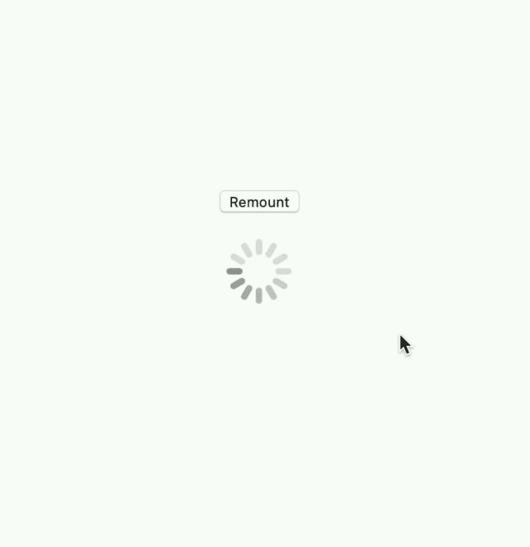

# 如何阻止你的旋转跳反应

> 原文：<https://dev.to/selbekk/how-to-stop-your-spinner-from-jumping-in-react-5cmp>

有时，当在 web 应用程序中加载数据时，会以这种瀑布式的方式发生。首先，获取一些授权数据，然后是一些用户数据，最后是构建视图所需的数据。

这通常会导致不同的微调器呈现在同一位置，从而导致以下用户体验:

[https://codesandbox.io/embed/jumping-spinners-yubc0](https://codesandbox.io/embed/jumping-spinners-yubc0)

看到每次文本改变时微调器是如何“跳”回开始的了吗？我讨厌那样！当然，一旦我们可以在任何事情上使用[悬念](https://css-tricks.com/reacts-experimental-suspense-api-will-rock-for-fallback-ui-during-data-fetches/)，这个问题可能会消失——但在那之前，我很乐意为我们的客户解决这个问题。

这种“跳跃”的发生是因为一个新的微调器被安装到我们的 DOM 中，CSS 动画重新开始。

几周前，React 原生 DOM 作者 [Vincent Reimer](https://twitter.com/vincentriemer) 发布了这个小演示:

> <video loop="" controls=""><source src="https://video.twimg.com/ext_tw_video/1160670601389862912/pu/vid/720x742/yZQkTKg2EX5rwwls.mp4?tag=10" type="video/mp4"></video>文森特·里默尔[@ vincentrimer](https://dev.to/vincentriemer)对 chonkit 的 spinner 组件进行了增强，即使动画仍然是通过 CSS 动画完成的，无论 React 在何时何地(重新)挂载动画，动画都将被同步。2019 年 8 月 11 日 21 点 53 分[](https://twitter.com/intent/tweet?in_reply_to=1160670658512052224)[](https://twitter.com/intent/retweet?tweet_id=1160670658512052224)[](https://twitter.com/intent/like?tweet_id=1160670658512052224)

我惊呆了！🤩这有可能吗？你是怎么做到的？

困惑地盯着看了几分钟后，我开始探究这是如何实现的。事实证明，这是一个非常简单的技巧！

## 如何同步您的微调器

旋转器的移动部分通常用 [CSS 动画](https://developer.mozilla.org/en-US/docs/Web/CSS/CSS_Animations/Using_CSS_animations)实现。至少在上面的例子中我是这样做的。动画 API 非常强大。

属性通常用于编排 CSS 动画，或者一个接一个地错开它们(例如，首先淡入，然后滑动到位)。但事实证明，它也可以用来倒带动画进度——通过**给它传递负值**！

因为我们知道我们的旋转器动画循环有多长，所以当我们的旋转器安装时，我们可以使用负的`animation-delay`值将动画“移动”到正确的位置。

给定以下 CSS:

```
keyframe spin {
  to { transform: rotate(360deg); }
}
.spinner {
  animation: 1000ms infinite spin;
  animation-delay: var(--spinner-delay);
  /* visual spinner styles omitted */
} 
```

Enter fullscreen mode Exit fullscreen mode

我们可以设置我们的微调组件挂载时的动画延迟:

```
const Spinner = (props) => {
  const mountTime = React.useRef(Date.now()));
  const mountDelay = -(mountTime.current % 1000);

  return (
    <div 
      className="spinner" 
      aria-label="Please wait" 
      style={{ '--spinner-delay': `${mountDelay}ms` }}
    />
  );
}; 
```

Enter fullscreen mode Exit fullscreen mode

这里，我们使用 React 的`useRef`钩子来保存我们的`Spinner`组件挂载的时间点。然后，我们计算“倒带”微调器动画的毫秒数，并使该值为负。

最后，我们通过 style prop 传递`--spinner-delay` CSS 自定义属性。

结果如下:

[https://codesandbox.io/embed/non-jumping-spinners-ojkjr](https://codesandbox.io/embed/non-jumping-spinners-ojkjr)

## 更多详情请

如果你想一步一步了解这里发生了什么？别担心，在这里。极其详细。🙈

```
const mountTime = React.useRef(Date.now())); 
```

Enter fullscreen mode Exit fullscreen mode

函数`Date.now()`返回从 1970 年 1 月 1 日开始的毫秒数([见此处](https://stackoverflow.com/questions/2533563/why-are-dates-calculated-from-january-1st-1970/2533567)深入探究原因)。我们将用这个数字作为我们的动画挂载时的基线。

`React.useRef`钩子可以让你保存一个任意的值，而不用触发重新渲染。它非常适合保存像我们的“挂载时间”这样的东西。你可以查看[文档](https://reactjs.org/docs/hooks-reference.html#useref)了解更多关于这个功能的细节。

```
const mountDelay = -(mountTime.current % 1000); 
```

Enter fullscreen mode Exit fullscreen mode

常量是我们将要“倒带”动画的实际毫秒数。数字`1000`必须与动画运行的毫秒数相匹配——因此，如果您的微调器旋转得比本例中的慢或快，您将不得不调整这个数字。

我们通过访问`mountDelay` ref 的`current`属性来访问在`mountTime`中计算的值。这就是 React 引用的结构。

我们正在使用模操作符`%`来计算我们的动画进行了多少毫秒。如果您不熟悉`%`操作符，没关系。如果你做`1123 % 1000`，你得到 123。如果你做`15 % 15`，你得到 0。你可以在这里了解更多关于[的信息。](https://riptutorial.com/javascript/example/760/remainder---modulus----)

最后，我们要否定这个数字，因为我们希望将一个负的延迟值传递给`animation-delay`属性。

```
<div style={{ '--spinner-delay': `${mountDelay}ms` }} /> 
```

Enter fullscreen mode Exit fullscreen mode

您知道您可以通过`style` prop 将 CSS 自定义属性(以前称为 CSS 变量)传递给您的类吗？是啊，我也是！事实证明，这实际上是一种将动态值传递给 CSS 的非常好的技术。请注意，在传递毫秒值之前，我们在它后面加上了`ms`。

您可以在 [MDN](https://developer.mozilla.org/en-US/docs/Web/CSS/Using_CSS_custom_properties) 上阅读更多关于自定义属性的信息。

```
keyframe spin {
  to { transform: rotate(360deg); }
}
.spinner {
  animation: 1000ms infinite spin;
  animation-delay: var(--spinner-delay);
} 
```

Enter fullscreen mode Exit fullscreen mode

在我们的 CSS 中，我们通过`animation`属性指定我们的动画，然后我们单独指定`animation-delay`值。您也可以在`animation`声明中这样做，但是对我来说这更容易阅读。

就是这样！

我希望你用这个技巧来提高你的旋转技巧，并与你的朋友分享。感谢阅读👋