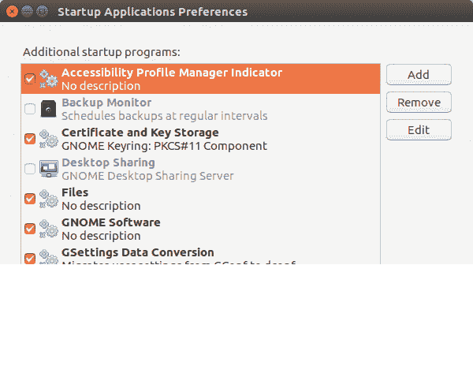

# 如何让你的 Ubuntu 桌面更快

> 原文：<https://dev.to/prahladyeri/how-to-trim-your-ubuntu-installation-of-extra-fat-and-make-it-faster-58ib>

*(原载于[prahladyeri . github . io](https://prahladyeri.github.io/blog/2017/09/how-to-trim-your-new-ubuntu-installation-of-extra-fat-and-make-it-faster.html))*

当你寻找一个更节省资源的发行版时，你得到的通常建议是使用一个更轻的衍生版本，比如 Xubuntu，Lubuntu 等等。然而，没有多少人知道，即使是一个“沉重”的发行版，如 Ubuntu LTS 与默认的 Unity 桌面，可以通过卸载一些软件包和删除其他启动轻得多。让我们看看它是如何实现的:

## 从启动应用程序中删除不需要的项目

当你进入 Ubuntu Dash 并启动“**启动应用程序**对话框时，它并不会向你展示整个画面。还有很多“隐藏 app”在你不知情的情况下，默默在后台启动。为了让所有这些隐藏的应用程序显示在该对话框中，您必须在终端中运行以下命令一次:

```
sudo sed -i 's/NoDisplay=true/NoDisplay=false/g' /etc/xdg/autostart/*.desktop 
```

Enter fullscreen mode Exit fullscreen mode

一旦你运行这个，然后打开“启动应用程序”对话框，你也可以看到隐藏的应用程序:

[](https://res.cloudinary.com/practicaldev/image/fetch/s--T6tmgm7K--/c_limit%2Cf_auto%2Cfl_progressive%2Cq_auto%2Cw_880/https://prahladyeri.github.io/uploads/2017/09/startup_applications.png)

**启动应用程序(Ubuntu)**

在此对话框中，您可以通过“取消选中”来禁止应用程序启动。在新安装时，我通常不检查最重要的是**备份监视器**和**桌面共享**。在非生产台式电脑上有如此巨大的备份精神分裂是没有意义的，所以我很奇怪为什么备份监视器一开始就被启用了。大约 99%的系统管理员要么定期执行手动备份，要么使用像 **rsync** 这样专门为这项工作设计的东西编写自动化脚本。

桌面共享是一个同样不必要的工具，在 linux 桌面上已经默认启用。这不是人们使用远程桌面客户端连接到同一网络上的其他电脑的 Windows 世界。大约 99%的 linux 用户使用 **ssh** 来连接远程机器。桌面共享在任何情况下都应该是一个选择加入的功能，有特殊需求的用户可以在需要时启用它。

## 删除 cups、avahi-daemon 等不必要的后台服务

在一个全新的 Ubuntu 安装上，运行`sudo netstat -antpe`，你会看到很少使用的`cupsd`守护进程(*通用 unix 打印服务*)运行在一个空闲的 TCP 端口上，默默地消耗你的内存和网络资源。类似地，您可以运行`sudo netstat -anupe`来扫描 UDP 端口，您同样会看到 cups 浏览器守护程序(`cups-browsed`)和 avahi 守护程序(`avahi-daemon`)服务。

打印机的使用越来越少，尤其是随着数字时代和互联网革命的到来。见鬼，最近甚至公司都在鼓励电子邮件通信，以避免纸质工作和拯救树木，现在我们来了——默认运行打印机服务的顶级 linux 发行版之一！

我对他们的谦卑请求是，请让这个成为一个选择加入的特性，那些需要它的人会有足够的意识去运行`sudo apt install cups`。在此之前，其他人可以做以下事情:

```
sudo systemctl disable cupsd
sudo systemctl disable cups-browsed 
```

Enter fullscreen mode Exit fullscreen mode

我们没有卸载它，只是禁用服务以防万一。在你说从浏览器导出 PDF 需要`cups`之前，不，最新版本的 firefox 和 chrome 都有自己的 PDF 扩展，不再依赖这项服务。

至于另一个服务(`avahi-daemon`)，它实际上没有任何意义，因为`avahi`是苹果专有协议的 linux 实现，用于设备之间的对等通信。没有哪个头脑正常的人会在他们的 PC/笔记本电脑上使用像 Ubuntu 这样的开源操作系统来与苹果公司的专有产品进行交流！这两者不能很好地结合在一起，因为苹果产品只能在封闭的生态系统中工作。

至于那些极少数绝对需要 avahi-daemon 的人，让他们自己安装吧，为什么默认包含这个？在那之前，我们其余的人可以简单地运行以下命令来禁用`avahi-daemon`:

```
sudo systemctl disable avahi-daemon 
```

Enter fullscreen mode Exit fullscreen mode

## 禁用 HUD(如果不使用)

Xubuntu 的内存占用如此之低(空闲时大约 200 MB)的原因之一是它没有像 HUD 这样的内存耗尽服务。例如，在我的笔记本电脑上，HUD 服务占用了整整 30MB 的内存，这对于一个我甚至都不使用的服务来说太多了。如本帖中的[所述，你可以从终端禁用 HUD 服务，如下所示:](https://askubuntu.com/a/218073/49938)

```
sudo chmod -x /usr/lib/indicator-appmenu/hud-service # 32bit systems 
```

Enter fullscreen mode Exit fullscreen mode

或者
sudo chmod-x/usr/lib/x86 _ 64-Linux-GNU/hud/hud-service # 64 位系统

## 禁用进化进程(如果你用雷鸟或者别的什么代替)

进化过程(比如`evolution-calendar-factory`和`evolution-addressbook-factory`)是巨大的内存吸血鬼，消耗你的内存。如果你启动系统监视器并搜索`evolution`，你会发现 4-5 个不同的进程消耗了你整整 120MB 的内存！现在，对于一个甚至不使用 evolution 电子邮件客户端或任何这些服务的人来说，他们为什么要放在第一位呢？但不幸的是，你不能仅仅用`apt`删除(`uninstall`)这些软件包。试图`apt remove evolution-data-server`将打破你的系统，因为他们已经使它成为桌面的核心部分。你可以做的是(如果你真的想要回那个内存)在这篇文章中建议的[解决方法。简单地重命名文件夹，如下所示:](https://askubuntu.com/a/816353/49938)

```
sudo mv /usr/lib/evolution-data-server /usr/lib/evolution-data-server-disabled
sudo mv /usr/lib/evolution /usr/lib/evolution-disabled 
```

Enter fullscreen mode Exit fullscreen mode

可选地，一个不太肮脏的方法是从单个进程中删除可执行标志，这样它们就不会启动。这样，如果你将来更新你的核心包，这个过程就不会再开始了。

```
sudo chmod -x /usr/lib/evolution/evolution-calendar-factory # less dirty hack 
```

Enter fullscreen mode Exit fullscreen mode

## 移除 GNOME 软件中心(仅在不使用时)

这个垃圾(gnome software center)在任何典型的 ubuntu 安装上占用了 70-80MB。对于管理软件，我发现古老的好方法比 gnome 软件中心更直观。在极少数情况下，当你绝对需要一个 GUI 时，`synaptic package manager`绝对可以工作得很好，而且不会持续占用你的资源。

如本答案中的[所述，从您的系统中安全移除 gnome software center 所需要的只是:](https://askubuntu.com/a/783075/49938)

```
sudo apt purge gnome-software 
```

Enter fullscreen mode Exit fullscreen mode

* * *

在如上所述对程序和服务进行调整之后，你的系统应该变得和其他轻量级发行版一样轻，比如 xubuntu、lubuntu 等等。您仍然能够享受和使用更丰富、视觉上更愉悦的用户界面！

在我自己的笔记本电脑上，我能够将空闲内存消耗从大约 550MB 减少到大约 300MB，这已经接近 ubuntu-mate 了！

## 更新

截止到 18.04 LTS，Ubuntu 已经用一个叫做“snappy”的垃圾软件取代了 gnome 软件中心，这个软件并不比它的前身好多少！要删除 snappy，只需遵循以下流程:

```
#check what snaps are installed
snap list

#remove all snaps
sudo apt purge snapd

#delete the snap folder
rm -rf snap 

#optionally replace snaps with standard apps
sudo apt install gnome-calculator gnome-logs gnome-characters gnome-system-monitor 
```

Enter fullscreen mode Exit fullscreen mode

我仍然不明白为什么 ubuntu 在每个新版本中不断推出这些额外的不必要的垃圾，如`cups`和`avahi`(考虑到它对普通用户或最典型的用户毫无用处)。我最大的猜测是，他们这样做是为了让用户搜索删除它的方法，从而提高他们的 linux 技能！

*参考:*

*   [https://askubuntu . com/questions/210387/how-can-I-disable-hud-service](https://askubuntu.com/questions/210387/how-can-i-disable-hud-service)
*   [https://askubuntu.com/a/816353/49938](https://askubuntu.com/a/816353/49938)