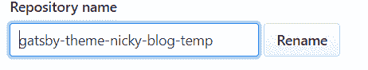
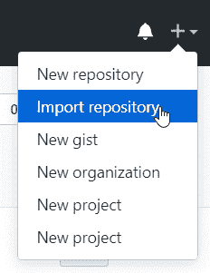
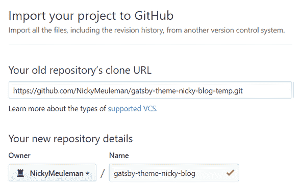
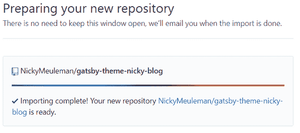

# 如何在 GitHub 上取消回购

> 原文：<https://dev.to/nickymeuleman/how-to-unfork-a-repo-on-github-2a8>

> TL；DR: **2 个步骤**:重命名存储库。以原始名称导入重命名的存储库。

有时，GitHub 上的存储库一开始是一个分支。你现在想中断这种联系。

GitHub 上的 Forks 有一些特殊的行为，比如默认情况下不启用 issues 选项卡。

## 1。在 GitHub 上重命名您的存储库

去 GitHub 上的库，找到**设置**页面，重命名你的库。(别担心，你可以保留原来的名字。)

这个新重命名的存储库仍然被标记为分叉！

## 2。导入存储库

GitHub 提供了一种导入存储库的方法。

抓取链接以克隆您刚刚重命名的存储库并输入它。

> 注意:提供 https 链接，SSH 链接不行

对于名称，输入您的存储库的原始名称。

过一会儿,“新的”存储库就准备好了。如果有一个电子邮件地址链接到该 GitHub 帐户，也会有一封电子邮件通知您成功。

## 享受你的不可伪造的仓库

git 历史仍然存在。👍

本地克隆的项目不必接触。

由于远程 url 与之前相同，推送更改应该无需干预。

由于从技术上讲这是一个全新的资源库，一些东西(特定于 GitHub web UI)丢失了。例如:拉取请求、描述、提供的网站 url。

