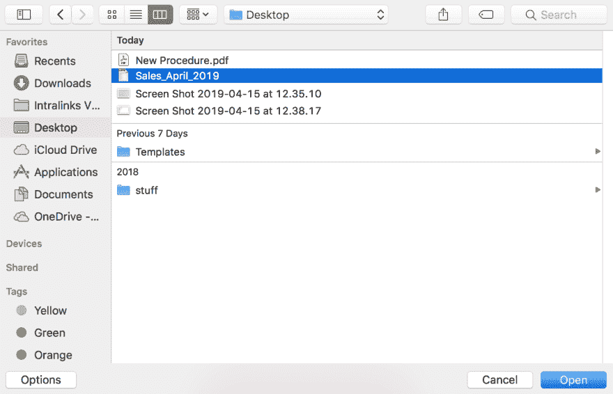
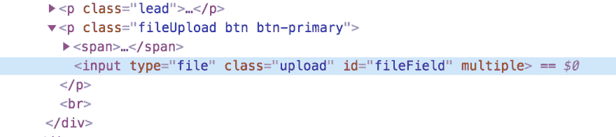
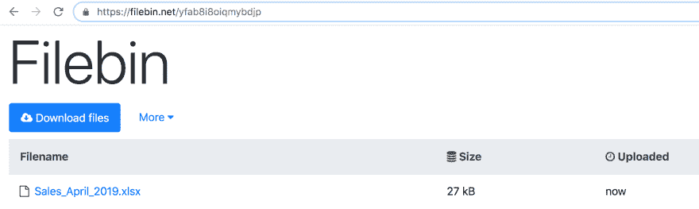
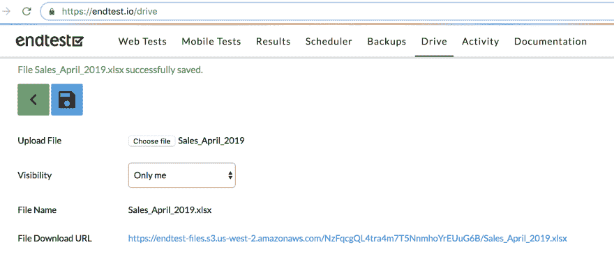
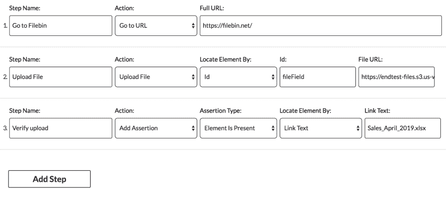
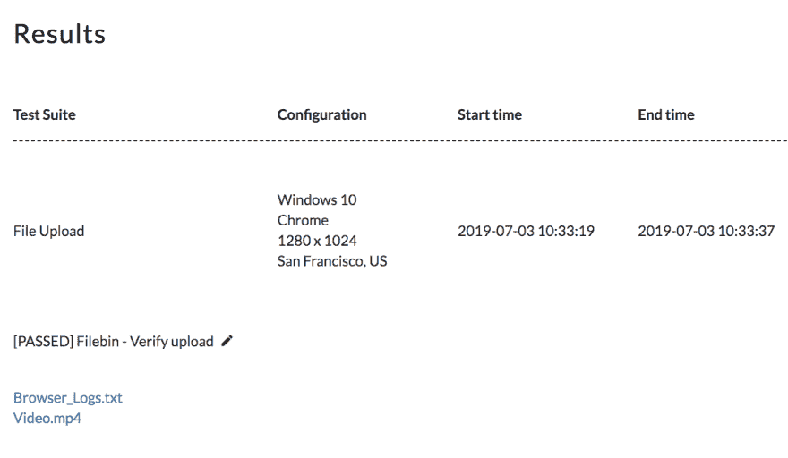

# 如何用 Selenium 上传文件

> 原文：<https://dev.to/razgandeanu/how-to-upload-files-with-selenium-3gj3>

任何使用 **[Selenium](https://www.seleniumhq.org/)** 的人最终都需要执行文件上传。

我们将以 **[FileBit](https://filebin.net/)** 站点为例。

我还将对 Selenium 和**[Endtest](https://endtest.io)**:
[https://www.youtube.com/embed/4DIVKcs--TA](https://www.youtube.com/embed/4DIVKcs--TA)
进行一些比较。首先，让我们看看文件上传通常是如何进行的。

#### 1。你点击上传按钮。

#### 2。操作系统会打开一个窗口，允许您选择文件。

在 Windows 上:

在 macOS 上:

选择文件后，文件的本地路径被写入文件输入中。

任何站点上的每个上传表单都有一个文件输入，您可以通过查找具有 **type="file"** 属性的 **input** 元素来轻松找到它。

并且文件上传完成:

您可能认为这很简单:

#### 1。请 Selenium 点击上传按钮。

#### 2。请 Selenium 点击我们想要的文件。

但那没用。

为什么？

因为硒只能与来自 **[DOM](https://www.w3schools.com/whatis/whatis_htmldom.asp)** 内部的元素相互作用。
操作系统的窗口不是 DOM 的一部分。

最糟糕的部分？

你的测试会被卡住，因为 Selenium 不能关闭那个窗口。

解决方案是直接在文件输入中写入文件的本地绝对路径，甚至不需要点击上传按钮。

*file _ input = driver . find _ element _ by _ id(" file field ")*
*file _ input . send _ keys(" C:/files/Sales _ April _ 2019 . xlsx ")*

如果您使用 Python 并且在多台机器上运行您的测试，您可以很容易地从相对路径中获得文件的绝对路径:

*导入 OS*
*absolute _ file _ path = OS . path . abspath(" files/Sales _ April _ 2019 . xlsx ")*
*file _ input = driver . find _ element _ by _ id(" fileField ")*
*file _ input . send _ keys(absolute _ file _ path)*

一旦站点检测到在文件输入中写入了文件路径，它将自动上传该文件。

一个不便之处是，大多数站点倾向于隐藏文件输入，Selenium 无法找到隐藏的元素。

解决办法？

执行一些 JavaScript 代码，更改文件输入的 CSS 并使其可见。

如果您的站点使用 jQuery:

*$("#fileField ")。css("visibility，"可视")；*
*$("#fileField ")。css("display，" block ")；*

如果您的站点没有使用 jQuery，就使用普通的 JavaScript:

*document . query selector(" # file field "). style . visibility = " visible "；*
*document . query selector(" # file field "). style . display = " block "；*

请记住，您需要在文件上传之前执行 JavaScript 代码。

Selenium 提供了一种执行 JavaScript 的简单方法:

*change _ visibility = ' $(" # file field ")。css("visibility，"可视")；*
*change _ display = ' $(" # fileField ")。css("display，" block ")；'*
*driver . execute _ script(change _ visibility)*
*driver . execute _ script(change _ display)*

这通常会奏效。

但是开发者有不同的隐藏文件输入的方法。

有些人可能会给它一个零像素的宽度和高度，有些人可能会把它移动到可视区域之外。

你需要弄清楚他们做了什么来隐藏和撤销它。

请记住，在以下情况下，硒不能与元素相互作用:

*   元素不可见
*   元素没有宽度和高度
*   元素被另一个元素覆盖

如果你在纠结，不知道该怎么做，只需执行整个代码块:

*document . query selector(" # file field "). style . visibility = " visible "；*
*document . query selector(" # file field "). style . display = " block "；*
*document . query selector(" # file field ")。style . width = " 200 px "；*
*document . query selector(" # file field "). style . height = " 200 px "；*
*document . query selector(" # file field ")。style . position = " fixed "；*
*document . query selector(" # file field "). style . overflow = " visible "；*
*document . query selector(" # file field "). style . zindex = " 999999 "；*
*【document . query selector(" # file field "). style . top = " 500 px "；*
*document . query selector(" # file field "). style . bottom = " 500 px "；*
*【document . query selector(" # file field "). style . left = " 500 px "；*
*document . query selector(" # file field ")。style . right = " 500 px "；*
*document . query selector(" # file field "). style . margin bottom = " 100 px "；*

使用 **[Endtest](https://endtest.io)** 在测试中上传文件比使用 Selenium 更容易:

#### **1。您首先需要在驱动器部分上传您的文件:**

 
确保复制了**文件下载网址**。

#### **2。在您的测试中使用上传文件动作:**

#### **3。在他们的跨浏览器云上执行测试:**

