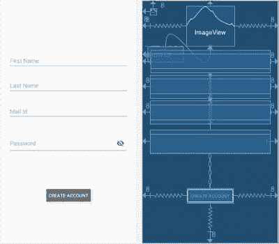
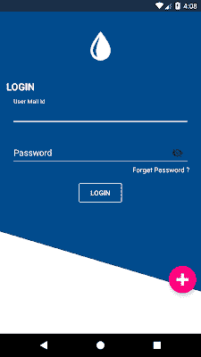
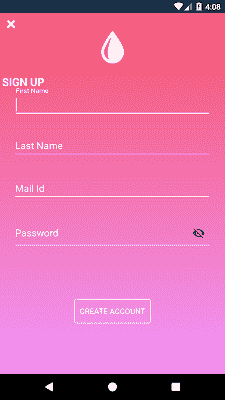
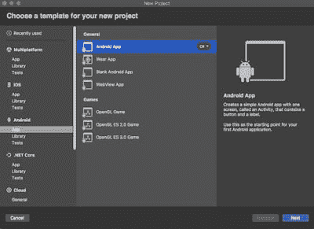

# 如何在 Xamarin 中使用约束布局？机器人

> 原文：<https://dev.to/logeshpalani98/how-to-use-constraint-layout-in-xamarin-android-1115>

**简介:**

```
 In this article demonstrates, what is Constraint Layout and how to use it in Xamarin.Android and Xamarin.iOS to improve your page performance and the response of UI. There is no default package for constraint layout in Xamarin.Android. So, we need to install a plugin for this. 
```

[](https://1.bp.blogspot.com/-SbhPt4cIiek/XTy36EqoGWI/AAAAAAAAOxA/2NkUGCtKRXEnOEl3eB_YKWnxEvA44rNgACLcBGAs/s1600/JPEG%2BFile.jpg)

**什么是约束布局？**

* * *

** **约束有助于减少视图的层次结构，提高视图的布局性能和灵活性。它有助于根据不同视图的位置、大小、尺寸和排列进行设计。约束布局具有不同的属性来设置布局中的视图。您可以轻松设置布局中任何位置的视图，而不是相对布局。它将支持 Android 和 iOS 平台。约束布局位于视图组下。

**约束布局的优势？**

*   平面视图层次结构，没有嵌套视图。
*   更好的性能和高响应性。
*   对齐屏幕的位置、大小和对齐方式。
*   支持 Android (API 9)和 iOS 平台。

**一些重要的约束布局特性和属性？**

这些属性只接受 id 或 parent。从目标视图的任意一侧对齐视图。

*   目标视图的左边是目标视图的左边。

*   所需视图的左对齐是目标视图的右对齐。

*   所需视图的 layout _ constraint right _ toLeftOf-align-right 位于目标视图的左侧。

*   所需视图的 layout _ constraint right _ toRightOf-align-right 位于目标视图的右侧。

*   layout_constraintTop_toTopOf -对齐所需视图的顶部是目标视图的顶部。

*   layout _ constraint top _ tobottom of-align 所需视图的顶部是目标视图的底部。

*   layout _ constraint bottom _ toTopOf-对齐所需视图的底部是目标视图的顶部。

*   layout _ constraint bottom _ tobottom of-align 所需视图的底部是目标视图的底部。

*   layout _ constraint baseline _ toBaselineOf-对齐所需视图的基线是目标视图的基线。

*   layout _ constraint start _ toEndOf-align 所需视图的起点是目标视图的终点。

*   layout _ constraint start _ toStartOf-align 所需视图的起点是目标视图的起点。

*   layout _ constraint end _ toStartOf-align 所需视图的结束是目标视图的开始。

*   layout _ constraint end _ toEndOf-align 所需视图的末端就是目标视图的末端。

边距属性-这些属性只接受正值。

*   layout_marginStart -所需视图起始端的边距。

*   layout_marginEnd -从所需视图的末端开始的边距。

*   layout_marginLeft -所需视图左侧的边距。

*   layout_marginTop -所需视图顶部的边距。

*   layout _ marginRight 所需视图右侧的右边距。

*   layout_marginBottom -所需视图底部的边距。

**让我们从如何使用约束布局在 Xamarin 中设计或对齐视图开始。安卓？**

**安卓输出:**

[](https://1.bp.blogspot.com/-8wJNgxcp-jo/XTy-UamY4XI/AAAAAAAAOxQ/RZjyer7OyV4yXZJ9Y7LBXUt4H4tfkhEdwCLcBGAs/s1600/60339134-8c1f9d80-99c5-11e9-8dd9-6f34af7469cd.png)
[T6】](https://1.bp.blogspot.com/-VXxcN0KQmVw/XTy-UYI3YKI/AAAAAAAAOxM/6uPtTofBWBgBsCHWiJuGU3O27wJo3pSPgCLcBGAs/s1600/60339137-8f1a8e00-99c5-11e9-9c61-dde5caa245fc.png)

按照以下步骤，使用约束布局来归档上面的视图。

**让我们开始**

**第一步:创建新项目**

```
 You can create Xamarin Android app by going to File \>\> New \>\> Android under select App \>\> In the General section select Android App then click Next \>\> In the new window, enter and select your application name, theme and compatibility followed by click Create project. 
```

[](https://1.bp.blogspot.com/-E2PDbYKBk6g/XTzJbrlEkyI/AAAAAAAAOxg/VYHJlVIc2yAyAkIW5h5oWa5drK8efV0bgCLcBGAs/s1600/Project%2Bcreation.jpg)

**第二步:添加约束布局插件**

创建项目后，将下面的 NuGet 包添加到您的项目中

*   [Xamarin。Android . support . constraint . layout](https://www.nuget.org/packages/Xamarin.Android.Support.Constraint.Layout)
*   材料设计。

为此，右键单击包并选择添加包>>新的对话框出现，右上角搜索“Xamarin。Android . support . constraint . layout”并单击添加包按钮。

**第三步:设计说明**

```
 Now, design Sign up page. For that, Go to Solution Explorer \>\> Resource \>\> layout \>\> double click to open content\_main.xml. First, we need to set the root of the layout is Constraint layout and declare app namespace. 
```

_
_ xmlns:Android = "【http://schemas.android.com/apk/res/android】_

_ xmlns:app = "[http://schemas.android.com/apk/res-auto](http://schemas.android.com/apk/res-auto)" _

_ xmlns:tools = "[http://schemas.android.com/tools](http://schemas.android.com/tools)" _

_ Android:id = " @+id/container " _

_ Android:background = " @ drawable/gradientcolor _ rose " _

_ Android:layout _ width = " match

*</Android . support . constraint . constraint layout>*

现在，开始你的设计。将图像按钮设置在页面的左上角。用于基于父视图设置图像按钮的 below 约束属性。

*app:layout _ constraint left _ toLeftOf = " parent "*

*app:layout _ constraint top _ toTopOf = " parent "*

徽标图像–该视图由图像按钮的右侧和父视图的中心设置。基于父视图的图像集的 top、end、start 属性和基于另一个视图 id 的另一个属性集。

*app:layout _ constraint top _ toTopOf = " parent "*

*app:layout _ constraint start _ toEndOf = " @+id/image view 2 "*

*app:layout _ constraint start _ toStartOf = " parent "*

*app:layout _ constraint end _ toEndOf = " parent "*

文本视图–该视图设置在图像下方，位于父视图的左侧。这下面的约束属性用来设置文本在正确的位置。第一个左侧属性集基于父属性，但其他属性由不同的 id 设置。

*app:layout _ constraint left _ toLeftOf = " parent "*

*app:layout _ constraint top _ toBottomOf = " @+id/imageView "*

_ app:layout _ constraint bottom _ toTopOf = " @+id/txtFirstName " u

此外，您可以使用不同的属性设置其他子视图。

**第四步:登录页面设计**

现在，设计 LoginPage。为此，请转到解决方案资源管理器>>资源>>布局>>双击打开 login_activity.xml。

**第五步:注册页面设计**

```
 Now, create a background colour of Signup page named as grandientcolor\_rose.xml. Add new XML page by going to right-click drawable folder \>\> Add new File \>\> Left bar select Android \>\> next followed by select XML file \>\> give the name as grandientcolor\_rose.xml. Copy and paste the below code. 
```

**第六步:MainActivity.cs 代码**

```
 Next open MainActivity.cs(Login Activity)  and add the following code to validate the user input. When you click login, it will validate and check the user is available or not. If credentials are correct it goes to the main page. If you want to sign up click a floating button. 
```

**第七步:注册 Activity.cs 代码**

```
 Add another activity for the sign-up page. For that, Go to Solution Explorer \>\> Resources \>\> activities \>\> Add a new activity named as signup\_activity.cs. Full source code is given below. Entered data will be validated and stored in Intent. 
```

**第八步:输出**

```
 Now, Rebuild and run your application. You will have the result like below. 
```

Android 输出:

[](https://1.bp.blogspot.com/-8wJNgxcp-jo/XTy-UamY4XI/AAAAAAAAOxY/9wHIjIjECXMrTDqkoOrfZEHF_H7lfRC7QCEwYBhgL/s1600/60339134-8c1f9d80-99c5-11e9-8dd9-6f34af7469cd.png)
[T6】](https://1.bp.blogspot.com/-VXxcN0KQmVw/XTy-UYI3YKI/AAAAAAAAOxU/Mkbjl8VT7F8ZTzm6vATfiTcQTXXxyTFQwCEwYBhgL/s1600/60339137-8f1a8e00-99c5-11e9-9c61-dde5caa245fc.png)

注意:导入图像，字符串，颜色，主题。

完整源代码来源:[https://github . com/logeshpalani 98/xamarin droid-LoginSignupConstraintDemo](https://github.com/logeshpalani98/XamarinAndroid-LoginSignupConstraintDemo)

感谢您的阅读，如果您有任何建议，请在下面留言。

参考安卓指南:[https://developer . Android . com/reference/Android/support/constraint/constraint layout](https://developer.android.com/reference/android/support/constraint/ConstraintLayout)