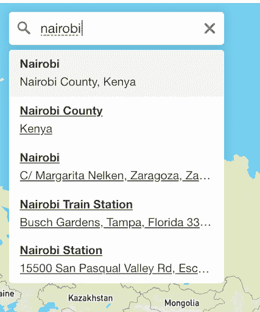
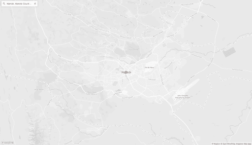
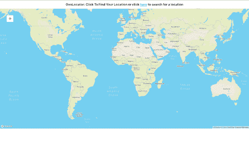
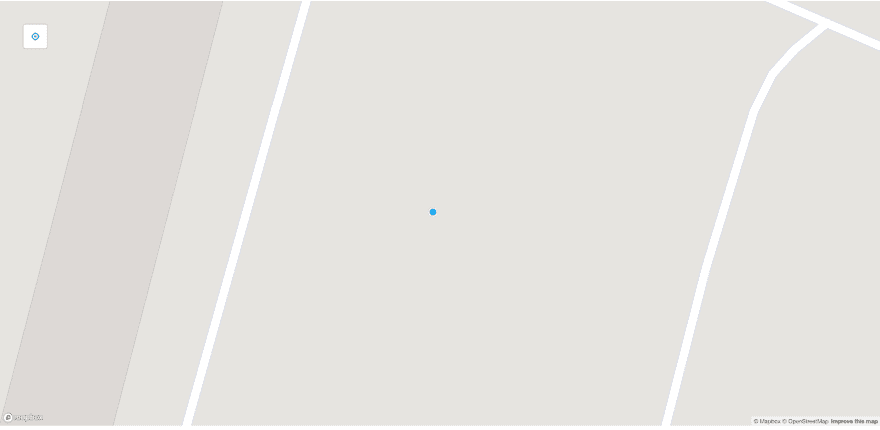

# 如何将 Mapbox GL 与 React 一起使用

> 原文：<https://dev.to/bnevilleoneill/how-to-use-mapbox-gl-with-react-3592>

[](https://res.cloudinary.com/practicaldev/image/fetch/s--cFT5OP4b--/c_limit%2Cf_auto%2Cfl_progressive%2Cq_auto%2Cw_880/https://thepracticaldev.s3.amazonaws.com/i/lrjddqf6zeoo4hc5qqlt.png)

## 什么是 Mapbox？

Mapbox 是一个实时定位平台，允许开发者为各种应用程序创建交互式和直观的地图界面。在网络上，这是通过一个名为 [Mapbox GL JS](https://docs.mapbox.com/mapbox-gl-js/api/) 的 JavaScript 库来完成的，该库使用 [Web GL](https://get.webgl.org/) 来渲染来自[矢量线](https://docs.mapbox.com/help/glossary/vector-tiles/)和 [Mapbox 样式](https://docs.mapbox.com/mapbox-gl-js/style-spec/)的交互式地图。

你想用 React 构建地图界面吗？多亏了优步的工程师，我们可以通过一个名为 [react-map-gl](https://uber.github.io/react-map-gl/#/) 的包相对容易地做到这一点，该包为 mapbox-gl 提供了 react 集成以及一个易于使用的组件库。

在本文中，我们将利用`react-map-gl`构建两个地图组件，一个显示您的当前位置，另一个允许您在全球范围内搜索位置。

首先，我们将通过运行`create-react-app mapbox-react`，用 [create-react-app](https://github.com/facebook/create-react-app) 引导我们的应用程序。

[](https://logrocket.com/signup/)

## 定位你的位置

我们想从确定一个人的位置开始。有了`react-map-gl`，我们可以使用一个名为`GeolocateControl`的内置组件来实现这一点，它允许我们通过浏览器跟踪用户的位置。在我们这样做之前，我们必须使用来自`react-map-gl`的`MapGL`组件初始化地图。让我们看看如何在代码中做到这一点，为了让事情变得有趣，我们将使用 React 钩子。

让我们通过运行`npm install react-map-gl`来安装 react-map-gl。

现在让我们设置我们的组件。

```
import React,{ useState } from 'react'
import MapGL, {GeolocateControl } from 'react-map-gl'
import config from '../config'
import 'mapbox-gl/dist/mapbox-gl.css'

const TOKEN=config.REACT_APP_TOKEN

const geolocateStyle = {
  float: 'left',
  margin: '50px',
  padding: '10px'
};

const Map = () => {

  const [viewport, setViewPort ] = useState({
    width: "100%",
    height: 900,
    latitude: 0,
    longitude: 0,
    zoom: 2
  })

  const _onViewportChange = viewport => setViewPort({...viewport, transitionDuration: 3000 })

  return (
    <div style={{ margin: '0 auto'}}>
      <h1 style={{textAlign: 'center', fontSize: '25px', fontWeight: 'bolder' }}>GeoLocator: Click To Find Your Location or click <a href="/search">here</a> to search for a location</h1>
      <MapGL
        {...viewport}
        mapboxApiAccessToken={TOKEN}
        mapStyle="mapbox://styles/mapbox/dark-v8"
        onViewportChange={_onViewportChange}
      >
        <GeolocateControl
          style={geolocateStyle}
          positionOptions={{enableHighAccuracy: true}}
          trackUserLocation={true}
        />
      </MapGL>
    </div>
  )
}

export default Map 
```

Enter fullscreen mode Exit fullscreen mode

上面显示的代码创建了一个地图，可以通过点击页面左上角的按钮来精确定位你的当前位置。让我们来分析一下这是如何工作的。

为了初始化我们的地图，我们初始化我们的地图组件，并使用状态钩子初始化一个名为`viewport`的对象，我们将把它作为道具提供给 MapGL 组件。我们将使用`viewport`初始化地图的初始坐标及其缩放和大小。

我们还启动了一个`setViewport`函数，用于更新视口的值。`MapGL`组件需要另外三个道具，`mapboxApiAccessToken`是调用 mapbox API 所需的[访问令牌](https://docs.mapbox.com/help/glossary/access-token/)，可以从 mapbox 获得。`mapStyle`链接到 mapbox 提供的各种地图样式，在这种情况下，我们将使用黑暗模式。

最后一个道具是`onViewportChange`，它是我们用来更新`viewport`的函数。就这样，就这样我们有了功能图！现在我们需要添加定位服务。

为了添加地理定位，我们导入了`GeolocateControl`组件，我们将为其提供三个道具。第一个是先前作为 React 样式对象传递的声明为`geolocateStyle`的样式，它决定了触发地理定位服务的按钮的大小和位置。下一个 prop us `positionOptions`，它是一个包含传递给地理定位 API 的选项的对象，用于获取和观察用户的位置，比如启用高精度，我们将通过将`enableHighAccuracy`设置为 true 来实现。我们还设置了一个名为`trackUserLocation`的道具为真，这使得地理定位按钮成为一个开关，当用户的位置改变时，它可以监控和更新用户的位置。

## 搜索位置

为了能够搜索用户的位置，我们将使用名为 [react-map-gl-geocoder](https://www.npmjs.com/package/react-map-gl-geocoder) 的包来构建`react-map-gl`的功能，该包是与 react-map-gl 一起使用的 mapbox-gl-geocoder 的 react 包装器。

要安装它，运行`npm install react-map-gl-geocoder`

我们还将使用 [deck-gl](https://deck.gl/#/) ，一个来自优步的可视化框架，来添加一个覆盖图，标记我们在地图上搜索过的区域，以提高可读性。安装它`run npm install deck.gl`。

很好，现在我们已经准备好构建我们的组件了，我们将把它命名为`SearchableMap`，我们的代码应该是这样的:

```
import "mapbox-gl/dist/mapbox-gl.css"
import "react-map-gl-geocoder/dist/mapbox-gl-geocoder.css"
import React, { Component } from 'react'
import MapGL from "react-map-gl";
import DeckGL, { GeoJsonLayer } from "deck.gl";
import Geocoder from "react-map-gl-geocoder";

const token = process.env.REACT_APP_TOKEN 

class SearchableMap extends Component {
  state = { 
    viewport :{
      latitude: 0,
      longitude: 0,
      zoom: 1
    },
    searchResultLayer: null
  }

  mapRef = React.createRef()

  handleViewportChange = viewport => {
    this.setState({
      viewport: { ...this.state.viewport, ...viewport }
    })
  }
  // if you are happy with Geocoder default settings, you can just use handleViewportChange directly
  handleGeocoderViewportChange = viewport => {
    const geocoderDefaultOverrides = { transitionDuration: 1000 };

    return this.handleViewportChange({
      ...viewport,
      ...geocoderDefaultOverrides
    });
  };

  handleOnResult = event => {
    this.setState({
      searchResultLayer: new GeoJsonLayer({
        id: "search-result",
        data: event.result.geometry,
        getFillColor: [255, 0, 0, 128],
        getRadius: 1000,
        pointRadiusMinPixels: 10,
        pointRadiusMaxPixels: 10
      })
    })
  }

    render(){
      const { viewport, searchResultLayer} = this.state
      return (
        <div style={{ height: '100vh'}}>
          <h1 style={{textAlign: 'center', fontSize: '25px', fontWeight: 'bolder' }}>Use the search bar to find a location or click <a href="/">here</a> to find your location</h1>
          <MapGL 
            ref={this.mapRef}
            {...viewport}
            mapStyle="mapbox://styles/mapbox/streets-v9"
            width="100%"
            height="90%"
            onViewportChange={this.handleViewportChange}
            mapboxApiAccessToken={token}
            >
              <Geocoder 
                mapRef={this.mapRef}
                onResult={this.handleOnResult}
                onViewportChange={this.handleGeocoderViewportChange}
                mapboxApiAccessToken={token}
                position='top-left'
              />
            </MapGL>
            <DeckGL {...viewport} layers={[searchResultLayer]} />
        </div>
      )
    }
}

export default SearchableMap; 
```

Enter fullscreen mode Exit fullscreen mode

首先，我们用`MapGL`组件创建一个地图容器，就像我们在前面的组件中所做的那样。接下来，我们使用来自`react-map-gl-geocoder`的 Geocoder 组件，它是一个搜索组件，从 Mapbox API 返回给定位置的坐标。

这需要一些道具。`onResult` prop 是一个函数，当搜索返回一个结果参数时会调用这个函数，在我们的例子中，它会创建一个`GeoJsonLayer`对象，并将其状态设为`searchResultLayer`。然后，此 GeoJsonLayer 用于在地图上创建一个 deck-gl 图层，以指示在地图中搜索的位置。

就像`MapGL`组件一样，地理编码器也有一个被调用来更新地图的`onViewportChange`函数，在我们的例子中，我们选择创建一个单独的函数来处理这个被称为`handleGeocoderViewportChange`的函数，以便在更新地图上的视口时覆盖过渡持续时间。如果希望使用默认值，可以使用与 MapGL 相同的视口更改处理程序。地理编码器还需要 mapbox 令牌来访问 mapbox API 和获取位置。

搜索时，我们的地理编码器会建议一些位置，如下所示。

[T4】](https://res.cloudinary.com/practicaldev/image/fetch/s--OhrwWf-D--/c_limit%2Cf_auto%2Cfl_progressive%2Cq_auto%2Cw_880/https://i0.wp.com/blog.logrocket.com/wp-content/uploads/2019/07/mapboxapp.png%3Fresize%3D427%252C512%26ssl%3D1)

您还会注意到，我们创建并使用了一个 Ref 来集成这两个组件，它作为一个`mapRef` prop 被传递给这两个组件。

我们的可搜索地图中的最后一块是我们为其创建数据的 deck.gl 图层。当我们搜索一个区域时，这将在地图上呈现。它被传递了视口细节以及用来在我们的位置上生成点的`searchResultLayer`,如下所示。

[](https://res.cloudinary.com/practicaldev/image/fetch/s--xcESfHMY--/c_limit%2Cf_auto%2Cfl_progressive%2Cq_auto%2Cw_880/https://i0.wp.com/blog.logrocket.com/wp-content/uploads/2019/07/mapdisplay.png%3Fresize%3D512%252C294%26ssl%3D1)

就这样，我们有了一个可搜索的地图！

## 路由

您会注意到我在每个组件的顶部放置了组件链接。现在让我们编辑 App.js 来添加路由以链接这两个组件。我们将使用`react-router-dom`来实现这一点，运行`npm install react-router-dom`。一切就绪，让我们添加路线。

```
import React from 'react'
import './App.css'
import Map from  './components/Map'
import SearchableMap from './components/SearchableMap';
import { Route, Switch, BrowserRouter } from 'react-router-dom'

function App() {
  return (
      <div>
        <BrowserRouter >
        <Switch>
            <Route exact path="/" component={Map} />
            <Route exact path="/search" component={SearchableMap} />
        </Switch>
        </BrowserRouter>
      </div>
  )
}
export default App 
```

Enter fullscreen mode Exit fullscreen mode

太好了，我们都设置好了，运行您的应用程序来玩这两个组件。这是它们完成后的样子。

[T4】](https://res.cloudinary.com/practicaldev/image/fetch/s--OSULh649--/c_limit%2Cf_auto%2Cfl_progressive%2Cq_auto%2Cw_880/https://i1.wp.com/blog.logrocket.com/wp-content/uploads/2019/07/geolocator.png%3Fresize%3D512%252C296%26ssl%3D1)

[](https://res.cloudinary.com/practicaldev/image/fetch/s--2BdBSRGF--/c_limit%2Cf_auto%2Cfl_progressive%2Cq_auto%2Cw_880/https://i0.wp.com/blog.logrocket.com/wp-content/uploads/2019/07/geolocatorlocation.png%3Fresize%3D1600%252C781%26ssl%3D1)

## 结论

Mapbox GL 是一个创建交互式地图界面的伟大工具，使用`react-map-gl`它甚至可以更容易地集成到 React 应用程序中。除此之外，优步周边的软件包生态系统，您可以扩展其功能，使用 deck-gl 创建各种好看的界面，以创建令人惊叹的外观覆盖。

* * *

## Plug: [LogRocket](https://logrocket.com/signup/) ，一款适用于网络应用的 DVR

[](https://res.cloudinary.com/practicaldev/image/fetch/s--6FG5kvEL--/c_limit%2Cf_auto%2Cfl_progressive%2Cq_auto%2Cw_880/https://i2.wp.com/blog.logrocket.com/wp-content/uploads/2017/03/1d0cd-1s_rmyo6nbrasp-xtvbaxfg.png%3Fresize%3D1200%252C677%26ssl%3D1)

[log rocket](https://logrocket.com/signup/)是一个前端日志工具，让你重放问题，就像它们发生在你自己的浏览器中一样。LogRocket 不需要猜测错误发生的原因，也不需要向用户询问截图和日志转储，而是让您重放会话以快速了解哪里出错了。它可以与任何应用程序完美配合，不管是什么框架，并且有插件可以记录来自 Redux、Vuex 和@ngrx/store 的额外上下文。

除了记录 Redux 动作和状态，LogRocket 还记录控制台日志、JavaScript 错误、stacktraces、带有头+体的网络请求/响应、浏览器元数据、自定义日志。它还使用 DOM 来记录页面上的 HTML 和 CSS，甚至为最复杂的单页面应用程序重新创建像素级完美视频。

[免费试用](https://logrocket.com/signup/)。

* * *

帖子[如何使用 Mapbox GL 和 React](https://blog.logrocket.com/how-to-use-mapbox-gl/) 最先出现在[日志博客](https://blog.logrocket.com)上。