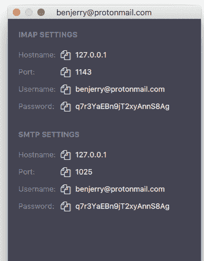

# 如何在 Nodemailer 中使用 ProtonMail

> 原文：<https://dev.to/polluterofminds/how-to-use-protonmail-with-nodemailer-5c4l>

[](https://res.cloudinary.com/practicaldev/image/fetch/s--HUg-oBE4--/c_limit%2Cf_auto%2Cfl_progressive%2Cq_auto%2Cw_880/https://blog.graphitedocs.com/conteimg/2019/07/Screen-Shot-2019-07-05-at-9.28.56-AM.png)

这可能是一篇非常小众的文章，但它值得一写。我是 [ProtonMail](https://protonmail.com) 的超级粉丝。事实上，去年我把所有的 [Graphite](https://graphitedocs.com) 电子邮件都转移到了 ProtonMail Pro 账户。我被 ProtonMail 混淆复杂加密的简单方式所吸引。整个实现极大地推动了我已经做的和我计划用 Graphite 做的事情。也就是说，使用 ProtonMail 确实有它的缺点。

没有内置的日历客户端。所以，如果你来自 Outlook 或 Gmail，你将会非常失望。我错过了很多电话，因为我试图手动跟踪邀请。我已经(大部分)通过使用苹果日历解决了这个问题。ProtonMail 的另一个缺点是它似乎与使用 SMTP 设置的客户端不兼容。但是，幸运的是，这个问题有一个解决方案。

对于付费用户，ProtonMail [提供了一个桌面桥客户端](https://protonmail.com/bridge/)。这个客户端在你机器的后台静默运行，会自动加密和解密电子邮件，这样你就可以使用桌面电子邮件客户端，比如苹果邮件。但是这种解决方案还实现了其他功能。

如果你是一名开发者，想要使用一个 ProtonMail 帐户和 [Nodemailer](https://nodemailer.com) (基于 NodeJS 的电子邮件发送工具)，乍一看，你似乎做不到。但是，这就是桥梁出现的地方。只要您或您的应用程序的用户希望使用 ProtonMail 通过您的应用程序发送电子邮件，并且桌面桥正在运行，您就可以通过 ProtonMail 从 Nodemailer 发送加密的电子邮件。

我们先来看看桌面桥。下载桥时，系统会提示您使用 ProtonMail 凭据登录。一旦你这样做了，你就会有一个桌面托盘应用程序在你的菜单栏中运行。从那里，您可以访问 IMAP 和 SMTP 设置:

[](https://res.cloudinary.com/practicaldev/image/fetch/s--KLuNBmf1--/c_limit%2Cf_auto%2Cfl_progressive%2Cq_auto%2Cw_880/https://blog.graphitedocs.com/conteimg/2019/07/Screen-Shot-2019-07-05-at-9.17.43-AM.png)

这是配置 Nodemailer 所需的内容。让我们来看一个示例配置，然后我们将了解一下发生了什么。

```
async function main(){
    let transporter = nodemailer.createTransport({
        host: "127.0.0.1",
        port: 1025,
        secure: false, // true for 465, false for other ports
        auth: {
          user: "johnnycash@protonmail.com", 
          pass: "$cHI4cyrtfUM"
        }, 
        tls: {
            rejectUnauthorized: false
        }
      });

    let info = await transporter.sendMail({
      from: '"Me" <johnnycash@protonmail.com>',
      to: "someonecool@email.com",
      subject: "Hello!",
      text: "Hello world?",
      html: "<b>Hello world?</b>"
    });

    console.log("Message sent: %s", info.messageId);
  } 
```

Enter fullscreen mode Exit fullscreen mode

上面的异步函数处理配置，但是记住它不是一个自调用函数。这是一件好事，以后你就会明白为什么了。现在，让我们看一下配置来理解发生了什么。

`transporter`变量调用一个 Nodemailer 函数，该函数接受您的 SMTP 设置。到目前为止很简单。然而，有几个陷阱需要注意。`secure`物业感觉应该是`true`。我是说，这是质子邮件，非常安全，对吧？但是，桌面桥客户端将端口 1025 用于 SMTP。对于 465 端口，`secure`属性只能是`true`。所以，一定要在这里输入`false`。不要担心，您的电子邮件仍将使用 TLS 发送，并使用您的 ProtonMail 密钥加密。

第二个陷阱是`tls`对象。当您浏览 Nodemailer 的文档时，您不会在当前的示例中看到这个对象。这是因为一般来说，对于托管电子邮件服务，TLS 证书是正确签名的，不会被拒绝。在 ProtonMail 的例子中，桥客户机实际上只是在你的计算机上给你一个 SMTP 层。它在后台处理加密和解密，并给你一个本地服务器，你可以使用电子邮件客户端。但是该本地服务器使用自签名的 TLS 证书。这将在 Nodemailer 中失败，除非您如上所示设置了`tls`对象。

剩下的应该就简单明白了。那么，现在你可以发送你的电子邮件了。使用这个异步函数，您可以确保在电子邮件试图发送之前，所有的承诺都被返回。你现在需要做的就是在你的服务器应用程序上发送邮件的任何地方运行下面的调用:`main().catch(console.error);`

就是这样。现在，你可以通过 Nodemailer 自己使用 ProtonMail，或者你可以允许你的应用程序的用户将 ProtonMail 配置为他们的电子邮件发送者。