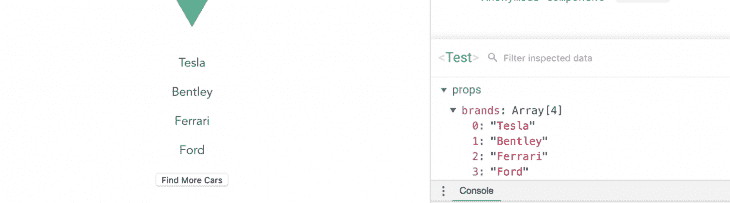

# 如何在 Vue.js 中使用无状态组件

> 原文：<https://dev.to/bnevilleoneill/how-to-use-stateless-components-in-vue-js-54km>

**由[nwo se lotana](https://blog.logrocket.com/author/nwoselotanna/)撰写**

[](https://res.cloudinary.com/practicaldev/image/fetch/s--z7tegbS8--/c_limit%2Cf_auto%2Cfl_progressive%2Cq_auto%2Cw_880/https://thepracticaldev.s3.amazonaws.com/i/mt58yn017opqrnlyl73h.png)

在这篇文章中，您将了解功能组件，并了解如何在 Vue 的工作流程中使用无状态组件。

## 开始前

您需要在您的电脑中安装以下设备:

*   [Node.js 版本 10.x](https://nodejs.org/en/) 及以上安装。您可以通过在终端/命令提示符下运行以下命令来验证您是否拥有此版本的 Node.js:

```
node -v 
```

Enter fullscreen mode Exit fullscreen mode

*   [Visual Studio 代码编辑器](https://code.visualstudio.com/)(或类似的代码编辑器)
*   [Vue 的最新版本](https://vuejs.org/)全球安装在您的机器上
*   安装在您机器上的 Vue CLI 3.0

为此，首先卸载旧的 CLI 版本:

```
npm uninstall -g vue-cli 
```

Enter fullscreen mode Exit fullscreen mode

接下来，安装新的:

```
npm install -g @vue/cli 
```

Enter fullscreen mode Exit fullscreen mode

*   在这里下载一个 Vue starter 项目
*   解压缩下载的项目
*   导航到解压缩后的文件，并运行命令以保持所有依赖项最新:

```
npm install 
```

Enter fullscreen mode Exit fullscreen mode

## 简介:什么是状态和实例？

Vue 应用程序状态是决定组件行为的对象。Vue 应用程序状态决定了组件的呈现方式或动态性。

同时，Vue 实例是一个 ViewModel，它包含的选项包括表示元素的模板、要挂载的元素、方法和初始化时的生命周期挂钩。

[](https://logrocket.com/signup/)

## Vue 组件

Vue.js 中的组件通常是反应式的:在 Vue.js 中，数据对象可以有很多选项，包括您可以使用的概念、计算属性、方法和观察器。此外，数据对象会在数据值发生变化时重新呈现。

相比之下，功能组件不保持状态。

## 功能组件

本质上，功能组件是拥有自己的组件的功能。功能组件没有状态或实例，因为它们不保存或跟踪状态。此外，您不能访问功能组件中的构造。

功能组件是为演示而创建的。Vue.js 中的功能组件类似于 React.js 中的功能组件。在 Vue 中，开发人员可以通过传递上下文，使用功能组件轻松地构建直接、简洁的组件。

## 功能组件语法

从[官方文档](https://vuejs.org/v2/guide/render-function.html#Functional-Components)来看，一个功能组件是这样的:

```
Vue.component('my-component', {
  functional: true,
  // Props are optional
  props: {
    // ...
  },
  // To compensate for the lack of an instance,
  // we are now provided a 2nd context argument.
  render: function (createElement, context) {
    // ...
  }
}) 
```

Enter fullscreen mode Exit fullscreen mode

## 创建功能组件

创建功能组件时要记住的一个关键准则是功能属性。functional 属性是在组件的模板部分或脚本部分指定的。模板部分的语法如下:

```
<template functional>
  <div> <h1> hello world</h1>
  </div>
</template> 
```

Enter fullscreen mode Exit fullscreen mode

您可以像这样将脚本指定为属性:

```
export default {
  functional: true,
  render(createElement) {
    return createElement(
      "button", 'Click me'
    );
  }
}; 
```

Enter fullscreen mode Exit fullscreen mode

## 为什么功能成分很重要？

功能组件可以快速执行，因为它们没有状态，并且在数据值改变时不会经历与模板的组件或部分相同的初始化和重新呈现过程。

大多数情况下，功能组件对于表示或显示项目循环非常有用。

## 演示

在这个介绍性演示中，您将看到带有 Vue 模板的单页面组件类型演示和功能组件的 render function 类型。

### 单页功能组件

打开您的`Test.vue`文件，并将下面的代码块复制到文件:

```
<template functional>
  <div>
    <p v-for="brand in props.brands" :key="brand">{{brand}} </p>
  </div>
</template>
<script> 
export default {
  functional: true,
  name: 'Test',
  props: {
    brands: Array
  }
}
</script> 
```

Enter fullscreen mode Exit fullscreen mode

脚本和模板中的功能指示器显示这是一个功能组件。请注意，props 仍然可以被传递——它们是功能组件中唯一可以被传递的数据值。

时态数据 props hold 也可以循环使用。

打开您的`app.vue`文件，并将下面的代码块复制到其中:

```
<template>
  <div id="app">
    
    <Test 
     :brands ="['Tesla', 'Bentley', 'Ferrari', 'Ford']">
    </Test>
  </div>
</template>
<script>
import Test from './components/Test.vue'
export default {
  name: 'app',
  components: {
    Test
  }
}
</script>
<style>
#app {
  font-family: 'Avenir', Helvetica, Arial, sans-serif;
  -webkit-font-smoothing: antialiased;
  -moz-osx-font-smoothing: grayscale;
  text-align: center;
  color: #2c3e50;
  margin-top: 60px;
}
</style> 
```

Enter fullscreen mode Exit fullscreen mode

在这里，您将看到 props 引用与冒号一起使用。

使用以下命令在开发服务器中运行应用程序:

```
npm run serve 
```

Enter fullscreen mode Exit fullscreen mode

浏览器中的结果应该如下所示:

[](https://res.cloudinary.com/practicaldev/image/fetch/s--Du-UFiMg--/c_limit%2Cf_auto%2Cfl_progressive%2Cq_auto%2Cw_880/https://i2.wp.com/blog.logrocket.com/wp-content/uploads/2019/09/stateless-components-corrected.png%3Fresize%3D730%252C256%26ssl%3D1)

### 渲染函数方法

功能组件也可以包含渲染功能。

开发人员使用渲染函数创建自己的虚拟 DOM，而不使用 Vue 模板。

使用渲染函数在**汽车**列表下创建一个新按钮。在项目文件夹中创建一个名为`example.js`的新文件，并将下面的代码块复制到文件中:

```
export default {
    functional: true,
    render(createElement, { children }) {
      return createElement("button", children);
    }
  }; 
```

Enter fullscreen mode Exit fullscreen mode

这将在功能组件中创建一个呈现函数来显示按钮，并将元素上的子节点用作按钮文本。

打开您的`app.vue`文件，并将下面的代码块复制到文件:

```
<template>
  <div id="app">
    
    <Test 
     :brands ="['Tesla', 'Bentley', 'Ferrari', 'Ford']">
    </Test>
    <Example>
     Find More Cars
    </Example>
  </div>
</template>
<script>
import Test from './components/Test.vue'
import Example from './Example'
export default {
  name: 'app',
  components: {
    Test, Example
  }
}
</script>
<style>
#app {
  font-family: 'Avenir', Helvetica, Arial, sans-serif;
  -webkit-font-smoothing: antialiased;
  -moz-osx-font-smoothing: grayscale;
  text-align: center;
  color: #2c3e50;
  margin-top: 60px;
}
</style> 
```

Enter fullscreen mode Exit fullscreen mode

如果您再次运行该应用程序，您会看到**Find More Cars**——子节点——现在是按钮的文本。示例组件在检查时显示为功能组件。

[](https://res.cloudinary.com/practicaldev/image/fetch/s--IRYvAhNu--/c_limit%2Cf_auto%2Cfl_progressive%2Cq_auto%2Cw_880/https://i2.wp.com/blog.logrocket.com/wp-content/uploads/2019/09/stateless-components-find-more-cars-corrected.png%3Fresize%3D730%252C203%26ssl%3D1)

### 添加点击事件

您可以在组件上添加单击事件，并在根组件中包含该方法。但是，您需要 render 函数中的数据对象参数来访问它。

将它复制到您的`example.js`文件中:

```
export default {
    functional: true,
    render(createElement, { data, children }) {
      return createElement("button", data, children);
    }
  }; 
```

Enter fullscreen mode Exit fullscreen mode

现在，将您的点击事件添加到根组件中，Vue 将会识别它。

将以下内容复制到您的`app.vue`文件中:

```
<template>
  <div id="app">
    
    <Test 
     :brands ="['Tesla', 'Bentley', 'Ferrari', 'Ford']">
    </Test>
    <Example @click="callingFunction">
     Find More Cars
    </Example>
  </div>
</template>
<script>
import Test from './components/Test.vue'
import Example from './Example'
export default {
  name: 'app',
  components: {
    Test, Example
  },
  methods: {
    callingFunction() {
      console.log("clicked");
    }
  }
}
</script> 
```

Enter fullscreen mode Exit fullscreen mode

除了上面的例子，在[官方文档](https://vuejs.org/v2/guide/render-function.html#Functional-Components)中列出的功能组件中还可以使用其他参数。

## 结论

这个功能组件的初学者指南可以帮助你实现快速演示，显示项目的循环，或者显示不需要状态的工作流的简单部分。

* * *

**编者按:**看到这个帖子有问题？你可以在这里找到正确的版本。

## Plug: [LogRocket](https://logrocket.com/signup/) ，一款适用于网络应用的 DVR

[](https://res.cloudinary.com/practicaldev/image/fetch/s--6FG5kvEL--/c_limit%2Cf_auto%2Cfl_progressive%2Cq_auto%2Cw_880/https://i2.wp.com/blog.logrocket.com/wp-content/uploads/2017/03/1d0cd-1s_rmyo6nbrasp-xtvbaxfg.png%3Fresize%3D1200%252C677%26ssl%3D1)

[log rocket](https://logrocket.com/signup/)是一个前端日志工具，让你重放问题，就像它们发生在你自己的浏览器中一样。LogRocket 不需要猜测错误发生的原因，也不需要向用户询问截图和日志转储，而是让您重放会话以快速了解哪里出错了。它可以与任何应用程序完美配合，不管是什么框架，并且有插件可以记录来自 Redux、Vuex 和@ngrx/store 的额外上下文。

除了记录 Redux 动作和状态，LogRocket 还记录控制台日志、JavaScript 错误、stacktraces、带有头+体的网络请求/响应、浏览器元数据、自定义日志。它还使用 DOM 来记录页面上的 HTML 和 CSS，甚至为最复杂的单页面应用程序重新创建像素级完美视频。

[免费试用](https://logrocket.com/signup/)。

* * *

帖子[如何在 Vue.js 中使用无状态组件](https://blog.logrocket.com/how-to-use-stateless-components-in-vue-js/)最先出现在[日志博客](https://blog.logrocket.com)上。