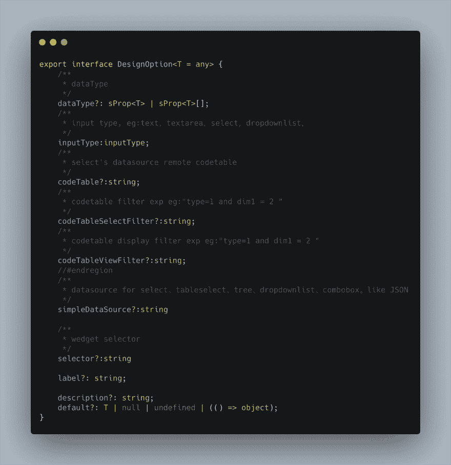
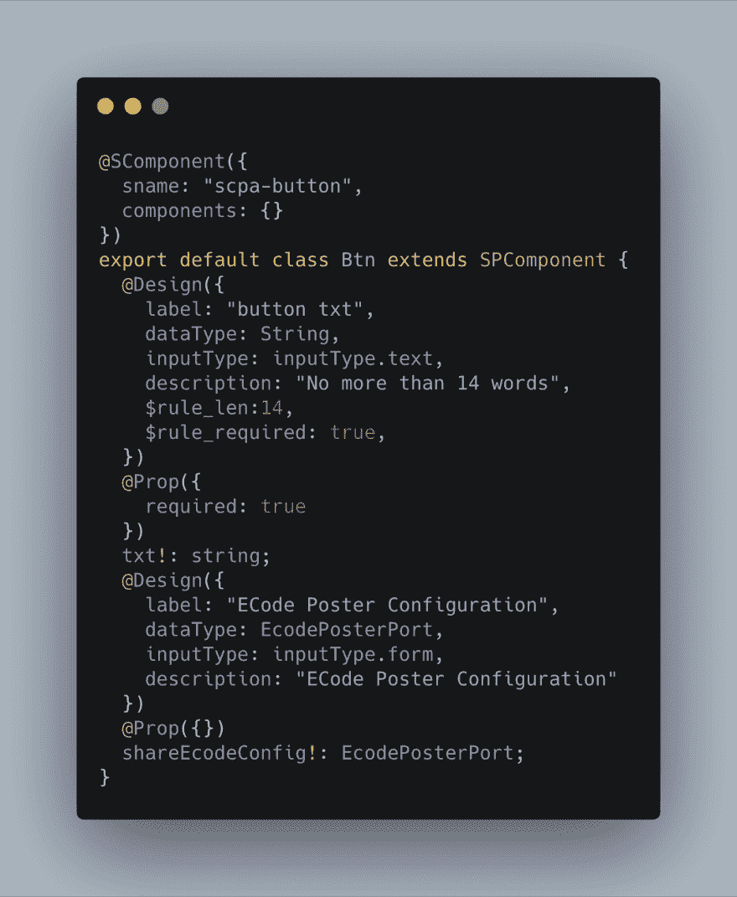
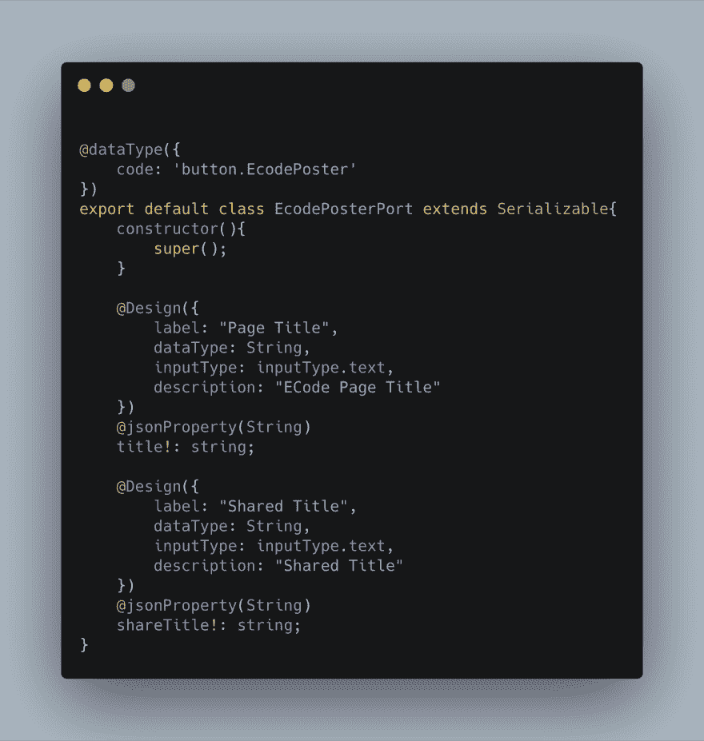
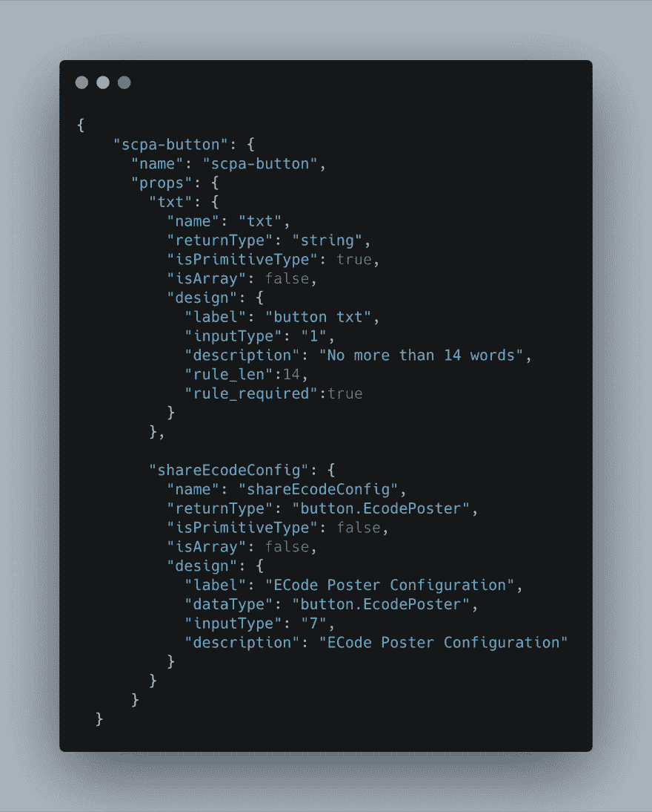
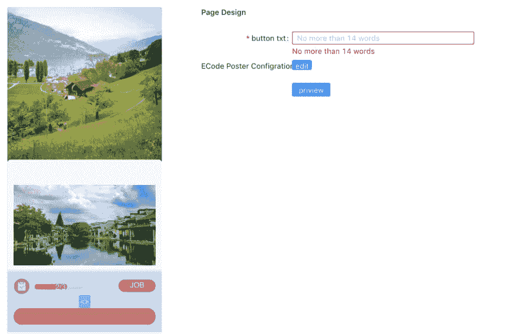

# 如何使用 Typescript 开发前端可视化平台

> 原文：<https://dev.to/happybang/how-to-use-typescript-to-develop-front-end-visualization-platform-1ebh>

元数据是提供关于其他数据的信息的数据。元数据在不同语言中有多种存储形式，例如。NET Framework 可移植可执行文件(PE)，以及通过 tsc 编译成 JavaScript 的 TypeScript。我们利用平台建模工具来生成元数据并将其存储在数据库中。

通常，元数据由运行时元数据和设计时元数据组成。运行时元数据类似于 TypeScript 和。网 PE。当汇编运行时，程序框架将提供描述功能。

元数据驱动的开发是一个管理概念。正如大多数前端开发人员所知，我们通常使用 npm 来管理我们的组件。然而，npm 提供的信息在构建 visula 建模平台方面仍然有限。

显然，我们需要组件内部的更多信息，比如属性和方法。不管怎样，做总比说好。

这里有一些实现它的想法。我们的前端堆栈是 Vue，我认为它也适用于 React。

我们制造一些装饰器来干涉 Vue 组件的构建和发布。我们的团队为可视化 web 编辑器定义了一些 decorators，当一个组件被发布时，组件级的元数据将被提取，因此在远程服务器上保存了设计时元数据。见下文。

1、我们设计了一个装饰器来描述组件在设计时需要提供的必要属性。

2、我们团队成员和装饰者一起开发组件。

不仅属性，而且复杂类型在运行时都应该被确保为安全描述。

3、我们开发了元序列化组件，使得提取复杂类型的元数据变得容易。

4、开发了网页可视化建模平台。我们对元数据进行了逆向转换，并将其转换为产品经理和操作员可以输入的形式。由于我们对类型的元数据进行了正则化，建模平台确保了运行时的安全性。

我的合作伙伴开发了一个 webpack-plugin 来过滤运行时源代码中的设计时元数据。设计时元数据不是很有用，但是对运行时有害。

我很自豪，也很享受用真实的代码示例探索如何为页面建模平台获取设计时元数据的过程。这里的例子只是一个演示。感谢您的阅读。