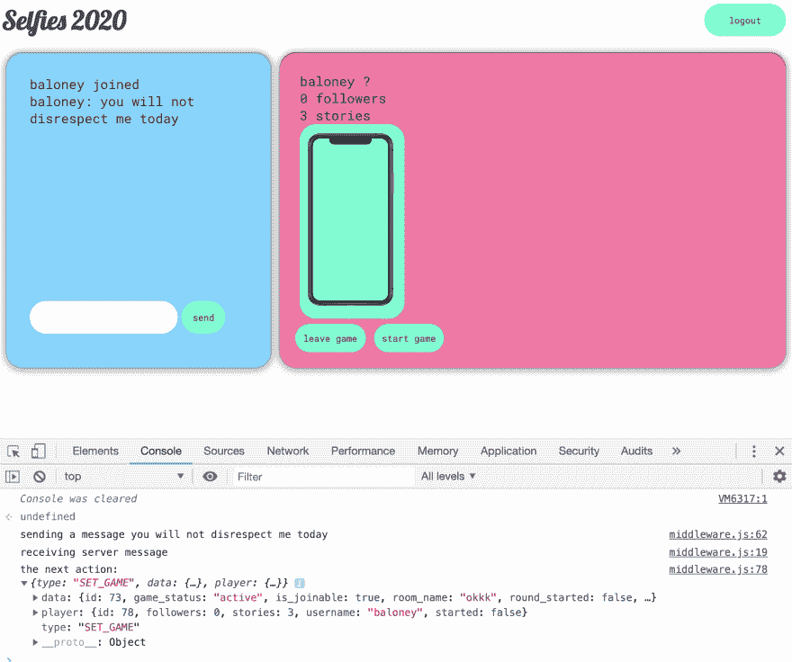

# 用 4 个步骤为 React/Redux 编写自己的 WebSocket 中间件

> 原文：<https://dev.to/aduranil/how-to-use-websockets-with-redux-a-step-by-step-guide-to-writing-understanding-connecting-socket-middleware-to-your-project-km3>

如果你想将 websockets 与 redux 结合使用，并且不喜欢依赖关系，那么只要你了解一些基本原理以及各个部分是如何结合在一起的，那么编写自己的中间件并不太难。在这篇文章中，我将解释如何编写自己的 websocket 中间件，并在前端浏览整个 websocket“流程”。这个项目的代码可以在[这里](https://github.com/aduranil/selfies)找到

### 步骤 1:定义一个将用于建立 websocket 连接的动作

我定义了一个返回对象的`const`，或者类型为`WS_CONNECT.`的“动作”

`export const wsConnect = host => ({ type: 'WS_CONNECT', host });`

有些人选择创建一个`actions.js`来保存他们所有的行为。我喜欢把我所有的 redux 动作、redux 和函数保存在同一个文件中，按类别分组。目前我的项目有 3 个模块，称为网络插座，游戏，和帐户。

我的 websocket 模块是这样的，它有我的`WS_CONNECT`动作:

```
// modules/websocket.js 

export const wsConnect = host => ({ type: 'WS_CONNECT', host });
export const wsConnecting = host => ({ type: 'WS_CONNECTING', host });
export const wsConnected = host => ({ type: 'WS_CONNECTED', host });
export const wsDisconnect = host => ({ type: 'WS_DISCONNECT', host });
export const wsDisconnected = host => ({ type: 'WS_DISCONNECTED', host }); 
```

Enter fullscreen mode Exit fullscreen mode

*通常我在这里会有一个类似于【T0:】的 reducer，但是我并不真的需要它用于 websockets，因为我不需要将数据保存在我的 redux 存储中。我将在奖金部分展示一个案例，并举例说明这样做的好处。

### 第二步:分派您的动作来打开一个新的 websocket 连接

我的项目类似于人们加入房间的聊天应用程序。一旦他们加入房间，我想建立一个到房间的 websocket 连接。这是一种方法，另一种方法是将你的整个项目包装在一个 websocket 连接中，我在这篇文章的附加部分有一个例子。

在下面的例子中，当用户进入房间时，我在`componentDidMount`上建立了一个新的 websocket 连接。我使用令牌认证是可以的，但是**我建议使用 websockets 的会话认证**，因为你不能在头中传递令牌。我正在调度上面定义的`wsConnect`函数，但是它不会做任何事情，因为我还没有编写我的中间件。

```
// pages/Game.js
import React from 'react';
import { connect } from 'react-redux';
import { wsConnect, wsDisconnect } from '../modules/websocket';
import { startRound, leaveGame, makeMove } from '../modules/game';
import WithAuth from '../hocs/AuthenticationWrapper';

class Game extends React.Component {
  componentDidMount() {
    const { id } = this.props;
    if (id) {
      this.connectAndJoin();
    }
  }

  connectAndJoin = () => {
    const { id, dispatch } = this.props;
    const host = `ws://127.0.0.1:8000/ws/game/${id}?token=${localStorage.getItem('token')}`;
    dispatch(wsConnect(host));
  };

  render() {
    // abridged for brevity
    return `${<span> LOADING </span>}`;
  } }

const s2p = (state, ownProps) => ({
  id: ownProps.match && ownProps.match.params.id,
});
export default WithAuth(connect(s2p)(Game)); 
```

Enter fullscreen mode Exit fullscreen mode

### 第三步:编写 websocket 中间件

好的，如果你做了与上面类似的事情，那么你就编写并发送了一个动作，就像你用普通的 redux 一样。唯一的区别是您不需要在 reducer 中分派动作(或者至少在这个例子中我不需要)。然而，还没有任何事情发生。你需要先写 websocket 中间件。重要的是要理解**你分派的每个动作将应用到你拥有的每个中间件**。

这是我的中间件文件，我将详细分解:

```
//middleware/middleware.js 

import * as actions from '../modules/websocket';
import { updateGame, } from '../modules/game';

const socketMiddleware = () => {
  let socket = null;

  const onOpen = store => (event) => {
    console.log('websocket open', event.target.url);
    store.dispatch(actions.wsConnected(event.target.url));
  };

  const onClose = store => () => {
    store.dispatch(actions.wsDisconnected());
  };

  const onMessage = store => (event) => {
    const payload = JSON.parse(event.data);
    console.log('receiving server message');

    switch (payload.type) {
      case 'update_game_players':
        store.dispatch(updateGame(payload.game, payload.current_player));
        break;
      default:
        break;
    }
  };

  // the middleware part of this function
  return store => next => action => {
    switch (action.type) {
      case 'WS_CONNECT':
        if (socket !== null) {
          socket.close();
        }

        // connect to the remote host
        socket = new WebSocket(action.host);

        // websocket handlers
        socket.onmessage = onMessage(store);
        socket.onclose = onClose(store);
        socket.onopen = onOpen(store);

        break;
      case 'WS_DISCONNECT':
        if (socket !== null) {
          socket.close();
        }
        socket = null;
        console.log('websocket closed');
        break;
      case 'NEW_MESSAGE':
        console.log('sending a message', action.msg);
        socket.send(JSON.stringify({ command: 'NEW_MESSAGE', message: action.msg }));
        break;
      default:
        console.log('the next action:', action);
        return next(action);
    }
  };
};

export default socketMiddleware(); 
```

Enter fullscreen mode Exit fullscreen mode

**调度 WS_CONNECT，做一个新的 WebSocket()。**看上面，当我调度`WS_CONNECT`动作时，你可以看到我有一个`action.type`也叫`WS_CONNECT`建立 websocket 连接。WebSocket 对象安装了 javascript。我用我在操作中传递的主机 url 建立了一个新的连接。

**Javascript WebSocket API。**JavaScript web socket API 有三个有用的属性:`onmessage`、`onclose`和`onopen.`在上面，我已经创建了处理这三个属性的处理程序，分别叫做`onMessage`、`onClose`和`onOpen`。最重要的一个是`onmessage`，它是一个事件处理程序，用于处理从服务器收到的消息。websocket API 也有我在中间件中使用的`close`和`send`函数。

**与服务器一起工作。**我不会在这篇文章中讨论服务器端，但服务器会向前端发送带数据的普通对象，就像前端如何向服务器发送带数据的普通对象一样。在接收服务器动作的`onMessage`中，我在服务器端定义了一个名为`update_game_players`的动作，它给我来自服务器的信息，然后我用类型为`SET_GAME`的动作分派一个名为`updateGame`的函数，将信息保存到我的 redux 存储中。

```
// modules/game.js 
export const updateGame = (json, player) => ({ type: 'SET_GAME', data: json, player });

const gameInitialState = { time: null };

export const gameReducer = (state = { ...gameInitialState }, action) => {
  switch (action.type) {
    case 'SET_GAME':
      return { ...state, game: action.data, current_player: action.player };
    default:
      return state;
  } 
```

Enter fullscreen mode Exit fullscreen mode

你可能想知道`default: return next(action)`是做什么的。如前所述，所有动作都被分派给中间件的所有部分。这意味着**如果我有一个动作类型与我的套接字中间件不相关，但与我的普通 redux 中间件相关，我仍然需要一种方法在套接字中间件中处理它**。函数的默认部分只是传递动作。下面的例子有助于说明:

[](https://res.cloudinary.com/practicaldev/image/fetch/s--axRZ2ugn--/c_limit%2Cf_auto%2Cfl_progressive%2Cq_auto%2Cw_880/https://thepracticaldev.s3.amazonaws.com/i/ektai3m4gnb8f5e9tucp.png)

当我在聊天中键入一些内容时，前端会向服务器发送一个名为`NEW_MESSAGE`的动作和数据。websocket 服务器接收它，然后将一个类型为`update_game_players`的有效载荷发送回前端，它基本上包括了当前游戏的所有相关内容，包括任何新消息。当前端接收到来自服务器的动作时，它会调度一个名为`updateGame`的动作，其类型为`SET_GAME`。**该动作被调度，但是套接字中间件没有任何用于`SET_GAME`的处理程序，所以它转到默认情况，同时转到我的默认 redux 中间件中的`SET_GAME`情况。**

### 第 4 步:用您的新中间件创建商店

这部分比较直接。如下面的例子所示，您可以用您所有的中间件**创建一个数组(我使用我刚刚创建的中间件和 redux 默认设置)，然后使用 redux 提供的`compose`和`createStore`函数创建商店** 

```
import React from 'react';
import ReactDOM from 'react-dom';
import { BrowserRouter as Router, Route } from 'react-router-dom';
import { createStore, applyMiddleware, compose } from 'redux';
import { Provider } from 'react-redux';
import reduxThunk from 'redux-thunk';
import rootReducer from './modules/reducers';
import wsMiddleware from './middleware/middleware';
import App from './App';

const middleware = [reduxThunk, wsMiddleware];
const store = createStore(
  rootReducer,
  compose(
    applyMiddleware(...middleware),
    window.__REDUX_DEVTOOLS_EXTENSION__ && window.__REDUX_DEVTOOLS_EXTENSION__(),
  ),
);
const Root = ({ store }) => (
  <Router>
    <Provider store={store}>
      <Route path="/" component={App} />
    </Provider>
  </Router> );

ReactDOM.render(<Root store={store} />, document.getElementById('root')); 
```

Enter fullscreen mode Exit fullscreen mode

### 额外收获:将你的整个项目包装在一个 websocket 连接中

下面是一个如何将整个项目包装在 websocket 连接中的例子。这是另一个也可以使用的模式。

```
// index.js abridged example showing just the root

const store = // where you create your store 
const Root = ({ store }) => (
  <Router>
    <Provider store={store}>
      <WebSocketConnection
        host={`ws://127.0.0.1:8000/ws/game?token=${localStorage.getItem('token')}`}
      >
        <Route path="/" component={App} />
      </WebSocketConnection>
    </Provider>
  </Router> );

ReactDOM.render(<Root store={store} />, document.getElementById('root')); 
```

Enter fullscreen mode Exit fullscreen mode

这里是我的`WebSocketConnection`包装器，非常简单。它建立到 websocket
的连接

```
// hocs/WebsocketConnection.js

import React, { Component } from 'react';
import { connect } from 'react-redux';
import { wsConnect } from '../modules/websocket';

class WebSocketConnection extends Component {
  componentDidMount() {
    const { dispatch, host } = this.props;
      dispatch(wsConnect(host))
    }
  }

  render() {
    return <div>{this.props.children}</div>;
  }
}

export default connect()(WebSocketConnection); 
```

Enter fullscreen mode Exit fullscreen mode

在这种情况下，我的减速器略有不同。在上面的步骤 2 中，我在建立 websocket 连接的同时，做了所有关于加入游戏的服务器动作。在这个例子中，我首先打开一个普通的 websocket 连接，并作为一个单独的动作加入游戏。这意味着**我需要确保我的 websocket 连接已经建立，然后再尝试做其他事情**，这就是为什么我现在想看看我是否连接了。

```
// modules/websocket.js 

const websocketInitialState = { connected: false };

export const websocketReducer = (state = { ...websocketInitialState }, action) => {
  switch (action.type) {
    case 'WS_CONNECTED':
      return { ...state, connected: true };
    default:
      return state;
  }
}; 
```

Enter fullscreen mode Exit fullscreen mode

我现在可以使用`connected`属性来决定是否分派动作。在 Game.js 文件中，我现在这样做

```
// pages/Game.js 

  componentDidMount() {
    const { id, connected } = this.props;
    if (connected) {
      this.connectAndJoin();
    }
  }

  connectAndJoin = async () => {
    const { id, dispatch } = this.props;
    await dispatch(joinGame(id));
  }; 
```

Enter fullscreen mode Exit fullscreen mode