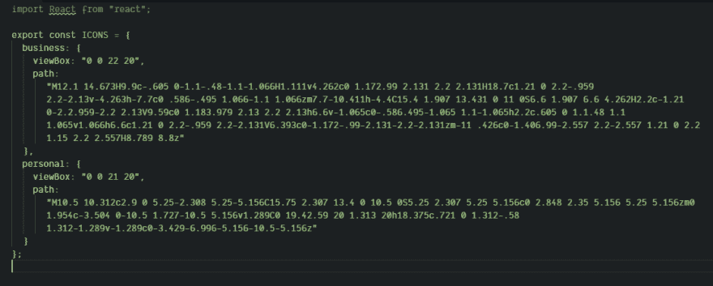
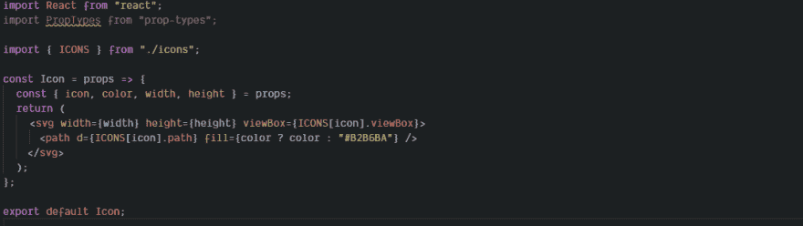
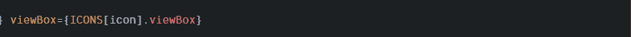
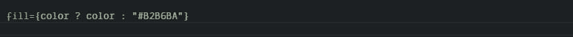
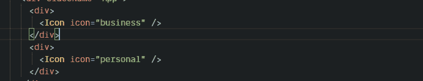

# 如何在 react 上使用 SVG

> 原文：<https://dev.to/raisaugat/how-to-work-with-svg-on-react-4kp4>

SVG 很棒。它们非常适合用作图标，因为它们在缩放时不会模糊。我们可以改变填充颜色，同时增加悬停效果等等。

在本教程中，我们将制作一个组件，该组件将渲染 SVG 图标，并将采用颜色选项，以便我们可以颜色。

## 图标

首先，让我们从一个常量图标变量开始，它将保存 SVG 的所有值，如 viewbox 和 path。Viewbox 是定义位置和尺寸所必需的。

## 包装纸

为了渲染 SVG，我们需要包装器。所以我们将创建一个包装文件。

这个组件将接收宽度，高度，颜色和图标名称等道具。宽度、高度和图标名称将在 svg 标签中使用，颜色将在 path 标签中使用。图标名称可以是任何名称，只要它包含在 ICONS 常量中。

这将有助于从提供的图标名称中获取 viewbox 的值。

这将有助于为 SVG 填充颜色。如果未提供颜色，将使用默认颜色。

如果您愿意，也可以定义 propType。

## 实现

[https://codesandbox.io/embed/35kyl](https://codesandbox.io/embed/35kyl)

在我搜索时偶然发现的这篇中型文章的帮助下，这篇教程成为可能。

[https://medium . com/@ David . gilbertson/icons-as-react-components-de 3 e 33 CB 8792](https://medium.com/@david.gilbertson/icons-as-react-components-de3e33cb8792)

好了，暂时就这些了。将很快带来另一个教程。