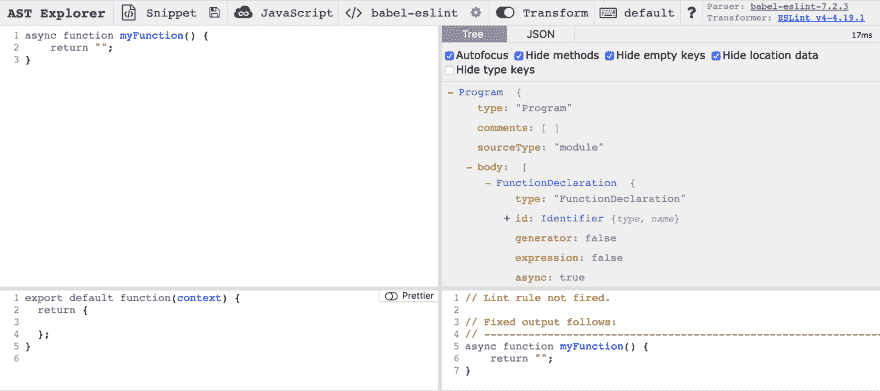
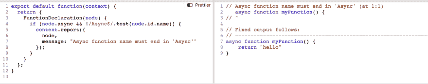

# 如何编写你的第一个 ESLint 插件

> 原文：<https://dev.to/spukas/how-to-write-your-first-eslint-plugin-145>

这篇文章是一个简单的 ESLint 插件入门指南，介绍了它们是如何工作的，如何设置、编写和使用。

## 什么是 ESLint 插件

它是 ESLint 的一个扩展，将执行一些规则，这些规则并没有在 ESLint 核心中实现。例如，最流行的插件之一`eslint-plugin-babel`，支持 ESLint 核心中没有的实验特性和 linter。
插件通常存储为单独的 NPM 模块，它导出`rule`对象，其中`key`是一个名称，`value`是另一个对象，带有执行规则的方法:

```
module.exports = {
    rules: {
        "rule-name": {
            create: function (context) {
                // rule implementation ...
            }
        }
    }
}; 
```

## 你为什么要在乎写你自己的呢？

有很多插件发布，找到你需要的插件的几率很高。但是在某些情况下，您可能需要特定于您的代码库的规则。
最近，我们的开发团队决定加强异步函数命名的角色。意思是，如果一个函数返回一个 promise 或者声明为`async`，它的名字必须有一个后缀:`function someFunctionAsync() {}.`
让我们以这个例子为教程，写一个插件，它会警告我们错误的函数命名。

## 创建插件

对于本教程，我们将创建一个本地插件包，并在简单节点包中使用它。项目结构将类似于:

```
plugin-tutorial 
│
└───my-eslint-rules
│   │   package.json
│   │   index.js
│   
└───node-app
    │   package.json
    │   index.js 
```

首先创建主文件夹`mkdir plugin-tutorial && cd plugin-tutorial`

### 安装插件包

每个有效插件都应符合以下标准:

*   是单独的 NPM 套餐
*   遵循`eslint-plugin-<plugin-name>`的名称格式
*   导出`rule`对象

1.  创建插件包:`mkdir my-eslint-rules && cd my-eslint-rules && npm init --yes`
2.  在`package.json` : `"name": "eslint-plugin-my-eslint-rules"`中命名包
3.  创建使用自定义规则导出`rules`对象的`index.js`，比如说`async-func-name`:

```
module.exports = {
  rules: {
    "async-func-name": {
      create: function (context) {
        return { /* ...rule methods */ }
      }
    }
  }
}; 
```

### 书写规则

为了构建和测试规则，我们将使用一个工具 [AST explorer](https://astexplorer.net) 。AST 代表抽象语法树或简称语法树，它是编程语言中源代码的一种表示。

通过选择解析器到`eslint-babel`和转换器到`ESLint v4`来设置 AST Explorer。

现在，您应该在浏览器中看到四个窗口:

*   左上角的窗口将被用来写一个源代码
*   窗口右上方是资源管理器的源代码。当您将鼠标悬停在表达式上时，您应该会看到代码中突出显示的部分
*   左下角是规则
*   右下角是规则运行后的输出，与代码相对应

[](https://res.cloudinary.com/practicaldev/image/fetch/s--ak1hll1W--/c_limit%2Cf_auto%2Cfl_progressive%2Cq_auto%2Cw_880/https://i.imgur.com/Vc1M86u.png)

规则是一个函数，它接受一个`context`对象，该对象具有额外的功能和与规则上下文相关的信息。
主要的方法是`context.report()`，它发布警告或错误。它接受一个参数 object，并且可以有以下属性:message、message、loc、data、fix。我们将使用一个简单的报表对象示例:

```
context.report({
    node: node,
    message: "Async function name must end in 'Async'"
}); 
```

该规则必须返回一个带有方法的对象，ESLint 在遍历源代码的语法树时调用这些方法来“访问”节点。在我们的例子中，我们有一个方法`FunctionDeclaration`，它接受一个参数`node`对象。该对象保存函数信息，如类型、名称、主体、每个值的位置。

为了检查函数名是否有一个`Async`后缀，我们需要访问这个名字，它在`FunctionDelacarion`节点的`id`对象中:`node.id.name`。

所以规则的主要逻辑应该是检查函数是否有`async`属性，如果名字不包含`Async`后缀，调用`context.report().`

应用规则后，AST explorer 中的输出应该用消息警告您:
[](https://res.cloudinary.com/practicaldev/image/fetch/s--L0ihV5Iy--/c_limit%2Cf_auto%2Cfl_progressive%2Cq_auto%2Cw_880/https://i.imgur.com/6i9sCDR.png)

在浏览器中编写规则并确保它捕获了规则条件之后，将逻辑移回插件包的`index.js`，这样就完成了插件:

```
module.exports = {
  rules: {
    "async-func-name": {
      create: function (context) {
        return {
          FunctionDeclaration(node) {
            if (node.async && !/Async$/.test(node.id.name)) {
              context.report({
                node,
                message: "Async function name must end in 'Async'"
              });
            }
          }
        }
      }
    }
  }
}; 
```

### 将插件应用到节点项目

首先让我们设置节点项目:

*   从`plugin-tutorial`运行`mkdir node-app && cd node-app && npm init --yes && touch index.js`并将 AST 浏览器中使用的相同功能添加到`index.js`:

```
async function myFunction() {
    return "";
} 
```

*   安装线〔t0〕
*   安装您创建的插件:`npm i ../my-eslint-rules --save-dev`
*   通过创建配置文件`.eslintrc`告诉 app 使用 ESLint 和 plugin:

```
{  "parserOptions":  {  "ecmaVersion":  2018  },  "rules":  {  "my-eslint-rules/async-func-name":  "warn"  },  "plugins":  ["my-eslint-rules"]  } 
```

*   使用命令:`./node_modules/.bin/eslint index.js`从终端和节点应用程序文件夹运行 ESLint 命令

差不多就是这样。如果为异步函数设置了错误的名称，那么在终端中运行 ESLint 之后，您应该会看到一个 ESLint 警告。

在项目中使用插件的重要部分是`.eslintrc`配置文件。来自插件的规则应该遵循命名`"<plugin-name>/<rule-name>": [warn/error]`。插件名应该添加到数组中的`plugins`字段。

## 编写插件的不同方法

编写插件更容易的方法是使用 Yeoman generator。你需要安装`yo`和`generator-eslint`包，并从终端运行`yo`命令。它将生成一个更加结构化的项目插件模板，包括测试设置。

## 你可能奋斗的地方

本教程中的插件示例是使用 common js 完成的，这意味着没有导入模块或新的 js 语法。
要在自定义插件中使用 es6 语言特性，如导入，您需要安装额外的`@babel-core, @babel/node, @babel/preset-env, babel-eslint, babel-register`并将以下配置添加到:

*   `.eslintrc`

```
{  "parser":  "babel-eslint",  "parserOptions":  {  "ecmaVersion":  6,  "sourceType":  "module",  "ecmaFeatures":  {  "modules":  true  }  }  } 
```

*   `.babelrc`

```
{  "presets":  ["@babel/preset-env"]  } 
```

## 总结

我们每天都在使用 ESLint，但大多数人不知道它在后台是如何工作的。希望现在你对 ESLint 如何工作，如何编写你的自定义插件和使用抽象语法树有了更好的理解。