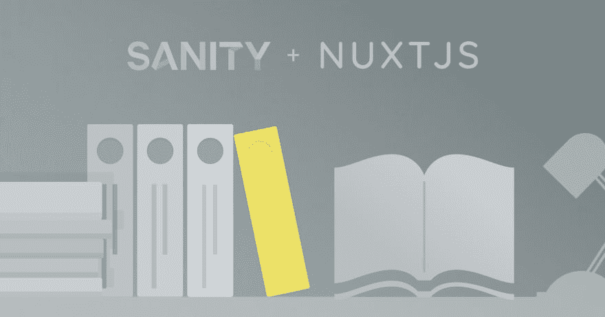

# 我们如何自动生成文档，JavaScript 风格

> 原文：<https://dev.to/couellet/how-we-auto-generate-documentation-javascript-style-5g32>

过去几个月，我们一直在打造购物车的新版本。

当我们开始着手这项工作时，我们知道这也意味着我们产品其他领域的变化。

文档是其中之一。

这意味着一些特定且急需的升级:

*   改进文档版本之间的导航
*   重新思考内容树状结构
*   尽可能自动化文档生成

我们也想忠于我们所宣扬的东西；使用[jam stack](https://snipcart.com/blog/jamstack)！这意味着选择正确的 JavaScript 工具来生成我们的文档。

我们最终选择了 [Nuxt](https://nuxtjs.org/) 用于静态文档生成， [Sanity](https://www.sanity.io/) [。io](https://www.sanity.io/) 用于管理内容，Netlify 用于自动部署。稍后我会解释原因。

最后，对于用户和我们的开发团队来说，这是一个极大地增强我们的文档 UX 的好机会。

在这篇文章中，我想向你展示我们是如何做到的，以及你如何复制它。

> 免责声明:请记住，这是一个正在进行的 3.0 版测试版，仅用于开发和测试目的。

→点击阅读全文