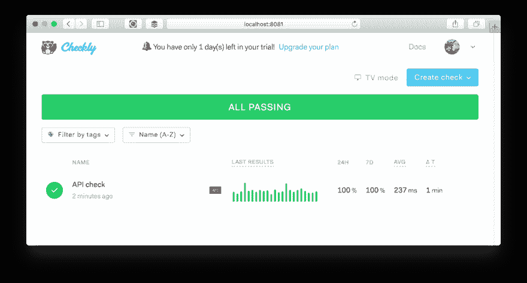
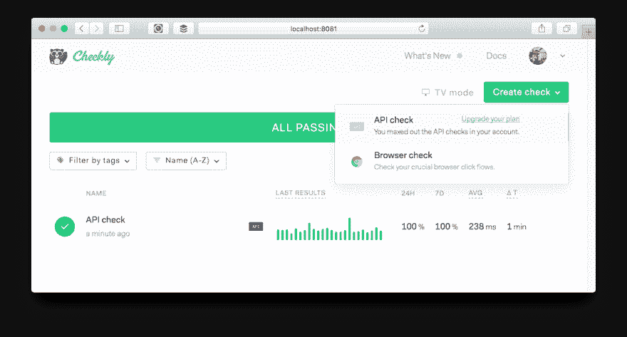
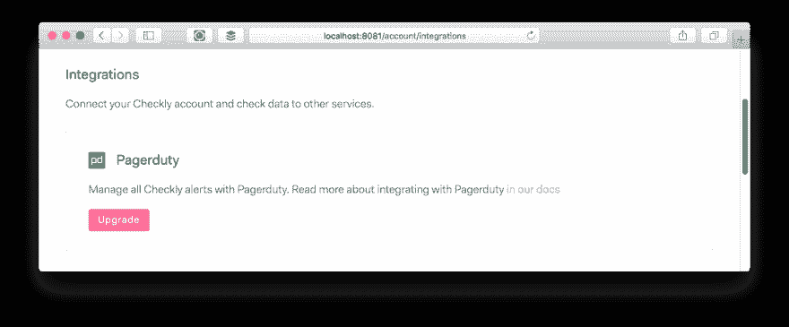

# 我们如何处理 Vue.js SaaS 应用程序中的计划限额

> 原文：<https://dev.to/checkly/how-we-deal-with-plan-limits-in-our-vue-js-saas-app-1p7o>

如果您运行一个 SaaS，您可能希望在用户几乎用完小部件时向他们显示。或者他们可以在一个更昂贵的计划中获得一些很酷的功能。或者，换句话说，在处理计划限制时，你如何才能做到既*又*商业化。

上周我们已经看了如何管理计划&的特点。那篇文章非常侧重于后端，所以本周我想更深入地探讨我们如何以友好的方式向用户展示这一点。

我们使用 [Vue.js](https://vuejs.org/) 和 [Vuex](https://vuex.vuejs.org/) 作为我们的前端，但是这里的模式和代码示例可以应用于任何其他 SPA 框架。

## 计划限额的类型

简要回顾我们在[上一篇文章](https://blog.checklyhq.com/how-we-manage-plans-features-in-our-saas-app/)中认识到的计划限制类型。

1.  **付费与过期**:您是付费客户或正在试用/停止付费。
2.  **基于计划的特性切换**:在您的计划上是否启用一个特性。
3.  **基于计划的音量限制**:你可以选择十个这样的，五个那样的。

我们还提到了基于角色的访问控制，但我想留待以后再写。

## 基本设置

我们需要跟踪一系列相当全局的变量，有些变量相当静态——年度支付者的计划到期日期每年变化一次——有些变量会随着用户与应用程序的交互而动态变化。

然而，我们不想用控制和验证这些横切关注点的逻辑来打扰我们所有的前端组件。我们想要公开一个专用的——我敢说是单例的——对象，它封装了所有计划和用户逻辑的当前状态。

为此，我们使用 Vue.js 和 Vuex，一个 Redux 类型的中央数据存储。在初始页面加载时，我们用我们感兴趣的东西通过*动作*和*突变*(这是两个非常特殊的 Vuex 东西，我在这里不会深入讨论)填充一个对象。

或者，在 Javascript-framework-is-eating-the-world-speak 出现之前，当用户登录时，您发出一个 XHR 请求，您的后端返回所有帐户数据，您将其解析为一个合意的对象。

这是这样一个物体的样子。这几乎是对优秀的 [Vue.js 调试工具](https://github.com/vuejs/vue-devtools)的精确复制和粘贴。

```
 { 
        isPayingCustomer: true,
        currentAccount: {
            features: ['SMS_ALERTS', 'TEAMS', 'PROMETHEUS', 'TRIGGERS']
        },
        expiryStatus: {
            daysTillTrialExpiry: 24
            planHasExpired: false
        },
        isFeatureLimited: {
            accountUsers: true
            apiChecks: true
            browserChecks: false
            dashboards: false
        },
    } 
```

请注意几件事:

1.  我们将几乎所有属性转换成`isSomething`或`hasSomething`形式。这使得您的代码在以后使用它的组件中更好。
2.  我们有一个`currentAccount`对象，因为一个用户可以是多个帐户的成员，并且可以在会话期间在它们之间切换。
3.  严格来说，`expiryStatus`对象保存了多余的数据。但是我们不希望每个使用它的组件都基于`daysTillTrialExpiry`属性实现布尔函数`planHasExpired`。
4.  这种表示与我们在后端存储它的方式非常不同。它是为了在前端中有用而专门定制的**。**

过了一会儿，我发现最后一颗子弹有点重要。这里引用一句话:

> 东西在后端的存储方式永远不会决定你如何在前端使用它们。

这可能是另一篇文章的素材，但对于自启动、全栈开发人员来说非常重要。你需要跨越鸿沟。后端和前端不一样。

现在我们来看一些例子。

## 例 1:计划到期日屏幕

如果你的计划即将到期，这就是出现在导航栏顶部的内容。这种情况只在两种情况下发生:

1.  您是试用用户，尚未升级。
2.  你是我们这个秘密且排外的社团的付费会员，但是由于某种不言而喻的原因，你的信用卡失效了。

为了变出这个消息，我们使用下面的代码。注意我们使用 Jade/Pug 作为模板，但是它应该很容易转换成普通的 HTML。

```
 .navbar-upgrade-notice(v-if='showUpgradeTeaser')
        | You have only {{expiryStatus.daysTillTrialExpiry}} day(s) left in your trial!
        router-link(:to="{ name: 'billing:plans' }") Upgrade your plan
      .navbar-upgrade-notice(v-if='showExpiredTeaser')
        | Your trial has expired!
        router-link(:to="{ name: 'billing:plans' }") Upgrade your plan 
```

这里发生了两件事:

1.  我们有一个关于`showUpgradeTeaser`和`showExpiredTeaser`布尔值的`if`语句。如果它们是假的，我们就不给你看。你懂的。
2.  我们直接使用`expiryStatus`对象并点击`daysTillTrialExpiry`属性来让用户知道他/她有多长时间。

但是我们如何从中央数据存储中获取这些数据呢？我们如何设置那个`showUpgradeTeaser`属性？为此，我们利用 Vue.js 的[计算属性](https://vuejs.org/v2/guide/computed.html)。它们非常棒，我尽可能多地使用它们。

简而言之，它们是在输入变化的基础上不断更新的属性。你可以称之为“被动”。在大多数框架中，这些代码存在于你的前端组件的*控制器*中，尽管 Vue.js 并没有这样称呼它们。

下面是我们导航栏组件的部分代码。

```
 computed: {
        expiryStatus() {
          this.$store.getters.expiryStatus
        },
        showUpgradeTeaser () {
          return this.expiryStatus 
            ? (this.expiryStatus.daysTillTrialExpiry > 0 
            && this.expiryStatus.daysTillTrialExpiry < 5) : false
        },
        showExpiredTeaser () {
          return this.expiryStatus ? this.expiryStatus.planHasExpired : false
        }
      } 
```

您可以看到`showUpgradeTeaser`和`showExpiredTeaser`是如何创建的。他们直接利用`expiryStatus`对象，该对象通过一种非常 Vue.js 特定的方式从 Vuex 商店获取数据，从而暴露给本地`this`上下文。你的框架也会有类似的东西。另请注意，我们开始显示从最后五天到计划到期的升级预告。

## 例 2:达到计划容量限制

这是用户在已经达到计划限额的情况下试图再创建一张支票时看到的情况。

[](https://res.cloudinary.com/practicaldev/image/fetch/s--KcfzaoAb--/c_limit%2Cf_auto%2Cfl_progressive%2Cq_auto%2Cw_880/https://blog.checklyhq.com/conteimg/2019/03/Screen-Shot-2019-03-31-at-20.15.45.png)

我们明确地希望在创建新支票的相关时刻通知用户他/她的计划限制。这可能有一个非常好的商业理由，这就是为什么所有 SaaS 公司都这么做。

这是我们前端代码的一个片段。它遵循与上面的例子完全相同的模式:

```
 .dropdown-item(v-if='isFeatureLimited.apiChecks ||  expiryStatus.planHasExpired')
        .check-icon
        .title API check
            router-link(:to="{ name: 'billing:plans' }") Upgrade your plan
            .button-text You maxed out the API checks in your account. 
```

同样，它会进入`expiryStatus`对象，但这次也会进入`isFeatureLimited`对象。他们一起决定是否显示升级按钮(并阻止创建新支票)。

对象封装了一个计划的状态，以及它是否超过了为特定资源分配的容量限制；在我们的例子中，API 检查和浏览器检查。

这实际上比看起来要复杂一些。我们再次在我们的中央数据存储中处理它。这里有一个片段:

```
 isFeatureLimited: (state, getters) => {
        return {
          apiChecks: getters.checks.filter(check => {
            return check.checkType === 'API'
          }).length >= getters.currentAccount.maxApiChecks
        }
      }, 
```

属性`apiChecks`是基于我们的数据存储中的另外两个属性动态生成的:

1.  `checks`，所有支票的数组，我们首先根据支票类型进行过滤，然后进行计数。添加一个检查或删除一个检查，这将得到即时更新。
2.  `currentAccount.maxApiChecks`，由用户当前所在的计划决定的属性。升级，你会得到更多，自动提高这一价值。

我们对所有其他数量有限的资源，如浏览器检查、团队成员和仪表板，做完全相同的事情。

## 例 3:计划特征切换

以下是当您的计划没有特定功能时所看到的情况，在这种情况下，Pagerduty 集成不在我们的开发人员计划中。

[](https://res.cloudinary.com/practicaldev/image/fetch/s--2jCIdTY---/c_limit%2Cf_auto%2Cfl_progressive%2Cq_auto%2Cw_880/https://blog.checklyhq.com/conteimg/2019/03/Screen-Shot-2019-03-31-at-20.22.00.png)

这个看起来最简单，但是实际上我经常遇到这种模式，所以我对它进行了更多的抽象。我预计 Checkly 的特性集将会增加很多，所以有一个相当通用的方法来处理这个问题是非常方便的。要点如下:

```
 .pagerduty
      .header Pagerduty
      span(v-if='$planHasFeature("PAGERDUTY")')

          // Pagerduty integration settings

      span(v-else)
        feature-not-available 
```

这里发生了两件事:

首先，我们检查当前计划是否启用了特性`PAGERDUTY`。我们没有使用特定于组件的属性，而是使用一个[全局混合](https://vuejs.org/v2/guide/mixins.html#Global-Mixin)向所有模板化元素公开一个名为`$planHasFeature()`的函数。

这个函数是做什么的？如果`currentAccount.features`数组保存了我们传递给函数的特性，只需要检查中央数据存储。代码如下。

```
 const hasFeature = {
      created () {
        this.$planHasFeature = function (feature) {
          return this.features.includes(feature)
        }
      },
      computed: {
        features () {
          return this.$store.getters.currentAccount.features
        }
      }
    } 
```

第二，如果这个计划没有这个特性，我们呈现一个通用的`feature-not-available`组件。这只是一个很好的按钮，带你到我们的升级页面。这个组件已经在其他九个组件中使用，所以我认为额外的抽象是值得的。

有了这些模式，你可以迎合一吨常见的 SaaS 的事情，如显示升级信息和基于容量的功能计数器。希望有帮助！