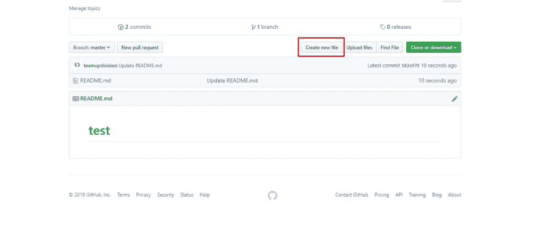
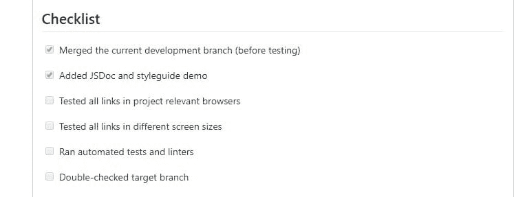
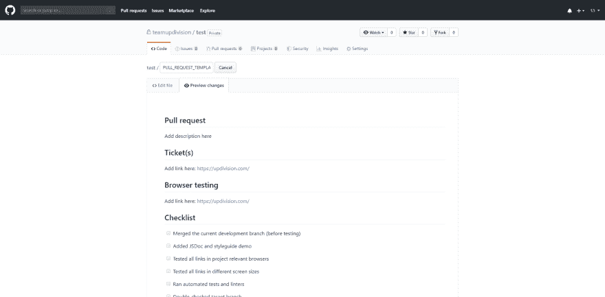
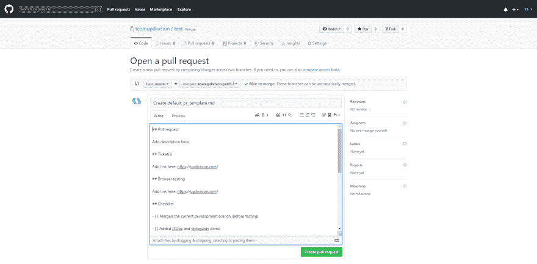
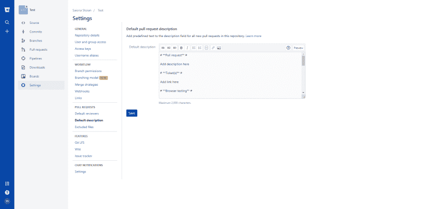
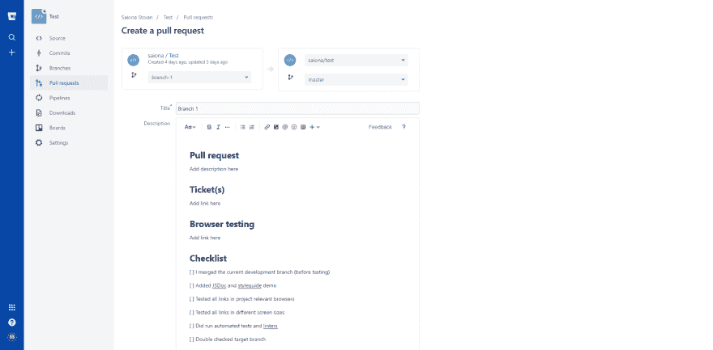

# 我们如何学会不再担心和喜欢拉请求模板。为什么你也应该

> 原文：<https://dev.to/updivision/how-we-learned-to-stop-worrying-and-love-pull-request-templates-and-why-you-should-too-4kmf>

设置源代码管理。维护遗留代码。日报。都有什么共同点？它们可能很乏味，但所有这些都需要去做。就像决定一个拉请求工作流并坚持下去一样。

如果你和我们一样，你可能喜欢编码，但是讨厌单调的工作。这也是我们选择拉式请求模板(简称 PR 模板)作为改进工作流程的简单工具的原因之一。我们可以保持东西干净整洁，而不显得单调乏味。

它们也是确保您在提交拉取请求时不会遗漏任何重要内容的好方法。当您将 PR 模板添加到存储库时，PR 描述将自动填充模板内容，所有项目参与者都可以访问它。

在本文中，我们将带你在两个最流行的平台上创建 PR 模板的步骤:GitHub 和 Bitbucket。我们还提供了两个日常工作中使用的 PR 模板，您可以根据自己的项目进行定制。最后，我们将谈论使用 PR 模板的好处以及我们通过使用它们获得了什么。

## 将 PR 模板添加到您的存储库中

### GitHub

您可以将 PR 模板创建为存储库中的文件，可以是简单的文本文件，也可以是 markdown(。md 或者。降价)。为了确保协作者也可以使用模板，请将文件存储在存储库的默认分支中。

要创建拉请求模板，请单击存储库主页上的“创建新文件”按钮，并将文件命名为 PULL_REQUEST_TEMPLATE。请确保添加。md 文件扩展名，如果你打算降价。

降价模板使您能够使用降价格式、提及或带有复选框的任务列表等功能。

*提及*:在新文件的主体中，您可以使用 **@person** 或 **@team** 提及负责审查提议变更的人员或团队，并向他们发送通知。

*带有复选框的任务列表*:在列表中的每个任务前加上: **- [ ]**
这将创建一个带有可点击复选框的列表。您可以选择或取消选择复选框来跟踪进度。要将任务标记为完成，请使用**【x】**。

为了确保您正确格式化了所有内容，请使用**预览**选项。

存储模板有几种选择:

*   在存储库的根目录中:repository/pull _ request _ template . MD
*   在 docs 目录中:repository/docs/pull _ request _ template . MD
*   在一个隐藏目录中:repository/。githum/pull _ request _ template . MD
*   在 PULL_REQUEST_TEMPLATE 子目录中，该子目录可以是根目录、docs 目录或隐藏目录

PULL_REQUEST_TEMPLATE 子目录允许您在同一位置存储多个 PR 模板。

将模板存储在 PULL_REQUEST_TEMPLATE 子目录中还允许您使用 **template** 查询参数来指定您想要使用哪个 PR 模板来填充描述字段。例如，对于您的 pull_request_template1.md 文件，您需要添加到新的 pull 请求的 URL: **？template = pull _ request _ template 1 . MD**。

一旦检测到 pull_request_template.md 文件，GitHub 将自动使用模板内容填充新的 pull 请求。

### 比特巴克云

Bitbucket Cloud 提供了一种更直观的创建 PR 模板的方式，虽然功能较少。目前，虽然 Atlassian 正在考虑支持 markdown 文件，但模板只能作为存储库设置添加。PR 模板仅适用于 Bitbucket Cloud，因此它们不涵盖 Bitbucket Server。

要添加 PR 模板，只需转到您的存储库设置，然后单击“拉式请求”下的“默认描述”选项卡。

然后，您将能够添加一个默认描述，该描述将自动应用于存储库中所有新的“拉”请求。

## 您项目的 PR 模板。拿两个。

代码审查是软件开发过程中最耗时的部分之一。毫无疑问，sprint 回顾中最常见的抱怨是围绕着敏捷董事会中无休止的“回顾中”专栏。

一个好的 PR 模板为代码评审设置了环境，不仅允许你优化速度，还允许你定制速度。

下面是我们在前端和 Laravel 项目中使用的两个拉请求模板，以及我们每次执行的操作的完整清单。根据您自己的具体使用情况，可以随意添加或删除项目。

**模板一前端**

**拉动请求**
拉动请求的目的。

**门票**
链接到任何打开的门票。

**浏览器测试**
链接浏览器测试。

**检查表**
[ ]合并当前开发分支(测试前)
[ ]添加 JSDoc 和 styleguide 演示
[ ]测试项目相关浏览器中的所有链接
[ ]测试不同屏幕尺寸上的所有链接
[ ]运行自动化测试和 linters
[ ]双重检查目标分支

**审查/测试清单**
[ ]运行自动化测试和 linters
[ ]审查代码和文档
[ ]测试项目相关浏览器中的所有链接
[ ]测试不同屏幕尺寸上的所有链接
[ ]检查可访问性(Wave，仅错误)

**模板二(具有前端或 API 的 LARAVEL)**

**拉动请求**
拉动请求的目的。

**门票**
链接到任何打开的门票。

**浏览器测试**
链接浏览器测试。

**清单**
[ ]合并当前开发分支(测试前)
[ ]运行自动化测试
[ ]检查 PSR2 编码标准和注释
[ ]双重检查目标分支
// if API
[ ]添加/更新 API 测试端点和文档
// If 前端
[ ]测试项目相关浏览器中的所有链接
[ ]测试不同屏幕大小上的所有链接
[ ]运行自动化测试和前端的链接

**评审/测试清单**
[ ]运行自动化测试和 linters
[ ]评审代码和文档
// if API
[ ]评审 API 端点和文档
// If 前端
[ ]测试项目相关浏览器中的所有链接
[ ]测试不同屏幕尺寸上的所有链接
[ ]检查可访问性(Wave，仅错误)

## 好的、更好的、最佳的做法。

以下是我们在公关模板的帮助下改进的一些内容:

*   跟踪每一个变更应该做什么:这包括测试，增加测试单元和更新文档。

*   **标准化我们希望贡献者包含的信息**:现在，任何被认为是强制性/重要的信息都会进入 PR 模板，例如，在提交 PR 之前需要完成/考虑的行动清单。

*   **让代码审查和批准过程更顺畅**:审查者知道在审查代码时会发生什么，开发人员知道他或她没有遗漏任何重要的东西。描述可以为提交历史提供额外的上下文，比如截图、链接、测试注释或者变更的业务上下文。

*   在缺乏经验的开发人员中养成良好的 git 习惯:清单不仅有助于确保公关一致性，还能帮助初学者学会写一份好的公关描述。

这可能是最明显的好处:**不用再复制和粘贴了！**

你有什么技巧和窍门可以让代码评审过程更顺利吗？