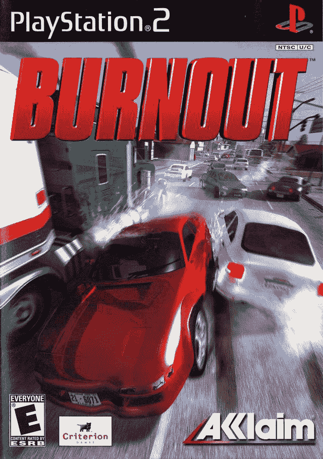

# 写作如何帮助我摆脱倦怠

> 原文：<https://dev.to/phizzard/how-writing-helped-pull-me-out-of-my-burnout-1e60>

因为有不同程度的倦怠和一些人如何度过倦怠，我将开始警告你们所有人，我不能思考倦怠而不思考有史以来最好的赛车游戏系列。现在我将描述一下我最近的倦怠。

从事 web 开发有时会有点累，因为从语言到框架，有太多不同的东西需要学习。很容易陷入这样的想法:你需要知道所有的事情，或者至少所有与你相关的事情。我主要喜欢使用 React 对于那些不熟悉 React 的人来说，React 是一个由脸书创建的用于构建 UI 的 Javascript 库。这是一个非常受欢迎的库，有很多支持，API 这些年来也有了很大的发展。这样做的好处是，图书馆会变得越来越好。不利的一面是，当新的变化到来时，你需要跟上它们，然而仅仅这一点并没有让我精疲力尽。

我已经到了可以非常轻松地构建 React 应用程序的地步。在使用该库几年后，我转向了他们较新的 hooks API，尝试了一些服务器渲染，尝试了一些使用 React 的框架，如 Next.js 和 Gatsby(我更多地选择了 Gatsby，并用它构建了一些项目)，最后，在避免使用它这么久之后，我研究了 Redux 的全局状态管理。

## 精疲力竭从这里开始

在完成了所有这些额外的事情，完成了一些兼职项目，做了一些作品集，并开始了一份新的工作之后，我感到筋疲力尽。我允许自己在工作之外休息，和家人一起放松，玩电子游戏，这些都是打发业余时间的好方法！不幸的是，在这段时间里，每当我想开始学习一些东西或开始一个新的副业来提升自己时，我最终都只有 5 个刚刚开始的想法，没有计划或愿景，每次我试图学习新技能或提高现有技能时，我都会感到沮丧。

随着事情的发展，我仍然能够很好地工作，但我非常清楚地意识到，我失去了一些扩展知识的热情，同时也非常清楚我周围所有我可以学习的东西。

## 这里是倦怠影响我的地方

这种情况持续了大概一个半月之久，我甚至开始质疑我作为一名开发人员的能力和我的学习能力。这没有帮助，因为当我开始一份新的工作时，我也容易有点冒名顶替综合症。在这一点上，我想也许我应该尝试学习一些完全不同的东西，比如 C++、Rust、Go，或者尝试投身于游戏开发。这导致我比以前更难恢复，让我在浪费了一个晚上的时间或撤退去玩一些电子游戏后感到沮丧。

我决定坐下来，我知道一个叫 Dev.to 的小东西，人们喜欢在上面写东西，所以我做了一个帐户，并决定不时地查看文章。我最终决定开始写一些粗略的随笔，讲述我领导和构建一个大型 web 应用程序的经历，虽然我并没有参与其中，但这感觉要被动和轻松得多；零挫败感。我坚持这样做，最终我把它格式化成一种可读的方式，并决定发表我的第一篇文章！

 [## 我构建大规模应用程序的艰难旅程

### Phil tiet jen Aug 9 ' 196 分钟阅读

#webdev #career #beginners](/phizzard/my-stumbling-journey-building-a-large-scale-app-2d4l)

## 这是倦怠开始消退的地方

当我发表我的第一篇文章时，我想大概会有 5 个人点击并浏览它。有这么多有价值的文章可以阅读，所以我的文章被阅读的机会有多大，也许我写了一篇糟糕的文章。

相反，虽然它没有爆炸，但相对于我的预期，它爆炸了。在一个周末，我收到了关于反应和评论的电子邮件通知，我读到的每条评论都很好，很有成效。有了这样积极的反馈和一小群追随者，我觉得我的心灵打开了我可以写的其他主题，这是事情开始为我打开的地方。

我思考的写作主题越多，我就越能批判性地思考我对自己擅长的事情了解多少，我的差距在哪里。我开始对这些领域进行更多的研究，将这种更好的理解应用到我希望最终也能发表的草稿中。

在经历所有这些研究的时候，我感觉学习的热情回来了，感觉很棒。我很享受和盖茨比在一起的时光，他们的主题工作流程正在制作中，我能够投入到一个新的辅助项目中，并有足够的动力来完成它。

作为一名开发人员，我现在对我面前的所有开放道路感到非常兴奋。我甚至停下来为自己设定了 2019 年剩下的目标。如果我能在年底前完成一小部分目标，我会很高兴。

我不得不为 dev.to 社区的伟大和 dev.to 的贡献者们大声欢呼，因为他们建立了一个新成员的帖子不会淹没在内容中并保持可见的平台。

如果你愿意谈论的话，你有过哪些精疲力竭的经历？是什么帮助你从另一端走出来的？你仍然有倦怠的问题吗？请在评论中告诉我，或者私信给我，我很乐意和你讨论这个话题！

如果你想关注我或者在那里聊天，我也在 Twitter 上。我有时在那里张贴东西！