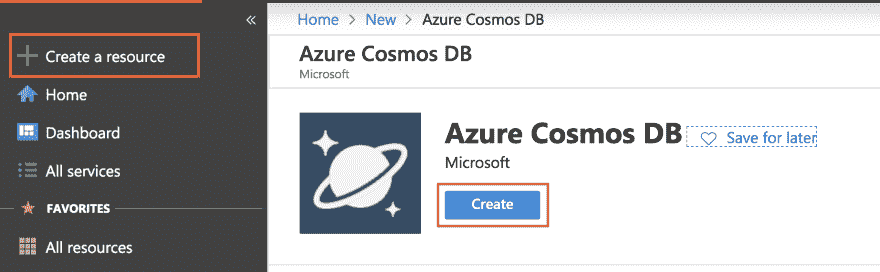
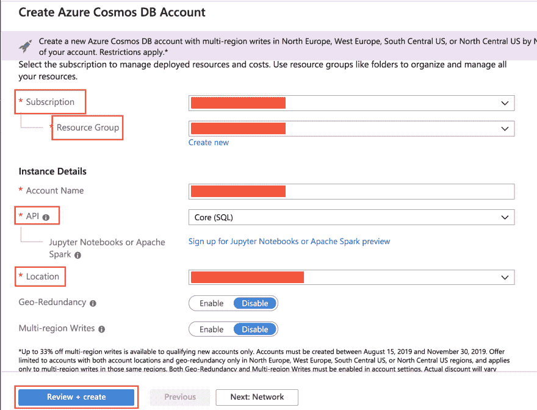
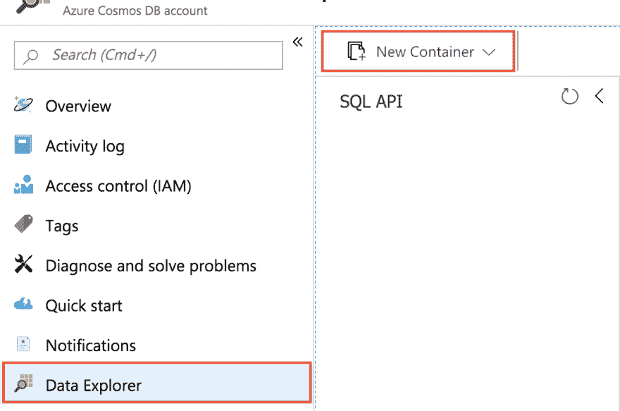
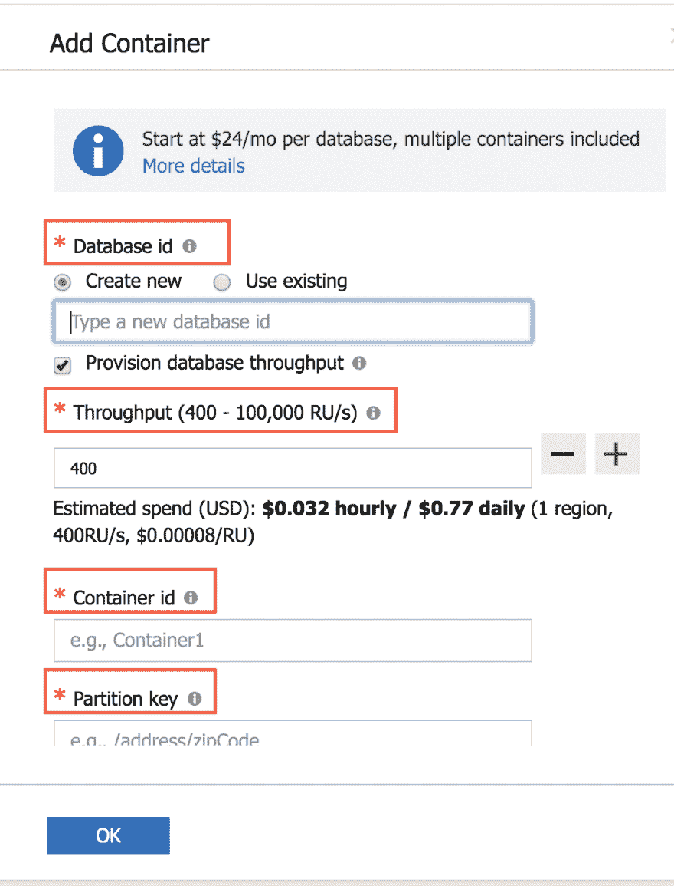
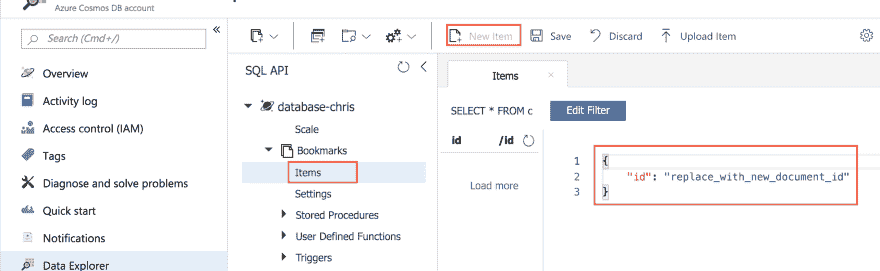
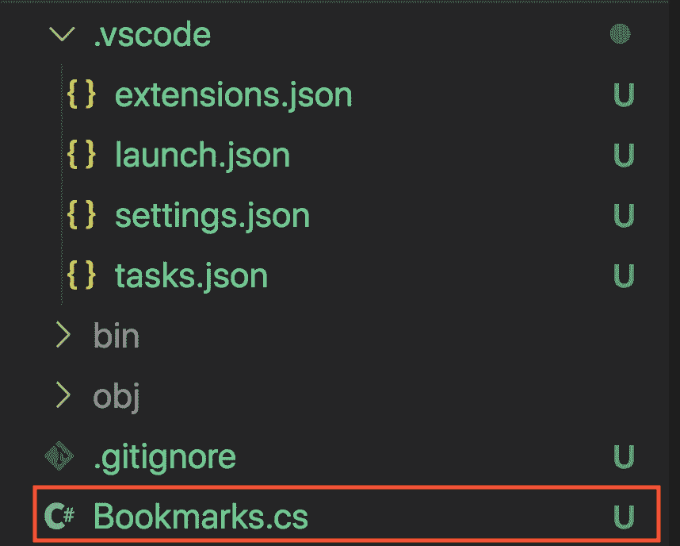
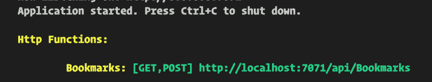
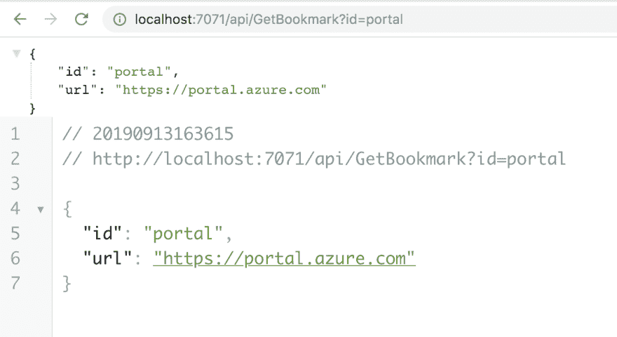
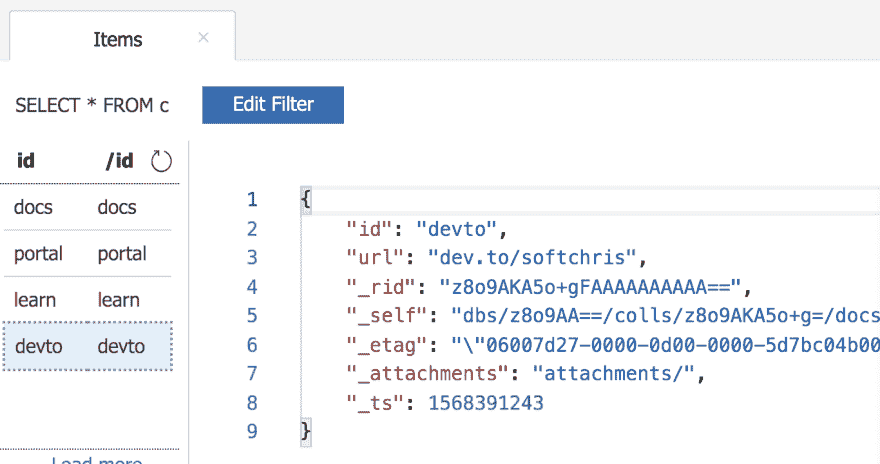

# 如何构建一个无服务器的 C#。Net 核心 API，有了绑定和数据库

> 原文：<https://dev.to/azure/how-you-can-build-a-serverless-net-core-api-in-no-time-with-bindings-and-cosmosdb-2eg8>

在 [Twitter](https://twitter.com/chris_noring) 上关注我，很乐意接受您对主题或改进的建议/Chris

本文是 [#ServerlessSeptember](https://dev.to/azure/serverless-september-content-collection-2fhb) 的一部分。在这个无服务器的内容集合中，您可以找到其他有用的文章、详细的教程和视频。9 月份，每天都有来自社区成员和云倡导者的新文章发布，没错，每天都有。

> 无服务器在很多方面都很棒。
> 
> 您对无服务器的第一印象可能是它在为您省钱。你已经意识到你有一些很少运行的代码，你已经把它们移走了，并且用它们制作了 Azure 函数。太好了，你已经很高兴了，谁不喜欢更多的资源呢？然后你会发现其他同样伟大甚至更伟大的东西。因为它位于云中，所以几乎不需要任何配置就可以将所有服务带到云中。怎么会这么容易？这很简单，因为我们使用了一种叫做*绑定*的东西。因此，让我们来谈谈无服务器，以及为什么和如何绑定是无服务器成功故事的一部分

在本文中，我们将涵盖:

*   **无服务器**，它是什么，我们为什么要使用它？
*   **核心概念**，让我们来看看绑定和触发
*   演示，让我们使用绑定和数据库来构建一些东西，并展示它有多简单

## 资源

*   注册一个免费的 Azure 账户
    如果你想开发逻辑应用和 Azure 功能，你需要一个 Azure 账户，这是免费的。

*   [触发器和绑定](https://docs.microsoft.com/en-us/azure/azure-functions/functions-triggers-bindings?wt.mc_id=devto-blog-chnoring)

*   [在不同语言中使用触发器和绑定的优秀示例页面](https://docs.microsoft.com/en-us/azure/azure-functions/functions-bindings-cosmosdb-v2#input---c-examples?wt.mc_id=devto-blog-chnoring)

*   [关于 CosmosDB 和 Azure 函数的好文章](http://dontcodetired.com/blog/post/Reading-Azure-Cosmos-DB-Data-In-Azure-Functions)
    好文章，总的来说好博客

*   [学习使用绑定和触发器的模块](https://docs.microsoft.com/en-us/learn/modules/chain-azure-functions-data-using-bindings/?wt.mc_id=devto-blog-chnoring)

## 无服务器

> 现在每个人都在谈论无服务器。无服务器这个无服务器的那个。这是为什么呢？

部分原因是如今云已经成为默认的托管平台，不再有服务器机房*几乎*。云实际上是别人的服务器机房，但底线是你不必在意。云在很多方面都有帮助，安全性、可靠性、备份、可伸缩性，最重要的是云中的其他事物能够相互交流。

> 为什么这很棒呢？

大多数公司都有大量的服务，这些服务共同构成了他们称之为业务的 IT 环境。让所有或大部分这些服务相互对话是一项非常耗时的任务，或者至少需要大量资源。今天的大多数云都非常善于在云内甚至跨云连接这些服务。

> 那么，无服务器在哪里合适呢？

在经历了云发展的许多步骤后，无服务器已经到来，在这些步骤中，我们最初决定不再管理硬件。然后我们决定我们不想和应用服务器打交道。所以我们到达了这样一个点，我们只想专注于代码，代码，除了代码什么也不做。这意味着 FaaS 诞生了一个全新平台，即服务。随着无服务器时代的到来，我们意识到了另一件事。我们开始越来越意识到，我们只想为实际的代码执行付费，而这正是无服务器服务所能提供的——完全托管并为您使用的服务付费。

> 但这不是我们阅读这篇文章的原因？

正确，我们在这里学习如何使用叫做*绑定*的东西将无服务器功能与其他东西集成。

## 核心概念

谈到集成和无服务器，我们需要理解三个主要概念，它们是

*   **触发器**，这就是我们的函数被调用的方式。导致调用的原因可能是任何事情，从 HTTP 调用、新的数据库条目到队列中的新消息等等。关键是，触发器是*启动*我们功能的东西。
*   **输入绑定**，这是对某种数据源的连接。重点是从这个数据源读取数据。这可能是 Excel 文档、数据库或队列中的任何内容
*   **输出绑定**，这是我们创建一个到数据库的连接，其明确意图是想要更改数据。通常，我们可以访问我们可以填充的记录，该记录进入数据源，通常用于更新或创建新数据

好了，现在我们知道了开始前需要知道的最重要的概念。

## 演示

好吧，那我们在建什么？为了展示无服务器有多棒，让我们试着联系至少两件事。这意味着我们需要构建/调配:

*   **数据库**，我们将提供一个 CosmosDB 数据库
*   **Azure Function App** 当然，我们将需要构建一个与我们的数据库连接的 Azure Function App

### 数据库

这一步非常简单。我们需要做的是登录 Azure 门户网站。你有账户吧？如果没有，在这里创建一个免费的 Azure 帐户

以下是我们需要采取的所有步骤:

1.  **调配**我们的数据库
2.  **建立**数据库并添加样本数据

**提供我们的数据库**

好了，我们已经登录了门户网站。现在，让我们像这样配置数据库:

[](https://res.cloudinary.com/practicaldev/image/fetch/s--LauTCyYF--/c_limit%2Cf_auto%2Cfl_progressive%2Cq_auto%2Cw_880/https://thepracticaldev.s3.amazonaws.com/i/xigs7t567fu6c68381ui.png)

此后，我们需要输入一些关于我们的数据库的信息。下面我们指出了我们需要填写的所有必填字段。确保您选择了`API`作为`Core(SQL)`，并确保您选择了一个离您最近的`Location`，以获得最佳响应时间。

[](https://res.cloudinary.com/practicaldev/image/fetch/s--ZwXWLj8j--/c_limit%2Cf_auto%2Cfl_progressive%2Cq_auto%2Cw_880/https://thepracticaldev.s3.amazonaws.com/i/uzw4wwwxp8cdho5fn7rm.png)

最后，点击底部的`Review + Create`。这应该会触发供应。几分钟后，您的资源/数据库应该可以使用了。

**建立数据库**

现在我们的资源已经准备好了，可以用来配置它了。我们要做的第一件事是添加一个容器。

> 什么是容器？

很高兴你问了这个问题:)容器实际上是保存我们的数据或实体的东西。容器本身包含一个名为*的文档*。

为了创建容器，我们从左侧菜单中选择`Data explorer`，然后点击`New Container`，就像这样:

[](https://res.cloudinary.com/practicaldev/image/fetch/s--PrChrqKF--/c_limit%2Cf_auto%2Cfl_progressive%2Cq_auto%2Cw_880/https://thepracticaldev.s3.amazonaws.com/i/8sjzdb4xcue9cs8rar9n.png)

下一步是填写创建容器所需的所有细节。

它会要求您填写以下字段:

*   **数据库 id** ，你可以给它取任何你想要的名字，我选择命名它为**数据库-克里斯**
*   **吞吐量**，给它赋值 **1000**
*   **容器 id** ，这是集合的名称。集合包含文档列表。每个文档就像表中的一行，表和集合大致是一样的东西。给它起名叫**书签**
*   分区键，分区键指定 Azure Cosmos DB 集合中的文档如何跨逻辑数据分区分布。这到底是什么意思？这意味着这个数据库可以在云中扩展。我们告诉它如何缩放，以及如何使用一种用于*分片*的技术来这样做。给定值 **/id**

该表单将如下所示:

[](https://res.cloudinary.com/practicaldev/image/fetch/s--BWE_IEzm--/c_limit%2Cf_auto%2Cfl_progressive%2Cq_auto%2Cw_880/https://thepracticaldev.s3.amazonaws.com/i/hrcdcez6fm9h5qyecovv.png)

**添加样本数据**

好了，现在数据库设置好了，我们可以开始用一些数据填充它了。所以下一步是点击我们的`Collection`书签，然后是`Items`。此后点击`Net Item`在我们的集合中插入一条记录，就像这样:

[](https://res.cloudinary.com/practicaldev/image/fetch/s--ZRrUmO5Z--/c_limit%2Cf_auto%2Cfl_progressive%2Cq_auto%2Cw_880/https://thepracticaldev.s3.amazonaws.com/i/ukbh9x0rq8015gztwtap.png)

正如你在右边看到的，它打开了一个文本区，我们可以用它来插入数据。让我们把它改成如下:

```
{
    "id": "docs",
    "url": "https://docs.microsoft.com/azure"
} 
```

并点击`Save`。像这样再增加几条记录:

```
{
    "id": "portal",
    "url": "https://portal.azure.com"
} 
```

还有最后一个:

```
{
    "id": "learn",
    "url": "https://docs.microsoft.com/learn"
} 
```

### Azure 功能 app

好，那么我们有一个数据库，一个数据源。现在是时候让我们构建一个 Azure Function app 和一个 Azure Function，并真正展示连接我们的数据源是多么容易。我们将执行以下操作:

1.  **支架**一个 Azure 函数 app 和一个 Azure 函数
2.  **建立**到数据库的连接
3.  从我们的数据库中读取,从而了解输入绑定
4.  将写入我们的数据库，从而学习输出绑定

**先决条件**

为了能够搭建我们的 Azure Function 应用程序，我们需要安装一些东西

*   [Azure 核心工具](https://github.com/Azure/azure-functions-core-tools#installing)
*   用于 VS 代码的 Azure 函数扩展，[扩展](//vscode:extension/ms-azuretools.vscode-azurefunctions)
*   一个免费的 Azure 帐户或一个现有的帐户(如果你有的话)，免费帐户

> 好了，都准备好了吗？

好，我们继续！:)

**搭建一个 Azure 功能 App**

开放 VS 代码。选择`View/Command Palette`(Windows 上 Ctrl + Shift + P，Mac 上 CMD + Shift + P)。

开始输入`Azure Function: Create new Project`并选择它。

*   选择当前文件夹
*   选择 C#作为语言
*   为我们的第一个函数选择 HttpTrigger
*   给它起名叫`Bookmarks`
*   您可以随意命名这个名称空间，但我们还是用`Company`吧。
*   选择授权类型`Function`

将弹出一个窗口到`restore dependencies`。点击它，或者如果你错过了它，请到终端键入`dotnet restore`。这是因为它下载了它指定的所有依赖库。

那好吧。我们得到了一个名为`Bookmarks`的函数，它驻留在`Bookmarks.cs`中，就像这样:

[](https://res.cloudinary.com/practicaldev/image/fetch/s--hgSTuLvk--/c_limit%2Cf_auto%2Cfl_progressive%2Cq_auto%2Cw_880/https://thepracticaldev.s3.amazonaws.com/i/9elzk1f0kjmrn7dm4vqs.png)

让我们敞开心扉，好吗？

```
// Bookmarks.cs
using System.IO;
using System.Threading.Tasks;
using Microsoft.AspNetCore.Mvc;
using Microsoft.Azure.WebJobs;
using Microsoft.Azure.WebJobs.Extensions.Http;
using Microsoft.AspNetCore.Http;
using Microsoft.Extensions.Logging;
using Newtonsoft.Json;
using System.Collections.Generic;

namespace Company
{
    public class Bookmark 
    {
        public string Id { get; set; }
        public string Url { get; set; }
    }
    public static class Bookmarks
    {
        [FunctionName("Bookmarks")]
        public static async Task<IActionResult> Run(
          [HttpTrigger(
            AuthorizationLevel.Function, 
            "get", 
            "post", 
            Route = null)
          ] HttpRequest req,
            ILogger log
            )
        {
            log.LogInformation("C# HTTP trigger function processed a request.");

            string name = req.Query["name"];

            string requestBody = await new StreamReader(req.Body).ReadToEndAsync();
            dynamic data = JsonConvert.DeserializeObject(requestBody);
            name = name ?? data?.name;

            return name != null
                ? (ActionResult)new OkObjectResult($"Hello, {name}")
                : new BadRequestObjectResult("Please pass a name on the query string or in the request body");
        }
    }
} 
```

我们最感兴趣的是函数的顶部，让我们放大一下:

```
[FunctionName("Bookmarks")]
public static async Task<IActionResult> Run(
  [HttpTrigger(AuthorizationLevel.Function, "get", "post", Route = null)] HttpRequest req,
  ILogger log
) { /* function body */ } 
```

我们可以看到属性`FunctionName`用于确定我们正在处理一个函数，它被称为`Bookmarks`。然后我们可以看到我们有一个属性`HttpTrigger`,表示它可以被一个 HTTP 调用触发。

### 添加 CosmosDB 输入绑定

好的，那么我们怎么把 CosmosDB 加到这个上面呢？嗯，有两种方法:

1.  **将 CosmosDB 属性**添加到我们的`Bookmarks.cs`文件中，然后从终端安装正确的 NuGet 包，以确保一切都能编译

2.  **添加一个带有 CosmosDB 触发器**的函数，这将安装所需的依赖项，还将触发一个存储对话框，让您选择存储帐户、数据库名称和收藏

让我们试试第一个选项。首先，让我们打开一个终端，输入:

```
dotnet add package Microsoft.Azure.WebJobs.Extensions.CosmosDB 
```

现在我们已经准备好下一步，向我们的`Bookmarks.cs`文件添加一个输入绑定。

为此，我们将使用一个名为`CosmosDB`的属性类。我们需要给它一些值

*   **数据库名称**，这是我们给数据库起的名字，所以这是**数据库——克里斯**
*   **收藏名称**，我们把我们的收藏命名为**书签**
*   **连接字符串**，至于连接字符串，这是我们在 Azure 门户中可以找到的。转到您的资源点击菜单中的**键**，然后复制**主连接字符串**中显示的值

现在，数据库名和集合名是我们可以添加到代码中的东西，比如:

```
// excerpt from Bookmarks.cs

[FunctionName("Bookmarks")]
public static async Task<IActionResult> Run(
  [HttpTrigger(AuthorizationLevel.Function, "get", "post", Route = null)] HttpRequest req,
  [CosmosDB("database-chris", "Bookmarks", ConnectionStringSetting ="CosmosDB")]IEnumerable<Bookmark> bookmarks
  ILogger log
) { /* function body */ } 
```

所以上面我们添加了属性类`CosmosDB`和*修饰*参数`bookmarks`。我们可以看到`bookmarks`的类型是`IEnumerable<Bookmarks>`

> 类型`Bookmark`从何而来？

这是我们需要创建的一个类型，要么在`Bookmarks.cs`中，要么在它自己的文件中，但是它需要有如下的形状:

```
public class Bookmark 
{
  public string Id { get; set; }
  public string Url { get; set; }
} 
```

它有属性`Id`和`Url`来匹配它在数据库中的形状。

进一步查看代码，我们给`ConnectionStringSetting`赋值`CosmosDB`

> 它从哪里来？

它来自一个文件`local.settings.json`和它的`Values`属性，比如:

```
{  "IsEncrypted":  false,  "Values":  {  "FUNCTIONS_WORKER_RUNTIME":  "dotnet",  "CosmosDB":  "value of primary connection string"  }  } 
```

**试用**

让我们首先在`Bookmarks.cs`中函数的第一行设置一个调试器。

在 VS 代码菜单中选择`Debug/ Start Debugging`。

[](https://res.cloudinary.com/practicaldev/image/fetch/s--N7yFLXcu--/c_limit%2Cf_auto%2Cfl_progressive%2Cq_auto%2Cw_880/https://thepracticaldev.s3.amazonaws.com/i/yamon2cfp0gzfzjxuios.png)

转到浏览器，输入`http://localhost:7071/Bookmarks`，你的断点应该会被命中，就像这样:

[](https://res.cloudinary.com/practicaldev/image/fetch/s--GXTnIGwc--/c_limit%2Cf_auto%2Cfl_progressive%2Cq_auto%2Cw_880/https://thepracticaldev.s3.amazonaws.com/i/qigybiof4aegyrkxiwcv.png)

如你所见，我们的`bookmarks`变量填充了数据，我们与数据库对话，它给我们数据，成功:)

**限制我们的反应**

现在上面是伟大的，我们从数据库中获得数据。然而，我们可能有数百万条记录，我们如何限制我们的反应呢？

这很容易做到，我们需要给我们的`CosmosDB`属性添加两个参数，即:

*   身份
*   分区键

了解分区键是值得的。所以这里有一个读[分区键的 CosmosDB](http://www.anderbakk.com/designing-a-partition-key-for-cosmos-db/)

好了，我们要做的是添加一个新函数，它能够从我们的触发器中获取一个`query`参数，并使用它来查询 CosmosDB。所以添加以下功能:

```
[FunctionName("GetBookmark")]
public static IActionResult GetBookmark(
  [HttpTrigger(AuthorizationLevel.Function, "get", Route=null)] HttpRequest req,
  [CosmosDB(
  "database-chris",
  "Bookmarks",
  ConnectionStringSetting = "CosmosDB", 
  Id = "id",
  PartitionKey = "{Query.id}"
)]Bookmark bookmark, 
  ILogger log
)
{
  return (ActionResult) new OkObjectResult(bookmark);
} 
```

现在启动我们的应用程序，在浏览器中运行下面的 URL`http://localhost:7071/api/GetBookmark?id=portal`。这将确保我们的 CosmosDB 查询值为`portal`的`id`。结果应该是这样的:

[](https://res.cloudinary.com/practicaldev/image/fetch/s--6c2zvLss--/c_limit%2Cf_auto%2Cfl_progressive%2Cq_auto%2Cw_880/https://thepracticaldev.s3.amazonaws.com/i/mbm0y7r21vq0d8kv17i0.png)

### 输出绑定

我们使用输入绑定来读取数据库。输出绑定用于写入数据库。让我们看两个不同的场景。

*   **Create** ，我们将从触发器中获取查询参数，并使用这些参数在数据库中创建一个条目
*   **更新**，我们将获取一个现有条目并更新它

**创建**

那么，创建输出绑定需要什么呢？嗯，几乎没什么。我们唯一需要的是类型为`out`的函数中的一个新参数，比如:

```
out dynamic bookmark 
```

让我们创建一个新的专用函数，将其命名为`CreateBookmark`，定义如下:

```
[FunctionName("CreateBookmark")]
 public static IActionResult CreateBookmark(
        [HttpTrigger(AuthorizationLevel.Function, "get", "post", Route=null)] HttpRequest req,
        [CosmosDB("database-chris","Bookmarks",
            ConnectionStringSetting = "CosmosDB")]out dynamic bookmark,
            ILogger log
    ) {
        string id = req.Query["id"];
        string url = req.Query["url"];

        bookmark = new { id = id, url = url };

        return (ActionResult)new OkObjectResult("created");
    } 
```

现在启动程序，在浏览器中输入一个类似这样的 URL。就这样，这应该会创建新条目。不相信我？在门户中查看您的数据库:

[](https://res.cloudinary.com/practicaldev/image/fetch/s--q5xxxhAX--/c_limit%2Cf_auto%2Cfl_progressive%2Cq_auto%2Cw_880/https://thepracticaldev.s3.amazonaws.com/i/zlmv0pmxq6axcqdfhsw8.png)

**更新**

因为这是 CosmosDB。这意味着如果有一个预先存在的具有该 id 值的记录，它将被简单地替换。然而，这可能不是你想要的。如果您只想更新某些属性，我推荐以下方法:

1.  **使用**一个输入绑定来检索一个现有的记录
2.  **将输入记录中的值复制到输出绑定中**
3.  **将从触发器获得的任何值复制到输出绑定中**

就这样，这就是我们的两个更新场景。

## 总结

我们已经学习了输入绑定和输出绑定。我们了解到输入绑定允许我们从数据库中读取数据，输出绑定允许我们创建或更新数据。此外，我们还学习了如何提供一个 CosmosDB 数据库，并使用一个名为 CosmosDB 的属性类连接到它。当然也有可能将 CosmosDB 作为触发器，但那将是另一篇文章:)