# 如何开始？VS 代码中的 NET Core 和 C#

> 原文：<https://dev.to/dotnet/how-you-can-get-started-with-net-core-and-c-in-vs-code-30gc>

在 [Twitter](https://twitter.com/chris_noring) 上关注我，很乐意接受您对主题或改进的建议/Chris

> 本文介绍了使用。我们将创建一个解决方案，一个库，一个控制台应用程序和一个测试项目。当然，我们将被教导如何执行我们的测试，所有这一切都来自终端

。NET 从 2001 年就出现了，很多开发人员已经开始使用 Visual Basic 了。NET 或 C#与 Visual Studio。他们当时用的是 Windows。时代变了，跨平台是必须的。NET 和 Visual Studio 都存在于 Windows、Linux 和 Mac 上。

在本文中，我们将涵盖:

*   正在安装。NET Core 和一些不错的扩展，比如 C#
*   **脚手架**一个解决方案
*   **添加类库**并将其添加到解决方案中
*   添加一个测试项目并运行我们的测试
*   添加一个控制台程序并使用我们的库
*   使用 vscode-solution-explorer 扩展改进我们的 IDE

我们学到了什么命令，接下来要看什么，比如 ASP、Docker、Cloud

## 资源

*   [托管. NET 核心 app](https://docs.microsoft.com/en-us/aspnet/core/host-and-deploy/?view=aspnetcore-3.0)
    托管. NET 核心 app 的方式有很多，Windows，Azure 等等。

*   [出版你。NET Core app to the Cloud](https://docs.microsoft.com/en-us/aspnet/core/tutorials/publish-to-azure-webapp-using-vscode?view=aspnetcore-3.0)
    让我们来学习如何发布我们的。NET 核心应用程序到云和 Azure。

*   注册一个免费的 Azure 帐户
    要使用 Azure，你需要一个免费的 Azure 帐户

*   [下载。网络核心](https://dotnet.microsoft.com/download)

*   [本文所依据的教程](https://docs.microsoft.com/en-us/dotnet/core/tutorials/using-on-macos?wt.mc_id=devto-blog-chnoring)

*   这是一个简单的 Hello world 控制台应用程序

*   容器化一个. NET 核心应用
    这解释了如何对你的应用进行 Dockerize 化，如何编写 Dockerize 文件等等。

*   [单元测试。NET Core](https://docs.microsoft.com/en-us/dotnet/core/testing/?wt.mc_id=devto-blog-chnoring)
    单元测试有不止一个选择

*   [dotnet CLI -所有命令](https://docs.microsoft.com/en-us/dotnet/core/tools/dotnet-new?tabs=netcore22&wt.mc_id=devto-blog-chnoring)T3`dotnet`工具有这么多命令。你知道你可以用一个 React 前端来搭建一个. NET 项目吗？

*   使用 ASP 和创建一个新的 web 应用程序。NET Core
    创建你的第一个 Web 应用程序的伟大教程。网络核心

## 安装和设置

你要做的第一件事就是安装。网芯。翻到这一页:

> [https://www.microsoft.com/net/download/core](https://www.microsoft.com/net/download/core?wt.mc_id=devto-blog-chnoring)

安装完成后，您应该可以访问一个命令行工具，您可以在名为`dotnet`的终端中调用它。您可以通过键入:
很容易地看到哪些命令可用

```
dotnet --help 
```

[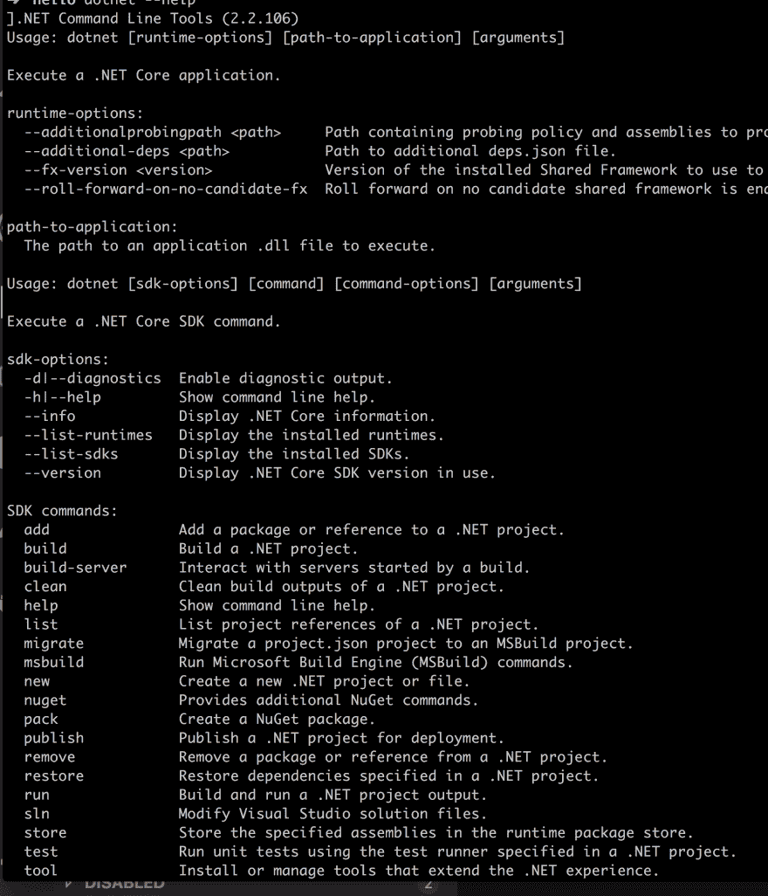](https://res.cloudinary.com/practicaldev/image/fetch/s--EAnSCsyk--/c_limit%2Cf_auto%2Cfl_progressive%2Cq_auto%2Cw_880/https://thepracticaldev.s3.amazonaws.com/i/n0hmptbs2k13x28phjr0.png)

正如你在上面看到的，有相当多的命令。我们将探索一些用于创建解决方案和项目的命令。

因为我们将使用 C#和 VS 代码，我建议下载 VS 代码

> [https://code.visualstudio.com/download](https://code.visualstudio.com/download)

一旦你的系统上有了 VS 代码，就去安装 C#扩展。键入`C#`，应该是这样的:

[](https://res.cloudinary.com/practicaldev/image/fetch/s--FjWv99Fb--/c_limit%2Cf_auto%2Cfl_progressive%2Cq_auto%2Cw_880/https://thepracticaldev.s3.amazonaws.com/i/jwu612zbdx2t4yt35x38.png)

好了，现在我们已经设置好代码了:)

## 创建解决方案

我们首先要做的是创建一个解决方案。解决方案是我们用来跟踪所有相关项目的东西。作为一个老。你可能习惯于通过 Visual Studio 来做这件事，但实际上我们将通过终端来做这件事。

我们将采取以下步骤:

1.  为我们的解决方案创建一个目录
2.  调用生成解决方案的命令

首先，让我们创建一个目录:

```
mkdir app
cd app 
```

您可以随意命名您的目录，`app`只是一个例子。

接下来，让我们创建一个解决方案。我们用下面的命令来做这件事:

```
dotnet new sln 
```

`sln`是`solution`的简称，这将生成一个新的解。因为我们站在`app`目录中，所以这会生成一个`app.sln`文件。

## 创建库

接下来，我们将生成一个库。现在，一个库不是一个可执行程序，而是我们包含在其他项目中的一组文件。

要创建一个库，我们需要在终端中键入以下内容(我们仍然在`app`目录中):

```
dotnet new classlib -o library 
```

上面我们可以看到我们的通用命令是`dotnet new`，后面是类型，在本例中是`classlib`，然后我们使用标志`-o`，最后一个参数是项目的名称。

让我们看看我们得到了什么:

[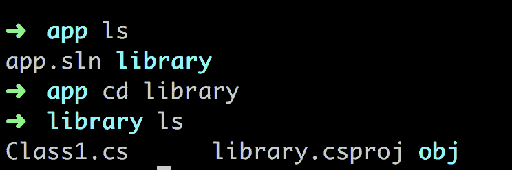](https://res.cloudinary.com/practicaldev/image/fetch/s--MvX689LM--/c_limit%2Cf_auto%2Cfl_progressive%2Cq_auto%2Cw_880/https://thepracticaldev.s3.amazonaws.com/i/hzoxldg09xxfhoe9xswv.png)

我们看到目录`library`已经创建。我们还看到我们得到了文件`Class1.cs`、项目文件`library.csproj`和一个目录`obj`。现在，让我们切换到 VS 代码，看看我们的文件。看 att `Class1.cs`，是这样的:

```
 // Class1.cs

using System;

namespace library
{
  public class Class1
  {
  }
} 
```

它做的不多，但它是有效的 C#代码。

让我们通过添加解决方案来结束这一部分:

```
dotnet sln add library/library.csproj 
```

这将以下条目添加到`app.sln` :

```
Project("{FAE04EC0-301F-11D3-BF4B-00C04F79EFBC}") = "library", "library\library.csproj", "{7F30581E-9BCD-46FB-B7A5-FC2A85DE1429}" 
```

目前，我们不会花太多时间去考虑这个问题，除非我们有一个了解我们的库的解决方案。

## 更新本库

好了，我们需要向我们的库项目添加一些代码。我们将执行以下操作:

1.  **从 NuGet 存储库中下载**一个 NuGet 包
2.  参考我们库代码中的 NuGet 包
3.  **构建**我们的代码

### 从 NuGet 资源库下载并使用一个包

> [https://www.nuget.org/](https://www.nuget.org/)

是一个大的(160k +库)存储库，所有 NuGet 库都在其中。这里的任何东西都可以通过简单的命令下载。对于这一部分，我们将抓取一个名为`Newtonsoft.Json`的特定库。这将允许我们来回解析 JSON。要使这个库成为我们解决方案的一部分，我们可以键入:

```
dotnet add library package Newtonsoft.Json 
```

以上意味着我们正在将包`Newtonsoft.Json`添加到项目`library`中。命令应该这样读:

```
dotnet add [what project to add it to] package [name of package at nuget.org] 
```

有时你可能正在处理一个现有的项目，或者你可能已经获得了最新的变更。无论哪种情况，您都可能会遗漏一些项目或解决方案正常运行所需的包。此时，您可以运行命令

```
dotnet restore 
```

这将获取项目`csproj`文件中指定为包引用的包。

### 更新本馆代码

在您的库项目中，将文件`Class1.cs`更改为`Thing.cs`，并向其中添加以下代码:

```
// Thing.cs

using static Newtonsoft.Json.JsonConvert;

namespace Library
{
  public class Thing
  {
    public int Get(int left, int right) =>
        DeserializeObject<int>($"{left + right}");
  }
} 
```

### 打造

接下来，我们需要编译代码。如果成功，这将生成一个所谓的`.dll`文件。这是使用的格式。NET 代表图书馆，代表动态链接库。

因此，让我们用命令来编译我们的代码:

```
dotnet build 
```

[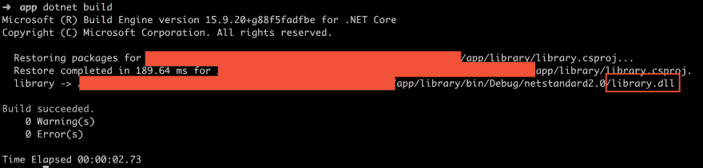](https://res.cloudinary.com/practicaldev/image/fetch/s--ZsZBQk2F--/c_limit%2Cf_auto%2Cfl_progressive%2Cq_auto%2Cw_880/https://thepracticaldev.s3.amazonaws.com/i/3w4i6wng5yvs4tahy2h3.png)

如上图所示，我们得到一个`library.dll`

成功！

## 创建测试库

接下来，我们将创建一个测试项目。所有的代码都值得进行某种程度的测试，还有什么比尽早设置测试更好的方式呢？要创建一个测试项目，我们需要键入以下内容:

```
dotnet new xunit -o test-library 
```

这将创建一个名为`test-library`的`xunit`类型的测试项目。

### 添加引用

让我们也将我们的项目添加到解决方案文件中:

```
dotnet sln add test-library/test-library.csproj 
```

这里的想法是测试我们名为`library`的项目中的功能。为此，我们需要在我们的`test-library`项目中添加对`library`的引用，就像这样:

```
dotnet add test-library/test-library.csproj reference library/library.csproj 
```

### 写作测试

当我们创建我们的`test-library`时，我们也创建了一个名为`UnitTest1.cs`的文件。让我们来看看这个文件:

```
 //UnitTest.cs

using System;
using Xunit;

namespace test_library
{
    public class UnitTest1
    {
        [Fact]
        public void Test1()
        {

        }
    }
} 
```

我们使用装饰符`[Fact]`来表示这是一个需要评估和运行的测试方法。让我们在`UnitTest.cs`旁边添加一些代码:

```
 //UnitTest.cs

using Library;
using Xunit;

namespace TestApp
{
    public class LibraryTests
    {
        [Fact]
        public void TestThing() {
            Assert.NotEqual(42, new Thing().Get(19, 23));
        }
    }
} 
```

### 运行我们的测试

我们现在准备运行我们的测试并检查结果。

要运行测试，请键入:

```
dotnet test test-library/test-library.csproj 
```

我们使用命令`dotnet test`，最后一个参数是在哪里找到测试项目的项目文件。那么我们得到了什么？

[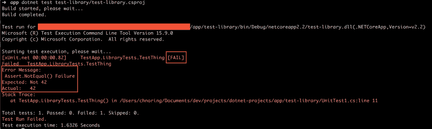](https://res.cloudinary.com/practicaldev/image/fetch/s--cLGtikL9--/c_limit%2Cf_auto%2Cfl_progressive%2Cq_auto%2Cw_880/https://thepracticaldev.s3.amazonaws.com/i/3yh4fx30ql8yfwr43tep.png)

从上图我们可以看出，我们的测试运行失败了。它清楚地表明了`[Fail]`。让我们看看为什么。*预期结果不是 42* 。嗯，让我们检查一下我们的`library`项目
中`Thing.cs`的实现

```
public int Get(int left, int right) =>
        DeserializeObject<int>($"{left + right}"); 
```

很明显，我们只是接受`2`个输入参数，然后对它们求和。`UnitTest1.cs`里的测试呢？

```
public void TestThing()
{
  Assert.NotEqual(42, new Thing().Get(19, 23));
} 
```

`19` + `23`不等于 42。等一下...应该是`Equal`。让我们改变一下:

```
public void TestThing()
{
  Assert.Equal(42, new Thing().Get(19, 23));
} 
```

让我们重新运行测试:

```
dotnet test test-library/test-library.csproj 
```

让我们检查结果....

[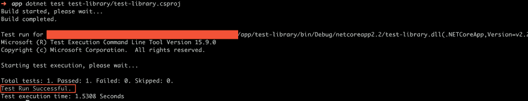](https://res.cloudinary.com/practicaldev/image/fetch/s--hnJXEo-p--/c_limit%2Cf_auto%2Cfl_progressive%2Cq_auto%2Cw_880/https://thepracticaldev.s3.amazonaws.com/i/sariv0g1pum06ft3knx5.png)

这一次，测试成功了。

成功！:)

## 控制台 app

接下来我们要做的是创建一个控制台应用程序。为什么这么问？嗯，我们想展示创建一个可重用的库的整个想法，我们可以在任何地方，从测试项目到控制台项目。

让我们像这样生成我们的控制台项目:

```
dotnet new console -o console-app 
```

这为我们提供了一个可运行的项目，其中有一个文件`Program.cs`作为入口点。从技术上讲，入口点是一个叫做`Main()` :
的方法

```
 // Program.cs

using System;

namespace console_app
{
  class Program
  {
    static void Main(string[] args)
    {
        Console.WriteLine("Hello World!");
    }
  }
} 
```

让我们将这个项目添加到解决方案文件中，就像这样:

```
dotnet sln add console-app/console-app.csproj 
```

### 添加和使用本库项目

下一步是开始使用我们的`library`项目，并使其成为我们的`console-app`项目的一部分。所以我们像这样添加依赖:

```
dotnet add console-app/console-app.csproj reference library/library.csproj 
```

将以上内容读作:

```
dotnet add [target project] reference [destination project] 
```

接下来，我们需要将我们的`Program.cs`文件的代码改为如下:

```
 // Program.cs

using System;
using Library;

namespace console_app
{
  class Program
  {
    static void Main(string[] args)
    {
        Console.WriteLine($"The answer is {new Thing().Get(19, 23)}");
    }
  }
} 
```

接下来让我们运行应用程序

```
dotnet run -p console-app/console-app.csproj 
```

[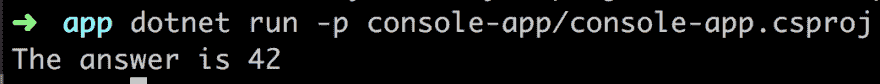](https://res.cloudinary.com/practicaldev/image/fetch/s--MS5kN-PZ--/c_limit%2Cf_auto%2Cfl_progressive%2Cq_auto%2Cw_880/https://thepracticaldev.s3.amazonaws.com/i/yn68cztpmihshwfcwct8.png)

我们用来自`library`项目的代码给自己弄了一个运行的应用程序。

厉害了:)

## 调试

调试。这是使用 Visual Studio 的好处之一。过去如此，现在也是如此。个人认为是首屈一指的，那么在 VS 代码中是什么情况呢？

好吧，让我们看看我们是如何调试的，然后反思它做得有多好。

现在，如果您打开一个缺少调试所需资源的解决方案，VS 代码会要求您添加该资源。那我怎么知道少了什么？嗯，您应该有一个如下所示的`.vscode`目录:

[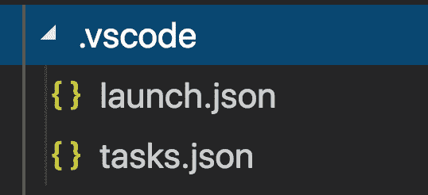](https://res.cloudinary.com/practicaldev/image/fetch/s--XWWzFcc5--/c_limit%2Cf_auto%2Cfl_progressive%2Cq_auto%2Cw_880/https://thepracticaldev.s3.amazonaws.com/i/guwfqzaipnj8kubzxcc1.png)

> 就这样？

嗯，你可以试着从菜单中选择`Debug/Start Debugging`，如果你看调试窗口的末端，你会注意到它正在运行`test-library`

[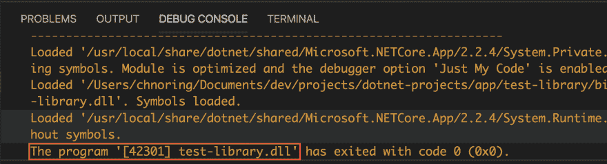](https://res.cloudinary.com/practicaldev/image/fetch/s--NOzs9nYL--/c_limit%2Cf_auto%2Cfl_progressive%2Cq_auto%2Cw_880/https://thepracticaldev.s3.amazonaws.com/i/520oxg1fdib0g1x0laqg.png)

现在，您可能希望在调试时实际运行`console-app`项目。要做到这一点，我们需要进入`.vscode`目录下的`launch.json`。找到类似这样的条目:

```
{  "name":  ".NET Core Launch (console)",  "type":  "coreclr",  "request":  "launch",  "preLaunchTask":  "build",  //  If  you  have  changed  target  frameworks,  make  sure  to  update  the  program  path.  "program":  "${workspaceFolder}/test-library/bin/Debug/netcoreapp2.2/test-library.dll",  "args":  [],  "cwd":  "${workspaceFolder}/test-library",  //  For  more  information  about  the  'console'  field,  see  https://aka.ms/VSCode-CS-LaunchJson-Console  "console":  "internalConsole",  "stopAtEntry":  false  } 
```

我们需要更改属性`"program"`以指向我们的控制台应用程序和`"cwd"`。

现在它应该看起来像下面的`launch.json`

[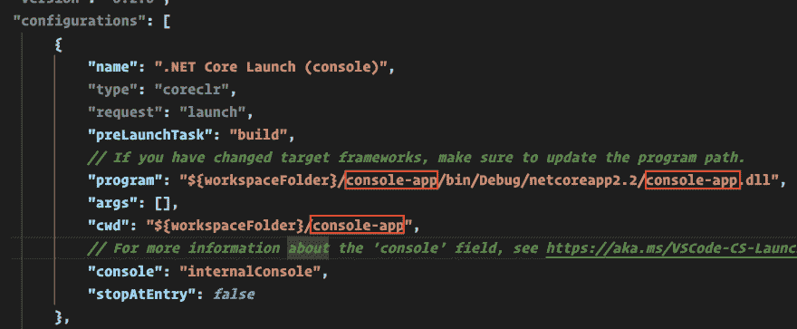](https://res.cloudinary.com/practicaldev/image/fetch/s--QsAGFiWv--/c_limit%2Cf_auto%2Cfl_progressive%2Cq_auto%2Cw_880/https://thepracticaldev.s3.amazonaws.com/i/4vsih00rmnz7a8pwuq5y.png)

然后选择菜单选项`Debugging/Start Debugging`,我们应该会看到以下内容

[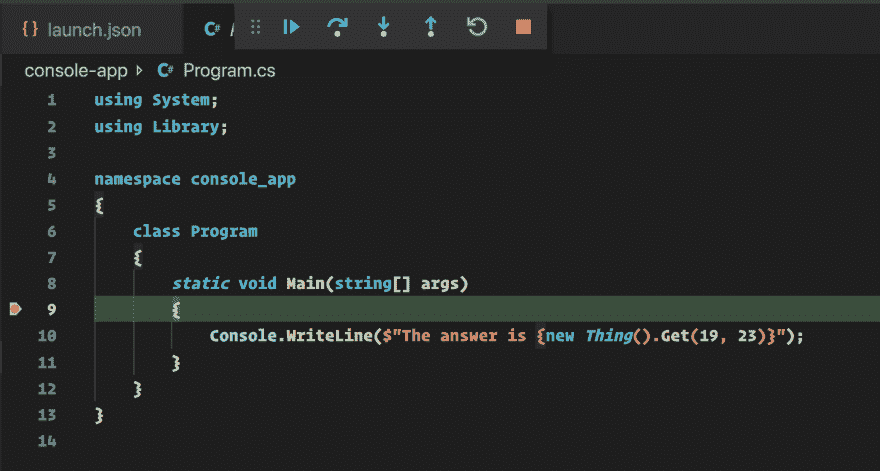](https://res.cloudinary.com/practicaldev/image/fetch/s--hg8UJXWz--/c_limit%2Cf_auto%2Cfl_progressive%2Cq_auto%2Cw_880/https://thepracticaldev.s3.amazonaws.com/i/kxy4pivxqiwyausi91kh.png)

我们有它，男孩和女孩，工作调试:)

所以，首先发生的事情是，我注意到当我在`Program.cs`中更改代码时，我的断点没有被正确命中。这是有原因的。查看我们在`launch.json`中的条目，我们看到有一个属性`"preLaunchTask": "build"`，它指出了一个应该在我们调试之前运行的任务。这个任务驻留在`tasks.json`中。看着这个文件，我们注意到它是这样的:

```
{  "label":  "build",  "command":  "dotnet",  "type":  "process",  "args":  [  "build",  "${workspaceFolder}/test-library/test-library.csproj"  ],  "problemMatcher":  "$tsc"  } 
```

是的，你是对的，在再次运行调试之前，我们没有构建正确的项目。解决这个问题的方法是运行

```
dotnet build 
```

在终端或中，修复这个任务并让它指向我们的`console-app`，就像这样:

[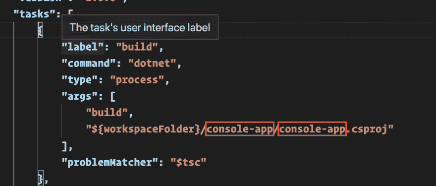](https://res.cloudinary.com/practicaldev/image/fetch/s--0IumaHJc--/c_limit%2Cf_auto%2Cfl_progressive%2Cq_auto%2Cw_880/https://thepracticaldev.s3.amazonaws.com/i/8zzn0j1wrmkf1fmgd9es.png)

如果你再次调试，一切都正常。现在你对 VS 代码的工作原理有了更多的了解。

如果我在这里有一个观点，作为一个用户，我想把它从我这里抽象出来。我宁愿要一个插件为我做这件事。在这一点上，我希望有一个解决方案资源管理器，就像我在 Visual Studio 中的那样。

## 改进 IDE

如果你像我一样有 10 年以上的经验。NET 平台，你在想办法把这个尽量做成 Visual Studio。你当然欢迎新的做事方式，比如使用终端，但是感觉你想要一个 UI。也许我应该使用实际的 Visual Studio？

嗯，有一个插件可以解决这个问题。叫`vscode-solution-explorer`。如果您安装它，您的项目将突然看起来像这样:

[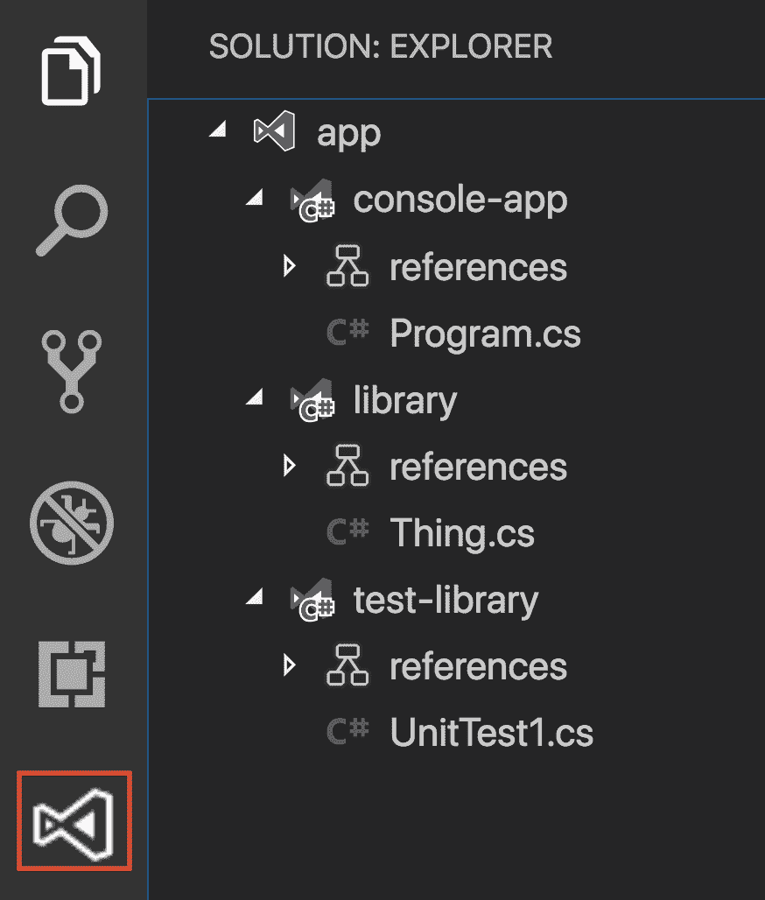](https://res.cloudinary.com/practicaldev/image/fetch/s--qgURedPy--/c_limit%2Cf_auto%2Cfl_progressive%2Cq_auto%2Cw_880/https://thepracticaldev.s3.amazonaws.com/i/xyitqvyr6y22twnq1zh7.png)

右键单击一个项目会显示如下菜单:

[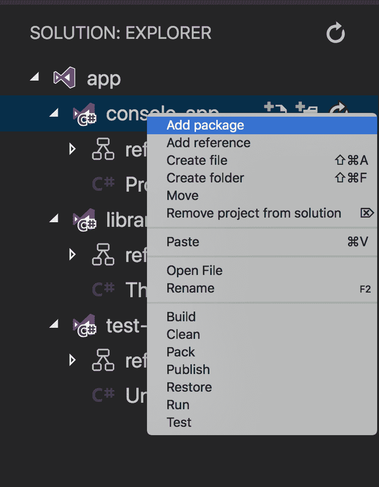](https://res.cloudinary.com/practicaldev/image/fetch/s--nRy3LxjR--/c_limit%2Cf_auto%2Cfl_progressive%2Cq_auto%2Cw_880/https://thepracticaldev.s3.amazonaws.com/i/uptrdog1uxx3hbizxnc6.png)

我的自发反应是:)

[](https://res.cloudinary.com/practicaldev/image/fetch/s--kRa6Uoqp--/c_limit%2Cf_auto%2Cfl_progressive%2Cq_66%2Cw_880/https://thepracticaldev.s3.amazonaws.com/i/gognv2gbb19p32nis3j6.gif)

这不是微软的官方扩展，但如果你像我一样喜欢终端命令，但有时只是想要一个用户界面，这很好，值得一试。

## 总结

好了，我们试着总结一下。我们已经接受了很多教育。网芯。我们被教导使用`dotnet` core 做任何事情，从搭建不同类型的项目到创建解决方案、添加引用、构建代码到运行测试。相当百搭。

最后，我们还展示了一个插件，它为我们所有的终端命令提供了另一种方法。当然，在幕后，它运行我们的终端命令，所以学习 CLI 的方法肯定是有价值的。:)