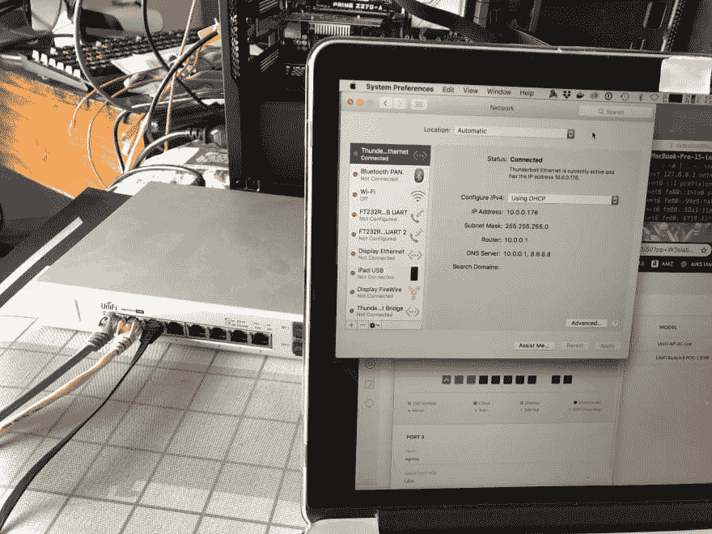
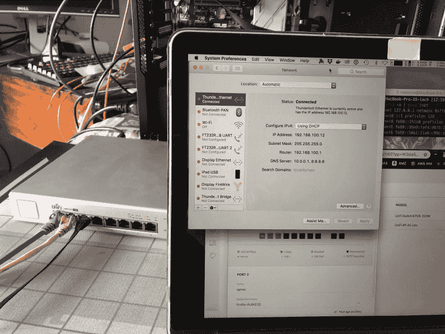

# 如何使用 XCP ng、pFSense、Ubiquity Unifi 改进您的开发人员家庭实验室/网络

> 原文：<https://dev.to/bsodmike/howto-improve-your-developer-homelab-network-with-xcp-ng-pfsense-ubiquity-unifi-29nl>

# 简介

在背景中，您会看到一个简单的 PC 构建，在这种情况下

*   华硕 Z270 Prime-A
*   16GB 关键内存
*   Intel 6700K
*   [StarTech.com 双端口 PCI Express (PCIe x4)千兆以太网服务器适配器-双端口网卡-英特尔 i350 NIC - GbE 网卡](https://amzn.to/2ISOpz4)
*   [EVGA Supernova 750 P2，80+铂金 750 瓦，全模块化 PSU](https://amzn.to/31H3Zqo)

在华硕 UEFI 中，确保启用英特尔虚拟化选项。

# 系统配置

*   已将 XCP ng v 7.6 安装到单个 SATA 固态硬盘上。
*   XCP-ng 被绑定到一个免费的后端。
*   主板英特尔网卡用于 XCP-ng 管理访问-连接到网关 10.0.0.1/24 的内部 EdgeRouter-x (ER-x)

# 设备端口(是的，在本例中是一台 PC...)

值得注意的是，这些都在 XCP-ng 控制软件中进行了相应的配置

*   NIC0:主板英特尔网卡
*   NIC1: I350 端口 1 // pfSense WAN (xn0)
*   NIC2: I350 端口 2 // pfSense LAN (xn1)

# 无处不在的 Unifi 交换机 8 托管 PoE+千兆交换机

*   我有 Unifi 控制器软件，在我的主要 XCP 服务器上的 Ubuntu 虚拟机上运行。它处理 Unifi 硬件的所有供应和控制。
*   此处使用的交换机是带 SFP 的 [Unifi Switch 8 受管 PoE+千兆交换机](https://www.ui.com/unifi-switching/unifi-switch-8-150w/),如下图左侧所示，为银色/灰色。

*   蓝色电缆->从 ER-x 路由器连接到 10.0.0.0/24 网络

*   黄色电缆- > pfSense 局域网

*   pfSense WAN 端口也从 ER-x 路由器连接到 10.0.0.0/24 网络

*   黑色线缆->连接到我的 MacBook Pro。

# 无处不在的 Unifi 交换机 8 端口配置

*   端口 1:设置为默认“所有”网络，默认为 VLAN1(中继端口)。
*   端口 2:设置为与本地局域网 **VLAN2** //绑定的自定义配置文件，这只是一个 VLAN ID 为 2 且 DHCP 设置为“关闭”的局域网配置文件。Profile 被称为 **Profile-VLAN2**
*   端口 3:连接 MBP 的黑色电缆-下图中设置为网络**局域网**

请注意笔记本电脑的 IP 地址是 10.0.0.0/24。

现在，如果我们将交换机端口配置文件更改为**配置文件-VLAN2** -神奇的事情发生了-笔记本电脑现在获得了 192.168.100.0/24 IP -耶！！这一点至关重要，因为这是 pfSense 中的虚拟端口(xn1)。

# 太好了，那么你为什么要这样做呢？

只需更改端口配置文件，任何下游流量现在都可以(1)直接从主路由器(ER-x)路由，或者(2)通过 ER-x ->进入 pFSense“设备”->从黑线路由出去。

**该设置允许您*切换*与黑色电缆**相连的物理网络😀

我还让 IDS(入侵检测系统)以 Suricata 的形式在 pFSense 中运行，它目前监控 WAN 接口。

我还可以将 pFSense 配置为 OpenVPN 客户端，所有通过它的流量都将通过 VPN 路由——这是我的最终目标。

## XCP-ng(Xen server)有什么优势

XCP-ng(Citrix Xen server 的开源分支)允许我们在虚拟机(VM)中运行 pFSense，这允许我们通过 XOA (Xen Orchestra)内的 cron-jobs 设置所述 VM 的定期备份。

由于它们与 FreeNAS 后端相连，所有备份都安全地存储在 ZFS。

## 这种方法的缺点

现在，我不需要通过 pFSense 的任何 VLAN，但如果我想标记进入 pFSense WAN 端口的 VLAN，这是不可能的，因为 pFSense 报告说现在连接了支持 VLAN 的接口。

Xen/XCP-ng 支持 SR-IOV，但我还没有掉进兔子洞。

## 生成 VLANs

我希望能够用自定义的 VLAN 标记来标记来自 xn1 (pfSense-LAN 端口)的流量，但是找不到这样做的方法；(1)看来 pFSense 没有这个能力(？？)但仅标记/解码通过 WAN 接口传入的流量(2)这是不可能的，因为 XCP-ng 将其与支持 VLAN 的硬件隔离(I350 网卡可以关闭该功能，802.1q)。

> 我很感激对我以上陈述的任何修正，因为我确信会有人从 pFsense 内部更好地了解标记端口——如果可能的话，请让我知道！

如果你已经做到这一步，分享你的想法-我渴望听到你的声音！！

发微博给我 [@bsodmike](https://dev.to/bsodmike) :)