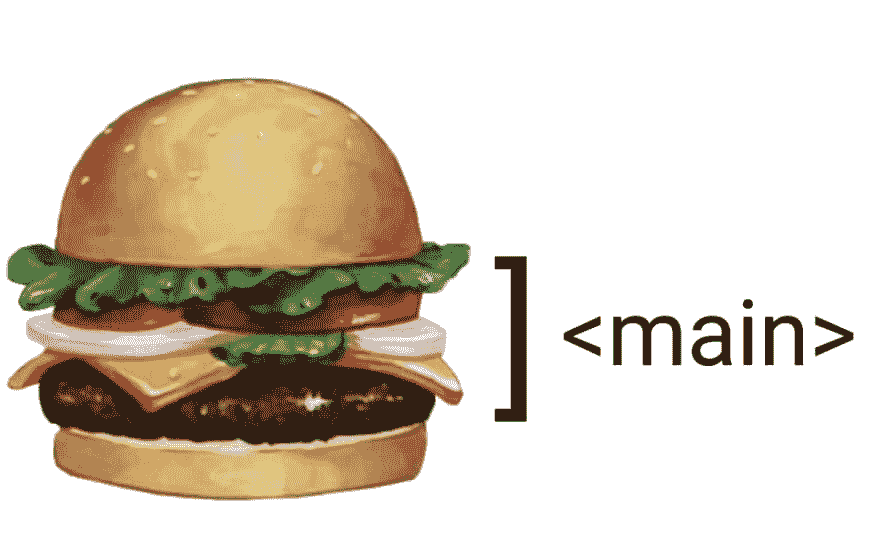
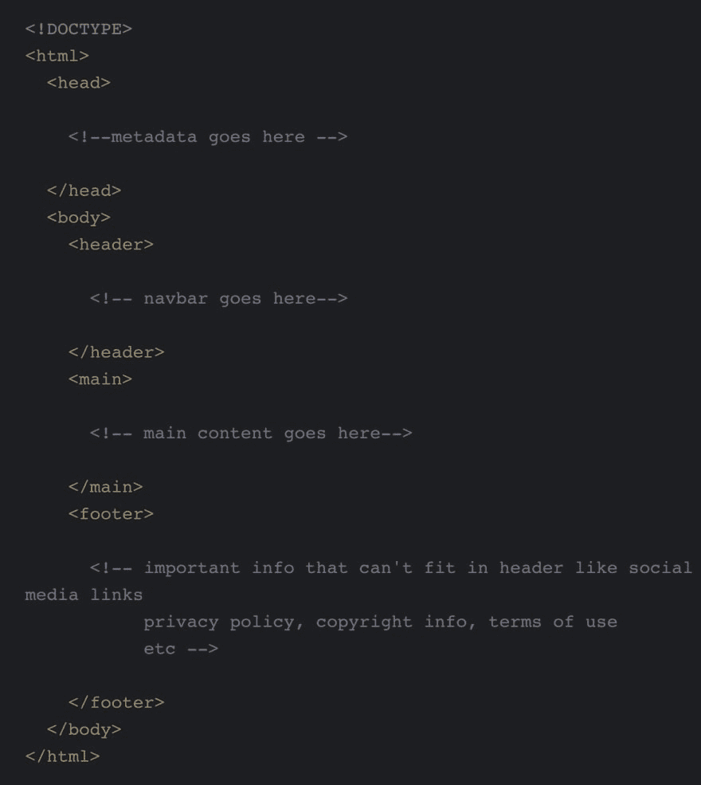
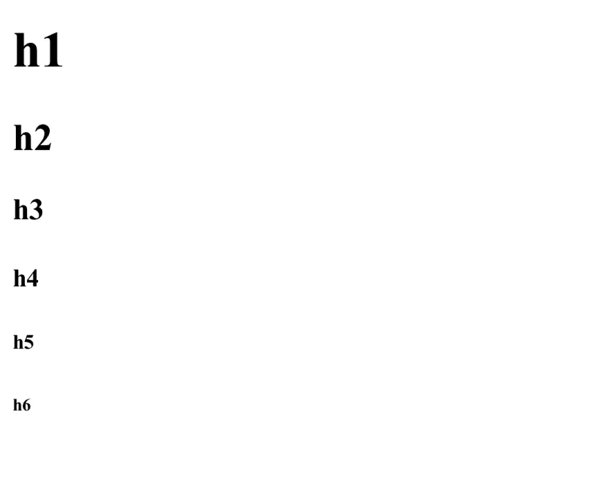

# HTML 101:开始学习需要知道的东西

> 原文：<https://dev.to/ceeoreo/html-101-what-you-need-to-know-to-get-started-5bmo>

*这篇文章最初刊登在[debugacademy.com](https://debugacademy.com/)上。*

当你开始 web 开发时，HTML 是你首先要学的东西之一。没有巨大的学习曲线或一大堆令人困惑的逻辑。这是 web 开发的主要组成部分之一。因此，如果你想成为一名 web 开发人员，HTML 是你肯定想知道的东西。

有数百种不同的 HTML 属性和特殊功能。创建网站时，很难理解什么是重要的，什么是你实际上最常用的。谢天谢地，我们在我的[调试学院](https://debugacademy.com/)课程中介绍了 HTML。我的导师关注的是对开始最重要的事情。所以在这篇文章中，我将概述我所学到的东西。这里是开始创建简单网站时你需要知道的最重要的 HTML。

## 结构元素

很多 HTML 都是关于结构的。HTML 的结构元素对用户看到的东西没有太大影响。但这与搜索引擎和屏幕阅读器如何处理你的内容有很大关系。所有用户都可以访问您的网站，这一点很重要，包括那些视力受损的用户。因此，虽然结构元素可能不会在视觉上呈现出来，但它们非常重要。

### `<!DOCTYPE html>`和`<html>`

我们用`<!DOCTYPE html>`和`<html>`开始我们的 HTML 文档。这两个元素告诉我们的浏览器(即。Chrome 或 Safari)之后的代码将是 HTML 格式。

### `<head>`和`<body>`

代码的`<head>`是所有元数据所在的地方。目前，我们不会深入探究什么是元数据以及它为什么重要。基本上就是你的浏览器需要知道的显示你的网站的重要信息。但是你的用户看不到。这是你链接到你的 CSS 文件和包含你的网站标题的地方。

`<body>`是所有剩余 HTML 代码所在的地方。我们将在这篇文章中讨论的所有 HTML 都嵌套在我们的`<body>`中。

### `<header>`

我们已经讨论过这个问题了，但我还是要再说一遍。`<header>`纯粹是结构性的。顾名思义，这是位于页面顶部的所有元素的位置。导航栏和导航链接将被放置在这里。

`<header>`元素不仅仅用于`<body>`中的导航栏。您可以使用一个`<header>`来将位于某些元素顶部或开头的任何内容进行分组。我看到文章、表格和卡片都是这样做的。在这篇文章中，我们将只关注在我们的`<body>`中使用它。

### `<main>`

HTML 代码的`<main>`部分是大部分内容所在的地方。这是你冰淇淋三明治里的冰淇淋。这是你的蟹肉馅饼的馅饼、奶酪和生菜。
 
与`<header>`不同，你的网页只能有一个`<main>`。

### `<footer>`

这是位于网页底部的内容部分。链接到社交媒体账户和不适合放入`<header>`的信息，请点击此处。这包括隐私政策、版权信息和使用条款。与`<header>`相似，`<footer>`也可以用在`<body>`以外的元素上，对位于该元素底部的内容进行分组。

这里有一个我们如何使用目前为止所学的 HTML 元素来建立一个页面的视觉效果。

### `<section>` vs `
`

这两个元素让很多人困惑，从初学者到一些有经验的 web 开发人员。这两个元素都用于对内容进行分组。令人困惑的部分是知道他们应该对什么内容进行分组。与`
`相比，`<section>`元素对 HTML 来说是相当新的。有些人在应该使用其他元素的时候仍然使用`
`元素。谈到这个话题，这里有一个通用的经验法则。

把你的网页想象成一本书。使用`<section>`对将出现在图书目录中的内容进行分组。扪心自问，这是我书中的一章吗？如果答案是肯定的，则将该内容包装在一个`<section>`中。如果答案是否定的，你也许可以用一个`
`来逃避。

## 视觉内容

这是事情变得真正令人兴奋的地方。显然，视觉内容就是我们的用户所看到的。重要的是我们知道如何使用这些元素以及何时使用它们。信不信由你，这些元素的使用地点、时间和频率对屏幕阅读器如何解读网站内容有很大影响。如果我们希望每个人都能喜欢我们的网站，我们必须记住所有这些事情。

### `<h1> - <h6>`

`<h1>` - `<h6>`中的 h 代表表头。这不要与`<header>`相混淆。我敢肯定，你们中的许多人以前在 [Word](https://products.office.com/en/word) 或 [Google Docs](https://www.google.com/docs/about/) 中使用过这种标题。标题只是加粗的大文本。尺寸根据您使用的割台而有所不同，`<h1>`最大，`<h6>`最小。这是每一个的视觉效果。

### `
`

`
`是我们放置段落的地方。所以，是的，它听起来就像它看起来的那样。这里不多解释了。

### ``

这是我们的图像标签。这个``不完整。为了实际显示一个图像，我们需要添加一个名为“src”的属性。我们将“src”设置为图像的链接或文件路径。我们还需要包括“alt”属性。这是一个很好的可访问性实践。你的“替代”将包含一个简短的描述你的形象。这是屏幕阅读器将获得的内容。使用“alt”可以让视力有障碍的用户更好地了解你的图片对你的页面有什么贡献。最后你的图像代码会是这样的:``。

### `<a href>`

我们经常需要链接到我们创建的网站上的外部信息。`<a href>`允许我们这样做。“a”代表锚,“href”代表超文本参考。“href”是一个类似“src”的属性。没有它`<a>`什么也做不了。“href”被设置为等于链接地址。总而言之，你的网站链接应该编码如下:`<a href=”www.im-a-link.com”>`。

您用一个`<a href>`将您想要超链接的文本包装起来。确保你的文字是描述性的，而不是类似“点击这里”的东西。“了解更多关于 HTML 的知识”会更好。出于可访问性的原因，我们希望我们的文本是描述性的。

### `<ul>``<ol>``<li>`

我们有时需要在网站上列出信息。我们使用无序列表`<ul>`和有序列表`<ol>`来做到这一点。无序列表用于与顺序无关的信息。我主要把这些用于导航栏链接。另一方面，有序列表用于顺序很重要的信息。想想循序渐进的指南和食谱。

`<li>`代表列表项。我们希望包含在列表中的东西放在`<li>`中，而这些`<li>`放在`<ul>`或`<ol>`中。有序列表的`<li>`被编号，无序列表的`<li>`由项目符号标记。

我们刚刚学习了作为一名网页开发者开始你的道路的基本 HTML。但是你可能不知道所有这些是如何组合在一起的。所以让我们把事情搞清楚，看看所有这些 HTML 元素作为真正的代码会是什么样子。

[https://codepen.io/ceeoreo/embed/dxPrWW?height=600&default-tab=html,result&embed-version=2](https://codepen.io/ceeoreo/embed/dxPrWW?height=600&default-tab=html,result&embed-version=2)

* * *

## 结论

如果你想成为一名 web 开发人员，HTML 是一个很好的起点。我希望这个关于 HTML 的简短指南将有助于激励你开始创作。在不久的将来，我会发布一个制作简单导航栏的 HTML/CSS 教程。有了这篇文章作为参考，我认为导航条教程对你们中的很多人会非常有用。敬请关注。一如既往，请随时留下反馈并与他人分享。

我相信你们中的许多人也对 CSS 感兴趣。我最近列出了一些学习和掌握 CSS 的非常好的资源。请随意查看。

 [## 用这 9 个很酷的资源爱上 CSS

### CEO ra Ford 16 年 7 月 19 日 15 分钟阅读

#css #webdev #beginners #tutorial](/ceeoreo/fall-in-love-with-css-with-these-9-cool-resources-djh)

感谢阅读！