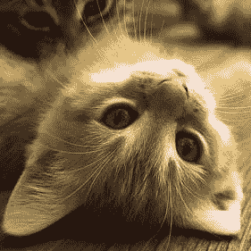

# CatPhotoApp 上的 HTML 代码

> 原文：<https://dev.to/gilbert25412563/html-code-on-catphotoapp-18oo>

# 在 HTML 中还需要什么来编辑它？

## CatPhotoApp

更多猫照在这里[猫照](#)。

猫喜欢的东西:

*   猫咬
*   激光笔
*   （意大利）千层面

猫最讨厌的三件事:

1.  跳蚤治疗
2.  雷
3.  其他猫

Indoor

Outdoor

Loving

Lazy

Energetic

<button type="submit">Submit</button>