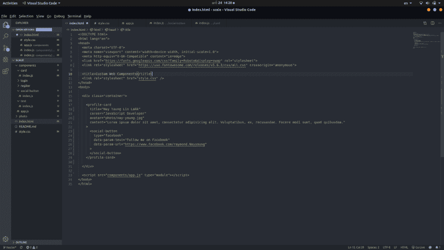
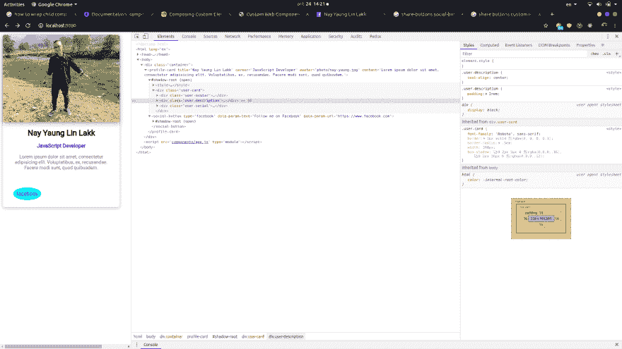

# HTML 自定义元素或 Web 组件

> 原文：<https://dev.to/nayyaung9/html-custom-elements-or-web-components-38ji>

问候开发人员...,

我现在正在创建新的 HTML 元素和可重用的 web 组件。我 17 岁，我不知道要创造什么。但这是我所做的一个小部分。

更新回购:[https://github.com/nayyaung9/custom-web-components](https://github.com/nayyaung9/custom-web-components)

[https://github.com/nayyaung9/scale.js](https://github.com/nayyaung9/scale.js)

下面是我的组件用法示例

我希望你们都和我一起做出贡献...

不知道你怎么给我建议。

过得愉快...