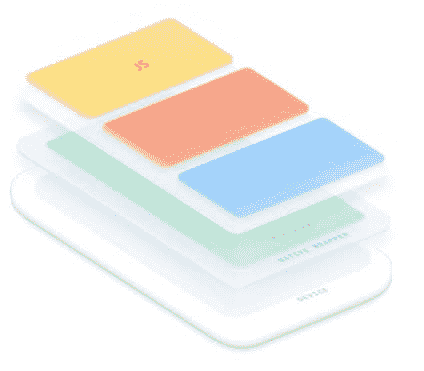
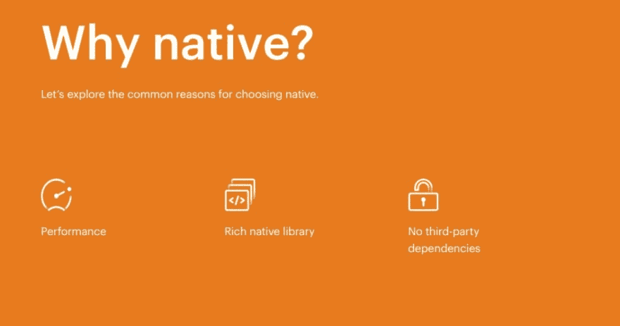

# 混血儿与本地人

> 原文：<https://dev.to/vishalraj232/hybrid-vs-native-559h>

面向架构师和应用程序开发领导者的跨平台混合开发介绍。

**移动交货缺口**

 **在移动技术的早期，只有一种方法可以给你的用户带来他们期望的性能和功能。你必须
使用每个平台的本地工具集。

当然，这也带来了真实且可衡量的权衡:
；为每个移动平台并行构建
；管理多个代码库
；雇佣并保留高度专业化的

与此同时，对移动体验的需求继续呈指数级增长。到 2022 年，预计 70%的企业软件交互将发生在移动设备上

考虑到传统本机开发的时间和成本，许多开发团队努力跟上这种需求也就不足为奇了。

谢天谢地，时代变了。随着移动和 web 技术的发展，混合技术已经成为本地技术的可行替代方案。许多人现在将混合开发视为简化和加速应用程序创建的一种方式。让我们来看看这种转变的原因。

**选择混合动力**

在最近的 Forrester 调查中，越来越多的人采用混合技术是显而易见的，该调查发现三分之二的开发人员选择跨平台或基于 web 的方法，而不是本地工具。与此同时，像 MarketWatch、Nationwide 和西南航空公司这样的顶级品牌已经为他们的客户和员工选择了一种混合方法，而不是原生的 power 应用程序。

根据
独立研究和证明，从本地转向混合的主要原因是:

速度
从一个代码库构建多个平台通常会使交付跨平台应用的速度比本地快 2-3 倍。
**效率**
减少了开发时间，避免了雇佣和保留专业本地人才的成本，与本地相比，可以为团队节省 60%或更多 3。
**设计&用户体验一致性**
通过在桌面、移动和网络上运行一个代码库，混合应用程序可以跨渠道提供更好的设计和 ux 一致性。
**Skillset**
Hybrid 为拥有内部 web 团队的 web 开发人员和企业提供工具，利用他们现有的技能和才能构建强大的移动应用。

综上所述，混合技术的优势帮助集中式开发团队缩小了差距，更好地满足了客户和内部员工对移动应用的需求。

**什么是混合 app？**
混合应用是原生应用。它们从平台的应用商店或市场下载，提供与任何使用原生 SDK 构建的应用相同的原生功能、离线支持和基于硬件的性能加速。

关键的区别在于，混合应用是使用 HTML、CSS 和 JavaScript 等开放网络技术
构建的，而不是 iOS、Android 和其他人使用的专有或专门的
语言。这意味着任何拥有
现代网络开发者技能的人都可以开始使用混合
方法构建应用。

混合应用运行在一个全屏浏览器中，这个浏览器被称为 webview，用户是看不见的。通过可定制的本机插件，他们可以访问特定移动设备的本机
功能(如相机或 touch ID)，而无需将核心代码
绑定到该设备。

这意味着跨平台混合应用程序可以在任何平台或设备上运行，所有这些都来自单一代码库，同时仍然提供本机性能。

## 比较混合与本地

在接下来的部分中，我们将提供混合与本地的一对一比较，强调每种方法的优缺点。

重要的是要记住，选择混合还是原生的决定应该基于您组织的独特目标、给定项目的环境以及您现有开发团队的组成。

当然，我们在网络的力量和跨平台混合开发的前景和潜力上下了很大的赌注。但是我们明白个人情况应该决定你选择哪条路线。

希望这个比较指南能给你一些有用的提示，帮助你为下一个项目选择正确的方法。但是请记住，在一个组织中通常有足够的空间来容纳不同的方法。这并不总是一个非此即彼的决定。

## 为什么是混合动力？

## 混合动力的缺点

当然，混合应用程序并非没有缺点:

**系统开销**
与本机相比，使用 webview 可能会带来一定程度的开销。近年来，丰富的性能 API 和越来越强大的硬件已经使这不再是一个因素，但它仍然是一个值得考虑的问题。对于大多数应用程序来说，性能上的差异很难察觉。但对于 3D 游戏和其他性能密集型应用，混合解决方案可能不是最佳选择。

**插件管理**

像 Ionic 这样的跨平台解决方案，以及 React Native 和其他解决方案，通过使用使用基本 JavaScript 解锁原生设备功能和集成的原生插件，能够访问设备的几乎所有原生功能，如相机或陀螺仪。在混合应用中，开源的 Cordova 和电容插件是解决这个问题的最流行的方法。这些插件的使用确实增加了开发的复杂性。Ionic 提供了一个名为 Ionic Native 的流行插件库，为构建任务关键型应用的团队提供可选的支持和维护。尽管如此，这是一个需要考虑的因素。

**第三方依赖**
选择跨平台方法意味着你信任框架供应商的制造商(无论是 Ionic、React Native、Xamarin 等)。)来跟上每个移动平台最新最棒的原生特性和设计模式。虽然 Ionic 致力于跟上新的 Android 和 iOS 版本，但每当你选择原生 SDK 以外的东西时，仍然会有依赖性

## 为什么是本土？

## 本地开发的好处

原生仍然是许多移动开发者的首选方法。这是有充分理由的。虽然这部分是基于几乎没有可行的替代方案的传统，但 native 今天仍有其优势。

**性能**

原生代码仍然比 Javascript 和 HTML 快。当开发人员希望构建要求苛刻的图形应用程序(如游戏和其他密集型动画应用程序)时，这一点很重要。使用 WebGL 规范，移动浏览器正在接近弥合这些类型的密集型应用程序的差距；不过，本土在这里还是有优势的。

**丰富的原生库**

使用原生 SDK 允许开发人员访问专门为这些平台设计的最新功能，而无需处理原生插件的复杂性。如果您已经熟悉本机工具和语言，并且不希望或不需要额外的抽象层，这是一个很好的选择。

**不依赖第三方**
通过专门使用原生 SDK 进行构建，开发人员无需依赖任何第三方来获得支持，也不需要依赖像 Cordova 这样的开源社区来获得最新功能。

## 本土发展的挑战

以下是最常提到的与本机开发相关的挑战:

**更长的开发周期**

原生应用通常具有更长的开发周期，尤其是在为多个平台构建时，这需要针对 iOS、Android 和桌面的两到三个不同的代码库。每个平台都有自己的细微差别，需要进行特定的更改、更新和维护，这会增加应用程序的成本并增加开发时间。这在开发过程中产生了许多迭代，以便为每个平台进行定制和测试，它还降低了您启动应用程序或推送更新的敏捷性。

**高昂的开发成本**
简而言之，在本地开发移动应用既昂贵又耗时，主要是因为构建每个平台所需的时间，以及雇佣和留住高度专业化的本地人才的成本。

有限的定制
使用本地组件创建定制的 UI 组件来匹配你公司的设计系统或模式库可能更具挑战性，因为你受限于每个平台所支持的设计模式。与 web 组件不同，本地组件不能在本地平台之外共享，所以您需要维护多个 UI 库。

本土人才难找
鉴于不到 7%的开发人员精通必要的编程语言，寻找和雇佣 iOS 和 Android 开发人员很困难。也很难将这些开发人员重新用于移动之外的其他项目。

## 比较跨平台方法

虽然今天可用的各种跨平台框架——Ionic、Xamarin、Flutter 和 React Native——表面上看起来可能相似，但随着深入研究，您会发现它们之间有许多差异。

简而言之，Ionic 框架和工具都基于开放的 web 技术，从用于构建 Ionic 应用程序的语言(HTML、CSS、JavaScript)，到在应用程序中运行的基于标准的 UI 组件。从这个意义上说，当你选择 Ionic 时，你实际上选择了 web——世界上最久经考验的通用运行时。您使用 web 进行构建，我们为您提供工具和组件库来帮助您取得成功。

大多数其他框架都添加了某种级别的自定义 UI 呈现，以便跨平台工作。比如 React Native 在运行时把你的 JavaScript 代码翻译成原生代码，使用 iOS 和 Android 提供的原生 UI 元素。Flutter 使用 Dart 语言，并使用自己的自定义图形引擎来跨设备工作。

每种方法都有其优点和缺点，通常归结为关于性能、代码共享、定制和可移植性的争论。这里涵盖了很多内容，所以如果你有兴趣了解更多，请查看我们的比较指南:Ionic vs . React Native([https://ionicframework . com/resources/articles/Ionic-vs-React-Native-a-comparison-guide](https://ionicframework.com/resources/articles/ionic-vs-react-native-a-comparison-guide))和 Ionic vs Flutter([https://ionicframework . com/resources/articles/Ionic-vs-Flutter-comparison-guide](https://ionicframework.com/resources/articles/ionic-vs-flutter-comparison-guide))。

你有兴趣建立移动和网络渐进式移动应用程序，然后检查出在 Ionicframework.com 的开源离子框架之一

## 关于爱奥尼亚

Ionic 最出名的是流行的开源 Ionic 框架，这是一个丰富的前端构建块和 UI 组件库，使用 HTML、CSS 和 JavaScript 等 web 技术可以轻松设计出漂亮、高性能的移动和渐进式 Web 应用程序(或 pwa)。

最重要的是，Ionic 是一个端到端的平台，可以帮助专业开发人员和团队加快和简化移动、桌面和网络应用程序的开发和交付。

如今，Ionic 正在为美国国家铁路客运公司、AAA、通用电气、汉堡王和塔吉特等主要品牌的应用程序以及 Sworkit、Shipt 和 Untappd 等热门消费应用程序提供支持。Ionic 由一个充满活力的社区提供支持，该社区拥有遍布世界各地的数百万开发人员，以及数以千计的全球聚会、论坛和社区驱动的活动，这些活动使我们能够轻松地利用我们的平台进行学习和成长。

如果你想知道哪个公司或企业一直在使用 Ionic 框架来构建他们的应用程序，那么你可以查看 ionicframework.com/enterprise/customers 的 Ionic 企业解决方案

要开始开发 Ionic 框架，您可以查看 GitHub 资源库上的免费开源代码，网址是

[https://github.com/ionicfirebaseapp/Ionic3-starterapp](https://github.com/ionicfirebaseapp/Ionic3-starterapp)

干杯！我希望这篇文章能给你一些信息。该内容参考了 Ionic Framework 的官方网站，所以要了解详情，从 Ionic 开始，你可以查看他们的官方网站。

内容来源:[https://www . ionicfirebaseapp . com/blogs/hybrid-vs-native-app-development/](https://www.ionicfirebaseapp.com/blogs/hybrid-vs-native-app-development/)**