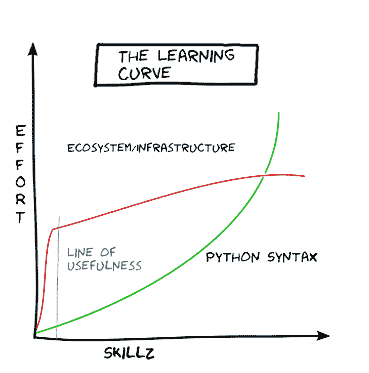
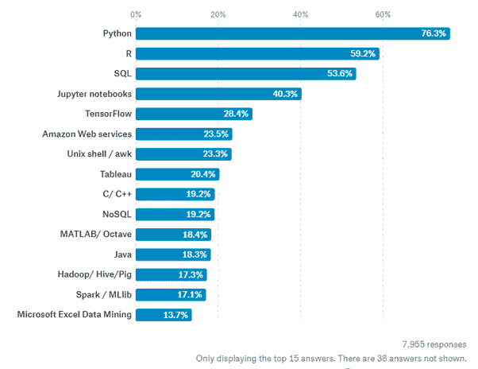
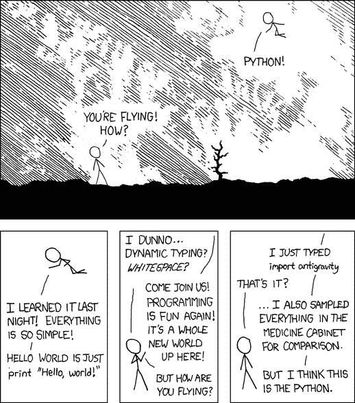

# 我将通过 Python |反向 Python 实验室让您实现自动化

> 原文：<https://dev.to/thepylot/i-am-going-to-automate-you-with-python-reverse-python-lab-474e>

### 嘿 **DEV** 网络！

在本实验中，我将使用 Python 实现自动化，这样您就可以在实验结束时开始飞行。

在我们继续之前，检查我以前的帖子来提高你的学习速度，它将帮助你快速有效地编码。

## 文章不再可用

好吧！让我们从实验前程序开始。

#### 这个实验室是关于什么的概念？

你将会看到 Python 在几乎任何职业中是如何富有表现力、高效和有用的。

#### 实验室的总体目的是什么？

主要目标是帮助您深入了解 Python 编程，并展示如何在日常生活中使用它。

#### 这个实验室有什么特别之处？

该实验室将为您提供有效、循序渐进地学习 Python 的绝佳资源。

首先，让我快速介绍一下 Python 的用途。

Python 不仅在软件工程师中，而且在数学家、数据分析师、科学家、会计师、网络工程师甚至孩子中，继续攀升为世界上最受欢迎的编程语言！它被用于从网页和游戏开发到机器学习、人工智能、科学计算和学术研究的各个领域。因为它是一种多用途的语言，这意味着只要有合适的工具/库，它可以用来构建任何东西。

如果您经常不得不做一些枯燥、重复的任务，比如复制文件、移动文件、将文件上传到服务器，您可以编写一个 Python 脚本来自动化所有这些工作并节省您的时间。这些任务对人类来说很简单，但很耗时，而且它们通常如此琐碎或具体，以至于没有现成的软件来执行它们。有了一点 Python 编程知识，您可以让您的计算机为您完成这些任务。所以你不一定要成为软件开发人员才能使用 Python。你可能是一名会计师、数学家或科学家，使用 Python 让你的工作变得更容易。

我强烈推荐你阅读《用 Python 自动化枯燥的东西》，这本书向你展示了如何使用 Python 来自动化任务，比如读写文件、网页抓取、调试、组织文件、使用 Excel、PDF 文件和 CSV 文件等等。

> "任何足够先进的技术都等同于魔法."亚瑟·C·克拉克爵士

现在，让我们看看我们的实验室！

#### Python 基础

[](https://res.cloudinary.com/practicaldev/image/fetch/s--BIjm7SFI--/c_limit%2Cf_auto%2Cfl_progressive%2Cq_auto%2Cw_880/https://thepracticaldev.s3.amazonaws.com/i/iwx27e7d2inksf75i0mh.png)

就简单性而言，Python 确实有很多优点。在许多方面，用 python 做事情更容易，但是您仍然需要搜索库，了解什么是适用的，并通过编写代码来解决您试图解决的任何问题。

Python 提供了很好的可读性和简单易学的语法，帮助初学者使用这种编程语言。它旨在尽可能简单，以便花费更多的编程时间。你会发现 Python 代码比任何其他语言都更具可读性，因为它被设计得像英语一样。例如，下面的第一个代码示例是用 C++编写的:

```
#include stdout 
int main()
{
    std::cout << "Hello, world!\n";
} 
```

Enter fullscreen mode Exit fullscreen mode

下面是 Python 3 中输出相同的代码:

```
print("Hello, world!") 
```

Enter fullscreen mode Exit fullscreen mode

Python 得到了优秀的自身数据结构的支持，这些数据结构与众不同，非常有用。它们很强大，你将花费更少的时间去理解数据结构，而花更多的时间去理解代码的实现。

这里有一些很好的资源可以帮助你学习 Python 的基础知识:

*   Codeacademy —很好地教授了基本语法，并构建了
*   [艰难地学习 Python](https://learnpythonthehardway.org/)——这本书教授从基础到更深入程序的 Python 概念。
*   我的第一个 Python 老师是来自 Treehouse Python 训练营的 Kenneth Love。
*   [Python 简介](https://realpython.com/learning-paths/python3-introduction/) —学习 Python 初学者的基本概念，帮助你开始学习 Python 的旅程。这些教程着重于你需要了解的关于 Python 的绝对重要的事情。
*   [学习 Python——初学者的完整课程【freeCodeCamp】](https://www.youtube.com/watch?v=rfscVS0vtbw)——这门课程将向你全面介绍 Python 中的所有核心概念。跟随视频，你很快就会成为一名 python 程序员！

这些是我迄今为止看到的最好的资源，但是如果你有更好的建议，请写在评论区。通常付费教程比免费的好，因为材料组织得很好，如果你遇到问题，讲师也会提供支持。但是根据市场趋势，Codecademy 被认为是愿意学习编码基础知识的初学者的最佳选择。对于高级阶段，Treehouse 是最好的，因为他们实际上有让程序员准备在现实生活项目中编码的课程。

一旦你学会了 Python 的基础，是时候构建小项目来提高你的知识了。 [Code Club](https://codeclubprojects.org/en-GB/python/) 提供最佳资源，通过有趣的小项目练习 Python 基础知识。

[](https://res.cloudinary.com/practicaldev/image/fetch/s--oW684Acy--/c_limit%2Cf_auto%2Cfl_progressive%2Cq_auto%2Cw_880/https://thepracticaldev.s3.amazonaws.com/i/ulaohkvd2qq3rcvarpfz.png)

#### 使用 Python 进行 Web 开发

感谢所有让 Python web 开发变得快速简单的不可思议的框架。该框架基本上是一个提供某些功能的包和模块的包，可以有选择地修改以产生特定于应用程序的软件。

那么如何选择合适的框架呢？Django 和 Pyramid 是成熟的 web 应用程序的必经之路。为了更好地控制和可视化或者原型化一个应用程序，Web2py 或者 Flask 可能是一个不错的选择。CheeryPy 是简单、极简主义者的必备选择。Tornado 可以同时处理 10，000 个或更多的应用并发连接，而 Dash 是分析的完美选择。

让我们看看 Python 在 web 开发中的强大功能。我将主要关注最流行的框架 Django。

##### 被许多受欢迎的公司使用和信任

Bitbucket、Instagram、Dropbox、Pinterest、Disqus 等公司都在应用增长中使用 Django 和 Pyramid 等 Python 框架。这些框架将管理几乎所有你扔给它们的东西，这也是 Python 的 web 开发如此受欢迎的部分原因。

> Disqus 是一个流行的博客评论托管服务，通过 Python 框架 Django，每秒有超过 80 亿的页面浏览量和 45K 的请求。

[排名前 10 的 Django 应用，以及为什么公司都将赌注压在这个框架上](https://www.netguru.com/blog/top-10-django-apps-and-why-companies-are-betting-on-this-framework)

[2019 年该不该学 Django？](https://www.quora.com/Should-I-learn-Django-in-2019)

##### 隐藏复杂的低级信息

上述框架是完全配备的开源工具包，具有非常可定制的架构，它促进了快速增长和简单的代码结构，这就是为什么我向初学者以及有经验的开发人员推荐 Python web 开发。

##### 省时器

时间就是金钱。通过使用这些框架，你将节省你的黄金时间。它非常适合在预算有限的情况下创建简单的原型或项目。

##### 网络安全

默认情况下，Django 可以防止大多数常见的安全错误:

*   **XSS(跨站点脚本)保护** — Django 模板系统默认对变量进行转义，除非它们被明确标记为安全。
*   **CSRF(跨站点请求伪造)保护** —易于全球启用，保证表单(POST 请求)从您自己的站点发出。
*   SQL 注入保护 — Django 使用内置的 ORM，因此没有 SQL 注入的风险(原始查询是可能的，但绝不是初学者需要使用的东西)。

欲了解更多信息，请查看 [Django Security](https://docs.djangoproject.com/en/2.2/topics/security/)

然而，有了良好的 web 框架，您就不必担心这一点，因为已经做了大量工作来防止 web 应用程序的任何滥用。

我将向您展示学习 Django 的资源，因为它是 Python 最流行的框架，我强烈推荐您从 Django 开始。互联网上有很多资源，但是下面的教程对于成为全栈 Python 开发者来说是最好的和初学者友好的

*   [真正的 Python](https://realpython.com/learning-paths/become-python-web-developer/) —这条学习路径将为您提供成为 Python web 开发人员所需的基本技能。您将涉及最流行的 Python web 开发框架，如 Django 和 Flask，使用数据库，以及基本的前端编码技能，如 HTML。
*   [简单胜于复杂](https://simpleisbetterthancomplex.com/) —关于 Python、Django 和 Web 开发的故事和教程
*   [Python 和 Django 全栈 Web 开发者 Bootcamp (Udemy)](https://www.udemy.com/python-and-django-full-stack-web-developer-bootcamp/) —学习用 HTML、CSS、Bootstrap、Javascript、jQuery、Python 3 和 Django 搭建网站！
*   为创业者编码是一个为非技术创业者设计的编程系列。学习 Django、Python、API、接受支付、Stripe、JQuery、Twitter Bootstrap 等等。
*   网络忍者 Django 系列 —网络忍者的 Django 教程向你介绍了 Django 到底是什么，以及为什么我们要作为 web 开发者使用它。

#### 用 Python 实现数据科学和 ML



Python 是数据科学最受欢迎的选择之一，因为它的学习曲线更容易，库也更有用。Python 使得用户更容易实现解决方案，同时遵循所需算法的标准。

> ##### Python 成为领导者
> 
> 以科技巨头谷歌为例，它创建了名为 tensorflow 的深度学习框架——Python 是用于创建该框架的主要语言。在网飞倡导的环境中，它的足迹不断增加。脸书和可汗学院的生产工程师长期以来一直将 Python 作为他们环境中的主要语言使用—[Python 是数据科学中最流行的语言吗？](https://marutitech.com/python-data-science/)

[](https://res.cloudinary.com/practicaldev/image/fetch/s--P4bNqwOB--/c_limit%2Cf_auto%2Cfl_progressive%2Cq_auto%2Cw_880/https://thepracticaldev.s3.amazonaws.com/i/mo6hz6pyc5fsjxhc1bri.jpeg)

想象一下，一台计算机可以根据你之前给它的数据做出决策和预测。

Python 是 ML 或一般 AI 的最佳选择，有两个主要原因:它的简单性，以及完整的可用库和框架。考虑到这些缺点，Python 远不是可用于机器学习的唯一语言选择。在许多其他语言中，R、Java 和 C++是用于 ML 的其他语言。此外，如果有人只是想学习 ML 概念，他们根本不需要编写任何代码就可以获得很好的知识。应用这些想法，尤其是作为一个开始。

希望从事人工智能技术的初级程序员应该学习 Python。即使他们发现他们更喜欢在程序后期添加另一种语言，一些语言知识对于理解之前的工作和开始构建他们自己的项目都是必不可少的。

解决数据科学和 ML 问题涉及数据预处理、分析、可视化、预测和数据保存。以下是 Python 的一些强大的统计和数值包:

*   **NumPy** 和 **pandas** (Python 数据分析库)让你高效轻松地读取/操作数据。
*   Matplotlib 允许你创建有用和强大的数据可视化。
*   **Scikit-learn** 允许你训练和应用机器学习算法到你的数据，并做出预测。还有一些神经网络的 **PyBrain** 和 **Tensorflow**
*   Cython 允许你转换你的代码并在 C 环境中运行它们，从而大大减少运行时间并提高你的模型性能。
*   **BeautifulSoup** 包，用于解析 HTML 和 XML 文档。它为解析过的页面创建了一个解析树，可以用来从 HTML 中提取数据，这对 web 抓取很有用。

查看这些黄金资源，开始您成为伟大数据科学家的学习之路:

*   [数据科学课程 2019:完整的数据科学训练营](https://www.udemy.com/the-data-science-course-complete-data-science-bootcamp/) —完整的数据科学培训:数学、统计学、Python、Python 中的高级统计学、机器&深度学习
*   [Dataquest](https://www.dataquest.io/) —学习 Python、R、SQL、数据可视化、数据分析、机器学习。立即尝试 60 项免费任务中的任意一项，开始您的数据科学之旅。
*   [用于数据分析的 Python](https://www.amazon.com/gp/product/1491957662/ref=as_li_tl?ie=UTF8&tag=buy05cb-20&camp=1789&creative=9325&linkCode=as2&creativeASIN=1491957662&linkId=42a9a64770e07dcad65b36017f058970)—它将涵盖所有基础知识，如数据聚合和时间序列，同时通过基本的 Python 练习，帮助您学习如何将 Pandas 应用于实际问题。
*   [Learn Data Science 教程-初学者全教程](https://www.youtube.com/watch?v=ua-CiDNNj30)-Learn Data Science 是这款针对绝对初学者的全教程课程。
*   [Fast AI](https://www.fast.ai/) —捆绑课程的研究实验室，一个拥有庞大社区的易用 Python 库。
*   [使用 Python 的实用机器学习教程](https://www.youtube.com/playlist?list=PLQVvvaa0QuDfKTOs3Keq_kaG2P55YRn5v&ref=hackr.io) —本课程的目标是让你对机器学习有一个整体的了解，涵盖理论、应用以及监督、非监督和深度学习算法的内部工作原理。

#### Python 的网络安全

[](https://res.cloudinary.com/practicaldev/image/fetch/s--OK1V9f7r--/c_limit%2Cf_auto%2Cfl_progressive%2Cq_auto%2Cw_880/https://thepracticaldev.s3.amazonaws.com/i/h1ob6xpqy4wibmp4qxmj.jpg)

学习编程语言可以让你在网络安全方面获得优势，因为它可以让你更深入地理解应用程序是如何工作的。拥有这种能力增加了您识别漏洞并找出如何修复它们的机会。

Python 将允许您自动执行任务并进行恶意软件分析。网络安全专家可以使用 Python 创建攻击模拟、构建入侵检测系统和扫描无线网络，而无需依赖第三方工具。Python 是在网络安全领域工作的人选择的编程语言之一。简单易学，高性能，多用途。

这里有一些很酷的网络资源，可以帮助你成为一名有道德的黑客:

*   [从零开始学习 Python &伦理黑客](https://www.udemy.com/learn-python-and-ethical-hacking-from-scratch/) —从 0 开始&通过编写 20 多个黑客程序从零开始同时学习这两个主题
*   使用 Python 进行合乎道德的黑客攻击(Ethical Hacking with Python)——虽然这门课程的目标是完全的初学者，但对于想要提高编码技能的经验丰富的程序员来说，它也是一个方便的复习工具。
*   [用于道德黑客的 Python](https://www.youtube.com/watch?v=5sqye64-1-k&list=PLBf0hzazHTGO7wysZIzstZi1han97XY16)—如何使用 Python 创建网络工具和道德黑客脚本。本系列将带您从 Python 初学者到中级/高级。
*   [用 Python 破解代码](https://www.amazon.com/Cracking-Codes-Python-Introduction-Building/dp/1593278225) —在 Python 编程基础的速成课程之后，你将学会制作、测试和破解用经典密码(如 transposition cipher 和 Vigenère cipher)加密文本的程序。
*   [黑帽 Python:面向黑客和 Pentesters 的 Python 编程](https://www.amazon.com/Black-Hat-Python-Programming-Pentesters-ebook/dp/B00QL616DW) —在创建强大而有效的黑客工具时，Python 是大多数安全分析师的首选语言。但是神奇是如何发生的呢？

至少了解 Python 编程的基础知识是有好处的。

```
python3 makeDevFly.py 
```

Enter fullscreen mode Exit fullscreen mode

[](https://res.cloudinary.com/practicaldev/image/fetch/s--ECESDiHM--/c_limit%2Cf_auto%2Cfl_progressive%2Cq_auto%2Cw_880/https://thepracticaldev.s3.amazonaws.com/i/g5rkmjq3ai7cx09du7jx.png)

我希望你能从这个实验中学到一些东西😃如果你发现它有用，请与你认为可能会发现它有用的朋友和家人分享！加入我的社交媒体，一如既往地保持联系！🚀

[insta gram](https://www.instagram.com/coderasha/?hl=en)
[Twitter](https://twitter.com/coderasha?lang=en)
给我买杯咖啡[支持我](https://www.buymeacoffee.com/xT2K0N1PY)😊☕