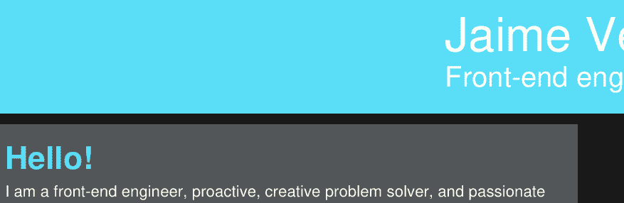
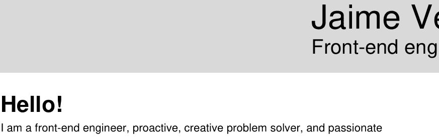
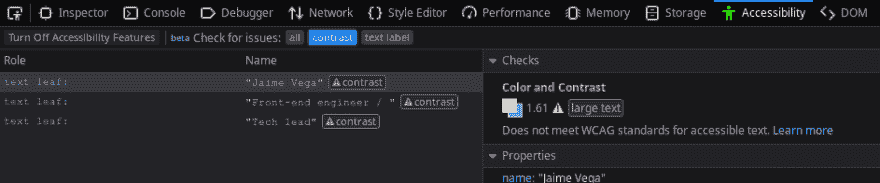
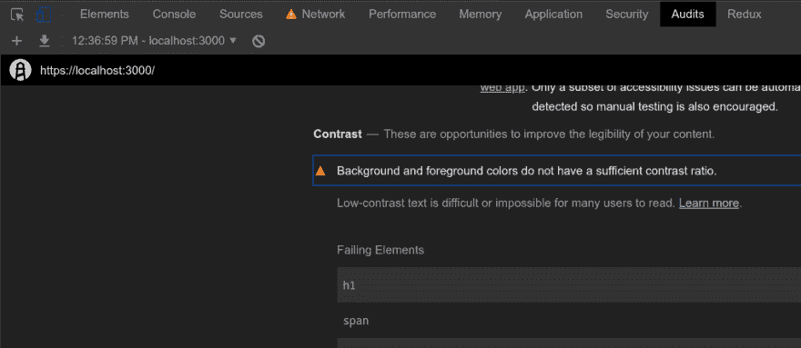
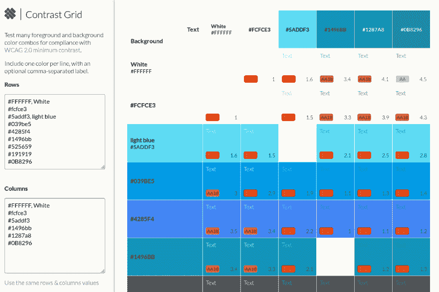
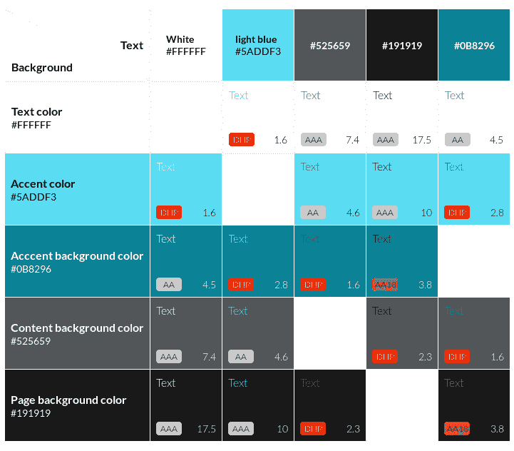
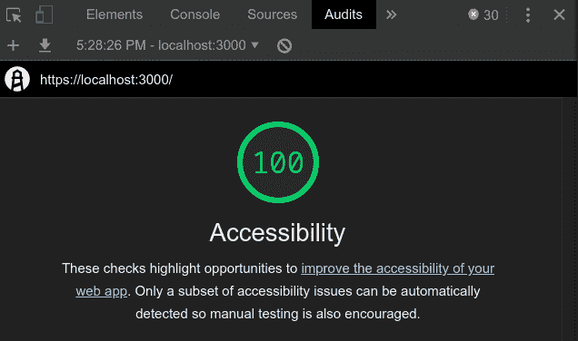

# 我选择了错误的调色板，因为它们是不可访问的。我是这样解决的。

> 原文：<https://dev.to/jvegadev/i-chose-the-wrong-color-palette-because-they-were-not-accessible-this-is-how-i-fix-that-47p9>

所以当我决定建立一个新的网站和简历时，我决定在两者中使用相同的设计。因为我想开始申请工作，而第一件事总是被问到简历，所以我决定先申请。

我从网上的一些网站获得了灵感(因为我不是设计师)，我决定保持简单:一种强调色，两种灰色和一种浅色的文字。所以我选了这些:

```
html {
  --accent-color: #5addf3;
  --page-background-color: #191919;
  --content-background-color: #525659;
  --text-color: #ffffff;
} 
```

这是我的简历:

[](https://res.cloudinary.com/practicaldev/image/fetch/s--3LNY7AnS--/c_limit%2Cf_auto%2Cfl_progressive%2Cq_auto%2Cw_880/https://thepracticaldev.s3.amazonaws.com/i/rk94y2zzh7vl5xlvswgt.png)

> 我知道许多公司仍然打印简历用于面试等。所以我决定也创建一个对打印机友好的版本。尽可能做到环保:
> 
> [](https://res.cloudinary.com/practicaldev/image/fetch/s--_dG2Ebr6--/c_limit%2Cf_auto%2Cfl_progressive%2Cq_auto%2Cw_880/https://thepracticaldev.s3.amazonaws.com/i/4jp1lgmist9uses43upl.png)

我知道你在想什么:你怎么能选择这些颜色，这是非常明显的，没有足够的对比！！！是的，我怀疑这一点，但是直到我开始建立网站并开始检查可访问性时，我才开始关注它...您可以在浏览器开发工具中轻松做到这一点:

[](https://res.cloudinary.com/practicaldev/image/fetch/s--U0kOcyLv--/c_limit%2Cf_auto%2Cfl_progressive%2Cq_auto%2Cw_880/https://thepracticaldev.s3.amazonaws.com/i/wabdd6k5wda8n9vpe5o0.png) 
*火狐网络开发工具*

[](https://res.cloudinary.com/practicaldev/image/fetch/s--fVL2wN7Q--/c_limit%2Cf_auto%2Cfl_progressive%2Cq_auto%2Cw_880/https://thepracticaldev.s3.amazonaws.com/i/8m8ufj6kqdbxkynsx7w3.png) 
*Chrome 开发工具*

是的，太糟糕了。Microsoft Word 有什么工具可以检查文档的可访问性吗？我不知道，但也许他们应该。

所以我想迟做总比不做好，所以，不幸的是，我不得不改变调色板，改变我的简历来使用新的。

我在网上搜索时发现了这个非常有用的网站:

[八个形状的网格对比](http://contrast-grid.eightshapes.com)

这真的真的很有帮助。您设置颜色和背景色，并向您展示它的外观和对比度分数:

[](https://res.cloudinary.com/practicaldev/image/fetch/s--iC5PSuyz--/c_limit%2Cf_auto%2Cfl_progressive%2Cq_auto%2Cw_880/https://thepracticaldev.s3.amazonaws.com/i/dq88tc86usc92d6eidby.png)

在花了一些时间选择颜色后，我意识到我必须扩展调色板来添加一种额外的颜色，因为深蓝不适合灰色背景。我做了一个妥协，不针对 100% AAA 对比度，只解决 AA。我的想法之一是为网站提供多个主题，所以我可能会在稍后引入一个高对比度主题来达到 AAA。我暂时选定了这个调色板:

```
html {
  --accent-color: #5addf3;
  --accent-backgroud-color: #0B8296;
  --page-background-color: #191919;
  --content-background-color: #525659;
  --text-color: #ffffff;
} 
```

[](https://res.cloudinary.com/practicaldev/image/fetch/s--hRvTdR_3--/c_limit%2Cf_auto%2Cfl_progressive%2Cq_auto%2Cw_880/https://thepracticaldev.s3.amazonaws.com/i/3svnye83ooe5e33z4lt6.png)

[新颜色](http://contrast-grid.eightshapes.com/?background-colors=%23FFFFFF%2C%20Text%20color%0D%0A%235ADDF3%2C%20Accent%20color%0D%0A%230B8296%2C%20Acccent%20background%20color%0D%0A%23525659%2C%20content%20background%20color%0D%0A%23191919%2C%20page%20background%20color%0D%0A&foreground-colors=%23FFFFFF%2C%20White%0D%0A%235addf3%2C%20light%20blue%0D%0A%23525659%0D%0A%23191919%0D%0A%230B8296&es-color-form__tile-size=regular)

和...

[](https://res.cloudinary.com/practicaldev/image/fetch/s--Nn_mRbSy--/c_limit%2Cf_auto%2Cfl_progressive%2Cq_auto%2Cw_880/https://thepracticaldev.s3.amazonaws.com/i/m9avsa3bjl38hzmukmhe.png)

当然，这只是开始。我的目标是确保最终的网站保持相同的分数。