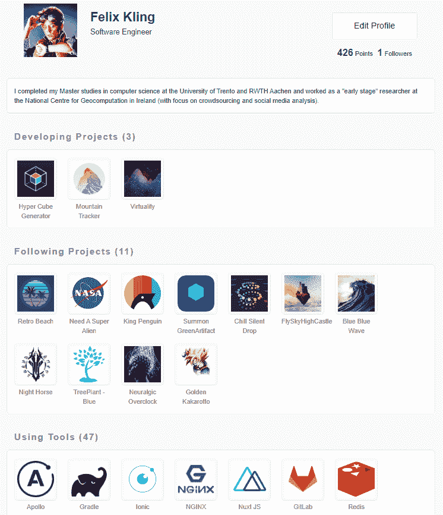

# 我创建了一个边项目共享平台，随时炫耀你的项目！

> 原文：<https://dev.to/webdevbadger/i-created-a-side-project-sharing-platform-feel-free-to-show-off-your-projects-52ki>

作为一名制作人，我倾向于花太多时间在开发上，没有足够的机会从人们那里得到反馈。

从这个角度出发，我决定创建一个网站，人们可以自由地分享项目更新以获得用户评论。

DevUp 支持的主要特性有:

*   项目展示
*   共享功能更新
*   发布用户参与帖子
*   技术堆栈共享
*   项目评审/反馈
*   用户支持

项目仍处于测试阶段，但如果您能与我们分享您的项目，我们将不胜感激！

DevUp: [https://devup.app](https://devup.app)

模拟地点:[https://devup-staging.netlify.com](https://devup-staging.netlify.com)

