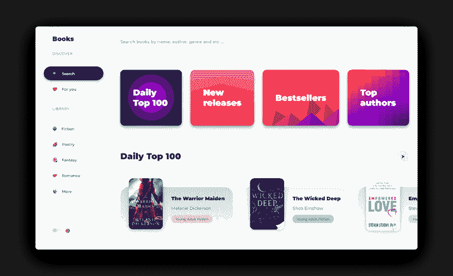
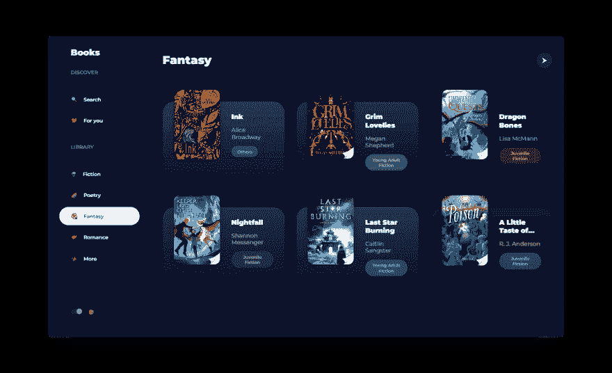

# 我创造了一个简单的方法来浏览和查找谷歌图书(今天是我的生日🎈)

> 原文：<https://dev.to/liyasthomas/i-created-an-easy-way-to-browse-find-google-books-today-is-my-birthday-4id0>

## **[书籍📚](https://liyasthomas.github.io/books)**

### 从 Google Play 图书中查找图书

### 随时投稿上 **[GitHub](https://github.com/liyasthomas/books)**

我在网上随便冲浪，看到一篇关于 [Google Books API](https://developers.google.com/books) 的文章。我读了这些文档，决定创建一个最小、轻量、漂亮的 web 应用程序，使用 Google Books API 浏览&查找书籍。

这就是我创作[书的原因📚](https://liyasthomas.github.io/books)。

[Books](https://liyasthomas.github.io/colorbook) 是一个开源项目，利用了 [Google Books API](https://developers.google.com/books) 。

它的一些特点是:

*   按书名、作者、类别、流派等搜索书籍。

*   简约优雅的用户界面。

*   PWA 支持。

*   黑暗模式。离不开它！

奖金:🌗我还增加了黑暗模式，这样你的眼睛在晚上就不会痛了！

### **T3】演示🚀**

### 随时投稿上 **[GitHub](https://github.com/liyasthomas/books)**

 [## 我在写一本书:解码激情项目📘

### liyas Thomas 5 月 24 日 202 分钟阅读

#books #productivity #startup #watercooler](/liyasthomas/i-m-writing-a-book-de-coding-the-passion-project-2c07)

* * *

如果你想知道我的下一个项目，或者只是想聊聊网络、生活和幸福，请在 Twitter 上关注我💙。如果我的任何项目帮助了你，请考虑[捐赠](https://paypal.me/liyascthomas)。

