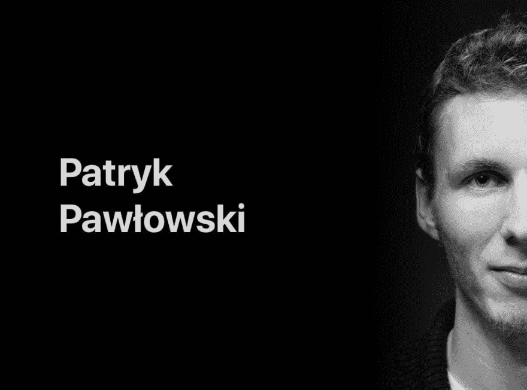
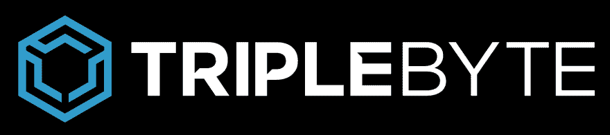

# 我采访了一个自学成才的开发商，他用现金买了房子

> 原文：<https://dev.to/petecodes/i-interviewed-a-self-taught-developer-who-bought-a-house-with-cash-492k>

在这个网站获得黑客新闻之后，我一天之内收到了 30 封来自自学成才的开发者的电子邮件。帕特里克·鲍洛夫斯基的一封信立刻引起了我的注意，因为他作为一名程序员赚的钱已经足够用现金买一栋房子了。对于一个自学成才的开发者来说还不错！我和他谈论了学位的现代价值、退出计算机科学课程以及给编程新手的建议。

嘿，你能给那些想了解你的人做个简短的介绍吗？

嗨！我是帕特瑞克。我是一名全栈开发人员、设计人员和远程工作倡导者。在过去，我参与了其他活动，比如在波兰组织 TEDx 活动。

### 你能告诉我们刚刚对你来说普通的一天是什么样的吗？你在做什么，你的生活方式是什么样的？

我远程工作，所以每天都不一样。一天，我在一个共同工作的空间工作，另一天，我在咖啡店或家里工作。刮风的时候，我会在海滩附近设立一个野外办公室，需要休息的时候，我会去放风筝。

现在，我接了一些中短期的项目(2-6 个月),为美国的初创公司建立 MVP。我目前的项目包括为即将发布的 CashFlo 应用程序开发 API。

### 对于那些想获得第一份编程工作，但没有时间或金钱攻读计算机科学学位的人，你有什么建议？

开始告诉每个人你正在学习/做网络开发。总有人需要一个网站，说真的！由于在创业/科技活动中认识了一些人，加入了 facebook 群组等等，我得到了一些演出机会。

另一件非常重要的事情——不要害怕承担你没有经验的项目。做程序员意味着不断学习。有人付钱让你学习新的东西，还有什么比这更好的呢？

## **想要一份开发人员的工作却没有学位？通过 [Triple Byte 的测验](https://triplebyte.com/a/Ww4mbM6/d)，直接进入顶级科技公司的最终现场面试**

### 成为职业程序员后，你的生活发生了怎样的变化？

从小我就一直梦想有足够的自由，想去哪就去哪。作为一名远程自由职业者，我能够做到这一点。我选择工作的时间、地点和方式。

我们生活在程序员的黄金时代。你可以赚 6 位数，但是住在美国以外的地方。多亏了这一点，我成了那些不需要为钱而紧张的幸运儿之一。几年前，我向自己承诺，我永远不会贷款。我是一个极简主义者——我不关心汽车，品牌。我甚至没有电视机。不过，我设法用现金买了一套公寓。

### 你是怎么学会编码的？

我成为软件开发人员的道路相当坎坷。我写第一行代码的时候才 13 岁。我在学校上过编程课，在那里我们解决算法问题。我喜欢这些挑战的挑战性，但是它们太模糊了。它们只是没有任何用户界面的脚本。所以我觉得我做不出什么东西。更确切地说，我在解谜。

大约在那个时候，我对 HTML 和 CSS 产生了兴趣。2009 年的网络是一个完全不同的地方，JavaScript 被认为是一个糟糕的笑话，而不是一项统治世界的技术。如果我告诉别人我是程序员，他们会嘲笑我。

无论如何，我开始学习 HTML 和 CSS，并享受我可以创建一些可见的和交互式的东西。当时我对设计一无所知，所以我只是尝试重新创建我喜欢的页面。我最喜欢的是 CSS 禅宗花园。这是一个展示 CSS 威力的项目。拥有完全相同的 HTML 文件，你可以看到不同的风格。

我花了很多时间重现这些例子，每当我不知道如何实现某个目标时，我就会查看页面的源代码，试图理解它。最终，我变得非常擅长 HTML 和 CSS。我认为它是设计和编程之间的桥梁。

也买过几本关于编程的书，但一本都没看完。现在，我知道我通过观察别人工作或者尝试自己解决问题学得最好。

### 你有什么特别的人激励你学习编码吗？

不完全是。我甚至会说，大多数成功的故事都让我失去了动力。我通常听说“天生的程序员”，他们在 3 岁时拥有第一台电脑，10 岁时就已经黑进了五角大楼。😂听到这样的故事，你会觉得自己永远不够好。这不是真的！

相反，pawekadysz 给了我很大的灵感。他是来自波兰的自学成才的设计师。你可能从他的达斯·维德摄影项目中认识他，这个项目几年前在网上疯传。当我开始我的自由职业生涯时，我在脸书给他写过信，他给我指引了一个好的方向。尽管他是一个伟大的设计师和摄影师，但他也是一个非常谦虚的人。

## [没有 CS OK——没有学位的开发者的工作板](https://nocsok.com)

### 你是如何从一个玩 HTML 和 CSS 的少年进步为专业开发者的？

我在高中的时候甚至不知道前端开发是一份真正的工作，所以我没有把它当作职业选择。我一直认为网站是由业余爱好者建立的，而 *true* 程序员正在向月球发送宇宙飞船或建立人工智能。

我仍然喜欢算法挑战，所以我实际上开始了一个计算机科学学位。但是太无聊了！我一直以为学习会集中在编程上。结果是，它占据了课程的 10%。最后，它是计算机科学，而不是编程，所以你什么都能学到一点。

编程课程非常基础，我十几岁的时候就知道这些东西了。所以我决定 3 个月后退学。第二年，我开始攻读平面设计学位。那是我一生中最好的决定之一！

### 那么，你是如何获得第一份编程工作/自由职业的呢？

退学后不久，朋友问我能不能设计开发一个 WordPress 页面。我可能甚至不知道 WordPress 是什么，但我答应了。到底学起来能有多难？一路走来，我学会了 WordPress，最重要的是，明白了前端开发可以是一份真正的工作。讽刺的是，弃学之后，我成了开发者！

### 你一直在和客户交流的时候，有没有人问过你的编码资质？

绝不！人们总是对我以前的工作感兴趣，不在乎问学位。

### 你觉得现在一个 CS 学位没必要吗？

对于我父母这一代人来说，这很难想象，但我坚信拥有学位已经完全被贬低了。现在很多人都有一个，这已经不重要了。重要的是经验。

当然，在有些领域，拥有扎实的计算机科学基础是有益的(比如人工智能)。但是对于大部分的编程工作来说，这是不必要的。

### 我知道你是一名平面设计师，也是一名全栈工程师。你会推荐设计师学编码，程序员学设计吗？

很长一段时间，我对设计和编程都是又爱又恨。有时候我想成为一名设计师，有时候我想成为一名程序员。我至少改变了十几次主意！(笑)

但是最终，大多数客户感兴趣的是得到一个最终产品(比如一个网站)，而不想浪费时间去寻找和协调开发人员、设计师、文案等的工作。所以我被迫同时做设计和编程。然后，我开始雇用文案和翻译，这样我就可以获得更大的项目。更多的技能意味着更大的项目，这意味着更多的钱。

另一件事是设计师和开发者之间的合作。如今，设计师是开发团队的一部分，所以美国人和 T2 人之间的交流至关重要。而如果你理解了对方，就可以更好的沟通，就可以设定适当的预期。

例如，如果你作为一个开发者有一些 UI/UX 知识，你可能知道交互元素(例如输入或按钮)应该有多种状态(例如禁用、聚焦、悬停)。如果你是一个有一些编程知识的设计师，你会明白用一个非标准的设计来开发一个东西会耗费很多时间。最后，这两份工作都很有趣！

### 你对未来的编码梦想是什么？

我梦想作为一家公司推出一款成功的数码产品。我正在慢慢地鼓起勇气去做一个关于獾的游戏。这将是一个非常个人化的旅程，我想自己做所有的事情-从设计，通过音乐和故事情节，到开发它！