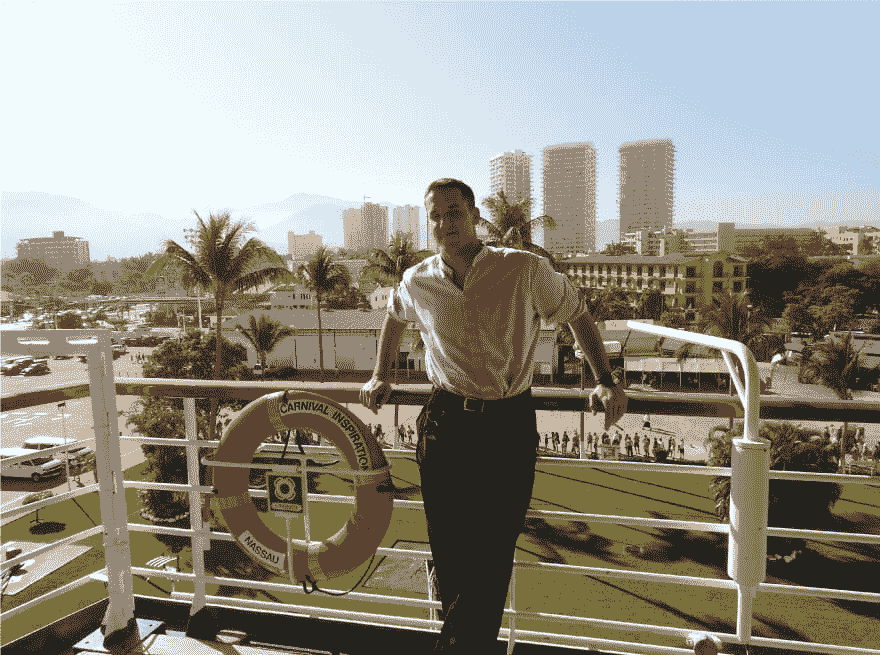

# 我是一名前酒保/服务员，现在是一名 web 开发人员和 DevOps 工程师，问我任何问题！

> 原文：<https://dev.to/pencillr/i-m-an-ex-bartender-waiter-who-is-now-a-web-developer-and-devops-engineer-ask-me-anything-14gb>

大约 21 岁时，我在获得物理学学士学位之前从大学退学，去了一艘船员船上工作。之后，我花了将近 6 年的时间四处旅行，在酒店和餐馆工作。27 岁的时候，我“觉醒”了，离开了牛津郡的酒吧经理工作，重新回到了科技和编程领域。

2011 年巴亚尔塔港。我可能看起来不错，但我在船上过得很艰难。但不抱怨。