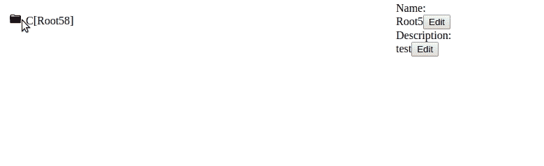

# 我需要帮助清理重复的代码

> 原文：<https://dev.to/sirheadless/i-need-help-with-cleaning-up-duplicated-code-2boc>

嘿，

我想给你看看我正在做的 react，redux，typescript 项目。之后，我希望你能帮我重构我的重复代码。我有很多函数在做同样的事情，但是我不能把它放入一个函数中。

让我们开始吧。这个应用程序有一个类似文件树的结构来存储 URL。就像大多数浏览器提供的书签一样。

[](https://res.cloudinary.com/practicaldev/image/fetch/s--gx34VKoL--/c_limit%2Cf_auto%2Cfl_progressive%2Cq_66%2Cw_880/https://thepracticaldev.s3.amazonaws.com/i/vbi8en24r2m6s5w2t8iy.gif)

我认为很容易看出我是一个主要关注应用程序的功能而不是外观的人，因为到目前为止我所做的是难以置信的丑陋。

然而，我非常关心干净的代码。有一件事我就是想不出如何让它变得更好，即使如此，我相信一定有一个好的解决方案。

在我的小视频中，你可以看到你可以通过点击编辑按钮来编辑 url 的每一个字段。编辑该字段并再次单击该按钮将向我的后端发送一个请求来更新该字段。它工作得很好，但是每个按钮都调用不同的函数，为另一个字段做同样的事情。

在这里，您可以看到将 url 的字段切换到输入字段并调度一个动作的函数，该动作表示`urlFormFields`属性已被更改。

```
 toggleIsNameEditField() {
    this.props.urlFormFields.isNameEditField = !this.props.urlFormFields.isNameEditField;
    this.props.dispatch(updateUrlFormFields(this.props.urlFormFields))
  }

  toggleIsDescriptionEditField() {
    this.props.urlFormFields.isDescriptionEditField = !this.props.urlFormFields.isDescriptionEditField;
    this.props.dispatch(updateUrlFormFields(this.props.urlFormFields))
  }

  toggleIsUrlEditField() {
    this.props.urlFormFields.isUrlEditField = !this.props.urlFormFields.isUrlEditField;
    this.props.dispatch(updateUrlFormFields(this.props.urlFormFields))
  } 
```

属性`urlFormFields`看起来如下

```
export interface UrlFormFields {
  isNameEditField: boolean,
  isUrlEditField: boolean,
  isDescriptionEditField: boolean,
  isRatingEditField: boolean,
} 
```

我的第一次尝试是创建一个类似于
的函数

```
 toggleEditField(editField: boolean){
    editField = !editField;
    this.props.dispatch(updateUrlFormFields(this.props.urlFormFields))

  } 
```

但这根本行不通。

我想到了其他一些无法实现的事情

你可以在这里找到代码[https://github.com/SirHeadless/FileSystemTree](https://github.com/SirHeadless/FileSystemTree)

如果你愿意帮助我，但你想在本地运行这段代码，我也会模拟后端调用，并把它放入自己的分支。

我从我以前在不同页面上的帖子中意识到，对我来说，沟通我的问题是什么并让它可以理解真的很难。如果您有任何问题或需要帮助，请联系我:)

非常感谢任何帮助！