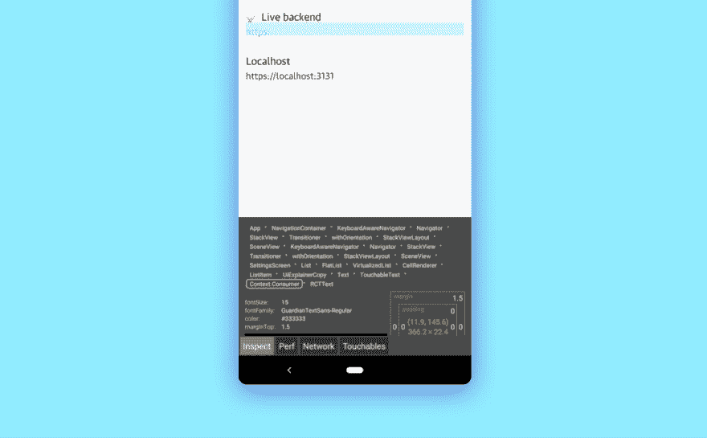
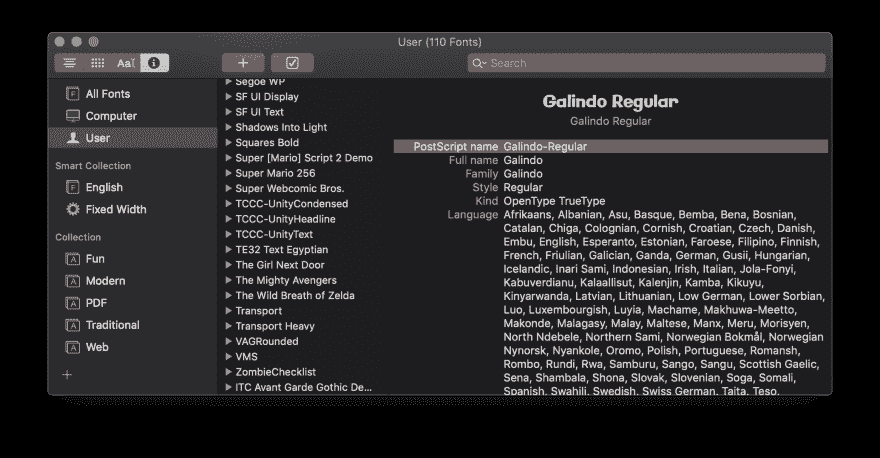

# 作为一名 web 开发人员，我学会了 React Native，以下是我学到的东西

> 原文：<https://dev.to/walaura/i-picked-up-react-native-as-a-web-developer-and-here-s-what-i-ve-learned-59h6>

在过去的几周里，我在[工作](https://gu.com)的时候一直在开发一个 React 原生应用。它是一个新闻阅读器(duh ),有点大，有文件系统访问、后台下载和推送通知。

这不是我第一次使用 React，但是！！这是我第一次使用 RN。这很可怕，因为新事物很可怕。虽然这是一次很棒的经历，我有点期待一个“哦，S**T”的时刻，在那里一些意想不到的事情变得非常糟糕——但是到目前为止，它非常有趣。

为什么反应原生？嗯，我的团队最初想要一个 web 应用程序！(答:他们现在很流行)我们改变路线有三个主要原因:

*   尽管网络是一个很好的选择，但我们的第一个市场是应用商店
*   我们希望它有非常复杂的离线和后台功能。这是非常早期的&在网络上是实验性的，但是从第一天起在移动应用上就已经解决了。
*   我们希望提供类似本土的体验。想想 60fps 动画，多重堆叠视图，这些作品。这些在应用程序世界里也是已经解决的问题，但是在网络上我们只能靠自己。
*   有了`react-native-web` [，我们就有了一条路径](https://github.com/necolas/react-native-web)，如果需要的话，可以把它变回 PWA

## 这不是网络

在网络上，plain React 最终会生成一个基于 HTML 的网站。这就是如何使用 CSS 并直接调用组件上的 DOM 函数。

Native 有点与众不同。尽管使用了 React 的语法——不像 Cordova 这样的库——RN 从不提供 HTML、DOM 元素或 CSS，而是直接在移动操作系统上编排本地视图。这非常棒，因为这意味着你的用户界面是真正的原生的。当然，它是使用 javascript 动态组装的，但是它使用了其他应用程序使用的相同的块集。

这与标准的 React 有何不同？老实说不是很多。原语[非常相似](https://facebook.github.io/react-native/docs/getting-started.html)！

```
 /*react web*/
const Counter () => (
    <div className='row'>
        <button onClick={setCount(c=>c+1)}>Add number</button>
        <span>{count}</span>
    </div>
)

/*react native*/
const Counter () => (
    <View style={styles.row}>
        <Button onClick={setCount(c=>c+1)}>Add number</Button>
        <Text>{count}</Text>
    </View>
) 
```

使用原生用户界面不仅让你的应用程序成为更好的公民，而且它还很快。如果你习惯于在网上努力获得 60 fps 的动画，这是一个全新的世界，你只需*获得那个*。免费的！即使是在古老的设备上！(第二部分将详细介绍性能)

[](https://res.cloudinary.com/practicaldev/image/fetch/s--rOdOuQbr--/c_limit%2Cf_auto%2Cfl_progressive%2Cq_66%2Cw_880/https://media0.giphy.com/media/DjEysmrFX7S8w/giphy.gif%3Fcid%3D790b76115cfba11a516c764845cde8a3%26rid%3Dgiphy.gif)

对了！你也不能从 HTML5 中获得所有的语义元素。RN 中几乎所有东西都是`View`。这意味着[为所有目的标记你的观点的语义目的是非常重要的](https://facebook.github.io/react-native/docs/accessibility)。您可以使用`accessibilityRole`来完成这项工作。如果您需要 alt 文本，`accessibilityLabel`已经覆盖您。

## 入门

我在很久以前做原型的时候有过一些非常基本的 xcode 经验(那时候 Xcode 看起来像 itunes？这是一个奇怪的时代)但无论如何，我知道与网络相比会发生什么——更快的应用程序，但更慢的开发周期和更难使用的开发工具。

_
我
是
所以
错了
_

首先，如果你只是想尝试一下你不需要的东西，你可以使用 [expo](https://expo.io) 来运行你的 javascript 并处理所有的应用程序。这大大减少了你对应用程序的控制，但是最酷的是你所有的代码仍然是普通的 React。如果你需要这种控制，你可以随时获取原始 Xcode 和 android studio 项目。

即使在你弹出之后，你仍然不能使用 Xcode 或 Android studio(除非你想)。`react-native run-ios`将启动一个模拟的 iPhone X 并运行你的应用程序，然后`react-native run-android`将它直接安装到你的手机上，你只打算充电，但它很好，我想现在你已经在你的手机上安装了一个应用程序。

关于设置 Android Studio 的 [react 文档相当不错。对于 iOS 来说，对你的应用程序进行代码签名是一件令人头疼的事情](https://facebook.github.io/react-native/docs/getting-started.html)——你需要在 iOS 设备上运行它之前完成这项工作。你不需要成为苹果开发者计划的付费会员，但是你需要登录 Xcode。我通常做的是尝试编译它，点击所有红色的东西，然后点击“修复问题”按钮，直到不再有问题。

最后，当运行你的应用程序时，你可以摇动你的设备或模拟器来得到一个非常酷的调试菜单。你可以像在网上一样热重装代码，运行 chrome devtools 寻找 bug，甚至打开世界上最可爱的小检查器:

[](https://res.cloudinary.com/practicaldev/image/fetch/s--zZlteQEj--/c_limit%2Cf_auto%2Cfl_progressive%2Cq_auto%2Cw_880/https://thepracticaldev.s3.amazonaws.com/i/cehwgjjo5v5hebg25igf.png)

## 造型

你可能想要设计你的应用程序。除非你正在做一个待办事项清单或者其他什么，否则你可能会想让你的应用程序变得更有风格。

React native 自带一个内置的`StyleSheet`模块。它为你处理造型。这很重要，因为您不必再争论使用哪种 css-in-js 解决方案。这也是不好的，因为`StyleSheet`是*与*CSS 如此相似，你可能会认为你正在编写 CSS，但相似之处只是表面的。

```
const styles = StyleSheet.create({
    button: {
        borderRadius: 999,
        backgroundColor: 'tomato',
        padding: 10,
        paddingHorizontal: 10,
    },
    text: {
        textTransform: 'uppercase',
    },
})

const Button = ({ children, ...props }) => {
    return (
        <Touchable {...props}>
            <View style={styles.button}>
                <Text style={styles.text}>{children}</Text>
            </View>
        </Touchable>
    )
} 
```

关于如何设计风格的内置文档非常好，但我想先了解大的变化

### 这很像 css-in-js

您的样式是一个带有 camelcase 属性的 javascript 对象。如果你用过`emotion`或`styled-components`，你会觉得这种工作方式很舒服

### 天齐像素

大多数手机屏幕都相当密集，并扩大了用户界面，所以作为一个单元，`1px`是*很多*并且很大，寻找边框。您可以使用`StyleSheet.hairlineWidth`来获得跨设备的 1 个屏幕像素的大小。

### 但一切都是 flexbox

因为所有的`StyleSheet`都是与底层操作系统对话，所以与 CSS 相比，你在布局方面受到限制。如果你想让某个东西浮动(比如把一个图像放在某个文本的旁边)，你就完全不走运了。使用 CSS 网格也一样！

你有一个神奇的`flex`属性，将`flexGrow`、`flexShrink`和`flexBasis`合并成一个数字。我不知道如何使用这个。 [@NikkitaFTW](https://mobile.twitter.com/nikkitaftw) 称之为‘向后屈’。她也不知道怎么用。

### 所以不能浮物

我们的是一个相当特殊的情况，但因为我们的应用程序必须呈现非常重的文章。为了解决这个问题，我们决定在 webview 中呈现文章的主体，并将其放在 React 本地应用程序中。这感觉是错误的，违背了直觉，因为“反正都是 javascript ”,但重要的是始终使用最好的工具来完成工作，而 web 是为呈现文档而构建的！

### 或调试布局😰

还记得你不得不开始把 divs 涂成红色来查看你的布局哪里有问题吗？准备好怀旧吧。RN 确实提供了一个内置的检查器，但是因为它在模拟器里面(或者在你的手机里面)，所以使用起来有点麻烦。

### 没有级联或选择器

您可以将样式直接应用到组件中。你不能根据孩子的类型来设计他们的风格，也不能有像`hover`或`disabled`州或`:before / :after`假区这样的东西。

这听起来有很大的局限性，但实际上，拥有一个架构良好的模块化小组件应用程序会为你解决很多问题。

没有你的风格级联，这可以使你的 CSS 更可预测，但也有点痛苦。我们通过使用 react context 来封装我们想要像主题颜色一样向下级联的样式属性，从而解决了这个问题。Context 非常适合这种情况，因为您可以在同一个屏幕中为不同的节点设置多个上下文，几乎像 css 变量一样工作。

这有点过于简单了(我们有一个直接返回值的 useAppearance()钩子),但是你应该明白了:

```
/*
in your appearance file
*/
export const appearances = {
    dark: {
        backgroundColor:'#000',
        color: '#fff',
    },
    light: {
        backgroundColor:'#fff',
        color: '#000',
    },
}
export const AppearanceContext = createContext('light') // <- that's the default!

/*
in your view
*/
<AppearanceContext.Provider value={'dark'}>
    <Button>I'm dark!</Button>
</AppearanceContext.Provider>
<AppearanceContext.Provider value={'light'}>
    <Button>I'm light!</Button>
</AppearanceContext.Provider>

/*
in your component
*/
(...) => {
    const { backgroundColor, color } = appearances[useContext(AppearanceContext)]
    return (
        <View style={{backgroundColor, color}}>{children}</View>
    )
} 
```

除了一个非常重要的用例之外，cascade 的丢失并没有看起来那么严重:

### 文本

所有你想在 React native 中渲染的文本必须是`<Text>Wrapped in a text tag</Text>`，它将以 16px 的系统字体显示。

你当然可以把你的文本设计成任何你想要的字体和大小，但是文本有如此多的形状和大小，你应该准备好有大量的变化。在我们的应用程序中，我们最终为所有样式的文本元素创建了一个文件，但我不确定这是最好的结构。

说到字体，你可能会想使用自定义字体！尤其是现在所有的应用程序都是黑底白字加一堆线条，除了打字没有别的方法来区分它们。首先是好消息，你不需要处理`@font-face`规则，这很简单！

可悲的是，其他一切都是痛苦。你的字体将会在你的 Android 和 iOS 项目中被复制，这就是问题所在:要在 Android 中使用字体，你需要引用它的文件名，要在 iOS 中使用它，你需要引用它的 Postscript 名称。不知道那是什么？别担心，我也没有。是这个东西:

[](https://res.cloudinary.com/practicaldev/image/fetch/s--MmvUB7b2--/c_limit%2Cf_auto%2Cfl_progressive%2Cq_auto%2Cw_880/https://thepracticaldev.s3.amazonaws.com/i/torryqbnknreppob1w93.png)

## 图片&图标

如果你遵循现代设计趋势，现在你的大多数图像将是平面矢量图像，可能是内联 SVG，我有一个坏消息要告诉你:你不能在 React native 中使用普通的 SVG。它们不受`<Image/>`元素的支持。这对图标之类的东西来说尤其不好。那你怎么加载图像呢？有几个策略:

对于复杂的形状，你可以把它们转换成位图，90 年代风格。你可能需要建立一个构建管道来为你生成它们。你的应用程序中的所有资源都将被预先下载，因此文件大小不像在网络上那样是一个重要的考虑因素(但不要发疯！)为了确保位图清晰，你需要在屏幕上以预期的尺寸导出它们。

如果您想远程导入 SVG，这有点棘手，但并非不可能！有几个库可以帮你做到这一点，只要把它们放到网络视图中。

对于其他的一切(我就是这么做的！)您可以使用`react-native svg`在代码中使用 SVG。它的工作方式是导出 React SVG 中所有内容的本地版本，您可以使用这些内容，它会为您绘制适当的视图

让 SVG 成为一等公民，使用道具和动画，一切都改变了我对所有 SVG 的看法。我一直知道它们是标记，但现在不得不自己直接调整它们，这给了我很多想法，让我可以用它们做一些很酷的事情。

说到底,`react-native svg`是一个非常精致的软件，它给你视图，所以它也可以用作低级别的绘图库，比如线条和圆圈等等！你的想象力是极限！

评估使用何种图像加载策略的一个好方法是问自己*如果不加载，事情会有多糟糕？*例如，你可能希望图标是内嵌的 SVG，而大英雄的图像是远程下载的。要知道，有些事情*总是*被搞乱，你的一些用户无论如何也看不到图像，因为他们使用屏幕阅读器，或者视力不好，或者他们不知道从圆圈中的框中出来的箭头是什么意思。

一定要确保你所有的图片都有合适的描述符！如果图像无法加载，提供合理的回退(例如，在 hero 中，用背景色代码给文本足够的对比度)

## 导航

听起来有点像这片土地的 T1。你可能已经注意到，手机应用比网络应用有更高级的导航类型。你不能只是把东西放在适当的位置，然后称之为一个 div，如果你看任何一个移动应用程序，你所有的屏幕都会滑出，滑入和滑出。`react-navigation`有一个[数据模型，它超级链接到这些转变](https://reactnavigation.org/docs/en/modal.html)。

每个导航器都是带有入口点的平面屏幕列表，每个导航器都定义了屏幕之间的转换。例如，你可以为你的所有应用程序使用一个导航器，其中所有的屏幕都会从左到右一个接一个地堆叠起来。

```
export const RootNavigator = createAppContainer(
    createStackNavigator({
        Main: HomeScreen,
        Downloads: DownloadScreen,
        Settings: SettingsScreen,
    })
) 
```

但是，假设你正在做一个音乐播放器，你想添加一张卡片，它可以在任何视图上滑动，上面有一些“正在播放”的信息。您可以创建一个新的顶层导航器，其中包含您原来的导航器和那张孤独的卡片。你甚至可以在它上面使用`{mode: 'modal'}`来获得一个预先制作的动画，瞧，现在如果你导航到你正在播放的视图，它会滑过你的应用程序的其余部分！

```
export const RootNavigator = createAppContainer(
    createStackNavigator({
        Main:   createStackNavigator({
            Main: HomeScreen,
            Downloads: DownloadScreen,
            Settings: SettingsScreen,
        }),
        NowPlaying: NowPlayingScreen,
    },
    {
        mode: 'modal'
    }
) 
```

真正酷的是，即使你的导航器是在一个层次结构中，你的路线名称却不是。你可以从任何路线导航到任何路线，而不用担心接触到顶层什么的。它就是有效。

出于可访问性的原因，你可能想要使用`<Link />`，比如[这个](https://reactnavigation.org/docs/en/web-support.html)。如果你曾经用`react-native-web`做过一个网站，这会让事情变得整洁

*很高兴知道！* `react-navigation`给了你很多控制，但是作为交换，它重新创建了很多平台的本地导航视图。如果你有更简单的需求，你可能想看看 [`react-native-navigation`](https://github.com/wix/react-native-navigation) ，它以灵活性为代价实现了平台原生导航栏。

## 总而言之

React native 我能说的唯一不好的地方就是太好了？正如我一开始所说的，我仍然在等待一个重大的“哦，不”类型的时刻，我骑了一个错误的假设太久，一半的应用程序坏了或什么的。

有趣的是，这发生在我的第一个 React (web)应用程序上！我们得到了最后一分钟的要求，让它在低端手机上的三星互联网上工作，嗯，这是一个 Redux 和 websocket 驱动的野兽，我们能做的最好的事情是让它在登录屏幕上崩溃，而不是在启动页面上。

IMO RN 非常好，我觉得有时它可能会受到一些不公平的批评。Web 开发人员害怕它，因为它不是 web，应用程序开发人员害怕它，因为它是一个不必要的抽象。就我个人而言，我印象深刻的是，作为一个解决方案，编写多平台应用程序是多么优雅，感觉它们属于每个平台。我也对最终使用`react-native-web`完成整个循环并获得 PWA 感到非常兴奋！

🥳

交叉手指这是有趣的阅读！我觉得我可以把其中的一些部分写成一本书！！我很想听听你对 React native 中奇怪或有趣的东西的看法，我希望这篇文章能激励你开始制作应用程序！

你喜欢这篇文章吗？请让我知道！我想出版一个后续的甚至更多的东西，比如动画和 perf，但是我不想让这个世界厌烦我的本土漫谈。

*嘶。可以在推特上关注我[@ freezydorito](https://twitter.com/freezydorito)T3】*