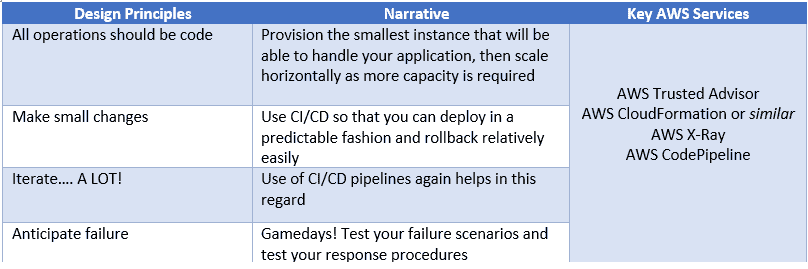
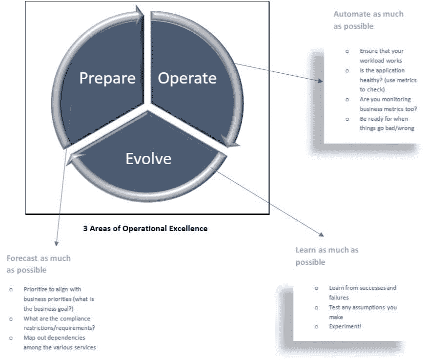
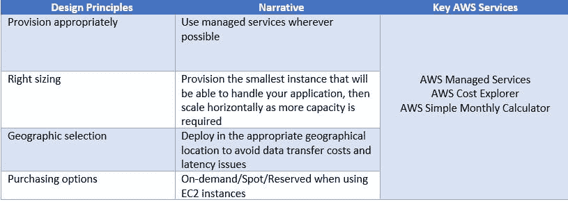
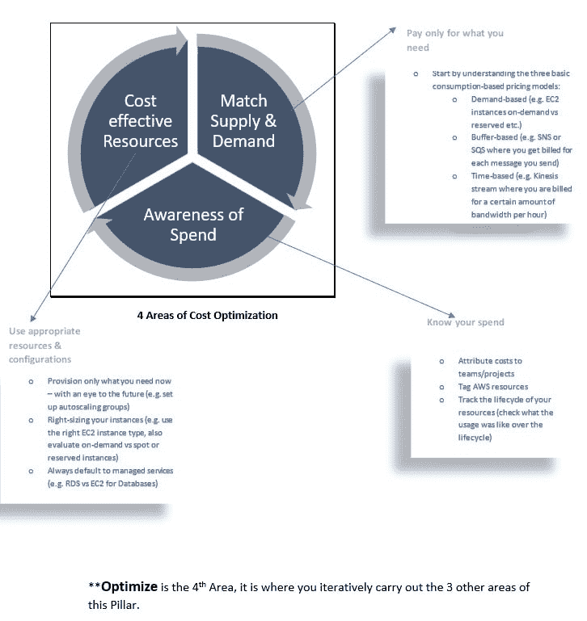
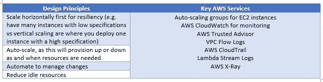
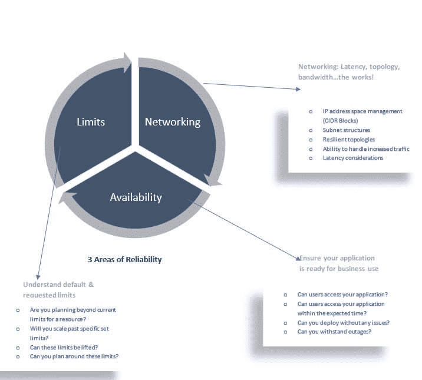
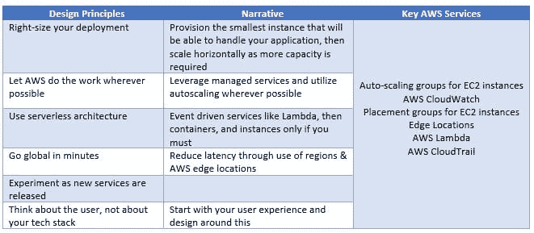
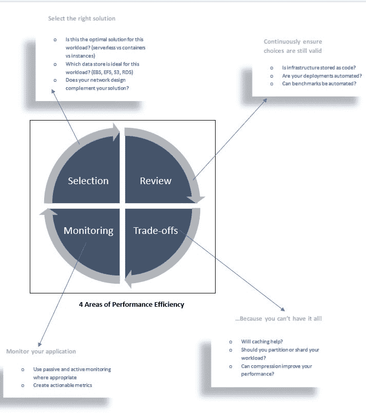
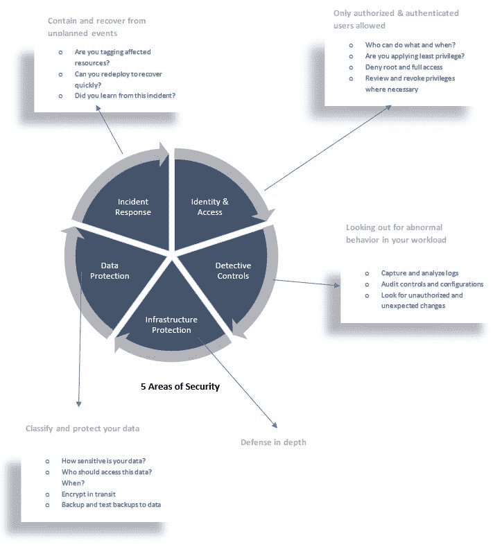

# 我最近深入研究了 AWS 架构良好的框架——这是我所学到的

> 原文：<https://dev.to/vel12171/i-recently-did-an-in-depth-on-aws-well-architected-framework-this-is-what-i-learned-1fj0>

**AWS 良好架构的框架**是 AWS 的产品，旨在帮助构建者为其应用构建安全、高性能、弹性和高效的基础设施。

该框架由 **5 个支柱**组成，以下通用设计原则是支配性的，并在所有这 5 个支柱中重复出现:

*   停止猜测容量需求>>>只为您使用的容量付费
*   自动化一切>>>为您的部署使用基础架构即代码和 CI/CD 管道
*   大规模测试>>>在生产副本上测试
*   游戏天>>练习，练习，为灾难而练习

这五大支柱是什么:

*   卓越运营
*   成本优化
*   可靠性
*   性能效率
*   安全性

现在，我们将详细介绍每一个支柱:

1) **卓越运营**
卓越运营支柱包括运行系统和洞察其运营以交付业务价值的能力，以及持续改进支持流程和程序的能力。
在设计卓越运营时，问自己以下问题:

*   你的架构行得通吗？
*   随着时间的推移，当用户与它交互时，它会继续工作吗？
*   它会以最少的努力继续工作吗？

下表列出了针对卓越运营的**“如何”**设计，可根据这些设计原则检查架构，以确保与该支柱保持一致:

[https://D1 . AWS static . com/whites/architecture/AWS-Operational-Excellence-pillar . pdf](https://d1.awsstatic.com/whitepapers/architecture/AWS-Operational-Excellence-Pillar.pdf)

接下来，我们看第二个支柱；成本优化:

2) **成本优化**
该支柱与卓越运营和绩效效率支柱紧密合作。
成本优化就是确保您只在绝对必要的地方花钱，同时满足您的功能需求并保持资源的充分利用。

这就是你如何确保你的架构师进行成本优化:
 
关于这一点的全部细节在这里:
[https://D1 . AWS static . com/whites/architecture/AWS-Cost-Optimization-pillar . pdf](https://d1.awsstatic.com/whitepapers/architecture/AWS-Cost-Optimization-Pillar.pdf)

我们差不多完成了一半:-)> >现在进入第三个支柱:

3) **可靠性**
可靠性支柱是关于确保系统能够从基础设施或服务中断中恢复，动态获取计算资源以满足需求并减少中断。
在设计这一支柱时，您会问自己以下几个主要问题:

*   这个系统会持续工作并快速恢复吗？
*   该系统会自动快速地从问题中恢复吗？
*   当您的用户需要时，这个系统会出现吗？

这就是你如何确保你是这个支柱的架构师:

[https://D1 . AWS static . com/whites/architecture/AWS-Reliability-pillar . pdf](https://d1.awsstatic.com/whitepapers/architecture/AWS-Reliability-Pillar.pdf)
下面是 re:Invent2018 的一个很棒的 **YouTube** 视频，它提供了关于设计弹性 VPCs 的更多信息:
YouTube:[https://www.youtube.com/embed/8K7GZFff_V0](https://www.youtube.com/embed/8K7GZFff_V0)

接下来，我们来看看第四个支柱:

4) **性能效率**
这是 **AWS** 对这一支柱的定义:性能效率支柱专注于高效利用计算资源来满足需求，以及如何在需求变化和技术发展时保持这一效率。
这一支柱是关于精益运营和减少浪费。
..这就是你如何设计这个支柱的:

最后但同样重要的是:-)；安全支柱:

5) **安全**
安全支柱是确保您在提供商业价值的同时保护您的信息、系统和资产。

作为这个支柱的架构师，这些应该是您的考虑事项:

[https://D1 . AWS static . com/whites/architecture/AWS-Security-pillar . pdf](https://d1.awsstatic.com/whitepapers/architecture/AWS-Security-Pillar.pdf)
[https://D1 . AWS static . com/whites/Compliance/AWS _ HIPAA _ Compliance _ white paper . pdf](https://d1.awsstatic.com/whitepapers/compliance/AWS_HIPAA_Compliance_Whitepaper.pdf)
[https://d0 . AWS static . com/whites/Security/AWS _ Security _ Best _ practices . PDS](https://d0.awsstatic.com/whitepapers/Security/AWS_Security_Best_Practices.pdf)

总之，AWS 架构良好的框架旨在成为评估您的架构的实用方法，确保您为您的应用程序部署最佳的基础架构，从而让您有时间为客户进行创新。

* * AWS 良好架构的工具可在管理控制台上获得。

演职员表:
[https://twitter.com/marknca](https://twitter.com/marknca)
[https://acloud.guru/](https://acloud.guru/)
[https://AWS . Amazon . com/blogs/APN/the-5-pillars-of-the-the-AWS-well-architected-framework/](https://aws.amazon.com/blogs/apn/the-5-pillars-of-the-aws-well-architected-framework/)