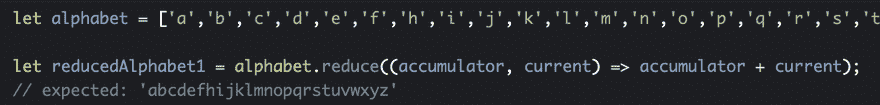

# 我花了整整一个周六试图理解。减少()

> 原文：<https://dev.to/phillipkent/i-spent-an-entire-saturday-trying-to-understand-reduce-27m2>

最近，我一直在努力提高我的 js 技能…包括在 Codecademy 上浏览一些 Javascript 课程，这让我完全崩溃，直到我不得不减少()…🤯！！

> reduce()方法对数组的每个元素执行一个 reducer 函数(您提供的),产生一个输出值。 <cite>(根据 [MDN](https://developer.mozilla.org/en-US/docs/Web/JavaScript/Reference/Global_Objects/Array/reduce) )</cite>

## 这个描述对我来说毫无意义。

我在研究和理解其他数组处理方法如 filter()和 map()方面没有任何问题...但是我在试图理解减少 T1 到底是怎么一回事时遇到了障碍。我花了一整天在这上面。

但是现在，我**认为**我终于明白了:我们通过对数组中的每一项执行一个函数，将一个对象数组“缩减”为一个对象，并将每一步的结果保存到一个*累加器*。这有点像我们对循环使用*的方式，但是这里我们只添加了一个结果(*累加*)。*

这个“累加器”的东西，就像我现在想象的那样:

如果这没有帮助，下面是我为自己写的例子，以确保我理解了累加器的基本性质。
[https://codepen.io/phillipkent/embed/KKPmPXj?height=600&default-tab=js&embed-version=2](https://codepen.io/phillipkent/embed/KKPmPXj?height=600&default-tab=js&embed-version=2)

## 我是怎么来的

为了达到这种理解程度，我不得不看 MDN、博客、youtube，最后放弃，请一个更有经验的程序员(我的朋友戴夫)像五岁时一样给我解释。

这是我得到的一个例子:
[https://codepen.io/phillipkent/embed/MWgmWzE?height=600&default-tab=result,js&embed-version=2](https://codepen.io/phillipkent/embed/MWgmWzE?height=600&default-tab=result,js&embed-version=2)

虽然我现在明白上面发生了什么，但我第一次看到它时并不明白。

## 为我点击的资源

**最后**，几个小时后，我开始*得到它*大约在我第三次阅读 [Jason Belcher 的帖子:“映射、过滤和减少”](https://jasonbelcher.dev/mapfilterreduce#reduce-implementation)，它实际上演示了滚动你自己的类似减少的功能，以及我第二次观看 YouTube 上的编码训练的视频[。](https://www.youtube.com/watch?v=-LFjnY1PEDA) [https://www.youtube.com/embed/-LFjnY1PEDA](https://www.youtube.com/embed/-LFjnY1PEDA)

如果你已经读到这里，你可能会和我一样沮丧和困惑(并且下定决心)——我希望这些链接能像帮助我一样帮助你！