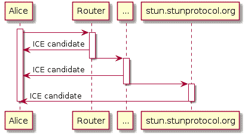
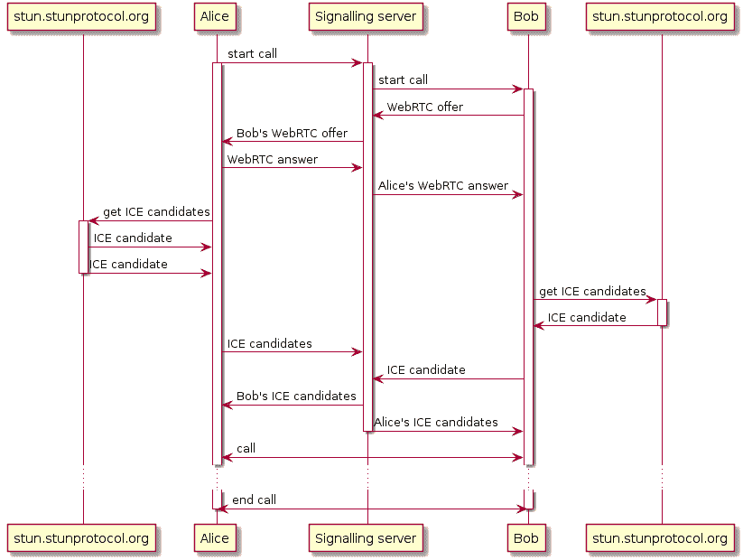

# 用 JavaScript 构建视频聊天

> 原文：<https://dev.to/michaelneu/i-webrtc-you-building-a-video-chat-in-javascript-2j38>

在最近的一个大学项目中，我们团队的任务是为我们的 iOS 和 web 应用程序提供视频通话功能。有许多解决方案承诺视频通话，但只有少数是免费的，而且大多只适用于一个平台。因为我们必须为 iOS *和 WebRTC】构建它，所以我们决定使用普通的 webrtc，因为“没那么难，对吧，\_(ツ)_/”*

## TL；博士；医生

我记得自己浏览博客帖子和教程，试图找到所需的最少步骤，最终甚至通读了 [Signal iOS 资源库](https://github.com/signalapp/Signal-iOS)。因此，下面是开始使用 WebRTC 时需要知道的基本要点(或者至少搜索一下在您的项目中不起作用的东西):

*   STUN 和`traceroute`类似:它收集你和一个 STUN 服务器之间的“跳数”；这些跳跃点被称为候选冰
*   冰候选基本上是`ip:port`对；您可以使用这些候选项“联系”您的应用程序
*   你需要一个双工连接来在呼叫方之间交换数据。考虑使用 WebSocket 服务器，因为这是实现这一点最简单的方法
*   当一方“发现”一个 ICE 候选时，通过 web socket/您的双工通道将其发送给另一方
*   获取您设备的媒体曲目，并将其添加到您的本地`RTCPeerConnection`
*   在您的`RTCPeerConnection`上创建一个 WebRTC 报价，并将其发送给另一方
*   接受并使用这个提议，然后回复你的答案

如果这对您的问题没有帮助，或者您通常对 WebRTC 感兴趣，请继续阅读。我们将首先看看 WebRTC 是什么，然后我们将为自己构建一个小型视频聊天。

## 什么是 WebRTC？

我就借用一下官网的“关于”部分:

> WebRTC 是一个免费的开放项目，它通过简单的 API 为浏览器和移动应用程序提供实时通信(RTC)功能。WebRTC 组件已经过优化，可以最好地满足这一目的。
> ——[webrtc.org](https://webrtc.org)

简而言之，WebRTC 允许您构建应用程序，使用对等连接实时交换数据。数据可以是音频、视频或任何你想要的东西。例如，信号呼叫是通过纯 WebRTC 完成的，由于点对点的性质，大部分工作都不需要通过第三方发送您的呼叫数据，例如像 [Skype 现在做的](https://arstechnica.com/information-technology/2016/07/skype-finalizes-its-move-to-the-cloud-ignores-the-elephant-in-the-room/)。

### 眩晕

为了在两个呼叫方之间建立对等连接，他们需要知道如何相互连接。这就是眩晕的用武之地。如上所述，它类似于 [`traceroute`](https://en.wikipedia.org/wiki/Traceroute) 。

当用 JavaScript 创建 WebRTC 客户端对象时，需要提供`iceServerUrls`，这本质上是 STUN 服务器的 URL。然后客户端经过所有的跳跃，直到它到达 STUN 服务器。下面的序列图以简化的方式显示了它的工作原理:

[](https://res.cloudinary.com/practicaldev/image/fetch/s--qUBLeUfu--/c_limit%2Cf_auto%2Cfl_progressive%2Cq_auto%2Cw_880/https://i.imgur.com/4h6Ohbd.png)

候选人离爱丽丝越远(到达她需要的跳数越多)，其*网络成本*越高。`localhost:12345`比`public_ip:45678`离她更近，所以`localhost`的成本可能是 10，而`public_ip`的成本可能是 100。WebRTC 试图以最低的网络成本建立连接，以保证高带宽。

### 优惠、答案和曲目

如果你想和朋友进行 FaceTime，他们可能会有兴趣知道你是如何给他们打电话的，也就是说，他们想知道你是只使用音频还是视频，或者即使你根本没有使用 FaceTime，只是用座机给他们打电话。

WebRTC *提供的*与此类似:你指定你将在即将到来的连接中发送什么。因此，当您`peer.createOffer()`时，它会检查哪些*曲目*，例如视频或音频，并将其包含在报价中。一旦被叫方收到提议，它就`peer.createAnswer()`指定它自己的能力，例如，它是否也将发送音频和视频。

### 传信

WebRTC 的一个重要部分是在对等连接建立之前交换信息。双方需要交换一个报价和答案，需要知道对方的 ICE 候选人，否则终究不知道自己的音视频流要发到哪里。

这就是*信令*的用武之地:你需要向双方发送所述信息。你可以使用任何你想做的东西，但是最简单的是使用一个[双工](https://en.wikipedia.org/wiki/Duplex_(telecommunications))连接，例如 WebSockets 提供的。使用 WebSockets，只要有来自信令服务器的更新，您就会得到“通知”。

典型的 WebRTC 握手如下所示:

[](https://res.cloudinary.com/practicaldev/image/fetch/s--A3lMgooQ--/c_limit%2Cf_auto%2Cfl_progressive%2Cq_auto%2Cw_880/https://i.imgur.com/aqyjrzZ.png)

首先，Alice 发出她想给 Bob 打电话的信号，于是双方开始 WebRTC“握手”。他们都获得了他们的 *ICE 候选者*，并通过信令服务器将其发送给另一方。在某个时候，Alice 创建了一个要约并发送给 Bob。谁先创建*要约*并不重要(即爱丽丝或鲍勃)，但对方必须创建*对*要约*的回答*。因为 Alice 和 Bob 都知道如何联系彼此以及将发送什么数据，所以建立了对等连接，并且他们可以进行他们的对话。

## 建造它

现在我们知道了 WebRTC 是如何工作的，我们“只”需要构建它。这篇文章将只关注网络客户端的使用，如果评论中对 iOS 版本感兴趣，我将在一篇新文章中总结这些陷阱。此外，我目前将 web 客户端实现为一个 React hook `useWebRTC`，我也可能会为此创建一个帖子。

服务器将采用 TypeScript，而 webapp 将采用普通的 JavaScript，没有单独的构建过程。两者都将只使用普通的 WebSockets 和 WebRTC——没有魔法。你可以在 GitHub 上找到这篇文章的来源。

### 服务器

我们将使用`express`、`express-ws`和其他一些库，你可以在[包中找到它们。](https://github.com/michaelneu/howto-webrtc/blob/master/package.json)

#### WebSocket 通道

许多 WebSocket 库允许在*通道*中发送数据。其核心是，信道只是消息中的一个字段(如`{ channel: "foo", data: ... }`)，允许服务器和应用程序区分消息属于哪里。

我们需要 5 个频道:

*   `start_call`:表示应该开始通话
*   `webrtc_ice_candidate`:交换 ICE 候选人
*   `webrtc_offer`:发送 WebRTC 报价
*   `webrtc_answer`:发送 WebRTC 答案
*   让服务器知道你是谁

WebSockets 的浏览器实现缺乏发送你是谁的能力，例如，在你的令牌中添加一个`Authorization`头是不可能的。我们可以通过 WebSocket 的 URL 添加令牌作为查询参数，但这意味着它将被记录在 web 服务器上，并可能缓存在浏览器上——我们不希望这样。

相反，我们将使用一个单独的`login`通道，在那里我们只发送我们的名字。这可能是一个令牌或其他任何东西，但为了简单起见，我们将假设我们的名字是安全和唯一的。

由于我们使用 TypeScript，我们可以很容易地为我们的消息定义接口，所以我们可以安全地交换消息，而不用担心打字错误:

```
interface LoginWebSocketMessage {
  channel: "login";
  name: string;
}

interface StartCallWebSocketMessage {
  channel: "start_call";
  otherPerson: string;
}

interface WebRTCIceCandidateWebSocketMessage {
  channel: "webrtc_ice_candidate";
  candidate: RTCIceCandidate;
  otherPerson: string;
}

interface WebRTCOfferWebSocketMessage {
  channel: "webrtc_offer";
  offer: RTCSessionDescription;
  otherPerson: string;
}

interface WebRTCAnswerWebSocketMessage {
  channel: "webrtc_answer";
  answer: RTCSessionDescription;
  otherPerson: string;
}

// these 4 messages are related to the call itself, thus we can
// bundle them in this type union, maybe we need that later
type WebSocketCallMessage =
  StartCallWebSocketMessage
  | WebRTCIceCandidateWebSocketMessage
  | WebRTCOfferWebSocketMessage
  | WebRTCAnswerWebSocketMessage;

// our overall type union for websocket messages in our backend spans
// both login and call messages
type WebSocketMessage = LoginWebSocketMessage | WebSocketCallMessage; 
```

因为我们在这里使用了联合类型，所以我们可以稍后使用 TypeScript 编译器来识别我们通过检查`channel`属性所接收到的消息。如果`message.channel === "start_call"`，编译器将推断消息的类型必须是`StartCallWebSocketMessage`。干净利落。

#### 暴露 WebSocket

我们将使用`express-ws`从我们的服务器中公开一个 WebSocket，它恰好是一个 express 应用程序，通过`http.createServer()` :
提供服务

```
const app = express();
const server = createServer(app);

// serve our webapp from the public folder
app.use("/", express.static("public"));

const wsApp = expressWs(app, server).app;

// expose websocket under /ws
// handleSocketConnection is explained later
wsApp.ws("/ws", handleSocketConnection);

const port = process.env.PORT || 3000;
server.listen(port, () => {
  console.log(`server started on http://localhost:${port}`);
}); 
```

我们的应用现在将在端口 3000 上运行(或者我们通过`PORT`提供的任何东西)，在`/ws`上公开一个 WebSocket，并从`public`目录提供我们的 web 应用。

#### 用户管理

由于视频通话通常需要 1 人以上，我们还需要跟踪当前连接的用户。为此，我们可以引入一个数组`connectedUsers`，每当有人连接到 WebSocket:
时，我们都会更新这个数组

```
interface User {
  socket: WebSocket;
  name: string;
}

let connectedUsers: User[] = []; 
```

此外，为了我们自己的方便，我们应该添加助手函数来通过用户的名字或套接字查找用户:

```
function findUserBySocket(socket: WebSocket): User | undefined {
  return connectedUsers.find((user) => user.socket === socket);
}

function findUserByName(name: string): User | undefined {
  return connectedUsers.find((user) => user.name === name);
} 
```

在这篇文章中，我们假设没有坏演员。因此，每当一个套接字连接时，它是一个人试图尽快呼叫某人。我们的`handleSocketConnection`看起来有点像这样:

```
function handleSocketConnection(socket: WebSocket): void {
  socket.addEventListener("message", (event) => {
    const json = JSON.parse(event.data.toString());

    // handleMessage will be explained later
    handleMessage(socket, json);
  });

  socket.addEventListener("close", () => {
    // remove the user from our user list
    connectedUsers = connectedUsers.filter((user) => {
      if (user.socket === socket) {
        console.log(`${user.name} disconnected`);
        return false;
      }

      return true;
    });
  });
} 
```

WebSocket 消息可以是字符串或`Buffer` s，所以我们需要首先解析它们。如果是一个`Buffer`，调用`toString()`会把它转换成一个字符串。

#### 转发消息

我们的信令服务器本质上是在呼叫双方之间转发消息，如上面的序列图所示。为此，我们可以创建另一个便利函数`forwardMessageToOtherPerson`，它将传入的消息发送到消息中指定的`otherPerson`。为了调试，我们甚至可以将`otherPerson`字段替换为发送原始消息的发送者:

```
function forwardMessageToOtherPerson(sender: User, message: WebSocketCallMessage): void {
  const receiver = findUserByName(message.otherPerson);
  if (!receiver) {
    // in case this user doesn't exist, don't do anything
    return;
  }

  const json = JSON.stringify({
    ...message,
    otherPerson: sender.name,
  });

  receiver.socket.send(json);
} 
```

在我们的`handleMessage`中，我们可以登录我们的用户，并可能将他们的消息转发给其他人。注意，所有与呼叫相关的消息都可以组合在`default`语句下，但是为了更有意义地记录日志，我明确地将每个通道放在这里:

```
function handleMessage(socket: WebSocket, message: WebSocketMessage): void {
  const sender = findUserBySocket(socket) || {
    name: "[unknown]",
    socket,
  };

  switch (message.channel) {
    case "login":
      console.log(`${message.name} joined`);
      connectedUsers.push({ socket, name: message.name });
      break;

    case "start_call":
      console.log(`${sender.name} started a call with ${message.otherPerson}`);
      forwardMessageToOtherPerson(sender, message);
      break;

    case "webrtc_ice_candidate":
      console.log(`received ice candidate from ${sender.name}`);
      forwardMessageToOtherPerson(sender, message);
      break;

    case "webrtc_offer":
      console.log(`received offer from ${sender.name}`);
      forwardMessageToOtherPerson(sender, message);
      break;

    case "webrtc_answer":
      console.log(`received answer from ${sender.name}`);
      forwardMessageToOtherPerson(sender, message);
      break;

    default:
      console.log("unknown message", message);
      break;
  }
} 
```

服务器到此为止。当有人连接到套接字时，他们可以登录，只要他们开始 WebRTC 握手，消息就会被转发给他们正在呼叫的人。

### Web app

web 应用程序由`index.html`和一个 JavaScript 文件`web.js`组成。两者都是从应用程序的`public`目录提供的，如上图所示。web 应用程序最重要的部分是两个`<video />`标签，它们将用于显示本地和远程视频流。为了获得一致的视频馈送，需要在视频上设置`autoplay`，否则会卡在初始帧:

```
<!DOCTYPE html>
<html>
  <body>
    <button id="call-button">Call someone</button>

    <div id="video-container">
      <div id="videos">
        <video id="remote-video" autoplay></video>
        <video id="local-video" autoplay></video>
      </div>
    </div>

    <script type="text/javascript" src="web.js"></script>
  </body>
</html> 
```

#### 连接到信令服务器

我们的 WebSocket 和我们的 web app 在同一个服务器上监听，所以我们可以利用包含主机名和端口的`location.host`来构建我们的 socket url。一旦连接，我们需要登录，因为 WebSockets 不提供额外的认证可能性:

```
// generates a username like "user42"
const randomUsername = `user${Math.floor(Math.random() * 100)}`;
const username = prompt("What's your name?", randomUsername);
const socketUrl = `ws://${location.host}/ws`;
const socket = new WebSocket(socketUrl);

// convenience method for sending json without calling JSON.stringify everytime
function sendMessageToSignallingServer(message) {
  const json = JSON.stringify(message);
  socket.send(json);
}

socket.addEventListener("open", () => {
  console.log("websocket connected");
  sendMessageToSignallingServer({
    channel: "login",
    name: username,
  });
});

socket.addEventListener("message", (event) => {
  const message = JSON.parse(event.data.toString());
  handleMessage(message);
}); 
```

#### 设置 WebRTC

现在这就是我们一直在等待的:WebRTC。在 JavaScript 中，有一个`RTCPeerConnection`类，我们可以用它来创建 WebRTC 连接。我们需要为 ICE 候选发现提供服务器，例如`stun.stunprotocol.org` :

```
const webrtc = new RTCPeerConnection({
  iceServers: [
    {
      urls: [
        "stun:stun.stunprotocol.org",
      ],
    },
  ],
});

webrtc.addEventListener("icecandidate", (event) => {
  if (!event.candidate) {
    return;
  }

  // when we discover a candidate, send it to the other
  // party through the signalling server
  sendMessageToSignallingServer({
    channel: "webrtc_ice_candidate",
    candidate: event.candidate,
    otherPerson,
  });
}); 
```

#### 发送和接收媒体曲目

视频通话在有视频时效果最好，所以我们需要以某种方式发送视频流。这里，用户媒体 API 派上了用场，它提供了一个检索用户的网络摄像头流的功能。

```
navigator
  .mediaDevices
  .getUserMedia({ video: true })
  .then((localStream) => {
    // display our local video in the respective tag
    const localVideo = document.getElementById("local-video");
    localVideo.srcObject = localStream;

    // our local stream can provide different tracks, e.g. audio and
    // video. even though we're just using the video track, we should
    // add all tracks to the webrtc connection
    for (const track of localStream.getTracks()) {
      webrtc.addTrack(track, localStream);
    }
  });

webrtc.addEventListener("track", (event) => {
  // we received a media stream from the other person. as we're sure 
  // we're sending only video streams, we can safely use the first
  // stream we got. by assigning it to srcObject, it'll be rendered
  // in our video tag, just like a normal video
  const remoteVideo = document.getElementById("remote-video");
  remoteVideo.srcObject = event.streams[0];
}); 
```

#### 执行 WebRTC 握手

我们的`handleMessage`函数严格遵循上面的序列图:当 Bob 收到一个`start_call`消息时，他向信令服务器发送一个 WebRTC 要约。Alice 收到这个消息，并用她的 WebRTC 回答进行了回复，Bob 也通过信令服务器收到了这个消息。一旦这样做了，双方交换冰候选人。

WebRTC API 是围绕`Promise` s 构建的，因此声明一个`async`函数和其中的`await`:
是最容易的

```
// we'll need to have remember the other person we're calling,
// thus we'll store it in a global variable
let otherPerson;

async function handleMessage(message) {
  switch (message.channel) {
    case "start_call":
      // done by Bob: create a webrtc offer for Alice
      otherPerson = message.otherPerson;
      console.log(`receiving call from ${otherPerson}`);

      const offer = await webrtc.createOffer();
      await webrtc.setLocalDescription(offer);
      sendMessageToSignallingServer({
        channel: "webrtc_offer",
        offer,
        otherPerson,
      });
      break;

    case "webrtc_offer":
      // done by Alice: react to Bob's webrtc offer
      console.log("received webrtc offer");
      // we might want to create a new RTCSessionDescription
      // from the incoming offer, but as JavaScript doesn't
      // care about types anyway, this works just fine:
      await webrtc.setRemoteDescription(message.offer);

      const answer = await webrtc.createAnswer();
      await webrtc.setLocalDescription(answer);

      sendMessageToSignallingServer({
        channel: "webrtc_answer",
        answer,
        otherPerson,
      });
      break;

    case "webrtc_answer":
      // done by Bob: use Alice's webrtc answer
      console.log("received webrtc answer");
      await webrtc.setRemoteDescription(message.answer);
      break;

    case "webrtc_ice_candidate":
      // done by both Alice and Bob: add the other one's
      // ice candidates
      console.log("received ice candidate");
      // we could also "revive" this as a new RTCIceCandidate
      await webrtc.addIceCandidate(message.candidate);
      break;

    default:
      console.log("unknown message", message);
      break;
  }
} 
```

#### 通过按键开始通话

我们仍然缺少的主要东西是从“呼叫某人”按钮开始呼叫。我们所需要做的，就是向我们的信令服务器发送一条`start_call`消息，其他的事情将由我们的 WebSocket 和`handleMessage` :
来处理

```
const callButton = document.getElementById("call-button");
callButton.addEventListener("click", () => {
  otherPerson = prompt("Who you gonna call?");
  sendMessageToSignallingServer({
    channel: "start_call",
    otherPerson,
  });
}); 
```

## 结论

如果我们同时在 Chrome 和 Safari 上打开 app，就可以在不同的浏览器上调用自己。这有点酷！

但是除了调用之外，还有很多事情没有在这篇文章中讨论，比如清理我们的连接，我可能会在以后的文章中讨论(比如对 WebRTC 和 WebSockets 使用 React 钩子)。请随意查看[回购](https://github.com/michaelneu/howto-webrtc)，在那里你也可以重新追踪这篇文章中出现的所有东西。感谢阅读！