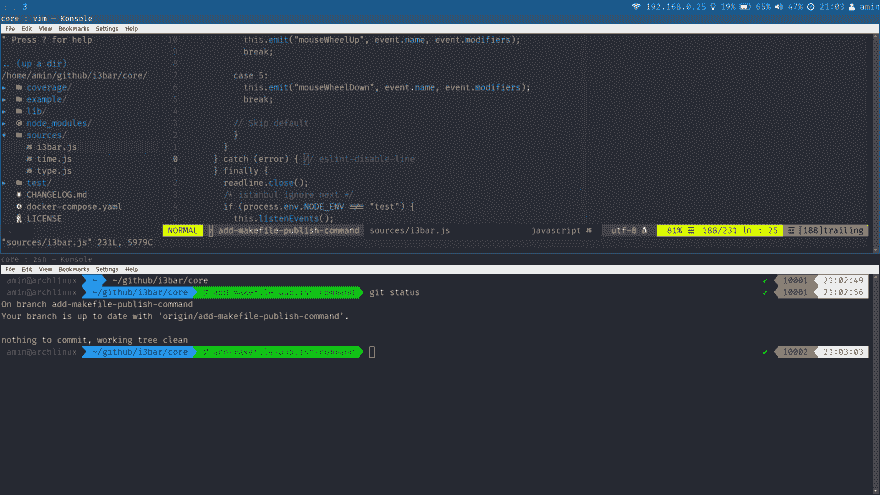
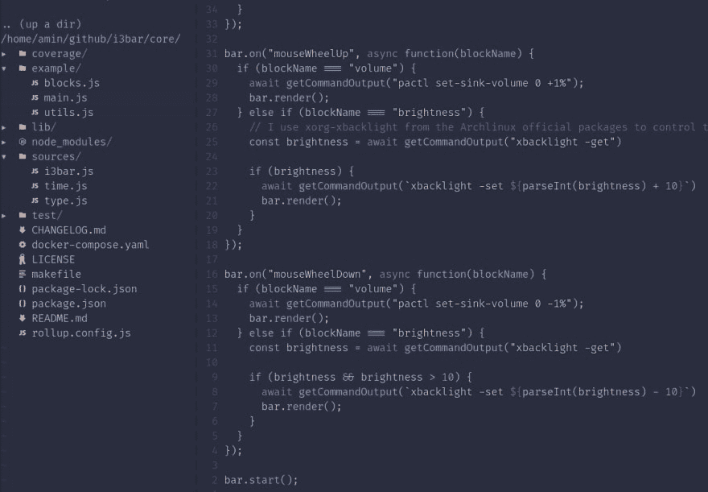
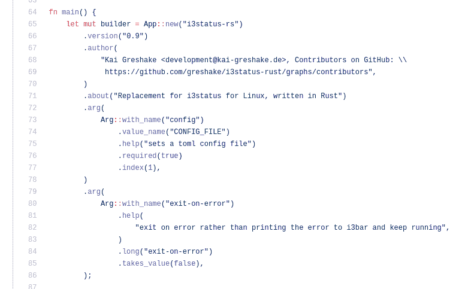

# @i3bar/core

> 原文：<https://dev.to/aminnairi/i3bar-core-6b8>

# 在 Node.js 中创建你的 i3 状态栏

## i3 是什么？

i3 是一个适用于 T2 GNU/Linux 和 Unix 操作系统的平铺窗口管理器。简单来说，平铺窗口管理器通过在屏幕上平均排列来帮助你组织窗口。如果你有一个窗口，它将占用所有的可用空间，两个窗口，它将把可用空间一分为二，以此类推...

[](https://res.cloudinary.com/practicaldev/image/fetch/s--NummOCJD--/c_limit%2Cf_auto%2Cfl_progressive%2Cq_auto%2Cw_880/https://i.ibb.co/fGH2Yfd/Screenshot-from-2019-08-13-21-03-30.png)

*我运行 VIM(上)和 Konsole(下)的桌面截图。*

## 什么是 i3 状态

i3 状态是 i3 窗口管理器的一个状态栏。这个想法类似于在 Mac OS X 操作系统上发现的:显示一些关于你的操作系统、应用程序、事件等的状态。我以前从未用过 OS X 操作系统，所以我不能说它是否容易定制。但是 i3status 有这样的优势:你想显示一些来自 API 的第三方程序输出？你猜对了！你想知道你所在地的天气吗？i3status 可以满足您的需求，因为它是高度可定制的。

[](https://res.cloudinary.com/practicaldev/image/fetch/s--kHeGtAgl--/c_limit%2Cf_auto%2Cfl_progressive%2Cq_auto%2Cw_880/https://i.ibb.co/wLMBRXb/linkedin-i3bar.png)

*我在@i3bar/core 的帮助下日常使用的状态栏。*

## 一些事实

[@i3bar/core](https://www.npmjs.com/package/@i3bar/core) 是我最近发布的 NPM 包。i3 窗口管理器的伟大之处在于，它甚至可以让你用自己的状态栏来替换默认的 i3 状态栏，我指的是你喜欢的从 GitHub 安装的&还是你自己用你想要的语言编写的，因为每个 i3 状态栏都遵循 i3 协议。协议告诉你它最终想从你那里得到什么，无论如何你都必须以某种方式提供它。该信息实际上是一个 JSON 对象，它列出了将在状态栏上显示所有块。块只是包含属性的 JSON 对象，比如包含块输出的`full_text`属性(就像电池的`71%`)。

最后，我们可以用几行代码编写自己的 Node.js 状态栏，如下所示:

```
"use strict";

const sleep = seconds => new Promise(resolve => setTimeout(resolve, seconds * 1000));

async function loop() {
  console.log(JSON.stringify({ full_text: new Date().toISOString() }));
  // {full_text: "2019-08-13T19:47:18.743Z"}

  await sleep(5);
  // wait five seconds, and then update the date
}

loop(); 
```

Enter fullscreen mode Exit fullscreen mode

*了解 i3 协议工作原理的基本实现*

所以，知道我可以写我自己的酒吧，我自然就把它写进去了...PHP。是的，我喜欢 PHP，用 PHP 写这篇文章让我很开心。除了这个条是非常静态的，因为它不会对诸如点击或音量滚动这样的事件做出反应。事实上，您有义务提供一个包含您想要显示的所有块对象的 JSON 数组，但与此同时，它也会为事件发送 JSON。我很难在我的脚本中集成一个非阻塞的 I/O 模型来让事件工作。即使在那之后，酒吧的反应也不够流畅，我知道我必须选择另一种语言。现在不要误解我的意思，PHP 很棒，事实上，我每天都在用 PHP 工作，但有时，你必须为工作选择正确的工具，而正确的工具是...

## Node.js 前来救援

因此，我用 JavaScript 为 Node.js 重新编写了这个东西。由于我已经获得了一些关于 i3 协议的经验，我知道将我的 PHP 代码翻译成 JavaScript 会很容易。我不仅做到了这一点，而且还发现了一些性能上的提高，我真的很高兴，因为我知道我已经构建了一些东西，可以让我最终以我想要的方式，用我喜欢并且非常熟悉的语言编写我的代码块。

[](https://res.cloudinary.com/practicaldev/image/fetch/s--iXuQtrfQ--/c_limit%2Cf_auto%2Cfl_progressive%2Cq_auto%2Cw_880/https://i.ibb.co/XtJ2vs6/devto-code-i3bar-core.png)

*我自己用 JavaScript 写的酒吧*

## 我学到了什么

最后，我甚至不认为 Node.js 是编写 i3 状态栏的完美语言，但用您最喜欢的语言编写它并能够以这种方式定制您的操作系统是一种极大的乐趣。我也用了一些 i3 状态的社区包，比如用 Rust 写的 [i3status-rs](https://i.ibb.co/mbGPsfz/source-i3status-rs.png) 。我喜欢它的外观，但我真的想了解更多关于这个协议的知识，也想看看我会想出什么。此外，Rust 是一种令人惊叹的语言，但编译 bar 的时间对我来说太长了(我猜有太多的第三方包)，最终，选择一种事件驱动的解释语言(如 Node.js 中的 JavaScript)来处理这种用例是非常聪明的(能够通过发出事件来更新 bar)。

[](https://res.cloudinary.com/practicaldev/image/fetch/s--TMbTvwTg--/c_limit%2Cf_auto%2Cfl_progressive%2Cq_auto%2Cw_880/https://i.ibb.co/mbGPsfz/source-i3status-rs.png)

*来自 i3status-rs 库的源代码*

## 下一步怎么办？

我计划增加一些更多的功能，比如你点击一个块的坐标位置(对我来说似乎太多了，但是协议允许这种信息，也许有些人会想到我在开始时没有的想法)。我还想创建另一个名为@i3bar/blocks 的包，您可以选择一个块，对它进行定制(而不是编写整个东西，对我来说更有趣)，并在您的配置中使用它，而不是必须编写所有内容。因为最终，@i3bar/core 只是一个 SDK，但是在资源库中有一个示例文件夹，这样你就可以查看我是如何制作我现在每天使用的状态栏的。也许还有一些推迟操作的工具，比如从 api 获取信息，每 10 分钟刷新一次(我正看着你呢，打开天气图)。这个项目只是一个开始，我希望我有社区的支持，以帮助我提供更多的功能！

感谢您花时间阅读，如果您有任何问题，如果我犯了一个错别字或错误，请不要犹豫。不要犹豫，在 GitHub 上打开一个问题，讨论你不理解的东西或者一个 bug/特性。

我知道我肯定不是最好的 Node.js 甚至 JavaScript 开发人员，我指望你指导我走上完美之路，如果你看到我的代码中有一些让你困扰的地方，我们甚至可以在这里或在某一期讨论它们。

祝你今天愉快，不要停止好奇！