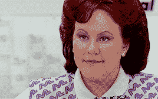

# 从空白画布开始创建新网站的理想工作流程？

> 原文：<https://dev.to/bradleycollins/ideal-workflow-to-start-a-new-site-from-a-blank-canvas-1bi6>

我试着不要回到炼狱教程，并从零开始着手新的项目。

为了提高我的 HTML 和 CSS 技能，我找到了一个网站(用 Wordpress 制作),我试图用 HTML、SCSS 和 JS 模仿它。

我的第一个想法是，为什么我不先用 HTML 标记所有的内容，然后我可以处理 CSS，使它看起来像原来的一样。这开始还不错，但是当我浏览示例站点时，我意识到这个页面非常长，有很多不同的部分/内容。

现在回头看看我写的所有 HTML 和我的无 CSS 页面，我想知道这个工作流程是正确的，错误的，还是只是简单的混乱。

在生产环境中使用的项目有标准的启动方式吗？

我是不是因为没有在页面上设计每一部分的样式而使我的生活/学习变得更加困难了？我觉得我可以做到，但现在我有大量的 HTML，看起来需要花一分钟来设计风格。

任何关于工作流程的提示/建议(我在这里使用了正确的词吗？)从零开始新项目？

回顾我所做的一切，我脑子里想的只有:

泰泰。