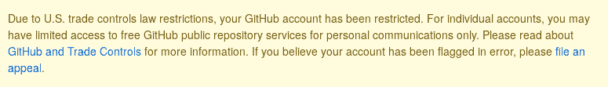

# 如果你不知道，现在你知道了——GitHub 正在限制来自伊朗和其他一些被禁运国家的用户的访问

> 原文：<https://dev.to/mjraadi/if-you-don-t-know-now-you-know-github-is-restricting-access-for-users-from-iran-and-a-few-other-embargoed-countries-5ga9>

### 这里有些东西你可能**一辈子都不会**看到:

这对我和许多其他人来说并不新鲜。事实上，这种歧视在我身上发生得太多了，以至于我很难过自己已经习惯了。让我告诉你发生了什么事。

### 19 年 7 月 1 - 28 日更新

现在可以公开您的私有存储库了。

几天前，我收到了一封来自 GitHub 的邮件，邮件中说我的 GitHub 帐户由于“贸易控制法的限制”而被限制。打开我的 GitHub 个人资料，我发现我无法访问我的私人存储库。它还停止了发布我的 GitHub Pages 网站。看到这种情况再次发生，我感到非常不安和失望。

我明白 GitHub 可能是无辜的，只是有义务遵守美国政府的法律法规，但可悲的是，受苦的不是政府。是我们。仅仅因为政府和政客合不来，我们就要付出代价。

我很感激 GitHub 为我们提供免费的私有存储库托管，但是我认为在没有任何事先通知的情况下阻止我们访问私有资产是绝对不专业和不道德的。

你可能会想，“这有什么大不了的？！有很多替代方案。”是的，我知道，但这不是重点。它是关于经常被忽视和歧视，并且不能像你的开发伙伴一样拥有访问工具和资源的权利。😔

如果你明天醒来发现 [@ben](https://dev.to/ben) 因为一个愚蠢的原因阻止你访问这个伟大的开发者社区，你会有什么感觉？

请务必检查此回购获取更多信息，看看你能如何帮助我们。

## [1995 年帕姆](https://github.com/1995parham)/[github-do-not-ban-us](https://github.com/1995parham/github-do-not-ban-us)

### GitHub 不会禁止我们进入🇮🇷开源世界

<article class="markdown-body entry-content container-lg" itemprop="text">

# 给 GitHub 的消息

 

英语|[简体中文](https://github.com/1995parham/github-do-not-ban-us./README-CN.md) | [【西班牙语】](https://github.com/1995parham/github-do-not-ban-us./README-ES.md)||[【意大利语】](https://github.com/1995parham/github-do-not-ban-us./README-IT.md) | [【欧安组织】](https://github.com/1995parham/github-do-not-ban-us./README-RU.md)|| >。日本語||[繁體中文](https://github.com/1995parham/github-do-not-ban-us./README-TW.md)

**注意！我们非常感谢你的支持。这个库总是显示人们都在一起对抗世界各地不幸发生的事情，由于 GitHub 修改了以前的一些限制，我们决定减少这个库的活动。当然，这并不意味着我们同意制裁和 GitHub，我们将很快发布一个结论和更多的解释，请等待这场运动将被终止**8 月 1 日星期四 23:59(德黑兰时间+4:30)** 。这次之后我们不会合并任何新的公关。再次感谢您的支持和好意，请等待我们的最终结论**

~~**提示:**可以用~~ …

</article>

[View on GitHub](https://github.com/1995parham/github-do-not-ban-us)