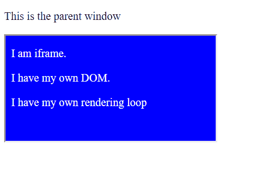

# iframes——它们不好吗？

> 原文：<https://dev.to/jcwardle/iframes-aren-t-they-bad-24c1>

大家第一次开始 web 开发的时候，听说 iframes 很可怕！不要用它们，它们又慢又怪，没什么用处！

我们被教导这一点是有原因的。在网页中嵌入 iframe 类似于打开两个不同的浏览器标签。iframe 有自己的 DOM 和加载事件，不与父窗口共享，这可能导致与 iframe 交互时的笨拙行为。移动设备上的滚动通常是主要的问题。

#### 一个 HTML 页面中 iframe 的例子:

#### 如果 iframes 这么糟糕，我为什么要用它？

简单的答案是，当你需要在网页中运行不可信的第三方代码时。

今天，我们最常以展示广告的形式看到这种情况。现在你的网页上可能就有一个。另一个用途是像 Codepen 和 Big Crunch 这样的网站，你可以编写和保存 HTML/CSS/Javascript 代码，这些网站上的其他用户可以看到。

如果两个 DOM 托管在同一个域中，iframe 可以使用 Javascript 访问它们之间的元素，如果 iframe 不受信任，这是非常危险的。这具有恶意活动的潜在风险，例如将用户重定向到恶意网站或窃取某人的身份验证。在 Big Crunch，我们在 earlyaccess.bigcrunch.io 上运行我们的网站，并在 rur.bigcrunch.io 上提供我们的 iframe。这种分离意味着用户无法编写可以逃离 iframe 的代码。

iframe 沙盒、iframe 之间的通信、滚动和交互等更多功能即将推出。