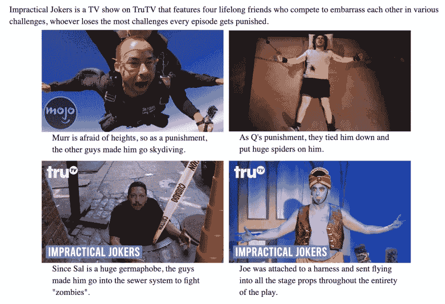

# 图像可访问性 101:图像组

> 原文：<https://dev.to/alhasenzahl/image-accessibility-101-groups-of-images-1ngg>

一组图像是用于传达相同或相似信息的图像的集合。

## 书写 alt 文本的提示:

为一组图像编写替代文本有两种不同的方法:

1)对于可以用一句话充分描述的一组图像:其中一个图像接收一个 alt 文本来描述整个组，而其他图像接收一个空的 alt 属性。

2)对于需要更健壮描述的分组:整个分组需要关于该分组内容的基本描述。然后，该组中的每个单独的图像需要有自己的描述来解释该图像的内容。

## 例子:

[](https://res.cloudinary.com/practicaldev/image/fetch/s--9aOKbxps--/c_limit%2Cf_auto%2Cfl_progressive%2Cq_auto%2Cw_880/https://thepracticaldev.s3.amazonaws.com/i/kzkn3t5lch6fqbir1keo.png)T3】

```
<div>
    
    
    
    
    
</div> 
```

上图是上述第一种方法的一个例子。一个备选文本足以描述整个组。因此，第一个星号上的 alt 文本表示该组直观显示的总体评级，而其余四个图像接收一个空的 alt 属性。

[](https://res.cloudinary.com/practicaldev/image/fetch/s---meRt0q1--/c_limit%2Cf_auto%2Cfl_progressive%2Cq_auto%2Cw_880/https://thepracticaldev.s3.amazonaws.com/i/1y666fzcc28a4ig4nhfz.png)T3】

```
<figure id="group" role="group" aria-labelledby="fig1">
    <figcaption id="fig1">Impractical Jokers is a TV show on TruTV that features four 
lifelong friends who compete to embarrass each other in various challenges, whoever 
loses the most challenges every episode gets punished.</figcaption>

    <figure role="group" aria-labelledby="fig11" class="figure">
        
        <figcaption id="fig11">Murr is afraid of heights, so as a punishment, 
the other guys made him go skydiving.</figcaption>
    </figure>
    <figure role="group" aria-labelledby="fig12" class="figure">
        
        <figcaption id="fig12">As Q's punishment, they tied him down and put huge 
spiders on him.</figcaption>
    </figure>
    <figure role="group" aria-labelledby="fig13" class="figure">
        
        <figcaption id="fig13">Since Sal is a huge germaphobe, the guys made him go 
into the sewer system to fight "zombies".</figcaption>
    </figure>
    <figure role="group" aria-labelledby="fig14" class="figure">
        
        <figcaption id="fig14">Joe was attached to a harness and sent flying into 
all the stage props throughout the entirety of the play.</figcaption>
    </figure>

</figure> 
```

此图像是上述第二种方法的示例。这四个图像组

## 总结

用于向页面内容添加简单概念或信息的图像被视为信息图像。让你的替代文本尽可能简短，并确保只包含最相关的信息。

决定一个图像是装饰性图像还是信息性图像是一个棘手的问题，最终取决于页面作者。它归结为为什么图像被包含在页面上，页面上包含的内容，以及什么是最有意义的。