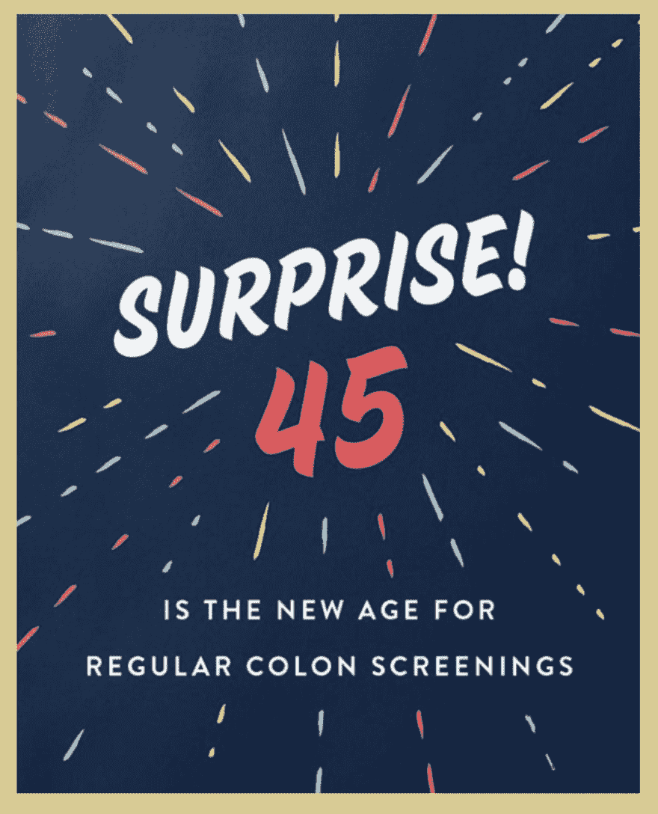

# 图像可访问性 101:文本图像

> 原文：<https://dev.to/alhasenzahl/image-accessibility-101-images-of-text-1pad>

文本图像是以文本为主要内容的图像，旨在供用户阅读。

## 书写 alt 文本的提示:

1)替代文本应该与图像中出现的文本完全匹配。

## 例子:

[](https://res.cloudinary.com/practicaldev/image/fetch/s--UoZgPOzE--/c_limit%2Cf_auto%2Cfl_progressive%2Cq_auto%2Cw_880/https://thepracticaldev.s3.amazonaws.com/i/0j5tlejsyr56pw38sju4.png)T3】

```
 
```

即使这个图像有一个攀岩绳和人攀岩的背景，图像的主要内容是引用。因此，替代文本应该反映引文及其作者，而不是出现在背景中的图像。

[](https://res.cloudinary.com/practicaldev/image/fetch/s--zLIJBoNc--/c_limit%2Cf_auto%2Cfl_progressive%2Cq_auto%2Cw_880/https://thepracticaldev.s3.amazonaws.com/i/xhtjkewatsbhtac19kbb.png)T3】

```
 
```

这是我为美国癌症协会伯明翰阿拉巴马分会工作时的一个客户网站上的图片。他们想建一个网站来提高人们对结肠癌的认识。该网站允许你发送一张有趣的卡片给你爱的人，鼓励他们接受筛查。这些卡片的 alt 文本需要与图片中的文字完全一致，这样非视觉用户仍然可以选择合适的邀请进行发送。

> 你可以在[诚恳地停止癌症网站](https://cordiallystopcancer.com/)上查看完整的网站和全部收集的卡片。

### 重要提示:

1)如果您使用的图像是简单的文本，可以放在页面的标记中，并使用 CSS 样式来匹配原始图像，这是首选。实际文本比图像更容易处理、操作和样式化。调整大小时，它也不会像素化或扭曲。

## 总结

包含文本作为主要内容的图像需要包含完全相同的文本。这样，非视觉用户可以大声读出图像的文本内容。