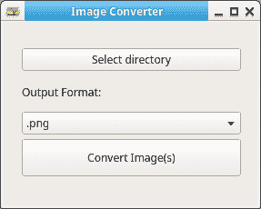

# python 中的图像转换器

> 原文：<https://dev.to/petercour/image-converter-in-python-nhj>

[](https://res.cloudinary.com/practicaldev/image/fetch/s--LiKbW15n--/c_limit%2Cf_auto%2Cfl_progressive%2Cq_auto%2Cw_880/https://thepracticaldev.s3.amazonaws.com/i/1bnkx4nwpdgukcshfxai.png)

用 Python 创建图像转换器 gui 很容易。您可以使用 **PyQt 模块**来创建桌面软件。然后在 designer 中简单地设计你的用户界面，然后加载代码。

在这个应用程序的情况下，只需将按钮点击链接到命令行程序“转换”。

```
 # connect clicks to callback functions
    self.pushButtonDir.clicked.connect(self.onClick)
    self.pushButtonConvert.clicked.connect(self.onConvert)

def onClick(self):
    self.thedir = str(QFileDialog.getExistingDirectory(self, "Select Directory"))
    print('select dir ' + self.thedir)

def onConvert(self):
    images = glob.glob(self.thedir + "/*")
    print(images)
    for image in images:
        # no dot in filename allowed
        newImage = image[:image.index(".")] + self.comboBox.currentText()
        cmd = "convert " + image + " " + newImage
        os.system(cmd) 
```

关于 PyQt 的更多信息:

*   [https://github.com/petercour/image-converter-pyqt](https://github.com/petercour/image-converter-pyqt)
*   [https://pythonbasics.org/pyqt/](https://pythonbasics.org/pyqt/)
*   [https://pythonprogramminglanguage.com/pyqt-tutorials](https://pythonprogramminglanguage.com/pyqt-tutorials)