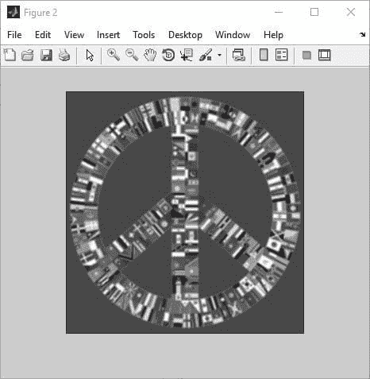
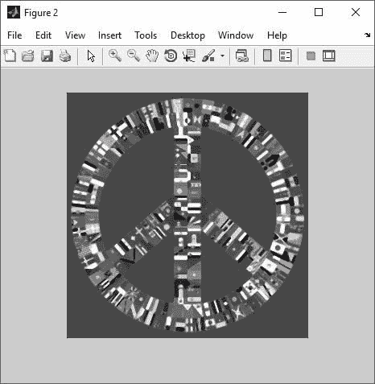

# 图像处理的 MATLAB 均值与中值算法(例)

> 原文：<https://dev.to/berkayakcay/image-processing-matlab-mean-ve-median-algoritmasi-ornek-2kp7>

在我们的范例中，使用了 3×3 滤镜和黑白影像。

> 用于处理图像和信号的方法。目的是消灭寄生虫。应用滤镜后，通过检测图像中的像素并将其与命令明显分离，可以进行清理。
> T2【莫 1】
> 
> 【莫 2】【莫 2】

### 均值滤波算法

我们的目标是：

*   以像素为单位读取您的图片。
*   平均每个像素周围距离 n 的像素值。
*   指定新图像中同一位置的像素的平均值。