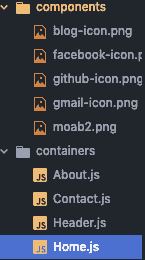
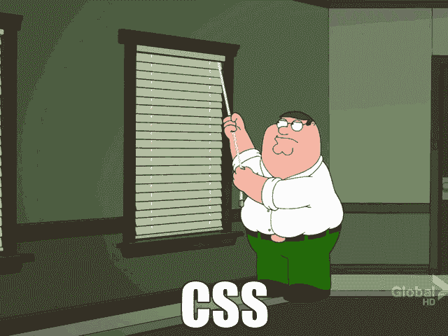

# 反应中的图像相对路径

> 原文：<https://dev.to/sofiajonsson/image-relative-path-in-react-3fci>

在我的训练营经历中，我非常依赖 bootstrap 和语义 UI 来使我的项目看起来和操作起来都符合我的要求。

当你以 100 英里/小时的速度前进时(浏览训练营的课程),没有太多时间停下来真正钻研 CSS，进入网站设计结构的本质。我决定通过使用纯 CSS 来挑战自己，以便更好地理解如何在没有语义或引导的情况下操纵屏幕显示我所想象的内容。

有这么多关于 CSS 的教程，但我决定写这篇文章，以便跟踪我遇到的困难，以便我可以在需要时返回，或者更好的是，如果我可以帮助某人远离 Q 和 A 的深黑洞，即堆栈溢出。

我遇到的第一件事是为我当前的 react 项目创建一个图像的相对路径，这花费了我大量的时间。对于那些不熟悉这个主题的人来说，相对路径指的是指向文件系统中的一个特定位置*相对于你正在处理的当前目录*(也就是说，将一个图像拖到你的项目中的一个文件中，并在那里引用它)。这在内存方面代价更大，所以对于我的大多数项目，我都使用外部 web 图像(google 图像)的绝对路径。
无论如何，我对此感到很紧张，因为这是*这样的*一件简单的事情，但答案却是我从未见过的。而不是查看文件结构:
 
并键入如下内容:``

我偶然发现的解决方案:

我由此得出的原因是，当你使用 Webpack(一个模块捆绑器)时，你需要为 web pack`require`一个图像来正确地处理它(或者它们，如果有多个的话)。因此外部图像工作得很好，但是相对路径将需要您`require`它们，以便像它们在 Ruby on Rails 项目中那样工作。

不用说，我很高兴有这么简单的东西，但对我的项目如此重要，最终以我预期的方式工作。我很好奇接下来会出现什么样的 CSS 障碍和解决方案，它们可能会成为另一篇博文！
 
如果你有什么想分享的，我很乐意在评论中听到！