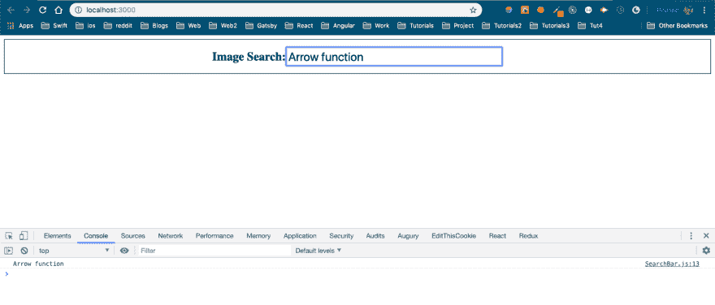
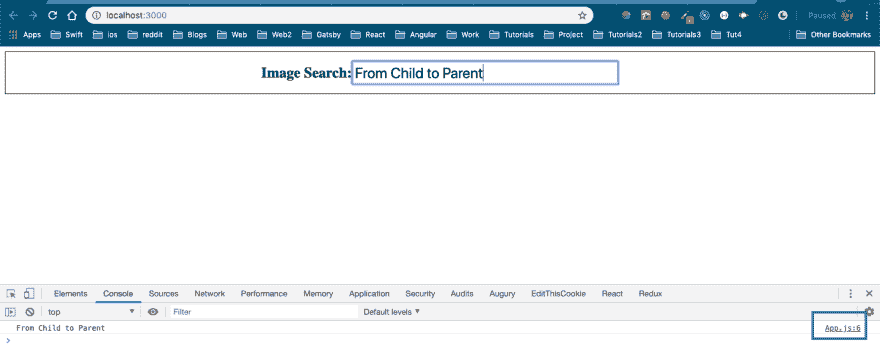
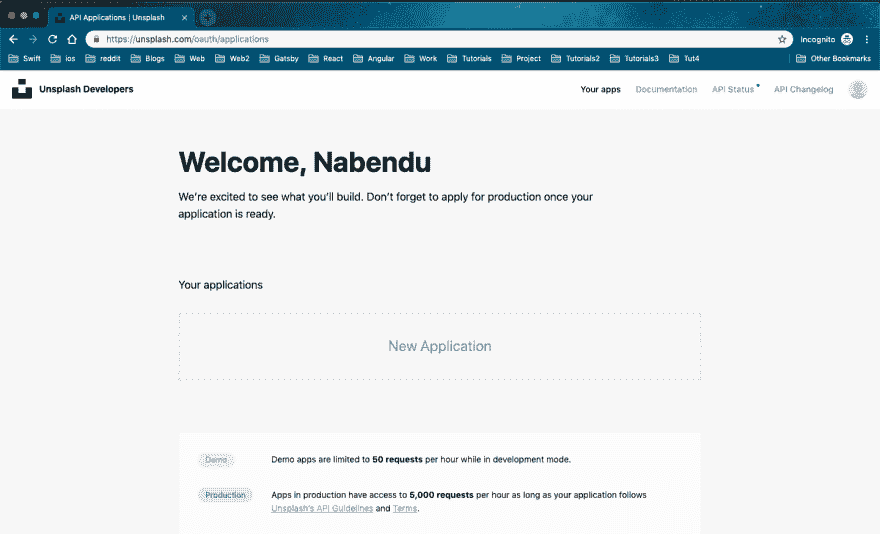
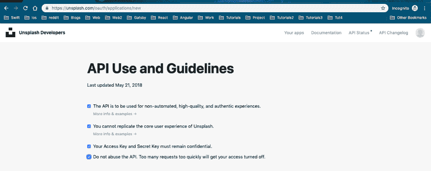
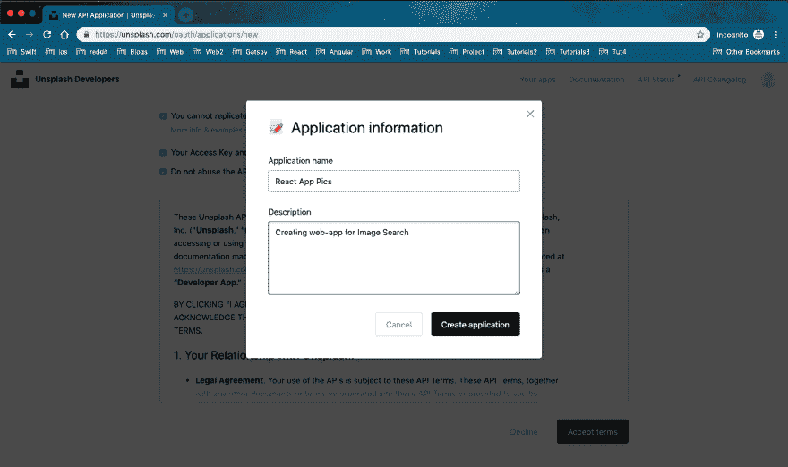
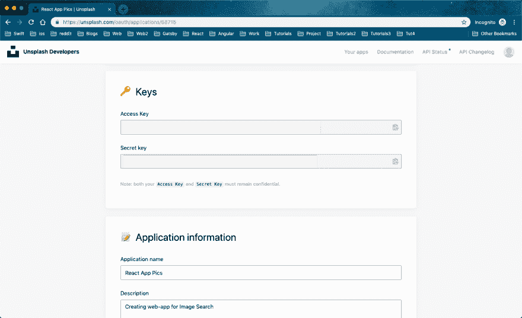
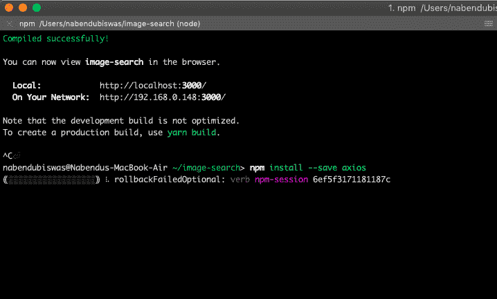
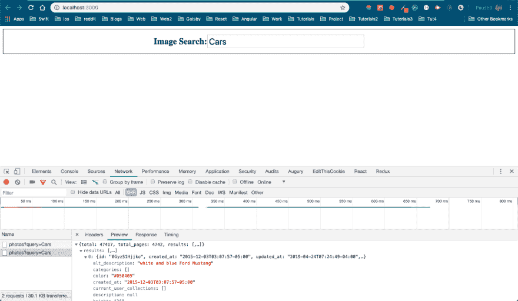

# ReactJS -2 中使用 unsplash API 的图片搜索应用程序

> 原文：<https://dev.to/nabendu82/image-search-app-using-unsplash-api-in-reactjs-2-25ih>

欢迎阅读本系列的第 2 部分。我们将从第 1 部分离开的地方开始。

我们将处理 **SearchBar.js** 文件，并使用标准的 React 语法来处理表单。

```
 import React from 'react';
    import './SearchBar.css';

    class SearchBar extends React.Component {

        state = { val: '' }

        onInputChange = (event) => {
            this.setState({ val: event.target.value })
        }

        onFormSubmit = (event) => {
            event.preventDefault();
            console.log(this.state.val);
        }

        render() {
            return (
                <div>
                    <form onSubmit={this.onFormSubmit}  className="flexContainer">
                        <label><h2>Image Search: </h2></label>
                        <input
                            className="inputStyle"
                            type="text"
                            value={this.state.val}
                            onChange={this.onInputChange}
                        />
                    </form>
                </div>
            )
        }
    }

    export default SearchBar; 
```

这整个逻辑的细节可以在我的另一篇博客文章中找到，链接是。检查**第 50 题**和**第 51 题**。

我们可以通过在搜索栏中键入任何内容并按回车键来看到这一点。它将控制台日志相同。

[ ](https://res.cloudinary.com/practicaldev/image/fetch/s--zDkDntC_--/c_limit%2Cf_auto%2Cfl_progressive%2Cq_auto%2Cw_880/https://cdn-images-1.medium.com/max/2880/1%2AIJ0KSUCJ-9TPQY_eIPJJuA.png) *魔法箭的功能*

现在，我们将开始实现使用用户输入的搜索词的逻辑。我们可以只在搜索组件中使用搜索词( *this.state.val* )，但是我们会将它传递回父应用组件。我们希望图像列表由不同的组件 image list 显示。

为此，我们将首先将我们的 **App.js** 更改为基于类的组件，因为稍后我们必须处理状态。

```
 import React from 'react';
    import SearchBar from './SearchBar';

    class App extends React.Component  {
        onSearchSubmit(term) {
            console.log(term);
        }

        render() {
            return (
                <div>
                    <SearchBar userSubmit={this.onSearchSubmit}/>
                </div>
            )
        }

    }

    export default App; 
```

在上面的代码中，新术语用粗体标记。这里，我们将一个*属性*传递给名为 **userSubmit** 的 SearchBar 组件。它调用一个回调函数 **onSearchSubmit** 。

现在在我们的 **SearchBar.js** 文件中，我们将修改 **onFormSubmit** 方法，通过道具 **userSubmit** 将用户在 **this.state.val** 中输入的搜索词发送到 App.js

```
 onFormSubmit = (event) => {
            event.preventDefault();
            this.props.userSubmit(this.state.val);
        } 
```

现在，在我们的搜索栏中输入任何内容，然后按 enter 键，我们就会从 App.js 文件中获得 console.log。这整个逻辑的细节可以在我的另一篇博文中找到，链接是[链接](https://dev.to/nabendu82/interview-preparation-react-redux-2-2ohj)。查**第 52 题。**

[ ](https://res.cloudinary.com/practicaldev/image/fetch/s--sw2V0pPk--/c_limit%2Cf_auto%2Cfl_progressive%2Cq_auto%2Cw_880/https://cdn-images-1.medium.com/max/2880/1%2AELhlxs_45zrB3NvVvSXulA.png) *控制台来自 App.js*

现在，是时候从 *unsplash api* 加载一些真实数据了。这个想法是把搜索词输入到搜索栏中并使用它。然后在 unsplash 中搜索那些图片，并在我们的应用程序中显示那些图片。

所以，去 https://unsplash.com/developers 注册成为一名开发者吧。一旦你注册，它将显示下面的页面。

[ ](https://res.cloudinary.com/practicaldev/image/fetch/s--Y_LUJVgh--/c_limit%2Cf_auto%2Cfl_progressive%2Cq_auto%2Cw_880/https://cdn-images-1.medium.com/max/2880/1%2Ab-XabJ0OUez0CshwGxXjoQ.png) * unsplash 寄存器*

现在，点击新的应用程序，它会要求一些基本的东西进行检查。勾选同下图截图。

[ ](https://res.cloudinary.com/practicaldev/image/fetch/s--aC6kLwQ6--/c_limit%2Cf_auto%2Cfl_progressive%2Cq_auto%2Cw_880/https://cdn-images-1.medium.com/max/2878/1%2A-kX3LVWQkrm8NdERhnptTg.png) *基本检查*

然后向下滚动并点击**接受条款**。它将打开下面的弹出窗口，在这里您必须输入您的**应用程序名称**和**描述**。

[ ](https://res.cloudinary.com/practicaldev/image/fetch/s--_SZmoK7r--/c_limit%2Cf_auto%2Cfl_progressive%2Cq_auto%2Cw_880/https://cdn-images-1.medium.com/max/2880/1%2AluygHbn1sjy7uxlux_RpCA.png) *接受任期*

一旦你点击**创建应用**，它将带你到完成页面。在这里你会找到**访问键**。点击剪贴板进行复制。我的是隐藏的，因为你显示创建自己的。

[ ](https://res.cloudinary.com/practicaldev/image/fetch/s--_QyHHmQt--/c_limit%2Cf_auto%2Cfl_progressive%2Cq_auto%2Cw_880/https://cdn-images-1.medium.com/max/2880/1%2ABrnILw3rF0mY8GuKN8iEZg.png) *访问键隐藏*

现在，我们将创建 AJAX 客户端来调用 unsplash API。我们将使用流行的第三方库 axios 作为我们的 AJAX 客户端。我们必须先安装 axios，所以请前往您的终端。通过按下 *Ctrl+c* 关闭正在运行的应用程序(npm 启动),并键入 *npm install — save axios*

[ ](https://res.cloudinary.com/practicaldev/image/fetch/s--me428WQw--/c_limit%2Cf_auto%2Cfl_progressive%2Cq_auto%2Cw_880/https://cdn-images-1.medium.com/max/2000/1%2Akwzz1iX-oAxkWG0aeRGCtQ.png) *轴安装*

不要忘记通过 **npm start** 再次启动应用程序

现在，我们将转到我们的 App.js 并使用 axios 对 unsplash 进行 API 调用。

```
 import React from 'react';
    import axios from 'axios';
    import SearchBar from './SearchBar';

    class App extends React.Component  {
        onSearchSubmit(term) {
            axios.get('https://api.unsplash.com/search/photos', {
                params: { query: term},
                headers: {
                    Authorization: 'Client-ID YOUR_ACCESS_KEY'
                }
            })
        }

        render() {
            return (
                <div>
                    <SearchBar userSubmit={this.onSearchSubmit}/>
                </div>
            )
        }

    }

    export default App; 
```

这里，我们先导入 axios。然后我们使用 *axios.get* 方法。https://api.unsplash.com/search/photos[的终点](https://api.unsplash.com/search/photos)等细节来自 unsplash api [文档](https://unsplash.com/documentation)。

在上面的代码中，使用你在 unsplash 站点创建应用程序时得到的**访问键**来代替 **YOUR_ACCESS_KEY** 。

现在转到您的 [http://localhost:3000/](http://localhost:3000/) 并打开开发人员控制台。在开发者控制台中，打开*网络标签*。现在搜索任何项目，你会看到一个网络请求，如下图所示。

[ ](https://res.cloudinary.com/practicaldev/image/fetch/s--XrSjc_Mm--/c_limit%2Cf_auto%2Cfl_progressive%2Cq_auto%2Cw_880/https://cdn-images-1.medium.com/max/2880/1%2ABGZC7aJ32w6I2SXL8Bv9FQ.png) *网络请求。*

本系列的第 2 部分到此结束。