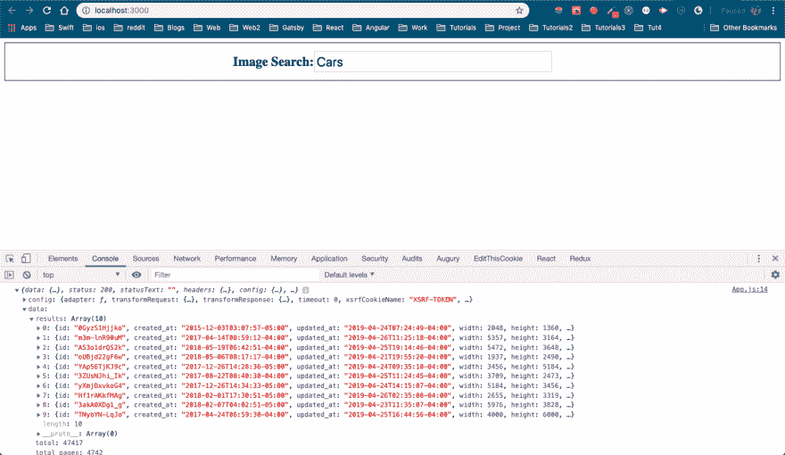
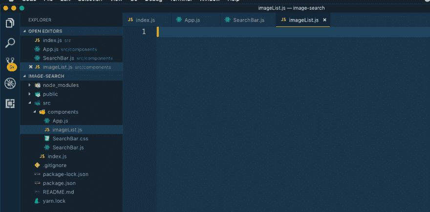
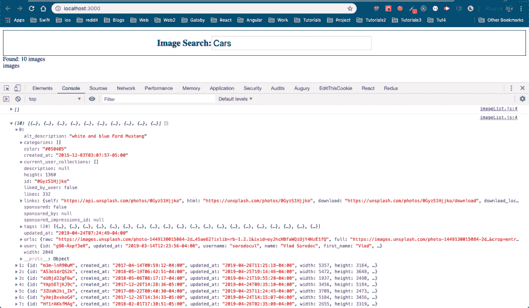

# ReactJS -3 中使用 unsplash API 的图片搜索应用程序

> 原文：<https://dev.to/nabendu82/image-search-app-using-unsplash-api-in-reactjs-3-29o2>

欢迎来到本系列的第 3 部分。我们将从第 2 部分离开的地方开始。

第 2 部分中使用 axios 的网络请求是一个异步请求。这是因为到达 unsplash 并获得我们的图像列表需要一些时间。

axios 请求总是返回给我们一个*承诺*。现在，有一种老方法可以使用。*然后是*功能。但是我们将使用新的更有效的*异步等待*语法。

因此，我们通过在前面添加**异步**来更新我们的 *onSearchSubmit* 函数。接下来，我们在 *axios.get* 方法的前面添加 **await** ，这实际上会导致 api 调用，并且需要一些时间。

```
 async onSearchSubmit(term) {
            const response = await axios.get('https://api.unsplash.com/search/photos', {
                params: { query: term},
                headers: {
                    Authorization: 'Client-ID YOUR_ACCESS_KEY'
                }
            })

            console.log(response);
        } 
```

现在，当我们搜索任何术语时，都会得到一个由 unsplash api 返回的对象。我们只将它存储在**响应**变量中，然后控制台记录它。

[ ](https://res.cloudinary.com/practicaldev/image/fetch/s--1rt1WQfS--/c_limit%2Cf_auto%2Cfl_progressive%2Cq_auto%2Cw_880/https://cdn-images-1.medium.com/max/2880/1%2AhL1iX_pdIqIs9MMvyl0nbA.png) * Unsplash 结果*

经过进一步验证，我们可以看到我们的图像列表在 data.result 数组中。我们现在将状态引入我们的应用程序组件。我们将初始化 state 以包含一个空数组 **images** ，然后使用 setState 用我们从 unsplash 获得的 **data.results** 数组来更新它。

```
 class App extends React.Component  {
        state = { images: [] };

        onSearchSubmit = async (term) => {
            const response = await axios.get('https://api.unsplash.com/search/photos', {
                params: { query: term},
                headers: {
                    Authorization: 'Client-ID YOUR_ACCESS_KEYS'
                }
            })

            this.setState({ images: response.data.results })
        }

        render() {
            return (
                <div>
                    <SearchBar userSubmit={this.onSearchSubmit}/>
                    <span>Found: {this.state.images.length} images</span>
                </div>
            )
        }

    } 
```

我们可能还记得，每当我们在 React 中使用 setState 时，它都会重新呈现组件，包括它的子组件。

在上面的代码中还有一点需要注意的是，我们将 **onSearchSubmit** 改为了一个箭头函数。这是必需的，否则，由于**设置状态**中使用的**这个**，我们将得到一个错误。

是时候创建我们的 imageList 组件了。在组件目录下创建文件 **imageList.js** ，如下图所示。

[ ](https://res.cloudinary.com/practicaldev/image/fetch/s--8HalLZiR--/c_limit%2Cf_auto%2Cfl_progressive%2Cq_auto%2Cw_880/https://cdn-images-1.medium.com/max/2124/1%2AeukLKq_RIzc4yR9DJ0dt9Q.png) * imageList 组件*

我们现在将在 App.js 中进行更改，以包含此 ImageList 组件。这里我们只是简单地传递所有图像的列表，它在一个数组中。

```
 import React from 'react';
    import axios from 'axios';
    import SearchBar from './SearchBar';
    import ImageList from './imageList';

    class App extends React.Component  {
        state = { images: [] };

        onSearchSubmit = async (term) => {
            const response = await axios.get('https://api.unsplash.com/search/photos', {
                params: { query: term},
                headers: {
                    Authorization: 'Client-ID YOUR_ACCESS_KEYS'
                }
            })

            this.setState({ images: response.data.results })
        }

        render() {
            return (
                <div>
                    <SearchBar userSubmit={this.onSearchSubmit}/>
                    <span>Found: {this.state.images.length} images</span>
                    <ImageList foundImages={this.state.images} />
                </div>
            )
        }

    }

    export default App; 
```

让我们首先构建一个基本的 imageList 组件，看看我们在道具中得到什么。

```
 import React from 'react';

    const ImageList = (props) => {
        console.log(props.foundImages);

        return (
            <div>images</div>
        )
    }

    export default ImageList; 
```

在搜索*汽车*时，我们会看到一系列的对象。它包含 url、描述和 id，我们将需要接下来显示图像。

[ ](https://res.cloudinary.com/practicaldev/image/fetch/s--iV8lW34o--/c_limit%2Cf_auto%2Cfl_progressive%2Cq_auto%2Cw_880/https://cdn-images-1.medium.com/max/2880/1%2A3f_H8IZFS_iri09GqVE_fw.png) *阵列的对象*

因此，我们将 **imageList.js** 的代码改为使用 **props.foundImages** 数组。我们使用 javascript map 来浏览它。然后，我们通过将 urls.regular 分配给 src 来显示图像。

注意，我们还需要给出 key，它应该是一个惟一的值，也是一个 alt 标签。如果我们不给他们中的任何一个，那么 React 将在控制台中给出警告。

```
 import React from 'react';

    const ImageList = (props) => {
        const imgs = props.foundImages.map(img => {
            return 
        });

        return (
            <div>{imgs}</div>
        )
    }

    export default ImageList; 
```

现在，前往 localhost，再次搜索*汽车*，你将从 unsplash 获得漂亮汽车的图片。

[ ](https://res.cloudinary.com/practicaldev/image/fetch/s--V6xy88QR--/c_limit%2Cf_auto%2Cfl_progressive%2Cq_auto%2Cw_880/https://cdn-images-1.medium.com/max/2880/1%2A3lp8yNp_Umx6zhEsErmo6w.png) *漂亮汽车*

本系列的第 3 部分到此结束。我们也完成了 web 应用程序的第 1 版。

但是我们也将有一个版本 2，它将以一种很好的方式显示这些图像。