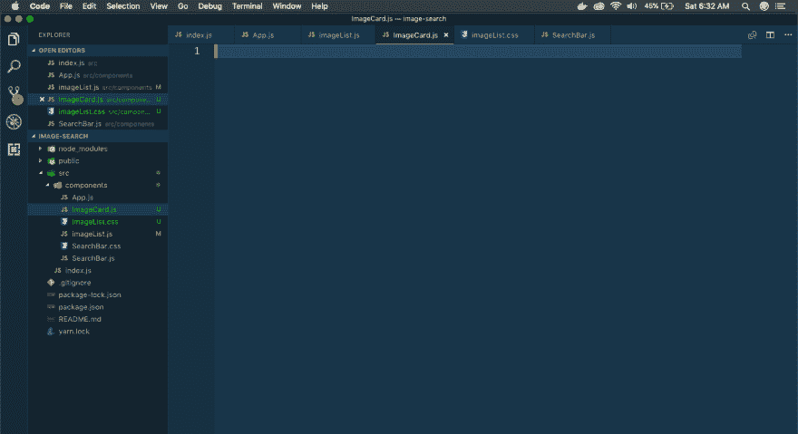
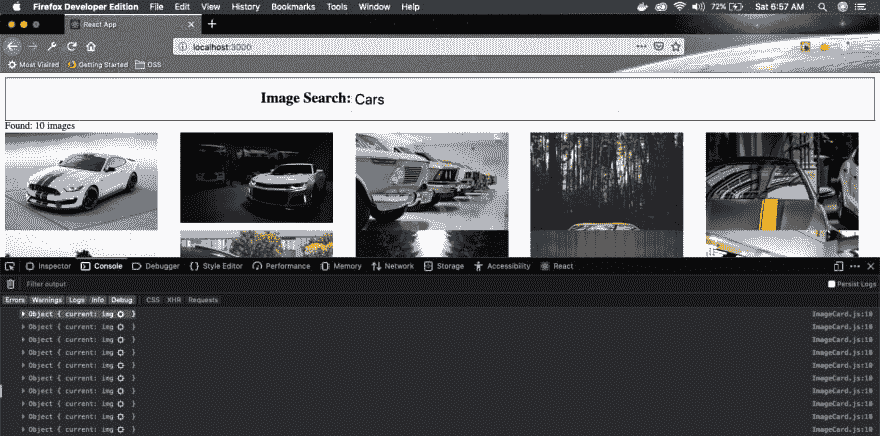
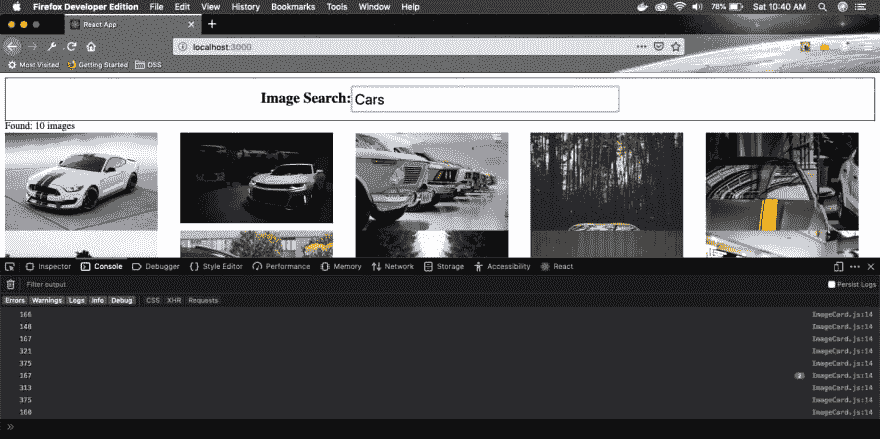

# ReactJS -4 中使用 unsplash API 的图片搜索应用程序

> 原文：<https://dev.to/nabendu82/image-search-app-using-unsplash-api-in-reactjs-4-336d>

欢迎来到本系列的第 4 部分。在第 3 部分中，我们已经完成了应用程序的第 1 版。在这里，我们将开始制作第二版，其中的图像将平铺得更好。为此，我们将使用 CSS 网格的魔力和 React Ref。

我们将首先从 CSS 网格开始。为了应用网格，让我们添加一个类 **image__list** 到包含图像列表的`<div>`中。另外，在同一个目录下创建一个文件 **imageList.css** 。

```
 import React from 'react';
    import './imageList.css';

    const ImageList = (props) => {
        const imgs = props.foundImages.map(img => {
            return 
        });

        return (
            <div className="image__list">{imgs}</div>
        )
    }

    export default ImageList; 
```

接下来，我们将添加一些基本的 CSS 网格到我们的 **imageList.css** 文件中。这里，我们给出的规则是每列 250px 宽或 1fr(网格中的特殊单位)。

```
 .image__list{
        display: grid;
        grid-template-columns: repeat(auto-fill, minmax(250px, 1fr));
        grid-gap: 10px;
    }

    .image__list img{
        width: 250px;
    } 
```

前往 localhost，看看 CSS 网格的魔力。

[ ](https://res.cloudinary.com/practicaldev/image/fetch/s--1_IzL1ZS--/c_limit%2Cf_auto%2Cfl_progressive%2Cq_auto%2Cw_880/https://cdn-images-1.medium.com/max/2880/1%2AEkRj8RGQPaqoktbgr-84RQ.png) *格子魔法*

现在，你可以从上面的截图中看到，一切都不美好。在垂直方向上，较大的图像跨度更大，因此在较小的图像中创造了一个丑陋的空间。

我们将通过使用 **grid-row-end** 来解决这个问题，但是我们不知道每个图像的垂直跨度是多少。为此，我们将使用 JavaScript。

首先，我们将为 image 制作一个单独的组件 **ImageCard** 。它会负责展示每一张图片。

[ ](https://res.cloudinary.com/practicaldev/image/fetch/s--5LALp_2r--/c_limit%2Cf_auto%2Cfl_progressive%2Cq_auto%2Cw_880/https://cdn-images-1.medium.com/max/2880/1%2AgAp0QTVE8-jgFVquTc4Olg.png) * ImageCard 组件*

我们现在将创建我们的 ImageCard 组件。打开 **ImageCard.js** ，添加以下代码。

```
 import React, { Component } from 'react';

    class ImageCard extends Component {
      render() {
        return (
          <div>
              
          </div>
        )
      }
    }

    export default ImageCard; 
```

在这里，我们只是简单地将所有的逻辑转移到这个组件上来显示一个``标签。接下来，我们前往 **ImageList.js** 来修改代码以显示这个组件。我们的修改用粗体标出。

```
 import React from 'react';
    import './imageList.css';
    import ImageCard from './ImageCard';

    const ImageList = (props) => {
        const imgs = props.foundImages.map(img => {
            return <ImageCard key={img.id} image={img} />
        });

        return (
            <div className="image__list">{imgs}</div>
        )
    }

    export default ImageList; 
```

现在，我们将使用 JavaScript 进入 DOM 并计算出每张图片的高度。现在，为了在 React 中访问 DOM，我们使用 ref 系统。

让我们将 ref 系统添加到 **ImageList.js** 中。这里，我们添加了一个构造函数，通过 **React.createRef()** 方法创建一个 Ref。然后，我们通过 **ref={this.imageRef}** 将其赋给 imag 标签。

现在，我们使用 **componentDidMount** 来访问它。正如我们所知，componentDidMount 生命周期方法在 DOM 呈现后运行。

```
 import React, { Component } from 'react';

    class ImageCard extends Component {
        constructor(props) {
            super(props);
            this.imageRef = React.createRef();
        }

        componentDidMount() {
            console.log(this.imageRef);
        }

        render() {
            return (
                <div>
                    
                </div>
            )
        }
    }

    export default ImageCard; 
```

现在，在 localhost 和开发人员控制台中打开应用程序。在这里，我们将看到控制台中显示了 10 幅图像。

[](https://res.cloudinary.com/practicaldev/image/fetch/s--fgIswkkr--/c_limit%2Cf_auto%2Cfl_progressive%2Cq_auto%2Cw_880/https://cdn-images-1.medium.com/max/2880/1%2AFO20dgF5gZQ4rr5srUZB3w.png)*img 访问*

现在，打开一个呈现的  标记，您将看到 **clientHeight** 属性。这个属性告诉我们每个图像的高度。我们将使用它来修复我们的应用程序。

[](https://res.cloudinary.com/practicaldev/image/fetch/s---8v5eOWP--/c_limit%2Cf_auto%2Cfl_progressive%2Cq_auto%2Cw_880/https://cdn-images-1.medium.com/max/2880/1%2AWAaP4QU156sNaJ8vFBMviA.png)

 **从上面的截图中可以清楚地看到， *clientHeight* 可以作为*this . imageref . current . client height*来访问，因此将其放入控制台日志中。

```
 componentDidMount() {
            console.log(this.imageRef);
            console.log(this.imageRef.current.clientHeight);
        } 
```

再次搜索时，我们应该看到图像高度。但是我们看到的是零(0)。

[ ](https://res.cloudinary.com/practicaldev/image/fetch/s--9iaHhkEr--/c_limit%2Cf_auto%2Cfl_progressive%2Cq_auto%2Cw_880/https://cdn-images-1.medium.com/max/2880/1%2ApGnTNRJ0tGES4RcO1Z6R3g.png) *意想不到的*

这是因为我们在控制台中看到的 DOM 元素( *this.imageRef* )当时没有关于图像的完整信息。它只在我们展开元素并由浏览器完成后获取信息。

为了解决这个问题，我们必须像下面的代码一样通过 eventlistner 的路径。

```
 componentDidMount() {
            this.imageRef.current.addEventListener('load', this.setSpans);
        }

        setSpans = () => {
            console.log(this.imageRef.current.clientHeight);
        } 
```

这里，我们已经将事件监听器添加到当前对象中。然后当图像被加载时，我们调用一个方法 *setSpans()* 。

再次搜索时，我们可以正确地看到图像的高度。

[ ](https://res.cloudinary.com/practicaldev/image/fetch/s--vEZVeMfA--/c_limit%2Cf_auto%2Cfl_progressive%2Cq_auto%2Cw_880/https://cdn-images-1.medium.com/max/2880/1%2A_PoKCbzbZ6YKdCmcvBX7ZQ.png) *图像高度*

在开始我们的 ***grid-row-end*** 数学之前，我们必须对我们的 **imageList.css** 文件做一个小小的修改。我们将添加一个属性 **grid-auto-rows** ，并将其设置为 150px。它指定每行的高度为 150 像素。

```
 .image__list{
        display: grid;
        grid-template-columns: repeat(auto-fill, minmax(250px, 1fr));
        grid-gap: 10px;
        grid-auto-rows: 150px;
    }

    .image__list img{
        width: 250px;
    } 
```

接下来我们将开始数学课。在这里，我们将我们的身高除以 150。值 150 是我们的行高，因此它将给出跨度数。

现在，我们有一个状态变量**跨越**。然后我们在 **setSpans** ()内部做一个 **this.setState** 。

```
 class ImageCard extends Component {
        constructor(props) {
            super(props);
            this.state = { spans: 0 };
            this.imageRef = React.createRef();
        }

        componentDidMount() {
            this.imageRef.current.addEventListener('load', this.setSpans);
        }

        setSpans = () => {
            const height = this.imageRef.current.clientHeight;
            const spansRows = Math.ceil(height / 150 );
            this.setState({ spans: spansRows });
        }

        render() {
            return (
                <div style={{gridRowEnd: `span ${this.state.spans}`}}>
                    
                </div>
            )
        }
    } 
```

接下来，我们将在 CSS 网格属性 **grid-row-end: span** `<Number>`中使用它。现在，该属性将根据值展开每一行。

让我们在 localhost 中再次进行搜索。另外，打开开发人员控制台。您可以看到每个网格元素现在都有一个类似于 **grid-row-end: span 2** 的属性

[ ](https://res.cloudinary.com/practicaldev/image/fetch/s--tkGMwvP---/c_limit%2Cf_auto%2Cfl_progressive%2Cq_auto%2Cw_880/https://cdn-images-1.medium.com/max/2880/1%2A3oepT2TR0qp6GVlofz1W-g.png) ** *网格-行-结束:跨度***

从上面的截图来看，情况并不完全好。这是因为 150 像素的高度太大了，而且对于某些图像来说，它创造了太多的空白。为了解决这个问题，我们将首先在 **imageList.css** 中做一些小的调整

在这里，我们使每行 10px，并消除了行之间的差距。**位置-项目:中心；**就是把一切都完美的居中。

```
 .image__list{
        display: grid;
        grid-template-columns: repeat(auto-fill, minmax(250px, 1fr));
        grid-gap: 0 5px;
        grid-auto-rows: 10px;
        place-items:center;
    } 
```

接下来在 ImageCard.js 中我们也做了同样的调整。现在我们不是除以 150，而是除以 10。

```
 setSpans = () => {
            const height = this.imageRef.current.clientHeight;
            const spansRows = Math.ceil(height / 10 );
            this.setState({ spans: spansRows });
        } 
```

这将导致更多的跨度，但会解决我们的问题。

[ ](https://res.cloudinary.com/practicaldev/image/fetch/s--RXuWRtsG--/c_limit%2Cf_auto%2Cfl_progressive%2Cq_auto%2Cw_880/https://cdn-images-1.medium.com/max/2880/1%2ARfH3L72h35mfXrCRjMJOxg.png) *问题修复*

这就完成了我们的迷你项目。希望你喜欢。你可以在这里找到 github 链接[。](https://github.com/nabendu82/image-search)

它也部署在 Netlify 中，这里的链接是。**