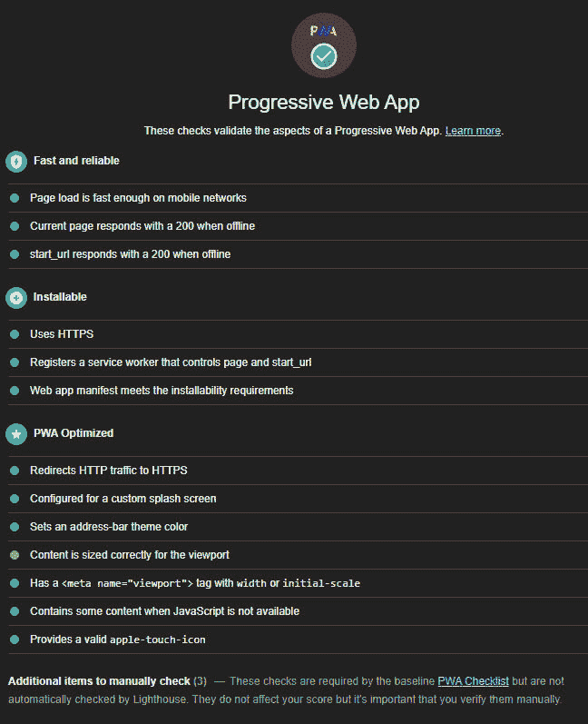
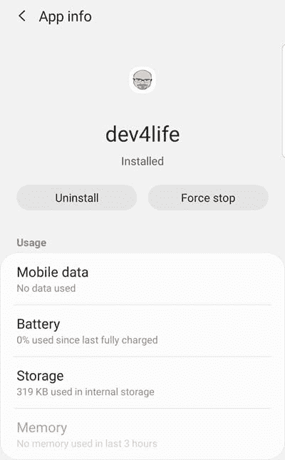
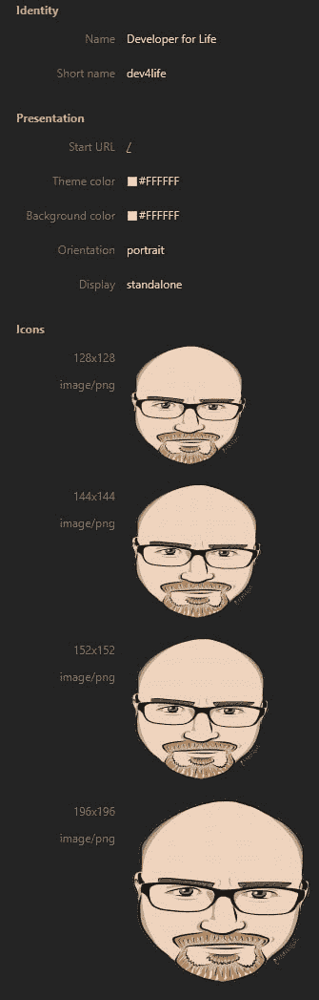
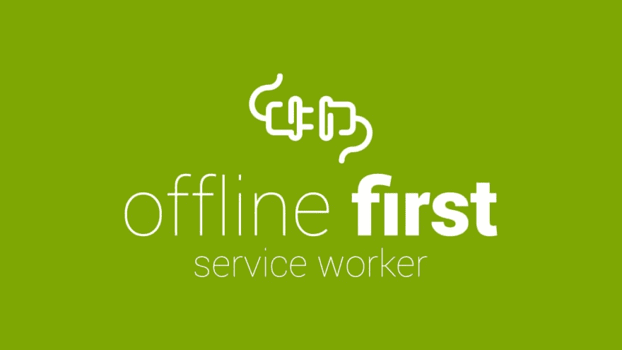
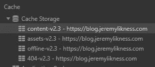
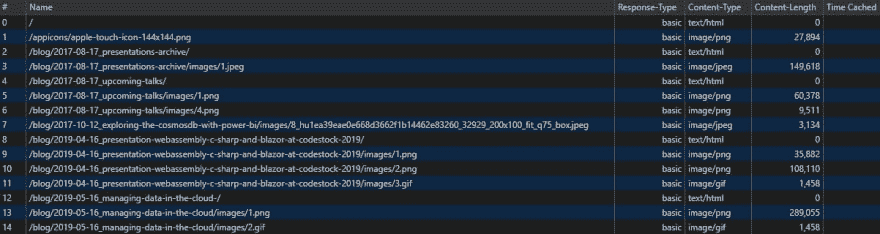
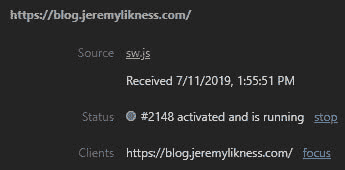

# 在你的静态网站中实现一个渐进式网络应用程序(PWA)

> 原文：<https://dev.to/jeremylikness/implement-a-progressive-web-app-pwa-in-your-static-website-h44>

[](https://res.cloudinary.com/practicaldev/image/fetch/s--nIArnrQs--/c_limit%2Cf_auto%2Cfl_progressive%2Cq_auto%2Cw_880/https://blog.jeremylikness.com/blog/implement-progressive-web-app-huimg/pwa.jpg)

我迁移到 Hugo 的最后一步是实现一个[渐进式 Web 应用](https://developers.google.com/web/progressive-web-apps/)(简称 PWA)。我想实施 PWA 有几个原因:

1.  它允许用户(并提示他们)将网站作为应用程序安装在他们的移动设备上。
2.  将来，我可以使用推送通知来通知用户新的内容。
3.  它支持离线模式，因此当互联网关闭时，用户仍然可以浏览和阅读。
4.  它缓存内容，以提供更快、更灵敏的体验。

<figure>[](https://res.cloudinary.com/practicaldev/image/fetch/s--qGkhwKbC--/c_limit%2Cf_auto%2Cfl_progressive%2Cq_auto%2Cw_880/https://blog.jeremylikness.com/blog/implement-progressive-web-app-huimg/app.jpg) 

<figcaption>开发者终身 App</figcaption>

</figure>

如果你对这些功能感兴趣，PWA 可能就是你要找的！

## 什么是 PWA？

最初是为移动设备设计的(我说*最初是*因为现在支持桌面 PWA)，PWA 是一种特殊类型的移动应用程序，使用传统的 web 技术如 HTML、CSS 和 JavaScript 构建。所有现代浏览器都支持 PWAs。它们被称为“渐进式”，因为从根本上讲，它们的行为就像浏览器中的普通网页一样，但一旦安装，就可以逐步添加新功能，如与硬件交互和管理推送通知。PWA 的最低要求是一个清单和一个服务人员。

## 载货单

这是开发者生命的清单。

```
{  "name":  "Developer for Life",  "short_name":  "dev4life",  "icons":  [  {  "src":  "/appicons/favicon-128.png",  "sizes":  "128x128",  "type":  "image/png"  },  {  "src":  "/appicons/apple-touch-icon-144x144.png",  "sizes":  "144x144",  "type":  "image/png"  },  {  "src":  "/appicons/apple-touch-icon-152x152.png",  "sizes":  "152x152",  "type":  "image/png"  },  {  "src":  "/appicons/favicon-196x196.png",  "sizes":  "196x196",  "type":  "image/png"  },  {  "src":  "/appicons/splash.png",  "sizes":  "512x512",  "type":  "image/png"  }  ],  "start_url":  "/",  "display":  "standalone",  "orientation":  "portrait",  "background_color":  "#FFFFFF",  "theme_color":  "#FFFFFF"  } 
```

它包含一些基本信息，如安装应用程序时显示什么图标、使用什么颜色、起始页是什么以及默认方向应该是什么。它安装在您网站的根目录下。这个链接将下载开发者终身清单: [manifest.json](https://blog.jeremylikness.com/manifest.json) 。

一旦安装了清单，您就可以在“应用程序”选项卡下的开发工具中查看它。

<figure>[](https://res.cloudinary.com/practicaldev/image/fetch/s---RbFG4Yy--/c_limit%2Cf_auto%2Cfl_progressive%2Cq_auto%2Cw_880/https://blog.jeremylikness.com/blog/implement-progressive-web-app-huimg/manifest.jpg) 

<figcaption>载货单</figcaption>

</figure>

为了生成图标，我使用了免费的在线工具[favicomatic.com](https://favicomatic.com)。

## 服务人员

PWA 最关键的部分是相关的[服务人员](https://developers.google.com/web/fundamentals/primers/service-workers/)。这是一个特殊的 JavaScript 应用程序，由浏览器或您的移动设备注册以管理网站。出于安全考虑，服务人员的工作范围仅限于他们所在的域。您不能为您的服务人员引用来自另一个域的 JavaScript，并且服务人员不能直接修改页面。相反，它们作为代理来帮助整理请求。如果您将您的服务人员放在`mydomain.com/serviceworker/code.js`处，它将只能访问在`mydomain.com/serviceworker`下提供的页面。因此，它通常安装在根位置。

我创建了一个在页脚引用的部分模板。它包含这个代码:

```
if ('serviceWorker' in navigator) {
    navigator.serviceWorker
        .register('/sw.js', { scope: '/' })
        .then(() => {
            console.info('Developer for Life Service Worker Registered');
        }, err => console.error("Developer for Life Service Worker registration failed: ", err));
    navigator.serviceWorker
        .ready
        .then(() => {
            console.info('Developer for Life Service Worker Ready');
        });
} 
```

JavaScript 为服务工作者( [sw.js](https://blog.jeremylikness.com/sw.js) )注册源代码，并在准备就绪时发出控制台消息。我实现的服务工作器主要充当网络代理。它有几个主要任务:

1.  它在浏览器的缓存中获取和存储内容。这用于在在线时提供内容以实现更快的连接，以及使内容在离线时可用。
2.  当您试图在没有连接到互联网的情况下访问非缓存内容时，它会提供一个特殊的脱机页面。
3.  它根据*生存时间(TTL)* 设置刷新内容。
4.  如果检测到新版本，它会清除旧的缓存并重新开始。

我将源代码基于这里的“离线第一个服务工作者”:

##  [维尔德哈伯](https://github.com/wildhaber) / [离线-先-sw](https://github.com/wildhaber/offline-first-sw)

### 具有 404 处理、自定义离线页面和特定文件类型的最大 TTL 的服务人员示例。

<article class="markdown-body entry-content container-lg" itemprop="text">

# 服务人员示例

[](https://github.com/wildhaber/offline-first-sw/blob/master/offline-first-sw.jpg)

## 特征

*   自定义脱机页面
*   自定义 404 页面
*   总是来自网络的资源的缓存黑名单规则
*   不同文件扩展名的单独 TTL 设置，用于考虑离线优先的滚动缓存刷新
*   根据您的特定需求轻松定制
*   更新时清理旧缓存
*   自动缓存用`<link rel='index|next|prev|prefetch'>`定义的相关内容

## 安装和使用

### 安装维修工人

只需在你的根目录下复制 [**sw.js**](https://github.com/wildhaber/offline-first-sw/blob/master/sw.js) :

```
# simple wget-snippet or do it manually
# cd /your-projects-root-directory/
wget https://raw.githubusercontent.com/wildhaber/offline-first-sw/master/sw.js
```

并使用以下代码片段启动服务人员:

```
<script>
    if('serviceWorker' in navigator) {
        /**
 * Define if <link rel='next|prev|prefetch'> should
 * be preloaded when accessing this page
 */
        const PREFETCH = true;
        /**
 * Define which link-rel's should be preloaded if enabled.
 */
        const PREFETCH_LINK_RELS = ['index','next', 'prev', 'prefetch'];
        /**
 * prefetchCache
 */
        function prefetchCache() {
```

…</article>

[View on GitHub](https://github.com/wildhaber/offline-first-sw)

从上到下的代码如下:

```
const CACHE_VERSION = 2.3; 
```

当代码更改时，我会更新它，以强制刷新缓存。每当`sw.js`文件改变时，浏览器将服务人员更新到其新版本。

```
const BASE_CACHE_FILES = [
    '/',
    '/js/jquery-3.3.1.min.js',
    '/404.html',
    '/offline',
    '/css/medium.css',
    '/css/bootstrap.min.css',
    '/css/additional.css',
    '/css/custom.css',
    '/manifest.json',
   img/logo.png',
   img/jumbotron.jpg',
    '/js/mediumish.js',
    '/blog',
    '/blog/2017-08-17_upcoming-talks/',
    '/static/about',
    '/privacy'
];
const OFFLINE_CACHE_FILES = [
    '/offline/'
];
const NOT_FOUND_CACHE_FILES = [
    '/404.html'
];
const OFFLINE_PAGE = '/offline/';
const NOT_FOUND_PAGE = '/404.html'; 
```

这些文件被分组到应该被预缓存的资产中，即，即使用户不访问这些页面，也可以获取并安装这些资产。这提供了基本的离线体验。对于离线模式和未找到的页面，还有一个特殊的缓存。我选择了呈现主页面和通过导航可用的顶级页面所需的资源。

```
const CACHE_VERSIONS = {
    assets: 'assets-v' + CACHE_VERSION,
    content: 'content-v' + CACHE_VERSION,
    offline: 'offline-v' + CACHE_VERSION,
    notFound: '404-v' + CACHE_VERSION,
};
// Define MAX_TTL's in SECONDS for specific file extensions
const MAX_TTL = {
    '/': 3600,
    html: 43200,
    json: 43200,
    js: 86400,
    css: 86400,
}; 
```

这段代码建立了四个独立的缓存来保存资产(图像、CSS 文件、脚本)、内容(实际页面)、离线页面和“未找到”页面。它还以秒为单位建立默认的“生存时间”。您可以在开发人员工具中查看缓存:

<figure>[](https://res.cloudinary.com/practicaldev/image/fetch/s--mLBvGMC5--/c_limit%2Cf_auto%2Cfl_progressive%2Cq_auto%2Cw_880/https://blog.jeremylikness.com/blog/implement-progressive-web-app-huimg/cache.jpg) 

<figcaption>缓存</figcaption>

</figure>

您还可以深入每个缓存的内容。这是我的内容缓存:

<figure>[](https://res.cloudinary.com/practicaldev/image/fetch/s--goXLwieS--/c_limit%2Cf_auto%2Cfl_progressive%2Cq_auto%2Cw_880/https://blog.jeremylikness.com/blog/implement-progressive-web-app-huimg/cachecontents.jpg) 

<figcaption>缓存内容</figcaption>

</figure>

接下来的几个方法是内部实用程序，用于计算文件扩展名和确定缓存是否过期。一个重要的设置是`CACHE_BLACKLIST`。我将它实现为一个简单的函数。

```
const CACHE_BLACKLIST = [
   (str) => !str.startsWith('https://blog.jeremylikness.com')
]; 
```

这确保了我不会缓存不是由我自己的网站提供的内容。我基本上禁止任何不属于我的领域。这意味着像外部广告这样的东西在离线模式下无法工作，这完全没问题。

> **⭐提示:**你可以添加`localhost`来允许，但我建议只在测试时这样做。如果您永久保留它，您将不得不在编辑新文章时手动刷新页面。自动刷新将提供缓存页面，而不是您的最新编辑。用`CTRL+F5`强制刷新很容易，但我更喜欢在测试结束后删除`localhost`。

安装方法只是将文件预加载到各自的缓存:

```
function installServiceWorker() {
    return Promise.all(
        [caches.open(CACHE_VERSIONS.assets).then((cache) => {
            return cache.addAll(BASE_CACHE_FILES);
        }
            , err => console.error(`Error with ${CACHE_VERSIONS.assets}`, err)),
        caches.open(CACHE_VERSIONS.offline).then((cache) => {
            return cache.addAll(OFFLINE_CACHE_FILES);
        }
            , err => console.error(`Error with ${CACHE_VERSIONS.offline}`, err)),
        caches.open(CACHE_VERSIONS.notFound).then((cache) => {
            return cache.addAll(NOT_FOUND_CACHE_FILES);
        }
            , err => console.error(`Error with ${CACHE_VERSIONS.notFound}`, err))]
    )
        .then(() => {
            return self.skipWaiting();
        }, err => console.error("Error with installation: ", err));
} 
```

当检测到新版本时，调用`cleanupLegacyCache`方法。它会找到旧的缓存并删除它们。

```
function cleanupLegacyCache() {
    let currentCaches = Object.keys(CACHE_VERSIONS).map((key) => {
        return CACHE_VERSIONS[key];
    });
    return new Promise(
        (resolve, reject) => {
            caches.keys().then((keys) => {
                return legacyKeys = keys.filter((key) => {
                    return !~currentCaches.indexOf(key);
                });
            }).then((legacy) => {
                if (legacy.length) {
                    Promise.all(legacy.map((legacyKey) => {
                        return caches.delete(legacyKey)
                    })
                    ).then(() => {
                        resolve()
                    }).catch((err) => {
                        console.error("Error in legacy cleanup: ", err);
                        reject(err);
                    });
                } else {
                    resolve();
                }
            }).catch((err) => {
                console.error("Error in legacy cleanup: ", err);
                reject(err);
            });
        });
} 
```

最复杂的代码是服务人员的心脏。该应用程序基本上拦截了浏览器用来加载内容的`fetch`事件，并用一个 JavaScript 代理替换它。下面的伪代码解释了这是如何工作的。

```
Intercept request for content
Is content in cache?
Yes, is content expired?
Yes, fetch fresh content.
If fetch was successful, store it in cache and return it
If fetch was not successful, just serve cached content
No, serve cached content
No, fetch the content for the first time
If fetch had OK status, store in cache and return
Otherwise show and store "not found" page
If fetch throws exception, show offline page
Done. 
```

这是*离线优先*策略，适用于不经常改变的内容。我见过的另一个流行的实现总是获取新内容，即使它在缓存中。为了响应速度，缓存的内容会立即提供，但是会存储新的内容，以便下次访问该页面时该页面是最新的。

> 根据我到目前为止所分享的内容，你可能知道如何直接访问该网站/PWA 的离线页面，或者通过断开网络连接使其出现。我试图通过加入等离子和闪电来使它变得有趣。

## 故障排除

你可能会发现(和我一样)第一次设置时会有很多故障排除。大多数浏览器应该在开发人员工具中为您提供清单视图和服务人员信息。它通常在一个`application`标签下。

<figure>[](https://res.cloudinary.com/practicaldev/image/fetch/s--4S0dK72p--/c_limit%2Cf_auto%2Cfl_progressive%2Cq_auto%2Cw_880/https://blog.jeremylikness.com/blog/implement-progressive-web-app-huimg/serviceworker.jpg) 

<figcaption>服务人员状态</figcaption>

</figure>

您可以使用它来强制更新、取消注册等。您可以浏览您的缓存，并手动删除它开始刷新。最后，服务工作者代码本身显示在源代码列表中，您可以像调试任何其他 JavaScript 代码一样设置断点。有时，单步执行只是为了观察页面逻辑的运行情况是很有用的。我遇到的最大问题是错误地输入了预缓存文件的路径，这将导致注册问题，并最终破坏功能。

### 灯塔

[Lighthouse](https://developers.google.com/web/tools/lighthouse/) 是一款开源工具，帮助提供关于你的网站的反馈，以提高你的网页质量。它评估诸如性能、可访问性和 SEO 就绪性之类的东西。它还可以评估你的 PWA。在 Chrome 和 Insider's Edge 的开发者工具下的`audits`标签中访问 Lighthouse。我发现它对设置我的 PWA 和确保满足所有要求非常有帮助。它会自动测试一长串特性，并提供一些您可以自己执行的手动检查。

<figure>[](https://res.cloudinary.com/practicaldev/image/fetch/s--nIArnrQs--/c_limit%2Cf_auto%2Cfl_progressive%2Cq_auto%2Cw_880/https://blog.jeremylikness.com/blog/implement-progressive-web-app-huimg/pwa.jpg) 

<figcaption>灯塔 PWA 审计</figcaption>

</figure>

请注意，某些要求可能在本地失败，例如强制执行 HTTPS。我在本地机器上使用它达到了 80%,然后在实际的安全域上第一次部署它之后完成了测试。

## 总结

pwa 使最终用户更容易访问内容。如果做得好，它们会提供更快、更流畅的体验。当我在关闭服务器的情况下意外地导航到一个本地页面时，我仍然感到惊讶，我发现自己看到的不是“未找到页面”，而是离线页面。希望这些步骤能让你清楚地实现你自己的 PWA。接下来，我将研究通知，以便在新的博客文章发布时提醒用户。在那之前，我希望你喜欢这个系列！

问候，

[](https://res.cloudinary.com/practicaldev/image/fetch/s--S1KFS2BY--/c_limit%2Cf_auto%2Cfl_progressive%2Cq_66%2Cw_880/https://blog.jeremylikness.cimg/jeremylikness.gif)