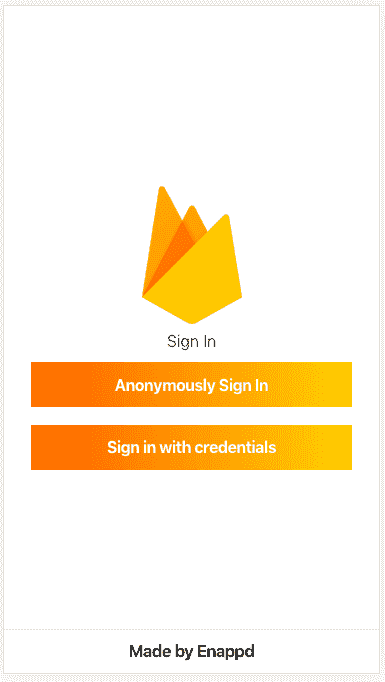
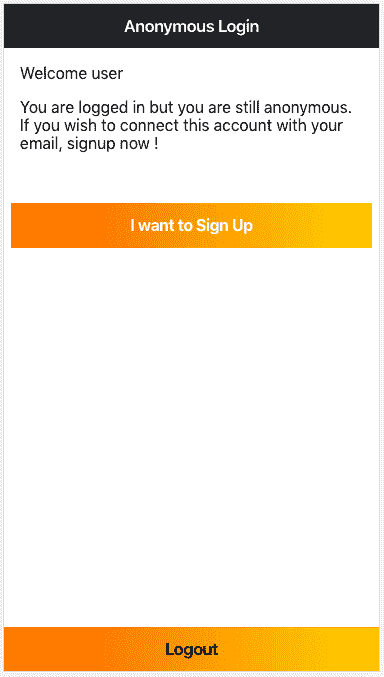
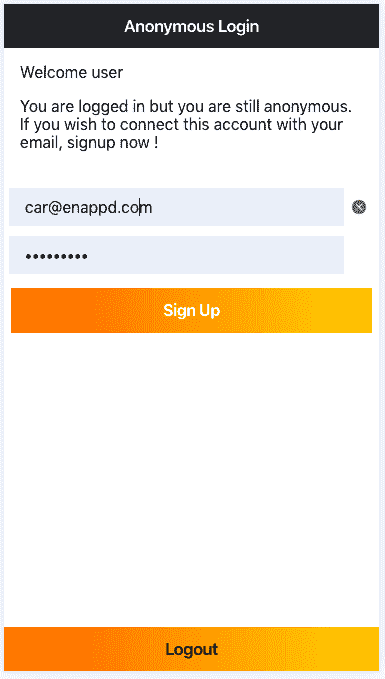
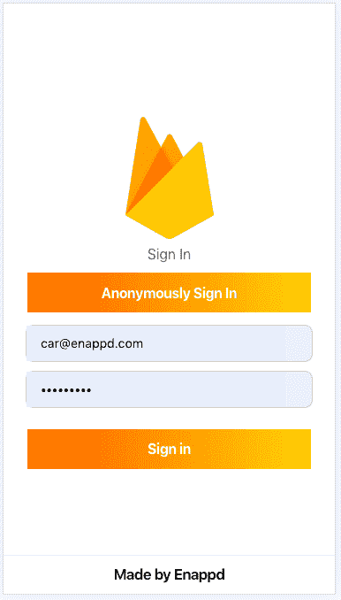

# 使用 Firebase 在 Ionic 4 应用中实现匿名登录

> 原文：<https://dev.to/enappd/implement-anonymous-login-in-ionic-4-apps-with-firebase-35mj>

* * *

在这篇文章中，你将学习如何使用 Firebase 在 Ionic 4 应用中实现匿名登录。我们还将学习如何将现有的匿名登录与一组新的电子邮件密码关联起来，这样匿名用户就可以转换为普通用户。我们将在一个简单的 Ionic 4 应用程序和测试中实现这些。

> 本教程的完整源代码可在[Ionic-4-firebase-anonymous-log in](https://github.com/enappd/ionic-4-firebase-anonymous-login)中获得

### 什么是 Firebase？

如果你不太了解 Firebase …你需要了解最新的技术新闻。Firebase 是当今市场上的热门产品。人们可以使用 Firebase 来创建快速的移动应用程序后端，具有大量内置和易于集成的功能。

Firebase 最常用的功能是作为后端。但是除了后端，Firebase 的认证特性是必须使用的。因此，本质上 Auth 成为默认情况下使用最多的特性。

#### Firebase 身份验证方法

Firebase 提供了许多登录方法——电子邮件/密码、社交登录和匿名登录。

是啊！匿名登录。听起来很奇怪，对吧？

**匿名登录**是 Firebase 提供的一种特殊类型的登录，用户不需要在他们的终端提供任何登录信息。Firebase 创建一个随机 ID，并在应用程序中登录用户。如果用户想在以后转换成普通用户，Firebase 还提供了一种将匿名帐户链接到普通凭证的方法。

也就是说，我相信你对学习使用 Firebase 的各种登录非常感兴趣。你可以在我们的[网站](http://enappd.com/blog)上使用 [**【脸书】**](https://enappd.com/blog/facebook-login-in-ionic-4-apps-using-firebase/25) 和 [**Twitter**](https://enappd.com/blog/twitter-login-in-ionic-4-apps-using-firebase/24) 博客查看我们的 Firebase 社交登录，以及免费的初学者(👻呜哇！)

### 什么是离子 4？

你可能已经知道离子，但我把它放在这里只是为了初学者。 **Ionic** 是一款完整的开源 SDK，用于混合移动应用开发。Ionic 提供使用 CSS、HTML5 和 Sass 等 Web 技术开发混合移动应用的工具和服务。应用程序可以通过这些网络技术构建，然后通过本地应用程序商店分发，安装在设备上。

换句话说——如果你在 Android 中创建本地应用程序，你就在 **Java** 中编码。如果你在 iOS 中创建原生应用，你可以在 **Obj-C** 或 **Swift** 中编码。这两种语言都很强大，但是很复杂。有了 Cordova(和 Ionic ),你可以为你的应用程序编写一段代码，它可以在 iOS 和 Android(以及 windows！)，HTML、CSS 和 JS 的简单性也是如此。

### 职位结构

我们将一步一步地探索 Firebase 的匿名登录特性。这是我的博客分解

**步骤**

1.  创建一个 Firebase 项目
2.  创建一个简单的 Ionic 4 应用
3.  将 Ionic 应用程序连接到 Firebase
4.  使用 AngularFire2 实现匿名登录
5.  将匿名用户转换为普通用户

我们有两个主要目标

1.  匿名登录用户
2.  将匿名用户链接到电子邮件/密码帐户，以便用户可以使用这些凭据登录

因为这是 Ionic 4 中的一个例子，你可以跳过第 6 步，在浏览器上完成你的测试。让我们开始吧！


<figure>

<figcaption class="imageCaption">Woah ! where did he dive in 😛</figcaption>

</figure>

### 步骤 1 —创建一个 Firebase 项目

如果你曾经使用过 Firebase，你可以跳到下一步。对于初学者，你可以通过进入 [Firebase 控制台](http://console.firebase.google.com)来创建一个 Firebase 项目(如果它要求你登录的话)。创建新项目或选择现有项目。您的 Firebase 控制台仪表板应该如下所示


<figure>

<figcaption class="imageCaption">Firebase dashboard with your projects</figcaption>

</figure>

**注意** —创建一个 Firebase 项目真的很容易，但是如果你仍然面临任何问题，请遵循[这篇博客](https://enappd.com/blog/how-to-integrate-firebase-in-ionic-4-apps/23/)的步骤 1-4

#### 启用匿名登录

一旦你的项目被创建，进入项目内部。进入**认证**页签，需要切换匿名登录**启用**


<figure>

<figcaption class="imageCaption">Enable anonymous login in Firebase</figcaption>

</figure>

### 步骤 2——创建一个简单的 Ionic 4 应用程序

> 我在[这篇博客](https://enappd.com/blog/how-to-create-an-ionic-4-app-for-beginners/13/)中已经详细报道了这个话题。

简而言之，您需要采取的步骤如下

*   确保您已经在系统中安装了 node(在这篇博文发表时是 V10.0.0)
*   使用 npm 安装**离子 cli**
*   使用`ionic start`创建 Ionic 应用程序

为了本教程，您可以创建一个`blank`启动器。运行`ionic start blank`时，将安装节点模块。安装完成后，使用在浏览器上运行您的应用程序

```
$ ionic serve
```

稍加修改，我的应用程序的登录页面看起来像这样(花哨的图标🔥，嗯)



<figure>

<figcaption class="imageCaption">Login page</figcaption>

</figure>

简单又贴心，就两个扣子

这是我们要做的

*   **用户匿名登录→转到主页**



<figure>

<figcaption class="imageCaption">Home Page</figcaption>

</figure>

*   **用户点击“我要注册”**将他/她的凭证与匿名账户关联。向用户提供电子邮件和密码字段。用户注册。



*   然后用户注销，**使用他/她连接到匿名帐户的凭证**重新登录



<figure>

<figcaption class="imageCaption">User can log back in with credentials</figcaption>

</figure>

我们将在后续步骤中看到这方面的代码

### 步骤 3-将 Ionic 应用程序连接到 Firebase

#### 复制 Firebase 配置

> *这一步的细节可以在我们的博客* [*如何在 Ionic 4 apps 中集成 Firebase*](https://enappd.com/blog/how-to-integrate-firebase-in-ionic-4-apps/23/)中找到

首先，从 Firebase 控制台复制 Firebase 配置信息，并将其粘贴到 Ionic 4 应用程序的`environment`文件中。环境文件将如下所示


为了将应用程序连接到 Firebase，并使用 Firebase 方法，我们将使用 AngularFire2 包。使用以下命令安装软件包

```
$ npm install firebase @angular/fire --save
```

在`app.module.ts`中导入 **angularFire2** 和你的`environment`