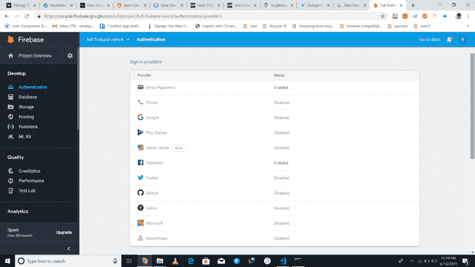
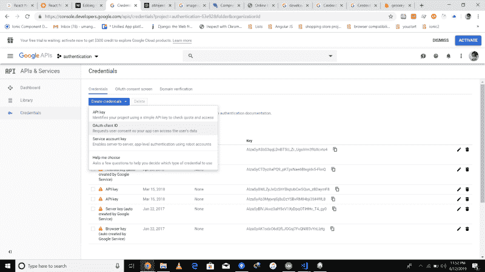
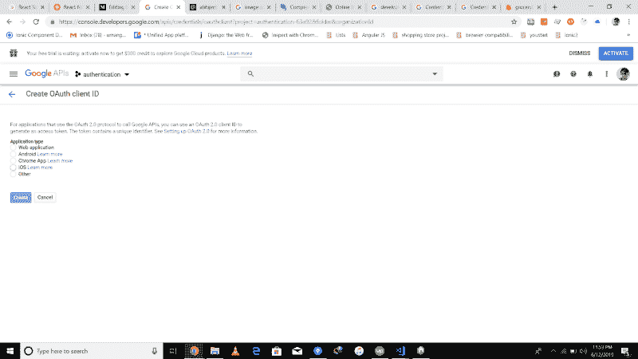
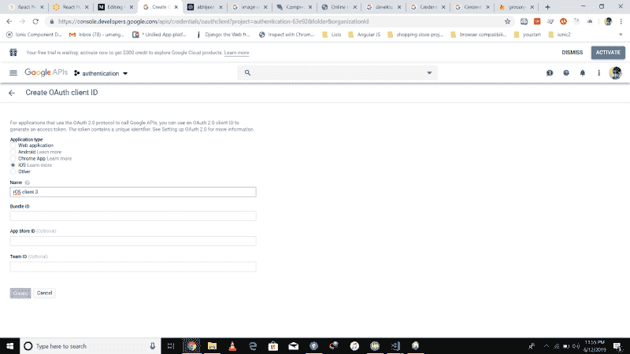
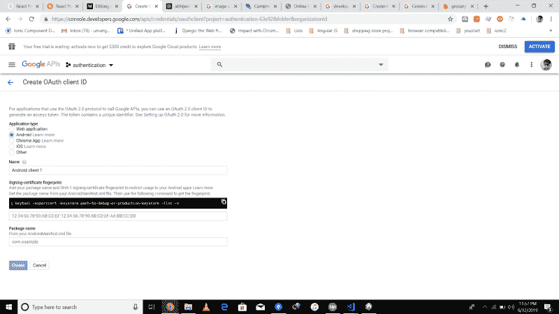
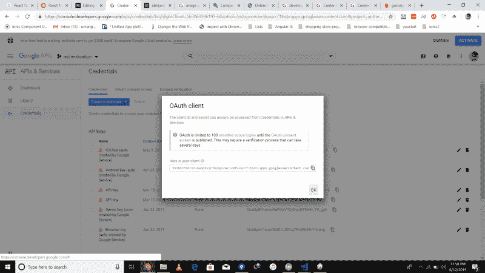
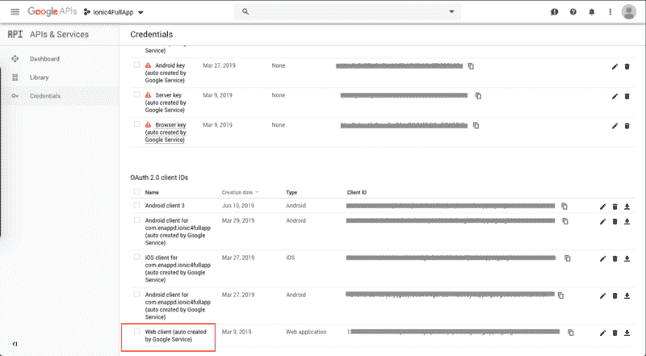
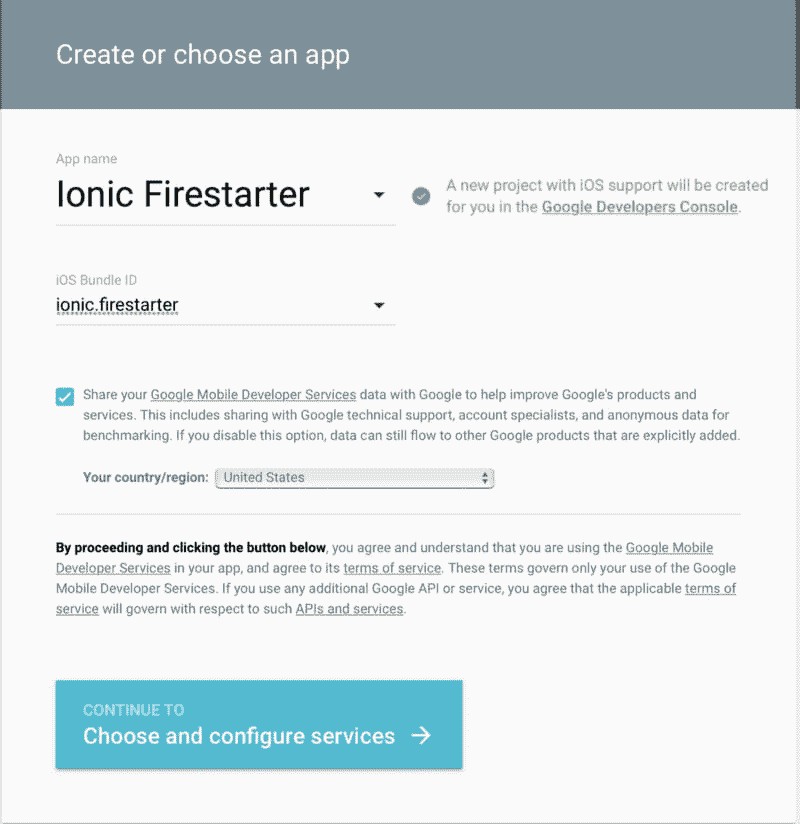
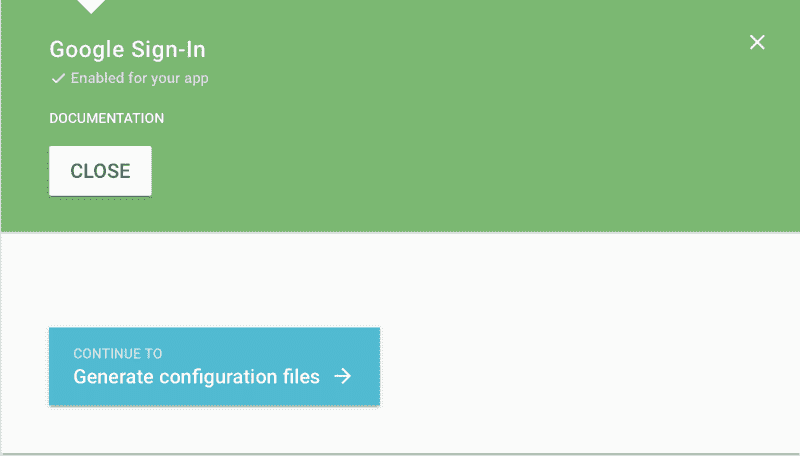
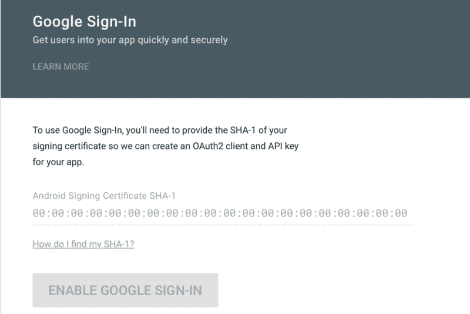

# 使用 Firebase 在 Ionic 4 应用中实现谷歌登录

> 原文：<https://dev.to/enappd/implement-google-login-in-ionic-4-apps-using-firebase-1056>

* * *

在这篇文章中，你将学习如何使用 Firebase 在 Ionic 4 应用中实现谷歌认证🔥。

我们将编写一个示例应用程序👨‍🍳，用户可以使用他们的谷歌账户登录。登录后，用户可以在主页上看到他们的基本资料信息，会话保存在 Firebase 中。

### 社交登录——什么和为什么

对于不想创建和记住另一个用户名/密码组合的用户来说，使用 Ionic 的社交登录很有帮助。相反，您可以允许用户使用他们已经拥有的帐户登录。你不需要存储散列密码进行比较，你不需要处理发送注册电子邮件，你也不需要重置密码。用户选择的提供商将为您处理所有这一切。此外，在移动应用程序中，谷歌登录是通过预装的谷歌应用程序自动完成的。

### 谷歌登录——什么和为什么

有几个原因让你应该在你的应用程序中使用谷歌登录

*   **易用性** —当新用户使用你的应用程序时，只需点击两个按钮即可使用谷歌登录。在其他情况下，用户必须输入电子邮件/密码并登录
*   **没有“忘记密码”** —当你的应用程序使用谷歌登录时，用户不必担心忘记你的应用程序的登录密码
*   **没有“验证电子邮件”** —如果您使用自己的自定义电子邮件身份验证，您必须验证该电子邮件是否有效。谷歌登录将始终有一个有效的相关电子邮件/电话号码。
*   **单一解决方案—** Google 登录允许您的用户在多台设备上使用单一登录凭证
*   **谷歌集成** —如果你的应用程序使用谷歌认证，你也可以在你的应用程序中使用谷歌 API。这可以包括获取用户推文等。
*   信任 —如今，人们普遍信任社交登录，而不是自定义电子邮件登录。社交登录遵循标准隐私协议，因此在信息共享方面更加可靠

### 离子认证

Ionic 框架已经存在了 5 年左右，因为它比 Swift / Java 更容易使用，所以在开发人员中非常受欢迎。此外，在 Ionic 4 中，你可以为 Android 和 iOS 应用程序保留一个源代码。开发商还能要求什么呢！

Ionic 4 是 Ionic 的最新版本(在撰写本文时),比以前的版本更加可靠和健壮。

Ionic 4 应用程序中有几种认证方式

*   **社交登录** —社交登录是移动应用中一种流行且简单的认证方式。你一定见过几乎所有现代应用程序中的谷歌、脸书、Instagram 登录。社交登录易于使用，对于快速集成来说更加可靠。
*   **创建自己的后端** —你可以在 Node.js、Go、Django 或者 Ruby-on-rails 中创建自己的后端，将你的 app 认证连接到自己的后端。这种方法受到需要完全控制用户身份验证的开发人员的青睐。但这种方法也是最费时间的一种。
*   **后端即服务(BaaS)——**您可以使用预建的 BaaS 平台，轻松将身份验证集成到您的应用中。基本上这些平台给你提供了一个现成的后端，你就不用自己做了。Firebase，Parse，Back4App 都是一些 BaaS 平台。 ***Firebase*** 是其中最受欢迎的移动应用，我们将在下一节研究

### 重火力点

Firebase 是一个后端即服务(BaaS)平台。它从 YC11 初创公司起步，成长为谷歌云平台上的下一代应用开发平台。它越来越受欢迎，因为它易于集成，功能多样。

Firebase 提供了许多快速集成。其中一些列举如下:

*   实时数据库
*   电子邮件认证
*   社交登录
*   应用内消息
*   推送通知
*   分析学
*   Crashlytics
*   远程配置

Firebase 正在迅速成长为最受欢迎的移动应用后端平台。

#### Firebase 身份验证选项

Firebase 不仅提供现成的电子邮件身份验证，还提供使用各种社交登录的身份验证。您可以看到 Firebase 提供的身份验证选项



<figure>

<figcaption class="imageCaption">Authentication options available in Firebase</figcaption>

</figure>

一旦 Google 登录完成，我们将使用 Firebase 来存储用户资料信息。这是首选方法，因为它对应用程序和 PWA 都是可靠的。

### 谷歌认证的步骤

我们将按照这些一步一步的说明来创建带有谷歌认证的 Ionic 4 应用程序

第一步:谷歌开发者控制台——创建你的应用

第二步:将你的平台添加到谷歌

‌Step 3:在 Firebase 项目中启用谷歌登录

‌Step 4:安装科尔多瓦谷歌插件连接你的应用程序与 Firebase

步骤 5:使用 Google 认证用户

步骤 6:在 Firebase 中存储 Google auth IdToken 和 AccessToken

步骤 7:使用 Firebase 自动登录用户

第八步:在 Android 上测试你的应用

### 第一步:谷歌开发者控制台

我们需要做的第一件事是设置我们需要从谷歌获得的一切，以使我们的应用程序工作。我们需要:

*   来自谷歌开发者控制台的一个`REVERSED_CLIENT_ID`。
*   在 Firebase 控制台中启用 Google 登录。
*   记下凭据，以便我们可以安装插件。

为了生成我们的凭证，我们需要在[谷歌开发者控制台](https://console.developers.google.com/) *中创建 iOS 和 Android 应用程序(因为我们正在使用令人敬畏的 Ionic，它从相同的代码库创建 iOS 和 Android)😎← woah 我刚斜体了一个表情符号！！)*

使用您用于 Firebase 的 Google 帐户登录(如果它要求您登录，请使用*)，然后按照说明创建应用程序。*

它会问你的第一件事是应用程序名称，一旦你开始输入，它就会搜索你的 Firebase 应用程序，选择你链接到这个项目的应用程序。

> 注意:您可以为此预先创建一个 Firebase 项目。查看[如何创建一个 Firebase 项目并链接到 Ionic 4](https://enappd.com/blog/how-to-integrate-firebase-in-ionic-4-apps/23)

在您的项目中，转到 *API 凭证*并寻找 *Web 客户端 ID* 。这将用于从登录过程中获取一个`idToken`或`serverAuthCode`，因此我们可以将它保存在 Firebase 中。

第一次，你会得到它后的凭证过程。要创建凭证，请转到 Google 控制台中的 API 凭证选项卡。

然后—创建凭据→ OAuth 客户端 ID。



然后它会问你申请类型，所以在这里选择你的申请类型。



对于 iOS 设置，您需要提供捆绑包 ID。这是默认设置为`io.ionic.starter`的`config.xml`中的值。将它更改为您喜欢的任何值，这将是您的 bundle ID。

请确保不要将其保留为默认值，如果您去应用商店，它可能会与其他类似的应用程序冲突。



将 Google sign 添加到 Android 平台的过程几乎是相同的，但有一个额外的要求。首先，点击[链接](https://developers.google.com/mobile/add?platform=android%26cntapi=signin)，开始创建你的 Android 应用。

> 需要注意的是，为了构建 Android(以及使用 cordova 插件)，你需要安装 Android 构建工具版本 19.1.0 或更高版本。

#### 获取密钥🔑

一旦安装了构建工具，并且您已经确认了这一点，那么**密钥库**应该可以获得我们在 Android 过程中需要的 SHA-1 值。密钥库用于保存您为构建的应用程序使用的签名密钥。

在终端中运行此命令以获取所需的 SHA-1 值:

```
keytool -exportcert -list -v -alias androiddebugkey -keystore ~/.android/debug.keystore
```

> **重要提示**:调试版本和发布版本的密钥库是不同的。出于测试目的，debug.keystore(缺省)运行良好。但是当您准备投入生产时，请确保对您的发布密钥库重复这些步骤。否则你会面临随机登录错误

将运行前面的命令后得到的 SHA-1 值添加到上面的输入中。

在这一步之后，点击[链接](https://developers.google.com/mobile/add?platform=android%26cntapi=signin)，添加你的 Android 项目。

再次确保您已经更改了项目的 config.xml 'id '值，使它不再是`io.ionic.starter`。



> 这里的包名是包 id

添加应用程序后，它会给你网络客户端 id



这也反映在我们的 OAuth2.0 客户端 Id 中



<figure>

<figcaption class="imageCaption">Look for Web-client ID in your project Credentials</figcaption>

</figure>

现在，点击突出显示的 Web 客户端 ID 前面的编辑按钮，如上图所示。


如果你点击网络客户端 Id，你也会得到**客户端** **秘密**。请妥善保管，以备后用。

### 第二步:将你的平台添加到谷歌

为了让 Firebase 能够与原生 Android 和 iOS 平台一起工作，我们需要为该应用程序做两种配置，每种配置都略有不同。

#### ios

在 Firebase 控制台中，创建一个 iOS 应用程序



对于 iOS 设置，您需要提供捆绑包 ID。这是默认设置为`io.ionic.starter`的`config.xml`中的值。将它更改为您喜欢的任何值，这将是您的 bundle ID。

请确保不要将其保留为默认值，如果您去应用商店，它可能会与其他类似的应用程序冲突。

设置完成后，你会得到一个 **GoogleService-Info.plist** 。将该文件保存到 Ionic 项目文件夹的根目录下。完成这些步骤后，您就大功告成了！至少对于 iOS 来说…

现在，您应该看到下面的 UI，并且已经下载了 Plist 文件，可以使用了。



#### 机器人

将 Google sign 添加到 Android 平台的过程几乎是相同的，但有一个额外的要求。首先，点击[链接](https://developers.google.com/mobile/add?platform=android%26cntapi=signin)，开始创建你的 Android 应用。

> 需要注意的是，为了构建 Android(以及使用 cordova 插件)，你需要安装 Android 构建工具版本 19.1.0 或更高版本。

#### 获取密钥🔑

一旦安装了构建工具，并且您已经确认了这一点，那么**密钥库**应该可以获得我们在 Android 过程中需要的 SHA-1 值。密钥库用于保存您为构建的应用程序使用的签名密钥。

在终端中运行此命令以获取所需的 SHA-1 值:

```
keytool -exportcert -list -v -alias androiddebugkey -keystore ~/.android/debug.keystore 
```

> **重要提示**:调试版本和发布版本的密钥库是不同的。出于测试目的，debug.keystore(缺省)运行良好。但是当您准备投入生产时，请确保对您的发布密钥库重复这些步骤。否则你会面临随机登录错误



### ‌Step 3:在 Firebase 中启用谷歌登录。

现在一切都在 Google 端设置好了，我们需要进入 Firebase 控制台并为我们的应用程序启用 Google 身份验证。

‌To 启用谷歌，你需要去[你的 Firebase 控制台](https://console.firebase.google.com/)并找到你正在使用的应用程序(或创建一个新的 Firebase 项目)

‌Once:你进入了应用的仪表盘，你将进入认证>登录方式>谷歌，然后点击启用开关。


<figure>

<figcaption class="imageCaption">Enable google-login and save Web-client ID and Secret</figcaption>

</figure>

并将你的**网络客户端 Id** 和**秘密**保存在你的 Firebase 应用程序中。

### 步骤 4:安装谷歌科尔多瓦插件

在这一步中，我们将在 Ionic 应用程序中安装 Cordova 插件。

‌For，打开你的终端，输入

```
$ ionic cordova plugin add cordova-plugin-googleplus --save --variable REVERSED_CLIENT_ID=myreversedclientid --variable WEB_APPLICATION_CLIENT_ID=mywebapplicationclientid
```

‌You'll 需要用您的真实凭据替换 REVERSED_CLIENT_ID 中的值。你可以在你的谷歌开发者仪表板中找到这两者。

‌It's 有点笨拙地使用科尔多瓦插件，所以 ionic 团队创建了 Ionic Native，这是科尔多瓦插件的包装器，所以我们可以用一种更“有角度/离子”的方式来使用它们。

‌So 现在，我们将打开我们的终端，并尝试这个 command‌安装谷歌从离子原生包

```
$   npm install --save @ionic-native/google-plus
```

#### 在你的应用中初始化 Firebase

首先，让我们创建一个 Ionic 应用程序。你既可以使用我们的 [Ionic 4 完全授权](https://store.enappd.com/product/firebase-starter-full-auth/)启动器，也可以从头开始创建自己的 Ionic 4 应用程序。这个应用程序包含所有类型的认证使用 Firebase。


<figure>

<figcaption class="imageCaption">Ionic 4 Full Auth app starter</figcaption>

</figure>

> *要了解如何从*开始*创建 Ionic app，请阅读* [*如何为初学者从头创建 Ionic 4 app*](https://enappd.com/blog/how-to-create-an-ionic-4-app-for-beginners/13/)

此外，我们需要安装@angular/fire [npm 模块](https://github.com/angular/angularfire2)，它实际上将 Firebase 功能连接到 Ionic app。要安装该模块，请运行

```
$ npm install firebase @angular/fire --save
```

另外，在`app.module.ts`中包含`environment`、`AngularFireModule`和`AngularFireAuthModule`