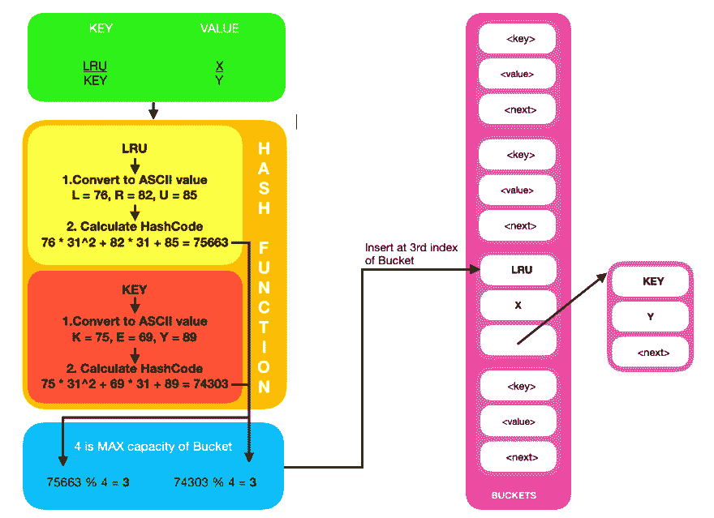
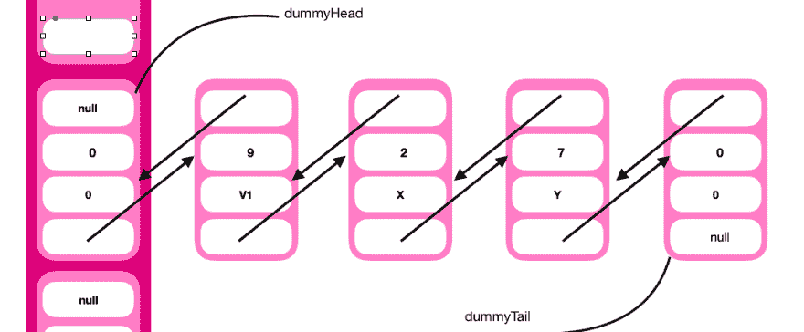
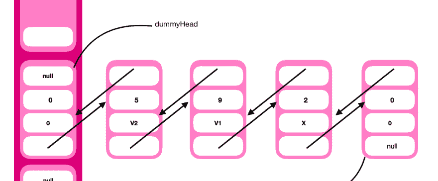

# 实施最近最少使用的缓存回收策略

> 原文：<https://dev.to/akarshan96/implementing-least-recently-used-cache-eviction-policy-2odn>

当我们搜索**最佳缓存驱逐政策**时，我们得到 **LRU** ，这是**最近最少使用**的缩写，作为顶部搜索结果。在这篇博客中，我将解读 LRU 缓存驱逐政策。让我们从理解任何缓存回收算法的核心目标开始。

### 1。目标

任何缓存回收算法或技术的目标都是通过确保应用程序中最常访问的资源保留在缓存内存中，同时回收其他资源来提高缓存性能。通过这种方式，用户或应用程序模块可以几乎即时地检索经常访问的资源，这减少了昂贵的重复查询的数量，进而提高了应用程序的整体性能。当缓存已满时，缓存回收算法或策略负责从缓存中移除或回收数据。LRU 的缓存驱逐政策就是其中之一。

### 2。定义

在 LRU，顾名思义，当缓存满时，最近最少使用的资源或数据会被逐出缓存。例如，如果我们有一个容量为 3 项的缓存。首先，我们添加一个元素 7，因为没有达到缓存的最大容量，7 可以很容易地容纳在缓存中。

[](https://res.cloudinary.com/practicaldev/image/fetch/s--aRL5-J8h--/c_limit%2Cf_auto%2Cfl_progressive%2Cq_auto%2Cw_880/https://thepracticaldev.s3.amazonaws.com/i/jrfo0kk4hsy4c4lnfwoo.JPG) 
同样的情况也会发生在接下来的两个元素 2 和 9 上。

[](https://res.cloudinary.com/practicaldev/image/fetch/s---CaDRsbT--/c_limit%2Cf_auto%2Cfl_progressive%2Cq_auto%2Cw_880/https://thepracticaldev.s3.amazonaws.com/i/teg07x4bkq7qlla0316r.JPG) 
现在，当我们添加下一个元素时，比如说 5，因为已经达到了高速缓存的最大容量，我们需要驱逐最近最少使用的元素，即 7，并添加 5。这类似于**队列**数据结构，因为我们遵循 FIFO。

[](https://res.cloudinary.com/practicaldev/image/fetch/s--G471KGxP--/c_limit%2Cf_auto%2Cfl_progressive%2Cq_auto%2Cw_880/https://thepracticaldev.s3.amazonaws.com/i/xnyh1pehr90fqoslj5l4.JPG)

如果我们用 7 来代替 5，那么 7 应该在队列的前面，因为它最近被使用过。

### 3。奠定基础

**3.1 Hashmap**
Hashmap 是一种时间复杂度为 O(1)的可以搜索和插入数据的数据结构。对于散列表中的每个条目，我们都有一个**键值对**。键是值的唯一标识符。让我们来解码散列表的工作原理。

*   Hashmaps 将数据存储在**桶**中。一个桶就是一个由链表的节点组成的**列表。哈希表的键值对存储在链表的节点中。**

*   使用哈希函数将密钥转换成哈希码。在 java 中，我们有一个方法`hashCode()`，它转换并返回字符串和整数等数据类型的 hashcode(整数值)。例如，如果我们有一个字符串**“ABC”**。字符串的 Hashcode 值将被计算为*s[0]*31^(n-1)+s[1]*31^(n-2)+...+ s[n - 1]* 其中 s[i]是字符串的第 I 个字符，n 是字符串的长度。
    “ABC”的 hashcode 是 97 * 31^2+98 * 31^1+99 = 93217+3038+99 = 96354。

*   96354 是一个非常大的数字。我们如何确定我们可以把它放在哪个桶里？答案是使用模函数。假设我们最初有 4 个桶。通过执行 hashcode modulo no.of buckets，我们将找到需要放入键值对的 bucket 的索引。在本例中，96354 % 4 是 2，因此我们将把关键字 abc 及其值放在 bucket 2 中。如果 hashcode 是一个负值，我们在执行模运算之前将其转换成绝对值。

*   考虑一个场景，其中 hashcode 的模返回一个索引，该索引已经包含一个具有另一个键值对的节点。这种情况被称为**冲突**，它使用链表来处理。在这种情况下，具有新的键-值对的节点将被放置在前一个节点的旁边，就像我们在链表中添加一个节点一样。

[](https://res.cloudinary.com/practicaldev/image/fetch/s--LaTky10g--/c_limit%2Cf_auto%2Cfl_progressive%2Cq_auto%2Cw_880/https://thepracticaldev.s3.amazonaws.com/i/88s3csa9uhco3x70mthn.png)

要了解更多关于**散列表**、**初始容量**和**加载因子**的信息，请参考[本](https://www.geeksforgeeks.org/java-util-hashmap-in-java/)。

**3.2 练习**
在上面的部分中，我们学习了散列表及其工作原理。现在让我们在不实际使用 hashmap 类的情况下实现 HashMap。
我们需要:

1.  一个**数组列表**作为桶
2.  **链表**包含处理冲突的键值对
3.  一个**散列函数**
4.  一个**模函数**让我们从创建一个包含键值对的链表节点开始。

```
class Node {
    String key;
    String value;
    Node next;
    Node(String key, String value) {
        this.key = key;
        this.value = value;
    }
} 
```

现在，我们将编写一个链表类，它将包含一个在冲突情况下添加节点的方法。

```
class NewLinkedList {
    public Node addNode(Node head, String key, String value) {
        if(head == null ||(head.key == null && head.value == null)) {
            head = new Node(key, value);
            return head;
        }
        Node current = head;
        while(current.next != null) {
            current = current.next;
        }
        current.next = new Node(key,value);
        return head;            
    }
} 
```

最后，我们将编写 HashMap 类，它将具有 get、put、hashFunction 和 moduloFunction 方法。

```
public class NewHashMap {
    ArrayList<Node> bucket;
    final int BUCKET_SIZE = 4;

    NewHashMap() {
        //initailize ArrayList bucket
        bucket = new ArrayList<Node>(BUCKET_SIZE);
        for(int i = 0; i < BUCKET_SIZE; i++) {
            bucket.add(null);
        }
    }

    private int hashFunction(String key) {
        char[] keyCharArr = key.toCharArray();
        int n = keyCharArr.length;
        int hashcode = 0;
        for(int i=0;i<n;i++) {
            hashcode = hashcode + keyCharArr[i] * (31^(n - 1 - i));
        }
        return Math.abs(hashcode);
    }

    private int moduloFunction(int hashcode) {
        return (hashcode % (BUCKET_SIZE - 1));
    }

    public String get(String key) {
        //get the index of the bucket in which the key can be possibly stored
        int index = moduloFunction(hashFunction(key));
        //get the node at that index
        Node node = bucket.get(index);
        //iterate through linked list in search of the key
        while(node != null) {
            if(node.key.equals(key))
                return node.value;
            node = node.next;
        }
        return null;
    }

    public void put(String key, String value) {
        //get the index of the bucket in which the key can be possibly stored
        int index = moduloFunction(hashFunction(key));
        //get the node at that index
        Node node = bucket.get(index);
        NewLinkedList list = new NewLinkedList();
        //add the key-value in a node of the linked list
        Node head = list.addNode(node, key, value);
        bucket.set(index, head);    
    }
} 
```

注意:这不是完美的实现，因为我们没有将整数作为键，哈希函数中的整数溢出和许多其他问题。这只是为了加深理解。

### 4。终局:实现 LRU

首先，让我们讨论如何实现 LRU。我们将有相同的实现桶、hashcode 和 modulo 函数，但是不同的是我们将使用**双向链表**而不是链表。为什么是双向链表？为了移除节点，你必须让它的前一个节点的下一个指针指向它的下一个节点，但是在一个单链表中，当你只有对它自身的引用时，你不能容易地得到对它的前一个节点的引用(O(n))。因此，双向链表解决了这个问题。

最近使用的键-值对将被添加到双向链表的前面，随着更多的键-值对被添加到链表中，它将位于末尾。最后，当它到达最末端或尾部时，它被从列表中删除，并因此从缓存中被逐出。下面展示了当列表的容量为 3 时的驱逐。
[](https://res.cloudinary.com/practicaldev/image/fetch/s--Qx1NmVqB--/c_limit%2Cf_auto%2Cfl_progressive%2Cq_auto%2Cw_880/https://thepracticaldev.s3.amazonaws.com/i/x3lq1o932brdu2oszqyw.png) 
键 5 被添加后，7 被逐出。
[T8】](https://res.cloudinary.com/practicaldev/image/fetch/s--tba-17el--/c_limit%2Cf_auto%2Cfl_progressive%2Cq_auto%2Cw_880/https://thepracticaldev.s3.amazonaws.com/i/dnpen30sffbj7xxtwubr.png)

让我们调整上面实现 hashmap 的代码来实现这一点。我们将使用散列表和双向链表来实现 LRU。

*   **写节点类**。因为它是双向链表的一个实现，我们将拥有指向前一个节点的 prev 变量。

```
class Node {
    Node prev, next;
    int key, value;
    Node(int key, int value) {
        this.key = key;
        this.value = value;
    }
} 
```

*   **编写 LinkedNodeList 类**。这是一个主类，我们将在其中定义 moveToHead、addToHead 和 removeTail 以及其他一些方法。

```
 //we are going to store head and tail of the list
    Node dummyHead;
    Node dummyTail;

    LinkedNodeList(){
        //initialize the variables which in this case is head and tail node with key and value as 0\. The next of head is tail and prev of the tail is head. All the nodes with key-value will be added in between dummy Head and dummyTail.
        dummyHead = new Node(0,0);
        dummyTail = new Node(0,0);
        dummyHead.next = dummyTail;
        dummyTail.prev = dummyHead;
    } 
```

现在让我们编写 **addToHead** 方法。当在高速缓存中引入新的条目时，使用这种方法。因为它是最近的条目，所以它将被添加到相应桶的列表的头部。

```
 void addToHead(Node node){
        //add node after dummyHead
        Node tmp = dummyHead.next ;
        dummyHead.next = node;
        node.next = tmp;
        node.prev = dummyHead;
        tmp.prev = node;
    } 
```

假设我们得到一个已经存在于列表中的条目，但是因为它是最近的条目，所以需要把它移到列表的头部。为了实现这一点，我们将定义 **moveToHead** 节点。

```
 void moveToHead(Node node){
        //next of prev of the node points to next of the node
        node.prev.next = node.next;
        //prev of next of the node points to prev of the node
        node.next.prev = node.prev;
        //the node is set after dummyHead
        addToHead(node);
    } 
```

当列表的容量达到最大时，我们将驱逐尾部。这是使用 **removeTail** 方法完成的。

```
 void removeTail(){
        //the node before dummyTail is removed and the next of prev of the evicted node will be dummyTail and prev of the dummyTail is prev of the evicted node.
        Node newTail = dummyTail.prev.prev;
        newTail.next = dummyTail;
        dummyTail.prev = newTail;
    } 
```

定义 getter 方法。

```
 Node getTail(){
        return dummyTail.prev;
    }

    Node getHead(){
        return next;
    } 
```

*   **编写 LRUCache 类**。我们将在这里定义 get 和 put 方法。让我们从编写构造函数开始。

```
class LRUCache {
    LinkedNodeList list;
    Map<Integer, Node> map;
    Integer capacity;
    //initilaize capacity, map and LinkedNodeList
    public LRUCache(int capacity) {
        list = new LinkedNodeList();
        map = new HashMap(capacity);
        this.capacity = capacity;
    } 
```

定义**得到**的方法

```
 public int get(int key) {
        //get the node/head from the map
        Node node = map.get(key);
        //if node is null return -1
        if(node == null){
            return -1;
        }
        //since the key is most recently accessed, we are going to move it to the head and return its value.
        list.moveToHead(node);
        return node.val;
    } 
```

定义 **put** 方法。

```
 public void put(int key, int value) {
        //get the head node
        Node node = map.get(key);
        //if value exists in node we will move the node to the head (after dummyHead)
        if(node != null){
            list.moveToHead(node);
            node.val = value;
        //else we create a new node with key and value as parameters.The node is added after dummyHead. if the capacity exceeds the tail is removed.
        } else {
            Node newNode = new Node(key, value);
            if(map.size() == capacity){
                Node tail = list.getTail();
                map.remove(tail.key);
                list.removeTail();
            }
            map.put(key, newNode);
            list.addToHead(newNode);
        } 
```

哒哒！我们在 JAVA 中成功实现了 LRU 缓存回收策略。

快乐编码。